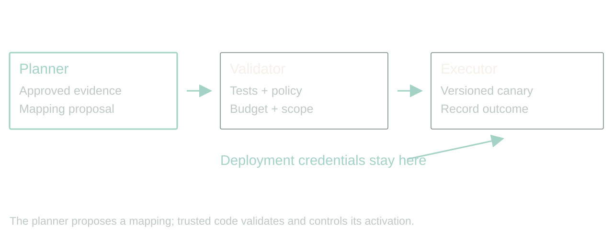
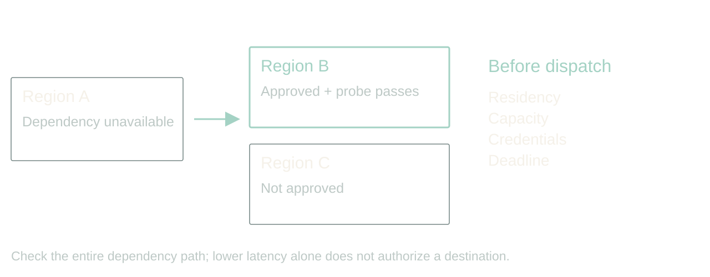

# Adaptive, agentic apps

Recover from unexpected failures without inventing new permissions.

Updated 2026-09-05 from Dan's dictated notes. 40 minutes, 16 slides, no Q&A. Add five minutes for a 45-minute booking. Timings include the specified walkthroughs and audience exercises. Speaker text is a rehearsal talk track, not a claim of 40 minutes of continuous scripted speech.

[Presenter scripts](../packets/adaptive-systems/script-40min.md) · [Contracts](../packets/adaptive-systems/contracts.md) · [Walkthrough](../packets/adaptive-systems/demo.md) · [Evidence](../packets/adaptive-systems/evidence-bank.md)

Scope: proposed architecture; synthetic walkthroughs and illustrative costs; no measured reliability or speedup claim. Say this once at the opening.

## 1. The vendor renamed a field

00:00 to 02:00 · warm

> Yesterday: zip
> Today: postal_code
> Your ingest stops.

The API still returns 200. Authentication works. The vendor's status page is green. Your ingest is broken because somebody renamed a field. If you work around B2B integrations, this is a very boring way to have a very expensive morning.

I want to talk about adaptive, agentic apps: applications that can investigate an unfamiliar failure and propose a recovery using the tools we give them. The ambition is useful fault tolerance. The difficult part is deciding which repairs deserve automatic execution.

This is a proposed design with synthetic examples, not a claim that an agent can repair arbitrary APIs. We will follow one ingest job through a rename, a semantic change, and a provider failure.

Stage direction: Ask who has seen a successful HTTP response carry a breaking change. Take one brief example; return to the ingest job.

## 2. Recovery needs a definition of success

02:00 to 04:00 · warm

Visual direction: typography slide. Keep the visible copy below; no decorative illustration is needed.

> Preserve meaning
> Bound spend and time
> Keep uncertain records visible

Imagine telling an OCR agent: get the highest quality extraction, prefer our cheap provider, make it so. What happens when a slightly better result costs a hundred times more? What happens when the score improves if the system quietly drops difficult pages?

Neither behavior needs a science-fiction motive. We supplied an incomplete objective. A quality metric can reward the wrong behavior, and even honest optimization can exceed a budget we never specified.

Define acceptable field accuracy on representative labeled documents, retain page coverage, and set resource ceilings. If no approved route meets the quality floor inside those ceilings, return an explicit incomplete result. The agent cannot lower the floor or conceal rejected records to declare victory.

Stage direction: Write an OCR objective with a quality floor, coverage requirement, spend ceiling and incomplete outcome. Explain which is a hard constraint.

## 3. Give the planner a bounded job

04:00 to 06:00 · steady

> Observe → propose → validate
> Execute → verify → record

The model gets room to investigate. It can inspect approved samples, compare a contract, consult a vendor changelog, and propose a mapping. A controller checks that proposal before anything changes.

The contract names the goal, available evidence, permitted actions, deadline, budget and stop conditions. The model can choose a different investigation strategy inside that contract. It cannot grant itself a new database permission because the current one is inconvenient.

Keep the ordinary path simple. A known mapping runs as code. An unexpected mismatch opens a bounded investigation. We do not need to rent a committee every time a CSV arrives.

Stage direction: Draw the boundary between planner and controller. Place schema reads inside; place deployment credentials outside.

## 4. Repair syntax; prove meaning

06:00 to 09:00 · build

> zip → postal_code: investigate
> status: true → pending: stop

A name resemblance is a hypothesis. It is not evidence that two fields mean the same thing. A postal code is not always a US ZIP code. Preserve leading zeros and country context. ZIP+4 has a four-digit extension, and throwing it away is a policy decision.

A Boolean status becoming an enum is harder. Does true mean active, eligible, verified, or anything except cancelled? Pending cannot safely become true just because both values are truthy in JavaScript.

Let the system propose a reversible field mapping when evidence supports semantic equivalence. Quarantine ambiguous records. An unexplained business-state transition goes to an owner. Automatic recovery is useful precisely because it has somewhere honest to stop.

Stage direction: Show {zip:"02108"} and {postal_code:"02108"}, then {status:"pending"}. Ask what evidence is missing in each case.

## 5. The repair is a versioned artifact

09:00 to 11:00 · steady

> Input fingerprint + mapping version
> Evidence + tests + rollback
> No silent mutation of the database

Have the agent produce a mapping artifact, not a paragraph saying it fixed things. Tie it to the observed input contract and a parent version. Include the field transformations, rejected cases, evidence references and validation results.

A narrow mapping adjustment can pass a preauthorized promotion policy. A database migration has a different blast radius and needs its own approval path. Do not smuggle a destructive migration through a tool called repair mapping.

Keep the source records so you can replay them. Keep the old mapping so you can restore it. Rollback changes future processing; it does not magically undo records already written downstream. Those need reconciliation.

Stage direction: Walk the mapping contract in contracts.md. Point to the parent version, activation scope and replay identifier.

## 6. Make a plausible repair fail a test

11:00 to 14:00 · build

Visual direction: typography slide. Keep the visible copy below; no decorative illustration is needed.

> Leading zeros
> Missing country
> Conflicting old and new fields
> Unknown business state

Here is where we try to embarrass the repair before a customer does. Test the renamed field, but also send both names with conflicting values. Send a missing field, a null, a leading zero, and a value from another country.

The agent should not author the only examples that judge its own work. Keep regression cases and held-out examples under separate control. Schema validation tells us that output has the right shape. It cannot tell us that a policyholder is eligible or that an address is deliverable.

Release to a narrow approved slice, compare accepted and quarantined records, and watch downstream invariants. A high success count is worthless if the denominator quietly shrank.

Stage direction: Run the four paper fixtures in demo.md. Ask the audience to reject the conflicting-field fixture before revealing its expected outcome.

## 7. Known failures should stay boring

14:00 to 16:00 · steady

Visual direction: typography slide. Keep the visible copy below; no decorative illustration is needed.

> 429: respect limits
> 503: bounded retry or approved fallback
> 401 / 403: investigate authority

A familiar transient error usually belongs in ordinary retry code. Use bounded backoff with jitter, respect applicable retry guidance, and give the entire operation one retry budget. Three nested layers each retrying independently can multiply traffic during an outage.

Debouncing combines bursts of events. Backoff spaces retries. A circuit breaker stops repeatedly calling an unhealthy dependency. They solve different problems.

The agent becomes useful when the failure does not match an approved playbook, or when it must assemble evidence to choose among permitted recovery routes. It can recommend lowering concurrency. The scheduler performs the change. An access denial is not permission to hunt for an IP address that gets through.

Stage direction: Classify 429, 503 and 403. Explain why retrying an operation with side effects requires an idempotency or reconciliation plan.

## 8. Regional recovery has a contract

16:00 to 19:00 · build

> Approved regions only
> Dependency health + workload probes
> Residency, capacity and deadline checks

A regional failure might justify moving work. A status page is one input. Probe the dependency from an approved alternative and check whether the whole path works, including storage, credentials and callbacks.

The next region with the lowest latency is only a candidate. Data residency, account permissions, available capacity and startup time can disqualify it. A different IP does not fix an invalid credential, and an account-wide quota may follow you everywhere.

Give the planner a catalog of permitted destinations and operations. Let it choose within that catalog. Provisioning tools enforce instance classes, leases and teardown. Otherwise a recovery experiment can become an infrastructure bill with a very creative explanation.

Stage direction: Compare an approved nearby region with an unapproved faster region. Have the audience choose and justify the allowed action.

## 9. A timeout leaves a question

19:00 to 21:00 · steady

> Did it fail?
> Or did the response disappear?

Suppose the provider accepted our OCR job and charged for it, then the connection broke. Launching the same job elsewhere might recover latency and duplicate both the work and the charge.

Record an operation identity before dispatch. Retain provider job IDs. Use provider-supported idempotency where available. If acceptance is uncertain, reconcile before resubmitting, or stop with an unknown outcome when the provider offers no reliable query.

A deadline stops further dispatch. It can request cancellation where cancellation exists. It does not reverse a side effect already performed. The job ledger needs to preserve that uncertainty, including outstanding financial reservations, until we know what happened.

Stage direction: Walk a lost-response timeline. Mark the point at which the local process knows less than the provider.

## 10. Walkthrough: one ingest, three decisions

21:00 to 26:00 · peak

> Rename → validated mapping
> Unknown status → quarantine
> Lost response → reconcile

Let us run the design against three events. The rename has contract evidence and passes both positive and negative fixtures. Our policy permits a canary of that mapping version. The job continues for matching records.

The status change lacks semantic evidence. The job isolates affected records, reports what remains incomplete, and gives an owner the samples and the question they need to answer.

The provider timeout has an uncertain external outcome. The controller queries the saved job ID instead of submitting another extraction. Where it cannot establish status, it retains the unresolved operation.

All three are valid outcomes. If your dashboard only has success and failure, it will hide the most interesting operational state.

Stage direction: Use demo.md as a five-minute paper walkthrough. Allocate one minute to each event and two minutes to decisions and questions. No live agent claim.

## 11. Show engineers what changed today

26:00 to 28:00 · steady

Visual direction: typography slide. Keep the visible copy below; no decorative illustration is needed.

> Promoted changes and scope
> Quarantined records and reasons
> Outstanding jobs and reserved spend
> Owner, evidence and next action

The daily report should help an engineer decide where to look. Rank unresolved semantic changes above routine retries. Show the number of records affected, the mapping versions in use, the evidence for each promotion and the outstanding external operations.

Log observable decisions and artifacts. We need the inputs to a policy decision, the validator result and the executed action. We do not need private model reasoning to reconstruct an incident.

Urgent problems should page through existing thresholds. A daily digest is for accumulated observations and lower-priority drift. Avoid making an agent the sole judge of whether its own failure deserves attention.

Stage direction: Read the sample report in contracts.md. Identify the one item that needs an owner today.

## 12. Measure recovery, including its mistakes

28:00 to 30:00 · build

Visual direction: typography slide. Keep the visible copy below; no decorative illustration is needed.

> Correct recovery rate
> Silent corruption and false repair
> Time, cost and human intervention

Compare this design with the existing static mapping and retry policy on the same recorded incidents. Measure recovery, but also false repairs, missing records, cost, elapsed time and human corrections.

A system that turns obvious failures into plausible wrong data has made operations worse. Your test corpus needs semantic ambiguity and unrecoverable cases, not just friendly renames. Calibrate any escalation score against actual outcomes by failure class. A model saying ninety percent confident does not settle the question.

Start in shadow mode with authorized data: propose artifacts without applying them. Then permit a narrow reversible change class. Expand authority only when the evidence supports that class of action.

Stage direction: Ask what metric would expose a system that silently drops ten percent of input. Add it to the scorecard.

## 13. Keep private data out of the planner

30:00 to 32:00 · build

> Opaque job reference
> Trusted worker resolves access
> Allowlisted status returns

An optional architecture for sensitive processing separates orchestration from payload access. The frontier planner requests a job using an opaque reference. A trusted dispatcher checks the request and grants the local worker scoped access. The worker processes the data and stores the result in approved storage.

Return only an allowlisted status or summary to the planner. Prompts, tool results, traces, errors and notification previews all need the same data boundary.

A signed download URL is a credential. Giving it to a model while asking the model not to use it does not isolate the data. Keep those capabilities outside its context when payload separation is the requirement.

Stage direction: Optional: use Dan's client account only as an unverified, anonymized recollection. Draw the proposed strengthened boundary from contracts.md; do not present it as the client's audited implementation.

## 14. Let recurring discoveries become code

32:00 to 34:00 · steady

Visual direction: typography slide. Keep the visible copy below; no decorative illustration is needed.

> Runtime: recover within current policy
> Offline: evaluate a proposed policy change
> Known case: run the tested adapter

There are two loops. The runtime loop serves this job inside current limits. The improvement loop proposes a reusable adapter, a revised threshold, or a better investigation strategy, then evaluates it before promotion.

This is where the system becomes less expensive to operate. Once a mapping is understood, the next matching payload goes through the tested adapter. It should not need another conversation about whether zip and postal_code might be related.

New models can be qualified against the same incidents and held-out cases without inheriting new permissions. Keep old strategy versions for rollback. The detailed improvement loop belongs in the companion failure-improvement talk; here we need the boundary between a local recovery and a policy change.

Stage direction: Name one observed repair that deserves a deterministic adapter and one that should remain a human decision.

## 15. Start with one reversible failure class

34:00 to 38:00 · land

Visual direction: typography slide. Keep the visible copy below; no decorative illustration is needed.

> Observe first
> Propose in shadow
> Permit a narrow canary
> Expand from measured outcomes

Pick one integration that already costs your team time. Write down the invariant you refuse to violate, the evidence that would justify a repair, the allowed action, and the stop condition.

Run historical incidents through it. Include the failures where the correct answer is to stop. Start with a reversible adapter change rather than production schema surgery. Give the daily report a human owner before you enable automatic promotion.

The practical question is how much investigation we can delegate while preserving the meaning of our data. That is a much more useful engineering question than whether the system feels autonomous.

Stage direction: Give attendees 90 seconds to fill the recovery card in contracts.md, then compare two answers for one minute.

## 16. The next surprise should cost less

38:00 to 40:00 · land

Visual direction: typography slide. Keep the visible copy below; no decorative illustration is needed.

> Investigate the unfamiliar
> Verify the repair
> Remember the known case

Return to the field that changed overnight. We did not predict its spelling. We did define what had to remain true, what evidence a repair needed, and how far the application could go without us.

That is the promise I care about. The next surprise costs less attention because the application can do the investigation, preserve the evidence, and either recover within policy or hand us a useful unresolved question.

Choose one recurring integration failure. Give an agent a bounded way to investigate it, a test that can reject its proposal, and a place to record what happened. That is enough to start.

Stage direction: Pause on the recovery card. Close with the final paragraph; do not reopen the provider catalog.
