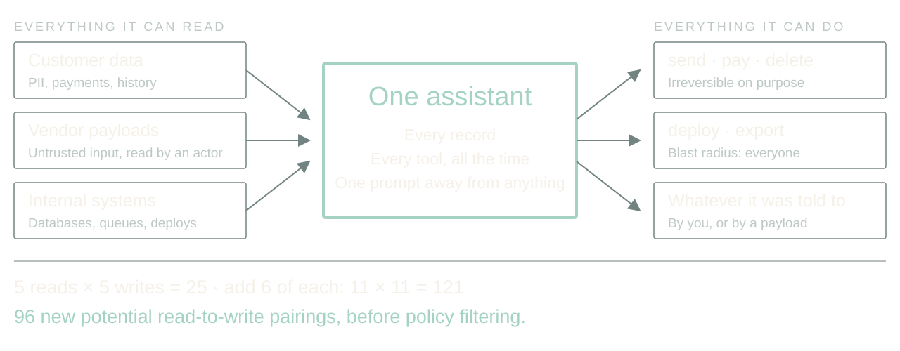
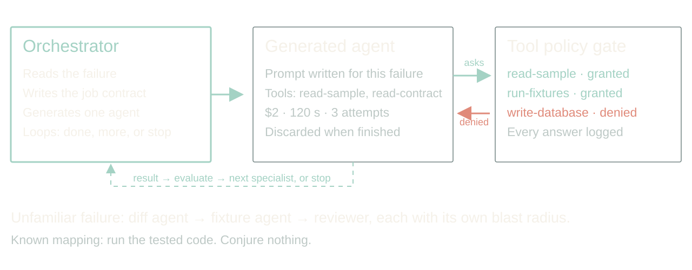
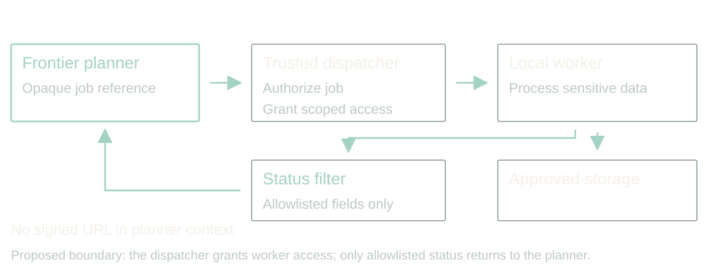
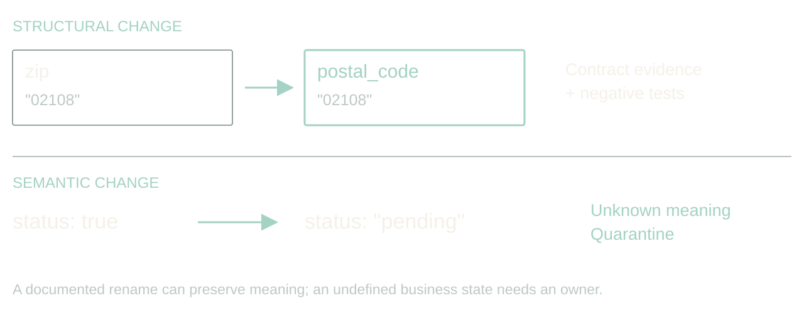
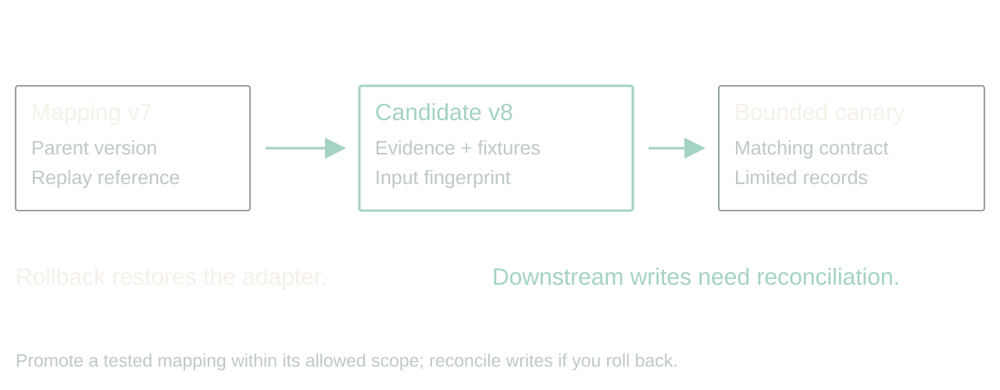
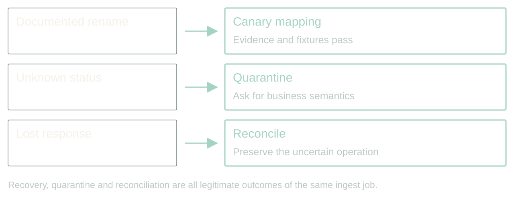
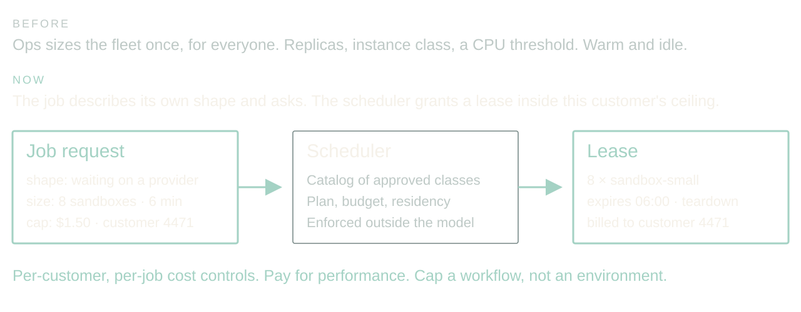

# Adaptive, agentic apps

Give each job exactly enough agent. Prove every repair. Let the app ask for its own scale.

Rewritten 2026-09-06 from Dan's notes. 40 minutes, 15 slides, four audience moments, no Q&A. Add five minutes for a 45-minute booking. The design is Dan's; the incidents are composites of real integrations with the names filed off. Say that once, on slide 1, and never apologize for it again.

[Presenter scripts](../packets/adaptive-systems/script-40min.md) · [Contracts](../packets/adaptive-systems/contracts.md) · [Memory pattern and prompt](../packets/adaptive-systems/memory-pattern.md) · [Walkthrough](../packets/adaptive-systems/demo.md) · [Evidence](../packets/adaptive-systems/evidence-bank.md)

Regenerate scripts, adaptations and the browser deck with `bun artifacts/speaking-portfolio-expanded/build-talk.ts adaptive-systems`.

## 1. The vendor renamed a field

00:00 to 02:00 · warm

> Yesterday: zip
> Today: postal_code
> Your ingest stops. The status page is green.

The API still returns 200. Authentication works. The vendor's status page is green. Your ingest is broken because somebody renamed a field. If you work around B2B integrations, this is a very boring way to have a very expensive morning.

Here is the promise of this talk. An application can notice that, investigate it, propose a fix, prove the fix, and keep the other ninety-eight percent of records flowing, all before you wake up. And it can do that without ever holding a permission you would be scared to give it.

The design is mine. The incidents are composites; I have had this exact morning more than once. We will follow one address ingest job through a rename, a change in meaning, and a provider that stops answering.

Story: The vendor rename you actually lived through. Name the field, the hour you noticed, and what it cost.

Stage direction: Hands up for a 200 response that carried a breaking change. Take one story, thirty seconds, and return to the ingest job.

## 2. The Bar Is a Pager

02:00 to 04:00 · warm

> Baseline: alert, wait for a person, replay
> Agent: investigate, propose, prove, continue
> Win condition: faster recovery, zero new false repairs

Before anyone gets excited about agents, name the boring alternative. A schema diff, an alert, and a human who replays the batch after coffee. It works. It costs a morning per surprise, and it does nothing for the unaffected records that are stuck behind the broken ones.

The agent has to beat that. Not on vibes. On time to recover, on records kept moving, and on a number the baseline gets for free: false repairs. Alert-and-wait never turns a rename into plausible wrong data. If the adaptive version does, even once, it has made operations worse.

So every slide from here is about buying recovery speed without buying corruption. Keep that trade in your head; it is the whole talk.

Stage direction: Write the three metrics on the board and leave them there.

## 3. Sorry, You're Building It

04:00 to 08:30 · build

> Browsers, CLIs, every SaaS: an agent layer you opt out of with --no-agent
> Ten tools is forty-five pairs. One more integration is not one more path.
> Accidents first. Then people who mean it.

Zoom out from the ingest job. The assistant with every customer's data and a toolbox that can send email, issue refunds, delete records and ship code is not a design we get to decline. It is arriving one integration at a time, and not only in our products.

Browsers ship a chat that drives the page. WebMCP lets an agent act on any site that opts in, and that list only grows. Soon your CLI takes English by default and you pass `--no-agent` to get the old behavior back. I know who to blame: the kids. Actually, the kids hate AI. It will be their kids who demand a safety blanket on everything, and I will be in a rocking chair explaining that the internet was better on vinyl.

Here is the hazard, and it applies to the small systems too. Risk does not grow with the number of tools. It grows with the pathways between them, and every integration multiplies those. Ten tools is forty-five pairs before you count chains. Plug in one SaaS with a dozen endpoints and you did not add twelve capabilities; you added hundreds of routes from something the agent can read to something it can do. Nobody reviews those combinations. Not your security team, not the model, not you at three in the morning. The dangerous pairing is never on the roadmap. It gets discovered.

Most of the damage will be accidents: a confident mapping, a helpful cleanup, a tool called with the wrong ID. Then the people who mean it. That renamed field can carry a sentence aimed at the model, because a vendor payload is untrusted input read by something that can act.

So the question is not whether to grant access. It is how many pathways are live at once. The big assistant still exists; it just never has all of its hands full at the same time, because it conjures a small agent per job with exactly enough.

Story: Your own near miss with an over-permissioned agent, or the tool pairing you only noticed after it fired.

Stage direction: Write 10 → 45 on the board. Ask who could list every read-to-write pathway in the agent they run today. Pause on the third line; let the room feel that the accident case is the common one.

## 4. Conjure the agent the job needs

08:30 to 12:00 · peak

> Tailored prompt, minimum tools, hard budget
> Tool search on request, policy decides, request logged
> Orchestrator loops: done, more help, or stop

Here is the shape. An orchestrator reads the failure and writes a job: goal, evidence it may read, actions it may take, deadline, spend, and the conditions that end it. Then it generates an agent for that job with a tailored prompt and only the tools it expects to need. A schema-diff agent gets read access to two samples and a contract. It does not get the database.

If the agent needs something else, it asks. Dynamic tool search lets it discover a tool; policy decides whether this job may have it; the request and the answer are logged whether or not it was granted. That log is the most interesting file in the system.

The orchestrator loops on the result: done, needs another specialist, or must stop. A diff agent hands to a fixture-writer hands to a reviewer, each with its own blast radius, each disposable when finished. Nobody rents a committee every time a CSV arrives — the known mapping runs as code, and only the unfamiliar case conjures anything.

This is a prototype on my own integrations. I am not giving you a success rate today because I do not have one I trust. I can tell you the log of denied tool requests taught me more about my own permissions than any audit.

Story: What the prototype's first denied tool request was, and what it revealed.

Stage direction: Draw the three boxes: orchestrator, generated agent, tool catalog with policy gate. Show one request crossing the gate and being refused.

## 5. Guard the tools that can hurt

12:00 to 15:00 · build

> High-risk classes: write, send, pay, delete, deploy, export
> Reads customer data? Then it never posts to a vendor.
> A signed URL is a credential

Two guards do most of the work. First, tools come in risk classes. Read is cheap to grant. Write, send, pay, delete, deploy and export each need their own approval path, and a generated agent gets at most one of them per job. Do not smuggle a destructive migration through a tool called repair mapping.

This is least privilege, written down by Saltzer and Schroeder in 1975. We have been nodding at it for fifty years while shipping service accounts that can do anything. A per-job agent is the first thing I have built where complying is easier than not.

Second, watch the boundary between systems. An agent that can read customer data and an agent that can post to a vendor are two agents, with a filter between them. That is where data leaks: not through the model being evil, but through a tool result flowing into the next tool call.

For sensitive processing the planner gets an opaque job reference. A trusted dispatcher grants a local worker scoped access, the worker touches the data, and only an allowlisted status comes back. A signed download URL is a bearer credential; handing it to a model while asking the model not to use it is not isolation, it is hope.

Story: The client setup with local models for sensitive data and a frontier orchestrator. Say which parts were real and which are the stronger design you would build now.

Source: Saltzer and Schroeder (1975), [The Protection of Information in Computer Systems](https://doi.org/10.1109/PROC.1975.9939), Proceedings of the IEEE 63(9), 1278 to 1308. Least privilege is their principle (f).

Stage direction: Point at the filter between worker and planner. Ask what else crosses it: prompts, traces, error bodies, notification previews.

## 6. Repair syntax; prove meaning

15:00 to 17:00 · build

> zip → postal_code: investigate
> status: true → pending: stop

Back to the ingest. A name resemblance is a hypothesis, not evidence. A postal code is not always a US ZIP. Keep the leading zero, keep the country, and remember ZIP+4 has a four-digit extension that somebody, somewhere, is joining on.

A Boolean status becoming an enum is harder. Does true mean active, eligible, verified, or anything except cancelled? Pending cannot become true just because both are truthy in JavaScript.

So the generated agent may propose a reversible mapping when evidence supports equivalence, and it must quarantine the rest. An unexplained business-state change goes to an owner with samples and a question. Automatic recovery is useful precisely because it has somewhere honest to stop.

Stage direction: Show {zip:"02108"} and {postal_code:"02108"}, then {status:"pending"}. Ask what evidence is missing in each. Two answers, then move.

## 7. The repair is a versioned artifact

17:00 to 18:30 · steady

> Input fingerprint + mapping version
> Evidence + fixtures + rollback
> No silent mutation of the database

The agent produces a mapping artifact, not a paragraph saying it fixed things. Parent version, input fingerprint, the transforms, the rejected cases, the evidence it read, and the fixture results.

A narrow mapping change can pass a pre-authorized canary policy. A schema migration has a different blast radius and its own approval path. Keep the source records so you can replay; keep the old mapping so you can restore. Rollback changes future processing. It does not un-write yesterday's downstream rows; those need reconciliation.

Stage direction: Walk the mapping artifact in contracts.md. Point at parent version, activation scope, replay reference.

## 8. The agent does not write its own exam

18:30 to 20:00 · steady

> Held-out fixtures under separate control
> Conflicting old and new fields
> Watch the denominator

Here is where we try to embarrass the repair before a customer does. The agent that proposed the mapping does not author the only tests that judge it. Regression fixtures and held-out cases live under separate control, and a generated fixture-writer agent adds to them without seeing the proposal.

Schema validation says the output has the right shape. It cannot say an address is deliverable. So release to a narrow slice, compare accepted against quarantined, and watch downstream invariants. A high success count is worthless if the denominator quietly shrank.

Stage direction: Keep the fixtures hidden. They are revealed in the walkthrough.

## 9. A lost response leaves a question

20:00 to 21:30 · steady

> Did it fail?
> Or did the answer disappear?

The same ingest calls an address-verification provider. Suppose the provider accepted the batch and charged for it, then the connection dropped. Resubmitting elsewhere recovers latency and doubles the bill.

Record an operation identity before dispatch. Keep the provider's job ID. Reconcile before resubmitting, and when the provider offers no way to ask, stop with an unknown outcome and say so. A deadline ends new dispatch; it does not reverse a side effect already performed. The ledger has to hold that uncertainty, reserved money included, until the answer arrives.

Stage direction: Mark the moment on the timeline where your process knows less than the provider does.

## 10. Walkthrough: one ingest, three decisions

21:30 to 26:00 · peak

> Rename → validated mapping, canary
> Unknown status → quarantine, owner
> Lost response → reconcile, hold the reservation

Run the design. The rename has contract evidence. The conjured diff agent proposes copy-string; now reveal the fixtures one at a time and let the room reject the one that must not be repaired. Passing both, policy permits a canary of that mapping version and the job continues for matching records.

The status change has no semantic evidence. The job isolates affected records, reports what is incomplete, and hands an owner the samples and the exact question.

The provider timeout has an uncertain outcome. The controller queries the saved job ID instead of submitting again, and where it cannot, it holds the unresolved operation and its reservation.

Three events, three different right answers, none of them success or failure. If your dashboard only has two states, it is hiding the most interesting one.

Stage direction: Five minutes from demo.md. Reveal fixtures before expected results. Ask the room for the next decision before showing it.

## 11. Compute Is a Tool Too

26:00 to 28:30 · build

> Old: ops sizes the fleet for everyone
> New: the job describes its shape and asks
> Per-customer, per-job cost controls and pay-for-performance

One more thing the orchestrator can conjure: compute. Scaling is still an infra decision made once for everyone — replica counts, instance classes, an autoscaler watching CPU. The agent inverts that. It knows this batch is mostly waiting on a provider, that eight sandboxes for six minutes would clear the backlog, and what this customer's plan allows.

So it asks. The request names shape, size, duration and a cost cap, charged to this job rather than a shared cluster. That is a new product surface: a customer buys a faster turnaround, and finance caps one workflow instead of an environment.

The guard is the tool guard. The agent chooses from a catalog of approved instance classes, the scheduler enforces leases and teardown, and an unapproved faster region is not a candidate no matter how good the latency looks. The mechanics are a companion talk.

Story: A job where per-customer compute would have changed the pricing conversation.

Stage direction: Contrast one autoscaler threshold with one job request. Ask which one a customer could be billed for.

## 12. Ironies of Automation

28:30 to 31:30 · steady

> Promoted changes and scope
> Quarantined records and reasons
> Outstanding jobs, reserved spend, denied tool requests
> Owner, evidence, next action

The daily report should tell an engineer where to look. Unresolved semantic changes above routine retries. Records affected, mapping versions in use, evidence for each promotion, outstanding external operations, and every tool request the policy refused.

Log decisions and artifacts, not private reasoning: policy inputs, validator result, executed action. That is enough to reconstruct an incident. Urgent problems page through existing thresholds; the digest is for drift. Never make an agent the sole judge of whether its own failure deserves attention.

One warning about that report, and it is the warning for this whole talk. Lisanne Bainbridge, 1983, Ironies of Automation: automating the routine cases does not remove the human, it promotes them to monitoring a system that is almost always right, and people are measurably bad at that job. Skitka and colleagues put numbers on it in 1999 — on the events the aid got wrong, people with a highly but imperfectly reliable aid did worse than people with no aid at all. So keep the report short, ranked, and usually almost empty. A digest nobody finishes is a digest nobody reads, and then the guard post is decorative.

Source: Bainbridge (1983), [Ironies of Automation](https://doi.org/10.1016/0005-1098(83)90046-8), Automatica 19(6), 775 to 779. Skitka, Mosier and Burdick (1999), [Does automation bias decision-making?](https://doi.org/10.1006/ijhc.1999.0252), International Journal of Human-Computer Studies 51(5), 991 to 1006.

Stage direction: Read the sample report in contracts.md. Find the one item that needs an owner today.

## 13. Widen Per Class, Never Per Streak

31:30 to 34:00 · land

> Shadow: propose, apply nothing
> Canary: one reversible change class
> Expand: from correct recoveries, false repairs, cost, interventions

Compare the design with the static mapping and the pager on the same recorded incidents. Count recoveries, but also false repairs, dropped records, cost, elapsed time and human corrections. Include the incidents where the right answer was to stop. A model saying ninety percent confident settles nothing.

Start in shadow mode: the conjured agents propose artifacts and apply none. Then permit one reversible change class, and widen authority per class from evidence about that class. Same discipline for tools and for compute. It is also the loop that tunes its own fan-out: acceptance up and false repairs flat, that job class gets more parallel attempts and a bigger budget; false repairs up, both come down.

Watch for the failure Diane Vaughan documented at NASA before Challenger and named normalization of deviance. Every widening is locally reasonable. Each one cites the last one as precedent. Nobody ever decides to be reckless. That is exactly why authority expands per class and from measured outcomes for that class, and never from how the last six went.

Source: Vaughan (1996), The Challenger Launch Decision, University of Chicago Press, on normalization of deviance.

Stage direction: Thirty seconds on the recovery card in contracts.md. Take one answer and name the evidence needed to widen that authority.

## 14. Start smaller: remember what happened

34:00 to 37:30 · steady

> Before returning: check relevant memory and correct known mistakes
> After execution: record checks, outcome, correction and frequency
> Generated, executed and verified are different states
> Memory is evidence, never permission

You do not need the whole agent factory to start. Take one agent that writes SQL or runs shell commands. Give it working memory for this job — goal, constraints, draft, unresolved checks — and observational memory across jobs: what it generated, what actually ran, what failed. Then make it consult that history before it hands you the next answer.

Suppose a reporting query keeps forgetting the tenant filter. It runs perfectly well and reports the wrong population. A preflight check the agent did not write rejects it before dispatch. Record the draft, the failed check, the correction. Next time, retrieve that pattern while the agent is still drafting, fix the omission before returning the SQL, and run the check again. That is adaptive behavior built from one agent and a small log.

Keep attempts as well as successes, and the schema version with them, because a command that worked on yesterday's schema is a clue and not a warranty. A clean exit is execution evidence; a plausible report still needs a correctness check. Remembered output is untrusted data and grants no new permissions. The copyable prompt and the record format are in the handout.

As patterns repeat, turn the reliable ones into tested templates. Once the known case is covered by code, it need not spend another model call rediscovering the rule.

Stage direction: Show the prompt in memory-pattern.md. Ask which observation proves the query ran and which proves it answered the right question. Use the tenant-filter example; no live execution is needed.

## 15. The next surprise should cost less

37:30 to 40:00 · land

> Conjure exactly enough
> Prove the repair
> Remember the known case

Return to the field that changed overnight. We did not predict its spelling. We did define what had to stay true, what evidence a repair needed, which tools this one job could have, and how far the app could go without us.

And return to the assistant with everything. It is still coming; nothing on these slides stops it, and I would not want them to. What changed is how many of its pathways are live at once. Not one agent holding every combination, which nobody can check. Many small ones you can afford to.

Pick one integration that already costs your team mornings. Give it a conjured agent with a bounded way to investigate, a test it did not write, and a place to record what happened. Or start with one reporting agent: keep its execution observations, make it check them before returning work, and measure whether the same mistake comes back. That is enough to start.

Stage direction: Land on the third line. Stop talking.
