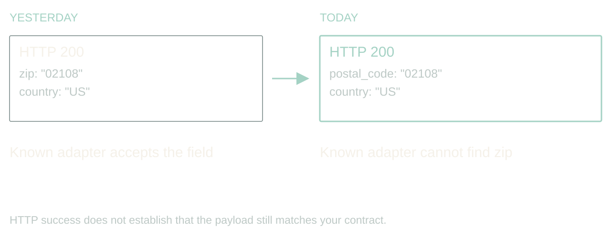
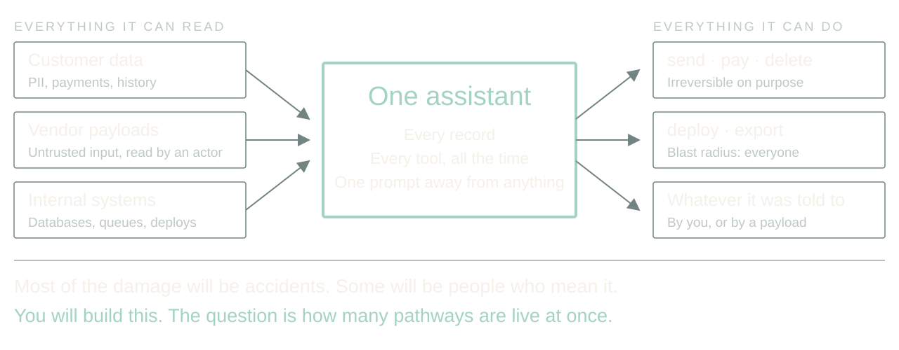
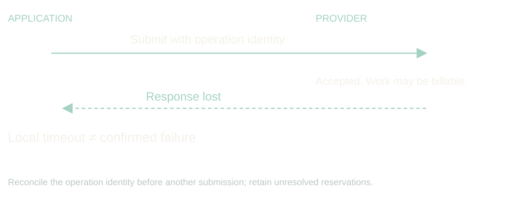

# Adaptive, agentic apps

Give each job exactly enough agent. Prove every repair. Let the app ask for its own scale.

Rewritten 2026-09-06 from Dan's notes. 40 minutes, 15 slides, four audience moments, no Q&A. Add five minutes for a 45-minute booking. The design is Dan's; the incidents are composites of real integrations with the names filed off. Say that once, on slide 1, and never apologize for it again.

[Presenter scripts](../packets/adaptive-systems/script-40min.md) · [Contracts](../packets/adaptive-systems/contracts.md) · [Walkthrough](../packets/adaptive-systems/demo.md) · [Evidence](../packets/adaptive-systems/evidence-bank.md)

Regenerate scripts, adaptations and the browser deck with `bun artifacts/speaking-portfolio-expanded/build-talk.ts adaptive-systems`.

## 1. The vendor renamed a field

00:00 to 02:00 · warm

> Yesterday: zip
> Today: postal_code
> Your ingest stops. The status page is green.

The API still returns 200. Authentication works. The vendor's status page is green. Your ingest is broken because somebody renamed a field. If you work around B2B integrations, this is a very boring way to have a very expensive morning.

Here is the promise of this talk. An application can notice that, investigate it, propose a fix, prove the fix, and keep the other ninety-eight percent of records flowing, all before you wake up. And it can do that without ever holding a permission you would be scared to give it.

The design is mine. The incidents are composites; I have had this exact morning more than once. We will follow one address ingest job through a rename, a change in meaning, and a provider that stops answering.

Story: The vendor rename you actually lived through. Name the field, the hour you noticed, and what it cost.

Stage direction: Hands up for a 200 response that carried a breaking change. Take one story, thirty seconds, and return to the ingest job.

## 2. The bar is: diff the schema and page a human

02:00 to 04:00 · warm

> Baseline: alert, wait for a person, replay
> Agent: investigate, propose, prove, continue
> Win condition: faster recovery, zero new false repairs

Before anyone gets excited about agents, name the boring alternative. A schema diff, an alert, and a human who replays the batch after coffee. It works. It costs a morning per surprise, and it does nothing for the unaffected records that are stuck behind the broken ones.

The agent has to beat that. Not on vibes. On time to recover, on records kept moving, and on a number the baseline gets for free: false repairs. Alert-and-wait never turns a rename into plausible wrong data. If the adaptive version does, even once, it has made operations worse.

So every slide from here is about buying recovery speed without buying corruption. Keep that trade in your head; it is the whole talk.

Stage direction: Write the three metrics on the board and leave them there.

## 3. Now imagine the assistant that has everything

04:00 to 07:00 · build

> All customer data
> Tools that email, refund, delete, deploy
> Accidents first. Then people who mean it.

Zoom out from the ingest job. The thing we are all building toward is an assistant with access to every customer's data and a toolbox that can send email, issue refunds, delete records and ship code. Most of the damage it will ever do will be an accident: a confident mapping, a helpful cleanup, a tool called with the wrong ID.

Then there are the people who mean it. That renamed field could carry a sentence aimed at the model. A vendor payload is untrusted input that now gets read by something that can act.

So the question for the next few years is not whether to give the assistant access. It is which strategies let us give it access and manage the risk. My answer, and what I have been building, is: never build the one assistant that has everything. Conjure a small one for each job, with exactly enough.

Story: Your own near miss with an over-permissioned agent, or a tool call you were glad had a dry-run flag.

Stage direction: Pause on the third line. Let the room feel that the accident case is the common one.

## 4. Conjure the agent the job needs

07:00 to 11:00 · peak

> Tailored prompt, minimum tools, hard budget
> Tool search on request, policy decides, request logged
> Orchestrator loops: done, more help, or stop

Here is the shape. An orchestrator reads the failure and writes a job: goal, evidence it may read, actions it may take, deadline, spend, and the conditions that end it. Then it generates an agent for that job with a tailored prompt and only the tools it expects to need. A schema-diff agent gets read access to two samples and a contract. It does not get the database.

If the agent needs something else, it asks. Dynamic tool search lets it discover a tool; policy decides whether this job may have it; the request and the answer are logged whether or not it was granted. That log is the most interesting file in the system.

The orchestrator runs the result through a loop: is the job done, does it need another specialist, or must it stop? A diff agent hands to a fixture-writer agent hands to a reviewer, each with its own blast radius, each disposable when finished. Nobody rents a committee every time a CSV arrives; the known mapping runs as code, and only the unfamiliar case conjures anything.

I have this working as a prototype on my own integrations. I am not going to give you a success rate today, because I do not have one I trust yet. I can tell you the log of denied tool requests taught me more about my own permissions than any audit.

Story: What the prototype's first denied tool request was, and what it revealed.

Stage direction: Draw the three boxes: orchestrator, generated agent, tool catalog with policy gate. Show one request crossing the gate and being refused.

## 5. Guard the tools that can hurt

11:00 to 14:00 · build

> High-risk classes: write, send, pay, delete, deploy, export
> Read customer data and post to a vendor never share one agent
> A signed URL is a credential

Two guards do most of the work. First, tools come in risk classes. Read is cheap to grant. Write, send, pay, delete, deploy and export each need their own approval path, and a generated agent gets at most one of them per job. Do not smuggle a destructive migration through a tool called repair mapping.

This is least privilege, and Saltzer and Schroeder wrote it down in 1975: every program runs with the least set of privileges the job needs. We have all been nodding at that for fifty years and shipping service accounts that can do anything. A per-job agent is the first thing I have built where complying is genuinely easier than not.

Second, watch the boundary between systems. An agent that can read customer data and an agent that can post to a vendor are two agents, with a filter between them. That is where data leaks: not through the model being evil, but through a tool result flowing into the next tool call.

For sensitive processing, the planner gets an opaque job reference. A trusted dispatcher grants a local worker scoped access; the worker touches the data; only an allowlisted status comes back. A signed download URL is a bearer credential. Handing it to a model while asking the model not to use it is not isolation, it is hope.

Story: The client setup with local models for sensitive data and a frontier orchestrator. Say which parts were real and which are the stronger design you would build now.

Source: Saltzer and Schroeder (1975), [The Protection of Information in Computer Systems](https://doi.org/10.1109/PROC.1975.9939), Proceedings of the IEEE 63(9), 1278 to 1308. Least privilege is their principle (f).

Stage direction: Point at the filter between worker and planner. Ask what else crosses it: prompts, traces, error bodies, notification previews.

## 6. Repair syntax; prove meaning

14:00 to 17:00 · build

> zip → postal_code: investigate
> status: true → pending: stop

Back to the ingest. A name resemblance is a hypothesis, not evidence. A postal code is not always a US ZIP. Keep the leading zero, keep the country, and remember ZIP+4 has a four-digit extension that somebody, somewhere, is joining on.

A Boolean status becoming an enum is harder. Does true mean active, eligible, verified, or anything except cancelled? Pending cannot become true just because both are truthy in JavaScript.

So the generated agent may propose a reversible mapping when evidence supports equivalence, and it must quarantine the rest. An unexplained business-state change goes to an owner with samples and a question. Automatic recovery is useful precisely because it has somewhere honest to stop.

Stage direction: Show {zip:"02108"} and {postal_code:"02108"}, then {status:"pending"}. Ask what evidence is missing in each. Two answers, then move.

## 7. The repair is a versioned artifact

17:00 to 19:00 · steady

> Input fingerprint + mapping version
> Evidence + fixtures + rollback
> No silent mutation of the database

The agent produces a mapping artifact, not a paragraph saying it fixed things. Parent version, input fingerprint, the transforms, the rejected cases, the evidence it read, and the fixture results.

A narrow mapping change can pass a pre-authorized canary policy. A schema migration has a different blast radius and its own approval path. Keep the source records so you can replay; keep the old mapping so you can restore. Rollback changes future processing. It does not un-write yesterday's downstream rows; those need reconciliation.

Stage direction: Walk the mapping artifact in contracts.md. Point at parent version, activation scope, replay reference.

## 8. The agent does not write its own exam

19:00 to 21:00 · steady

> Held-out fixtures under separate control
> Conflicting old and new fields
> Watch the denominator

Here is where we try to embarrass the repair before a customer does. The agent that proposed the mapping does not author the only tests that judge it. Regression fixtures and held-out cases live under separate control, and a generated fixture-writer agent adds to them without seeing the proposal.

Schema validation says the output has the right shape. It cannot say an address is deliverable. So release to a narrow slice, compare accepted against quarantined, and watch downstream invariants. A high success count is worthless if the denominator quietly shrank.

Stage direction: Keep the fixtures hidden. They are revealed in the walkthrough.

## 9. A lost response leaves a question

21:00 to 23:00 · steady

> Did it fail?
> Or did the answer disappear?

The same ingest calls an address-verification provider. Suppose the provider accepted the batch and charged for it, then the connection dropped. Resubmitting elsewhere recovers latency and doubles the bill.

Record an operation identity before dispatch. Keep the provider's job ID. Reconcile before resubmitting, and when the provider offers no way to ask, stop with an unknown outcome and say so. A deadline ends new dispatch; it does not reverse a side effect already performed. The ledger has to hold that uncertainty, reserved money included, until the answer arrives.

Stage direction: Mark the moment on the timeline where your process knows less than the provider does.

## 10. Walkthrough: one ingest, three decisions

23:00 to 28:00 · peak

> Rename → validated mapping, canary
> Unknown status → quarantine, owner
> Lost response → reconcile, hold the reservation

Run the design. The rename has contract evidence. The conjured diff agent proposes copy-string; now reveal the fixtures one at a time and let the room reject the one that must not be repaired. Passing both, policy permits a canary of that mapping version and the job continues for matching records.

The status change has no semantic evidence. The job isolates affected records, reports what is incomplete, and hands an owner the samples and the exact question.

The provider timeout has an uncertain outcome. The controller queries the saved job ID instead of submitting again, and where it cannot, it holds the unresolved operation and its reservation.

Three events, three different right answers, none of them success or failure. If your dashboard only has two states, it is hiding the most interesting one.

Stage direction: Five minutes from demo.md. Reveal fixtures before expected results. Ask the room for the next decision before showing it.

## 11. Scale becomes something the app asks for

28:00 to 31:00 · build

> Old: ops sizes the fleet for everyone
> New: the job describes its shape and asks
> Per-customer, per-job cost controls and pay-for-performance

One more thing the orchestrator can conjure: compute. Today scaling is an infra decision made once for everyone. Replica counts, instance classes, an autoscaler watching CPU. The agent inverts that. It knows this batch is mostly waiting on a provider, that eight sandboxes for six minutes would clear the backlog, and what this customer's plan allows.

So it asks. The request names shape, size, duration and a cost cap, and it is charged to this customer or this job rather than to a shared cluster. That is a new product surface: a customer can buy a faster turnaround, and a finance team can cap a single workflow instead of a whole environment.

The guard is the same one we used for tools. The agent chooses from a catalog of approved instance classes; the scheduler enforces leases and teardown; an unapproved faster region is not a candidate no matter how good the latency looks. The mechanics and the ecosystem are a companion talk.

Story: A job where per-customer compute would have changed the pricing conversation.

Stage direction: Contrast one autoscaler threshold with one job request. Ask which one a customer could be billed for.

## 12. Show engineers what changed today

31:00 to 33:00 · steady

> Promoted changes and scope
> Quarantined records and reasons
> Outstanding jobs, reserved spend, denied tool requests
> Owner, evidence, next action

The daily report should tell an engineer where to look. Unresolved semantic changes above routine retries. Records affected, mapping versions in use, evidence for each promotion, outstanding external operations, and every tool request the policy refused.

Log decisions and artifacts, not private reasoning. The inputs to the policy decision, the validator result, and the executed action are enough to reconstruct an incident. Urgent problems page through existing thresholds; the digest is for drift. Never make an agent the sole judge of whether its own failure deserves attention.

One warning about that report, and it is the warning for this whole talk. In 1983 Lisanne Bainbridge published a paper called Ironies of Automation. The irony is that automating the routine cases does not remove the human, it promotes them to monitoring a system that is almost always right, and people are measurably bad at that job. Skitka and colleagues put numbers on it in 1999: people given a highly but imperfectly reliable aid did worse than people given no aid at all. So keep the report short, ranked, and usually almost empty. A digest nobody can finish is a digest nobody reads, and then the guard post is decorative.

Source: Bainbridge (1983), [Ironies of Automation](https://doi.org/10.1016/0005-1098(83)90046-8), Automatica 19(6), 775 to 779. Skitka, Mosier and Burdick (1999), [Does automation bias decision-making?](https://doi.org/10.1006/ijhc.1999.0252), International Journal of Human-Computer Studies 51(5), 991 to 1006.

Stage direction: Read the sample report in contracts.md. Find the one item that needs an owner today.

## 13. Widen authority only from measured outcomes

33:00 to 36:00 · land

> Shadow: propose, apply nothing
> Canary: one reversible change class
> Expand: from correct recoveries, false repairs, cost, interventions

Compare the design with the static mapping and the pager on the same recorded incidents. Count recoveries, but also false repairs, dropped records, cost, elapsed time and human corrections. Include the incidents where the right answer was to stop. A model saying ninety percent confident settles nothing.

Start in shadow mode: the conjured agents propose artifacts and apply none. Then permit one reversible change class. Widen authority per class, from evidence about that class. This is the same discipline for tools and for compute.

Watch for the failure Diane Vaughan documented at NASA before Challenger and named normalization of deviance. Every widening is locally reasonable. Each one cites the last one as precedent. Nobody ever decides to be reckless. That is exactly why authority expands per class and from measured outcomes for that class, and never from how the last six went.

Source: Vaughan (1996), The Challenger Launch Decision, University of Chicago Press, on normalization of deviance.

Stage direction: Ninety seconds on the recovery card in contracts.md. Compare two answers for one minute.

## 14. Let recurring discoveries become code

36:00 to 38:00 · steady

> Runtime: recover within current policy
> Offline: evaluate a proposed policy change
> Known case: run the tested adapter, conjure nothing

Two loops. The runtime loop serves this job inside current limits. The improvement loop turns a repeated discovery into a tested adapter, a revised threshold, or a better investigation strategy, evaluated before promotion. Once zip and postal_code are understood, the next matching payload never opens an investigation.

New models qualify against the same incidents without inheriting new permissions. The full improvement loop is the failure-improvement talk; here the point is the boundary between a local recovery and a policy change.

Stage direction: Name one repair that deserves a deterministic adapter and one that should stay a human decision.

## 15. The next surprise should cost less

38:00 to 40:00 · land

> Conjure exactly enough
> Prove the repair
> Remember the known case

Return to the field that changed overnight. We did not predict its spelling. We did define what had to stay true, what evidence a repair needed, which tools this one job could have, and how far the app could go without us.

And return to the assistant with everything. We never built it. We built a factory for small ones, each with a tailored prompt, a short tool list, a hard budget, and a log of every time it asked for more. That is the strategy I believe in for the next few years: not one agent you have to trust, but many you can afford to check.

Pick one integration that already costs your team mornings. Give it a conjured agent with a bounded way to investigate, a test it did not write, and a place to record what happened. That is enough to start.

Stage direction: Land on the third line. Stop talking.
