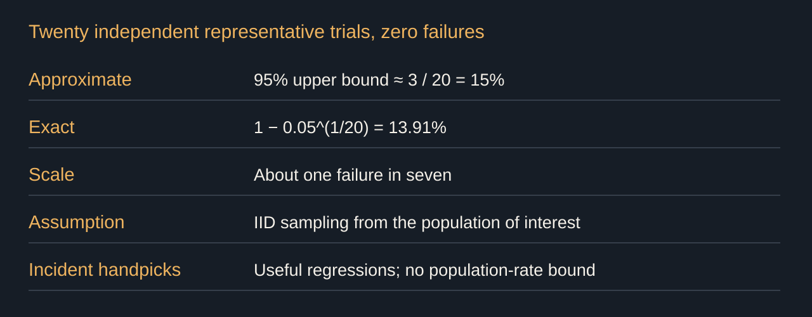

# Stop Looking at My Benchmarks… Get Your Own!

40 minutes. Timings include the exercises and delivery pauses, without Q&A. Sources checked 6 September 2026. Story prompts belong in speaker notes and require Dan’s own records before delivery.

## 1. A leaderboard, and the question it isn't answering

00:00 to 02:30 · warm

> A · 89.7
> B · 88.9
> C · 84.3

Every new model arrives wearing a tuxedo of benchmarks. Here are three scores. Pick the model you would try first.

One scope statement: the model names and workload numbers in this fixture are invented. The arithmetic and cited research are checkable. We are choosing a support system, not measuring general intelligence.

A won the displayed competition. Before buying the result, ask what competition it was. Which tasks, whose answers, what scorer, and how much uncertainty? The decimal point has done a lot of persuasion without answering any of those questions.

Stage direction: Take one show of hands. Do not ask the room to vote again on the next slide.

## 2. Same three models, your work

02:30 to 04:30 · warm

> A · 71% pass · $0.34/run
> B · 82% pass · $0.28/run
> C · 90% pass · $0.20/run

Now the same models attempt our cancellation workflow. C has the best pass rate in this fixture. The winner changed because the question changed.

We still need to know what pass meant. Did the system cancel the right account, or did it write a reassuring answer? Did it perform an authorized action, or did it merely mention policy? If the scorer only reads the chat, a polite failure can beat a terse success.

Prices can help choose among acceptable systems. They cannot tell us which systems are acceptable. The cost-per-success arithmetic belongs to Cry Me a Free Tier. Today the question is whether this score means anything.

## 3. Goodhart, Campbell, and the target

04:30 to 07:00 · build

> Reward a proxy and behavior changes
> Credit Strathern for the familiar Goodhart wording

Goodhart described statistical regularities breaking under pressure from their use in control. Campbell described the pressure that social decision-making puts on indicators and on the processes they measure. The familiar sentence about a measure becoming a target comes through Marilyn Strathern.

The practical question is the same. What behavior improves the number without improving the thing we care about? A support assistant can shorten handling time by closing the conversation before it solves the problem. A judge can reward confident prose while the backend state stays wrong.

Write that loophole down before optimizing. Then add a case that exploits it. If your evaluator applauds the exploit, you found work worth doing.

Source: Campbell (1979), [Assessing the impact of planned social change](https://doi.org/10.1016/0149-7189%2879%2990048-X). Strathern (1997), [Improving ratings](https://gwern.net/doc/statistics/decision/1997-strathern.pdf), European Review 5(3), 305–321. Formulations above are paraphrases.

## 4. Your eval suite is a measuring instrument

07:00 to 09:30 · build

> The suite needs an eval
> A green run is an inference, not a warranty

Your eval suite is a psychometric instrument somebody checked into Git. It produces scores from tasks and judgments, then we use those scores to make decisions. Where is its validation?

Try a response that sounds excellent but leaves the account active. Try a correct cancellation with awkward wording. Try an unauthorized cancellation with a perfect explanation. The instrument should distinguish those for the reasons you intended.

Nobody needs another dashboard to discover that the grader rewards tone. We need a counterexample and the nerve to keep it after it ruins the chart.

Story: The green eval run followed by a production failure. Bring the case, the score, the observed state, and the assumption the scorer missed.

## 5. One number is a comforting fiction

09:30 to 12:00 · build

> What is the score a score of?
> Construct validity: evidence for the interpretation

Cronbach and Meehl gave us construct validity. What property does this test actually measure, and what evidence supports that interpretation? Messick puts interpretation and use at the center of validation. A score used to shortlist a model and the same score used to authorize refunds are different claims.

Raji and colleagues make the problem explicit for broad AI benchmarks. A collection of tasks does not automatically justify a claim about everything the model can do.

For cancellation, separate constraints from preferences. The correct account and authorized state change are constraints. Tone is a preference after those pass. Averaging them together lets an unauthorized action buy its way out with a nice paragraph.

Source: Cronbach and Meehl (1955), [Construct validity in psychological tests](https://psychclassics.yorku.ca/Cronbach/construct.htm). Messick (1990), [Validity of Test Interpretation and Use](https://www.ets.org/research/policy_research_reports/publications/report/1990/ihmy.html). Raji et al. (2021), [AI and the Everything in the Whole Wide World Benchmark](https://datasets-benchmarks-proceedings.neurips.cc/paper/2021/hash/084b6fbb10729ed4da8c3d3f5a3ae7c9-Abstract-round2.html).

## 6. "Cancel my account."

12:00 to 15:00 · build

> Right account. Applicable policy. Authorized action.
> Verify state. Include the refusal path.

A customer asks to cancel. Identify the account through an authenticated context. Resolve the applicable policy. Check authority. Execute the allowed operation and read the resulting state. The response must match what happened.

Now vary one thing at a time. Wrong tenant. Expired session. Cancellation already completed. A tool times out after accepting the request. An account type that requires another approval. Each case names the expected state and what the assistant should tell the customer.

A trace becomes a test when it answers a specific question. A transcript without an acceptance criterion is only a souvenir. Keep enough context to reproduce the failure, and strip the customer's secrets before it enters the corpus.

Stage direction: Walk through timeout-after-acceptance using the contracts handout. Ask which backend read distinguishes a failed cancellation from a lost response.

## 7. Run it five times

15:00 to 18:00 · build

> 94, 82, 91, 97, 89
> 78, 79, 81, 82, 80 · pass at ≥ 80
> Majority disagreement: 2 / 5 = 40%

Your judge scores ninety-four, then eighty-two, then ninety-one, then ninety-seven, then eighty-nine. Same case, different answers. Noise wearing a lab coat.

A narrower spread can still change a decision. Use seventy-eight, seventy-nine, eighty-one, eighty-two, eighty. Pass at eighty or above. That gives fail, fail, pass, pass, pass. Two of five verdicts disagree with the majority. Forty percent. There is one change between adjacent runs; do not confuse that with majority disagreement.

In Auto-Tune Your LLM Judge I call majority disagreement the decision flip rate. Keep the definition beside the result. An always-pass judge has zero flips. A stable liar is still a liar, so check correctness against independent labels too.

Stage direction: Ask who reruns a fixed case. Reveal the five verdicts and do the 2/5 calculation aloud. Use the saved sequence; do not claim a live model run.

Source: Dan Levy, [Auto-Tune Your LLM Judge](https://danlevy.net/auto-tune-your-llm-judge/), supplied article. The sequence is reused as a teaching fixture, not a fresh measurement.

## 8. Twenty green cases. About one in seven.

18:00 to 21:30 · build

> Zero failures in 20 independent representative trials
> 95% upper bound: 3 / 20 ≈ 15%; exact 13.9%

Twenty for twenty feels finished. Here is what it buys under independent, identically distributed sampling from the population you care about.

With no failures, the chance of that observation at failure probability p is one minus p, raised to twenty. Set it to five percent. Solve for p. The exact one-sided ninety-five-percent upper bound is about thirteen point nine percent. Hanley and Lippman-Hand's rule of three gives the quick approximation: three divided by twenty, fifteen percent. About one in seven is the scale we still have not excluded.

Now the uncomfortable part. Twenty cases hand-picked from your favorite incidents are not a random sample. The confidence statement does not transfer to that set. They can catch known mechanisms. They cannot certify the population failure rate.

Card and colleagues examined statistical power in NLP comparisons. Small tests also miss real differences. More decimal places do not create more observations.

Stage direction: Spend one minute on (1 − p)^20 = 0.05. Ask what sample selection would make the bound inapplicable. Run arithmetic.ts if a calculator helps.

Source: James A. Hanley and Abby Lippman-Hand (1983), [If Nothing Goes Wrong, Is Everything All Right? Interpreting Zero Numerators](https://www.medicine.mcgill.ca/epidemiology/hanley/c607/ch08/zero_numerator.pdf), JAMA 249(13), 1743–1745. Card et al. (2020), [With Little Power Comes Great Responsibility](https://aclanthology.org/2020.emnlp-main.745/).

## 9. Your grader is an instrument too

21:30 to 25:00 · build

> 90 expert passes. Ten expert failures.
> Always-pass judge: 90% agreement, κ = 0

Take a hundred cases. Experts pass ninety and fail ten. Our judge passes everything. Ninety-percent agreement. Congratulations, we have calibrated a button.

Cohen's kappa compares observed agreement with agreement expected from the marginal label rates. Here both are point nine, so kappa is zero. But kappa also changes with prevalence. Do not replace blind faith in raw agreement with blind faith in a kappa threshold. Keep the confusion matrix and inspect the disagreements.

Blind model identity. Swap A/B answer order. Position bias and self-preference have published evidence behind them. Repeat these checks on the judge you actually use. When experts disagree, inspect the rubric and case before blaming the model for failing to find a truth you never agreed on.

Stage direction: Write the 90/10 confusion matrix. Compute (0.9 − 0.9)/(1 − 0.9). Allow 45 seconds to inspect the ten missed failures.

Source: Cohen (1960), [A Coefficient of Agreement for Nominal Scales](https://journals.sagepub.com/doi/abs/10.1177/001316446002000104). Feinstein and Cicchetti (1990), [High agreement but low kappa](https://pubmed.ncbi.nlm.nih.gov/2348207/). [Position bias study](https://arxiv.org/abs/2406.07791); [Self-Preference Bias in LLM-as-a-Judge](https://arxiv.org/abs/2410.21819).

## 10. Cranfield had a test collection

25:00 to 27:30 · build

> Fixed corpus. Queries. Relevance judgments.
> TREC started in 1992. It studied its own measurement.

Cleverdon, Mills, and Keen documented the Cranfield test collections in 1966. Fix the documents, fix the questions, judge relevance, and compare systems. NIST started TREC in 1992 and built a shared evaluation program around this kind of work.

The discipline also investigated its weak points. Incomplete judgments and disagreement among assessors affect what a score means. Voorhees found comparative rankings remarkably stable under changed judgments in the experiments she studied. That is evidence about those comparisons, not permission to trust any automated grader.

The Retrieval talk follows that history and its pooling problem. The point here is shorter: instrument validation is part of building the benchmark. It is not the ceremony after the launch.

Source: Cleverdon, Mills, and Keen (1966), [Cranfield report front matter](https://sigir.org/files/museum/Factors%20Determining%20the%20Performance%20of%20Indexing%20Systems%20Volume%20I.%20Design%20-%20Part%202.%20Appendices/pdfs/frontmatter.pdf). [NIST TREC overview](https://trec.nist.gov/overview.html). Voorhees (2000), [Variations in Relevance Judgments](https://www.nist.gov/publications/variations-relevance-judgments-and-measurement-retrieval-effectiveness).

## 11. Contamination and the reusable holdout

27:30 to 30:30 · build

> Public tests may have entered training
> Repeated tuning spends the holdout

Two different leaks. A public test may already be in the training data. Oren and colleagues show a way to detect contamination in black-box models under their method's assumptions. That does not make every public score meaningless. It makes provenance a question you must ask.

The second leak is ours. We inspect the holdout, tune a prompt, inspect it again, and repeat until the result looks good. The holdout became development data one honest decision at a time. Dwork and colleagues formalized this adaptive-data-analysis problem and studied controlled reuse.

Keep development cases separate from release evidence. Log every evaluation used to choose the candidate. Refresh with newly collected cases, retain regressions, and report which set served which purpose. Calling a file holdout.json does not make it held out.

Source: Oren et al. (2024), [Proving Test Set Contamination in Black-Box Language Models](https://proceedings.iclr.cc/paper_files/paper/2024/hash/46e624c244cff669223d488defd4e835-Abstract-Conference.html). Dwork et al. (2015), [The reusable holdout](https://pubmed.ncbi.nlm.nih.gov/26250683/), Science 349(6248), 636–638.

## 12. Stop averaging away failure

30:30 to 33:00 · build

> Slice by failure mechanism
> Show counts, variation, and critical violations

An overall pass rate weights whatever mix you put in the file. Add easy cases and it rises. Nothing about the hard cases had to improve.

Report cancellation by account type, authorization state, language, and tool outcome. Start with slices that correspond to plausible failure mechanisms. Show the count in each slice and repeat-run variation. A two-case slice should look like two cases, not a confident percentage.

Track critical violations separately. Nine friendly answers do not compensate for deleting the wrong account. Keep the denominator visible when the corpus changes so a new score does not quietly answer a new question.

## 13. Use the cheapest check that can honestly fail

33:00 to 35:00 · build

> State and schema belong in code
> Use judgment where the criterion requires it

Check the account state with code. Check whether a required field exists with code. Do not ask a model whether a JSON parser would accept the payload.

Use a model grader where the criterion requires language judgment, and validate it against labeled cases. Use people for disputed policy, hard ambiguity, and consequential decisions that need their authority. Each layer should be capable of rejecting a plausible wrong answer.

The ladder is a division of questions. It is not a contest to see how many things we can put behind an LLM call.

## 14. Make it a release gate

35:00 to 37:30 · land

> Version cases, scorer, rubric, and candidate
> Write the rejection rule before the flattering result

A release comparison needs the system version, prompt, tool configuration, corpus revision, scorer revision, and baseline. Otherwise the difference between two scores may be a difference between two instruments.

Set the rejection rule before viewing the candidate. Compare by slice. Keep critical violations visible and inspect uncertainty before celebrating a small gain. Each distinct production failure should leave a regression case with an acceptance criterion, while fresh sampling checks what the incident archive misses.

What would block your next rollout? Write one answer that the current suite could actually detect. If nothing would, you have a report, not a gate.

Stage direction: Give 45 seconds to write. Take one rule and ask which observable state would trigger it.

## 15. What does good mean here?

37:30 to 40:00 · land

> Validity · reliability · agreement
> Power · contamination · Goodhart

Start with twenty cases tomorrow. Attach the acceptance criterion, the source, and the reason each case belongs. Then attach the honest limitation: twenty green cases do not establish broad reliability.

Validity asks what inference the score supports. Reliability asks whether the measurement is repeatable enough for its use. Agreement asks where graders differ. Power asks whether the experiment can detect the difference we care about. Contamination asks what the system has already seen. Goodhart asks what optimizing the score will break.

The suite is an instrument. Test the instrument. Then use it to make a decision.
