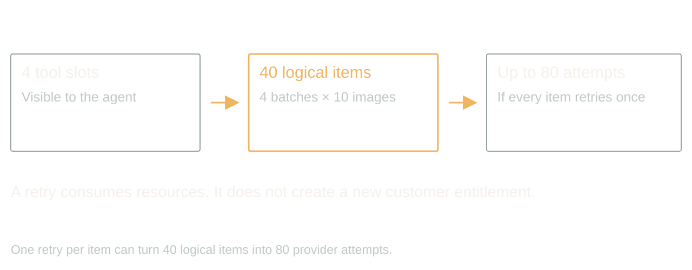
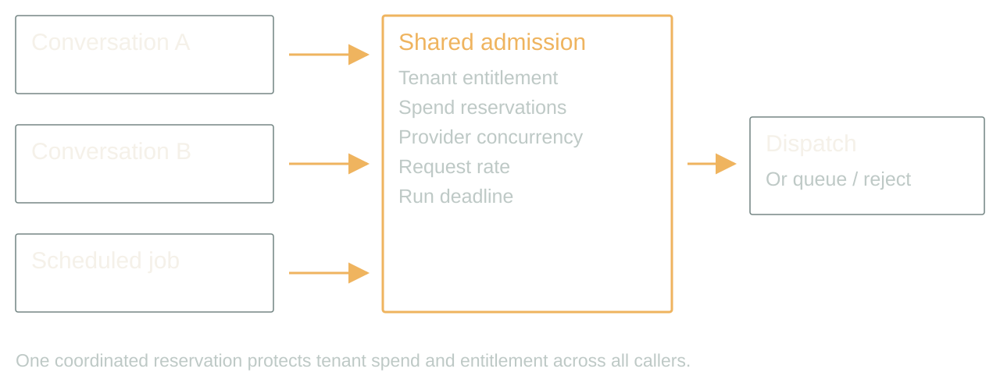
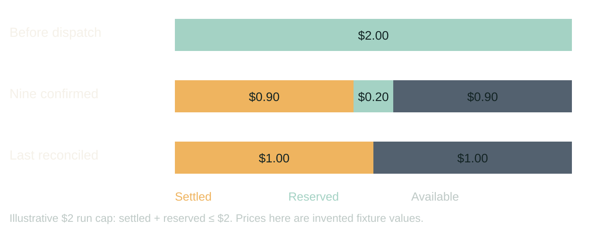
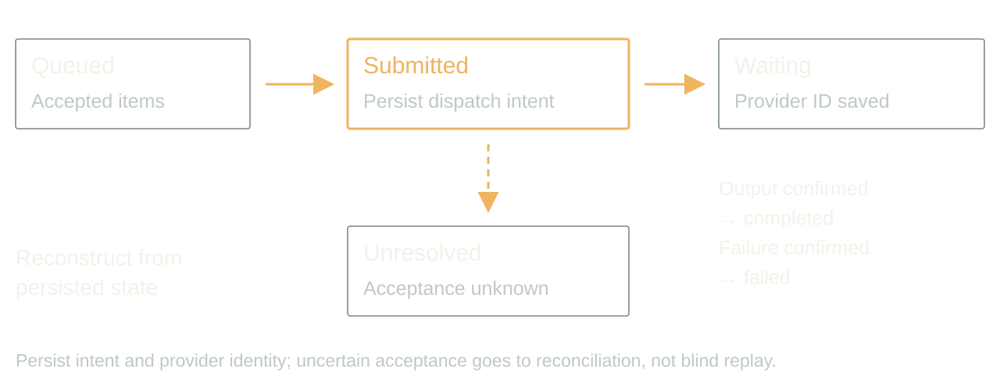
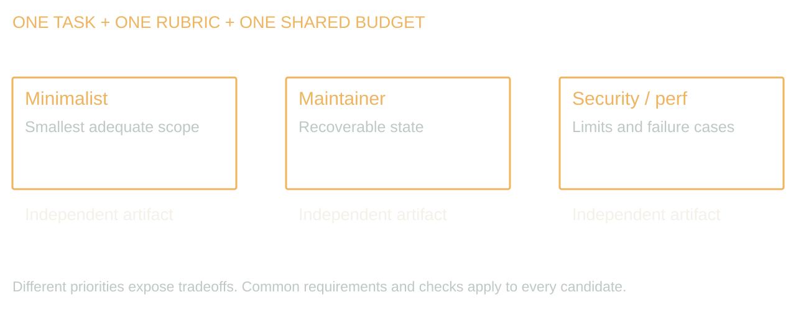
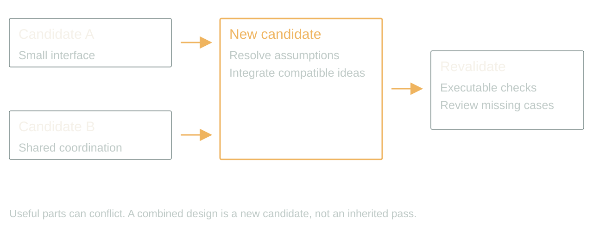

# Rethinking parallelization in the agentic era

Hidden fan-out, durable jobs, and competing solutions.

Updated 2026-09-05 from Dan's dictated notes. 40 minutes, 16 slides, no Q&A. Add five minutes for a 45-minute booking. Timings include the specified walkthroughs and audience exercises. Speaker text is a rehearsal talk track, not a claim of 40 minutes of continuous scripted speech.

[Presenter scripts](../packets/parallelization/script-40min.md) · [Contracts](../packets/parallelization/contracts.md) · [Walkthrough](../packets/parallelization/demo.md) · [Evidence](../packets/parallelization/evidence-bank.md)

Scope: proposed architecture; synthetic walkthroughs and illustrative costs; no measured reliability or speedup claim. Say this once at the opening.

## 1. Four calls. Forty images.

00:00 to 02:00 · warm

> 4 tool calls × 10 images
> = 40 provider jobs

Your agent is allowed four concurrent tool calls. Your image tool accepts ten prompts and fans them out. Everything obeys its local limit. You now have forty image jobs running for one customer.

The customer bought ten. The provider counts forty. Your dashboard proudly reports four tool calls. That is the problem I want to start with: we put the limit on the wrong unit of work.

This talk uses synthetic job counts and proposed designs. We will follow an image batch through admission, a timeout and a restart, then use the same accounting discipline to compare independent solutions to one engineering problem.

Stage direction: Let the audience calculate the fan-out before showing forty. Ask which component knows the customer entitlement.

## 2. Name the work you are parallelizing

02:00 to 04:00 · warm

Visual direction: typography slide. Keep the visible copy below; no decorative illustration is needed.

> Tasks: split the workload
> Attempts: compare solutions
> Placement: choose where work runs

Parallel systems existed long before agents. We already know about queues, distributed jobs, speculative execution and locks. What changes is that a model can propose the decomposition and generate several complete approaches cheaply enough to compare.

Keep three decisions separate. Splitting twenty images is task parallelism. Producing three designs for the same feature is search over alternatives. Moving a worker to another approved region is placement, which may add no parallelism at all.

Each decision needs a reason. More workers help only when useful independence survives the coordination cost. A model-generated plan does not repeal the dependency graph.

Stage direction: Classify image batches, route-optimization scenarios, three code designs and regional failover. Note that an LLM can schedule deterministic solvers without doing the numerical solving itself.

## 3. Tool slots hide downstream work

04:00 to 06:00 · steady

> Agent slots
> Tool batch size
> Provider attempts
> Tenant entitlement

A runtime may allow a total number of tool calls, separate limits by tool type, or something else entirely. Inspect the actual contract. Do not assume that four means four of every tool.

A batch tool is useful. It reduces orchestration chatter and owns the details of its workload. But its public contract must expose maximum batch size, estimated resource demand, cancellation behavior and how partial results return.

The multiplication is the danger. Add retries and nested worker spawning, and the visible tool count becomes an even worse proxy for work. Record logical items and external attempts separately. A retry is another attempt at an item, not a new entitlement.

Stage direction: Draw four callers, ten child jobs each, then one retry layer. Count 40 logical items and up to 80 attempts if every item has one retry.

## 4. Put admission below every caller

06:00 to 09:00 · build

> Reserve before dispatch
> Share tenant and provider limits
> Queue work that does not fit

A prompt saying only run one expensive tool is useful guidance. It is not a lock. Two conversations, a restarted worker and a scheduled job can all arrive at once.

Use a shared admission controller at the boundary every external dispatch crosses. It atomically checks the tenant budget and entitlement, provider concurrency, request rate and run deadline, then reserves capacity and spend. If the request does not fit, queue it or return an explicit rejection.

A process-local semaphore is enough only when that process owns all relevant work. Across processes, use a shared coordinator or transactional store. Keep a run's reservations separate from a tenant's aggregate limits so ten individually legal runs cannot overspend the account.

Stage direction: Walk two simultaneous callers in contracts.md. Show why read-balance-then-write loses and atomic reservation admits only one.

## 5. Count money separately from slots

09:00 to 11:00 · steady

> Concurrency ≠ requests per minute
> Reserved ≠ charged
> Cancelled ≠ refunded

Concurrency counts active work. A rate limit counts dispatches over time. A budget bounds money. You can satisfy any one and violate the others.

Reserve a defensible maximum for each permitted operation, including bounded retry allowance and relevant compute costs. If costs cannot be bounded, require an execution cap or refuse that action under a strict budget. Reconcile reservations against actual billing when the result is known.

A worker lease helps recover from crashes. Its expiry does not prove that a remote image job stopped. Keep unresolved provider jobs charged against the appropriate outstanding limits until reconciliation. Otherwise a crashed worker frees a slot for work that is still running.

Stage direction: Use the $2 illustrative ledger in contracts.md. Verify settled plus reserved never exceeds $2. All prices are invented fixture values.

## 6. Adapt pressure without moving the ceiling

11:00 to 14:00 · build

> Rate limit → wait and reduce
> Successful window → cautious increase
> Deadline → stop dispatch

An agent can propose that a batch of ten becomes five after a provider starts failing. That is useful local adaptation. The scheduler still owns the permitted range and the shared limits.

For known throttling, a deterministic policy is usually enough. Respect retry guidance, add jitter where appropriate, reduce admission, and increase cautiously after a successful observation window. Do not let every worker independently double throughput because its last request succeeded.

A global attempt budget contains nested retries. An operation identity limits duplicate effects where supported. If the deadline arrives, stop new work and report completed, pending and unresolved items separately. The user needs an accurate result, not a cheerful completion message over a pile of missing images.

Stage direction: Walk 10 → 5 after throttling, then a cautious recovery within the original maximum. Distinguish policy recommendation from enforcement.

## 7. Waiting does not need a GPU

14:00 to 16:00 · steady

Visual direction: typography slide. Keep the visible copy below; no decorative illustration is needed.

> CPU work → compute worker
> Provider wait → persisted job state
> Result → verified artifact

If a provider is generating the image, our application is mainly waiting on network I/O. Fifty containers do not make the provider render faster. A bounded asynchronous dispatcher may be enough for quick operations.

For long jobs, persist state and resume from callbacks or bounded polling. Choose a workflow engine when durable steps and event waits are the main requirement. Choose a sandbox when you need to execute a process, manipulate files, or isolate untrusted code. Choose a compute worker when the workload actually consumes CPU or GPU time.

These can work together. The useful decision is where execution happens and where recovery state lives. Provider-specific sleep behavior and billing need verification before deployment.

Stage direction: Place a local graph solver, a remote image request and a file conversion into the appropriate execution category.

## 8. A durable job survives the conversation

16:00 to 19:00 · build

> accepted → submitted → waiting
> completed / failed / unresolved
> Notification has its own status

Accept ten prompts and return a stable job ID. Persist item IDs, provider IDs, reservations, attempts, output locations and terminal states. The conversation can end without losing the job.

Save progress between steps. A callback may arrive twice or out of order. Authenticate it, deduplicate it, and apply only valid state transitions. A restart should reconstruct pending work from storage rather than rerun the whole conversation.

Cloudflare Workflows provides durable steps and waits. Durable Objects provide coordinated state, but their in-memory state can disappear during lifecycle transitions. Neither naming something durable nor keeping a sandbox around makes an arbitrary pending promise survive. The application still needs an explicit recovery protocol.

Stage direction: Draw the state machine in contracts.md. Crash after provider submission and before its ID is saved; discuss the unresolved state and provider idempotency.

## 9. Completion and notification are different jobs

19:00 to 21:00 · steady

Visual direction: typography slide. Keep the visible copy below; no decorative illustration is needed.

> Persist output first
> Enqueue notification once
> Retry delivery without regeneration

The provider finishes. Store the output reference and mark the item complete. Then schedule the notification using a persisted event or transactional outbox. An email failure should never rerun image generation.

You can adapt the delivery channel to user preferences and current presence. Presence is imperfect evidence. It is not consent to start sending texts. Keep allowed channels, delivery caps and quiet hours in a policy, and deduplicate messages by job and event.

At the user boundary, expose partial completion and unresolved items. Ten requested images with eight finished should look like eight finished and two pending. The notification layer should report that state, not reinterpret it.

Stage direction: Inject a notification timeout after all outputs are stored. Ask which state changes and which operation must not repeat.

## 10. Walkthrough: restart the batch

21:00 to 26:00 · peak

Visual direction: typography slide. Keep the visible copy below; no decorative illustration is needed.

> Two callers share a limit
> One response goes missing
> Restart without blind resubmission

Start with two callers each requesting a full batch. The first reserves the available entitlement. The second cannot reserve the same balance; it queues or receives an explicit rejection.

Now lose one provider response. We keep that item unresolved and keep its reservation. Restart the dispatcher. It reloads the job, checks provider status where supported and collects completed outputs. It does not treat a missing local result as proof that nothing happened.

Finally fail the notification. The delivery worker retries the notification against the completed job. Our expensive generation is untouched. That is the abstraction we wanted from the batch tool: one job with a recoverable lifecycle and honest accounting.

Stage direction: Use demo.md for the five-minute paper trace. Ask the room for the next transition before revealing it. This is not a live provider demonstration.

## 11. Parallel attempts explore different answers

26:00 to 28:00 · steady

> Minimal scope
> Maintainable design
> Security and performance scrutiny

Now change the unit of parallel work. Give the same bounded design problem to two or three independent attempts. A ruthless minimalist searches for the smallest adequate change. A maintenance-focused attempt considers interfaces and failure recovery. A security and performance reviewer challenges the expensive or dangerous assumptions.

These are priorities, not guarantees of independent expertise. Different models and prompts can still share the same blind spot. Give them the same requirements and acceptance criteria, and keep first drafts separate so they do not immediately converge on the first plausible answer.

I use this council-of-experts framing to get contrasting approaches. The contrast is the useful output. Three flattering versions of the same answer have not bought us much.

Stage direction: Use the batch-job design as the common problem. Read the three worker briefs in contracts.md and identify the tradeoff each should expose.

## 12. Make the judge earn its vote

28:00 to 30:00 · build

Visual direction: typography slide. Keep the visible copy below; no decorative illustration is needed.

> Fixed requirements
> Executable checks first
> Evidence-backed comparison
> Permission to reject everyone

Write the rubric before reviewing the candidates. For this job, hard gates include no duplicate dispatch after restart, no cross-tenant budget leakage and no regeneration on notification retry. A beautiful explanation cannot compensate for failing those requirements.

Use executable checks where they cover the requirement. Passing tests does not establish complete correctness, so review missing cases and operational complexity too. Remove author and model names where practical, vary presentation order, and require evidence for the judge's conclusions.

A stronger model with a larger reasoning budget can help with review, but remains another fallible reviewer. It must be allowed to reject every candidate. Spend on verification before launching the next hundred alternatives.

Stage direction: Score the synthetic candidates in demo.md. Reject the fastest candidate when it fails the restart requirement.

## 13. Synthesis creates a new candidate

30:00 to 32:00 · build

> Select compatible ideas
> Resolve conflicting assumptions
> Run the gates again

The final review should extract the best compatible ideas. That word compatible matters. A minimal design that assumes a single process cannot simply inherit the claims of another design that uses a distributed coordinator.

Write the resulting design as a new candidate with one coherent set of assumptions. Then rerun the tests and review. Passing parts do not automatically make a passing whole. For code, keep candidate work in isolated branches or worktrees, and merge through an explicit integration step.

Stop after the agreed candidate and review budget. If the evidence is inconclusive, return the alternatives and the unresolved tradeoff. An endless debate is still an expensive failure to deliver.

Stage direction: Combine the small batch API with durable state and shared admission. Ask which original single-process assumption must be removed.

## 14. Keep the procedure you discovered

32:00 to 34:00 · steady

Visual direction: typography slide. Keep the visible copy below; no decorative illustration is needed.

> Investigate once
> Encode the stable procedure
> Retain regression and negative cases

Once the comparison exposes a stable procedure, write it down as executable code, a check or a reusable tool. The next batch should use the dispatcher we just validated. It should not hold another architecture council.

Some work remains ambiguous. Keep reasoning where it changes a decision. Compile the repetitive operations whose contract you now understand, and retain negative cases so the rule does not overreach.

That leads into an improvement loop: evaluate proposals, promote useful procedures and monitor for drift. The full loop belongs in the companion talk. Here the payoff is that a parallel exploration can leave behind something cheaper to run and easier to inspect.

Stage direction: Identify one deterministic artifact from the exercise and the negative fixture that prevents it from misfiring.

## 15. Measure the accepted outcome

34:00 to 38:00 · land

Visual direction: typography slide. Keep the visible copy below; no decorative illustration is needed.

> Dispatch + queue + longest branch
> Merge + verification + delivery
> Total spend per accepted result

Parallel latency includes dispatch, queues, the slowest required branch, merge and verification. Starting three workers at once does not make the serial parts disappear. Waiting for every branch can make an otherwise finished task slower.

Compare against one competent attempt on the same task set. Count all candidates, failed work, reserved uncertainty, judging and human review. Measure accepted outcomes, not generated tokens or launched workers. More output can simply move the bottleneck into review.

Start with one extra attempt or one batch boundary. If it does not improve quality, elapsed time or cost enough to justify coordination, keep the simpler path. We are trying to buy useful work, not maximize the number of things blinking.

Stage direction: Give attendees 90 seconds to choose a baseline, a cap and an acceptance gate. Compare latency and total cost as separate measures.

## 16. Count the work below the tool call

38:00 to 40:00 · land

Visual direction: typography slide. Keep the visible copy below; no decorative illustration is needed.

> One budget across every branch
> Durable state across every restart
> A test before every promotion

Back to the four tool calls. Forty provider jobs were legal according to four local counters. The missing piece was a shared account of what the application had promised and what it had already started.

The same discipline applies when the outputs are competing designs. Bound the attempts, preserve their artifacts, judge them against the requirement, and verify the combined result. Parallelism gives us more opportunities to find a good answer. It also gives us more opportunities to spend money without one.

Inspect one expensive tool in your system. Count the work it can launch underneath itself. Put the limit where that work actually begins.

Stage direction: Close on the opening multiplication and the shared admission boundary. End without adding a new axis or vendor list.
