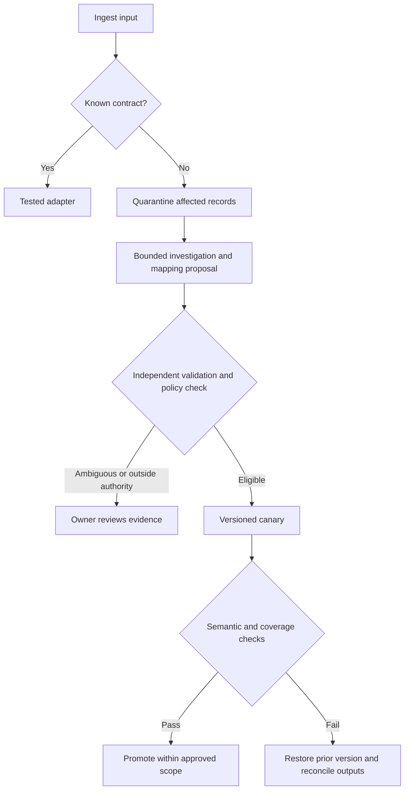
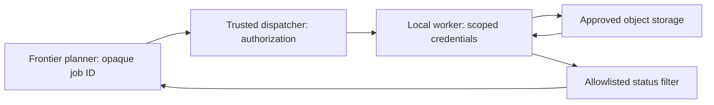

# Adaptive, agentic apps: implementation handout

Proposed contracts for the talk, not a deployed controller. Numerical limits are illustrative policy choices.

## A recovery request

```json
{
  "jobId": "ingest-1042",
  "goal": "Preserve address meaning and account for every input record",
  "inputContract": "vendor-address-v7",
  "evidence": ["approved-contract-v8", "redacted-sample-set-12"],
  "allowedActions": ["read-approved-sample", "propose-mapping", "run-fixtures"],
  "maxSpendUsd": 2,
  "deadlineSeconds": 120,
  "maxAttempts": 3,
  "promotionPolicy": "equivalent-address-rename-canary-v1",
  "stopOn": ["ambiguous-semantics", "unknown-external-outcome", "budget-exhausted"]
}
```

The trusted service resolves evidence IDs. Tools validate authorization independently of this model-visible proposal. Policy IDs refer to server-owned definitions. Generated output cannot redefine them.

## The mapping artifact

```json
{
  "version": "address-map-v8-candidate-1",
  "parentVersion": "address-map-v7",
  "inputFingerprint": "vendor-contract-v8-sha256-reference",
  "transforms": [{"from": "postal_code", "to": "postalCode", "operation": "copy-string"}],
  "rejectOn": ["conflicting-zip-and-postal_code", "missing-country", "unknown-status"],
  "evidenceRefs": ["approved-contract-v8", "fixture-report-1042"],
  "activation": {"vendor": "example-vendor", "contract": "v8", "maxRecords": 100},
  "rollbackVersion": "address-map-v7",
  "sourceReplayRef": "ingest-1042-raw-records"
}
```

The canary limit is a chosen example. A validator must check the declared transforms against an allowlist and independently computed test results. A matching input fingerprint alone does not prove semantics. Reject stale proposals if the active parent version changes before promotion. A compare-and-swap check prevents one repair from silently overwriting another.

## Recovery flow



## A daily report an engineer can act on

Synthetic report, not production observations.

| Priority | Observation | Impact | Next action |
| --- | --- | --- | --- |
| High | `status=pending` has no approved interpretation | 18 records quarantined | Integration owner requests vendor semantics |
| Medium | OCR submission has no confirmed outcome | One job, $0.20 reservation outstanding | Query saved provider job ID; no blind resubmission |
| Low | Address mapping v8 passed canary | 100 records checked, no fixture violations | Owner reviews evidence before scope expansion |

Include source refs, timestamps, policy and model versions, actual versus reserved spend, and counts of every input disposition. Aggregate low-priority retries. Alert urgent failures through independently configured monitoring.

## Separate orchestration from sensitive processing



The planner has no storage credential or signed URL. The dispatcher supplies short-lived scoped capabilities directly to the worker. Restrict outbound access, minimize worker privileges, and exclude payloads and credentials from traces and error bodies. Result storage is separate from the model-visible status channel. This reduces exposure paths; it is not a compliance certification or proof of complete isolation.

## Recovery card

Write a concrete answer to each question before enabling automatic action:

1. Which recurring failure starts the investigation?
2. What must remain true for every input record?
3. What evidence distinguishes a rename from a semantic change?
4. Which exact action may run automatically, on which scope?
5. What caps apply to attempts, elapsed time and spend?
6. Which uncertain states stop or escalate the job?
7. How are partial writes reconciled after rollback?
8. Who owns the report and approves a broader policy?
