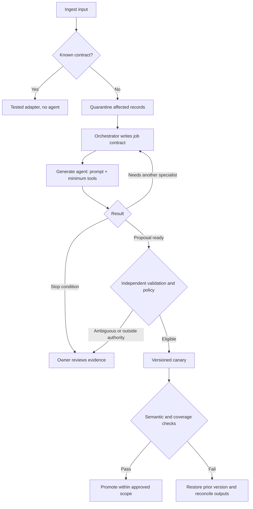
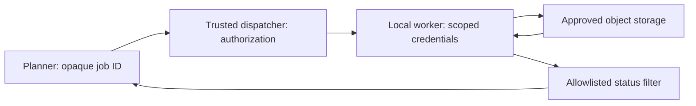

# Adaptive, agentic apps: implementation handout

Contracts from the talk. The job contract and tool policy mirror Dan's prototype agent generator; the rest is the design it is growing into. Numbers are policy choices, not measurements.

## The job contract the orchestrator writes

```json
{
  "jobId": "ingest-1042",
  "goal": "Preserve address meaning and account for every input record",
  "trigger": "schema-mismatch: vendor-address-v7 vs observed payload",
  "evidence": ["approved-contract-v8", "redacted-sample-set-12"],
  "tools": ["read-approved-sample", "read-contract", "propose-mapping", "run-fixtures"],
  "toolSearch": { "allowed": true, "policy": "ingest-repair-v3" },
  "riskClass": "read-and-propose",
  "maxSpendUsd": 2,
  "deadlineSeconds": 120,
  "maxAttempts": 3,
  "promotionPolicy": "equivalent-address-rename-canary-v1",
  "stopOn": ["ambiguous-semantics", "unknown-external-outcome", "budget-exhausted"]
}
```

The orchestrator generates one agent per job with a prompt tailored to the trigger and exactly the tools listed. Evidence IDs and policy IDs refer to server-owned definitions; generated output cannot redefine them. Tools validate authorization on their own, independent of what the model believes it was granted.

## The tool policy gate

Every tool request the generated agent makes, including discovery through tool search, passes one gate:

| Request | Risk class of tool | Job's risk class | Decision | Logged |
| --- | --- | --- | --- | --- |
| read-approved-sample | read | read-and-propose | grant | yes |
| run-fixtures | read | read-and-propose | grant | yes |
| write-mapping-version | write | read-and-propose | deny; orchestrator may conjure a promotion job | yes |
| write-database | write | read-and-propose | deny | yes |
| send-email | send | read-and-propose | deny | yes |

Risk classes: read, write, send, pay, delete, deploy, export. A generated agent holds at most one non-read class per job. A tool that reads customer data and a tool that posts to an external system never share a job without an allowlist filter between them.

The denied-request log is the most useful artifact the system produces. Review it weekly. It tells you which permissions your integrations actually want and which you have been granting by habit.

## The orchestrator loop



Typical chain for a rename: diff agent proposes; fixture agent adds held-out cases without seeing the proposal; reviewer agent compares. Each is generated, scoped, and discarded.

## The mapping artifact

```json
{
  "version": "address-map-v8-candidate-1",
  "parentVersion": "address-map-v7",
  "inputFingerprint": "vendor-contract-v8-sha256-reference",
  "transforms": [{"from": "postal_code", "to": "postalCode", "operation": "copy-string"}],
  "rejectOn": ["conflicting-zip-and-postal_code", "missing-country", "unknown-status"],
  "evidenceRefs": ["approved-contract-v8", "fixture-report-1042"],
  "activation": {"vendor": "example-vendor", "contract": "v8", "maxRecords": 100},
  "rollbackVersion": "address-map-v7",
  "sourceReplayRef": "ingest-1042-raw-records"
}
```

A validator checks the declared transforms against an allowlist and independently computed fixture results. A matching input fingerprint alone proves nothing about semantics. Reject stale proposals if the active parent changes before promotion; a compare-and-swap keeps one repair from silently overwriting another.

## Sensitive processing: keep capabilities out of the planner



The planner never holds a storage credential or a signed URL. The dispatcher hands short-lived scoped capabilities directly to the worker. Restrict egress, minimize worker privilege, and keep payloads and credentials out of prompts, traces, error bodies and notification previews. This reduces exposure paths; it is not a compliance certification.

## Compute as a job request

```json
{
  "jobId": "ingest-1042",
  "shape": "provider-wait",
  "size": {"class": "sandbox-small", "count": 8},
  "durationSeconds": 360,
  "region": "us-east",
  "costCapUsd": 1.5,
  "billTo": "customer-4471"
}
```

The scheduler resolves this against a catalog of approved classes, the tenant's plan and budget, and residency rules, then returns a lease with an expiry and a teardown. The agent chooses within the catalog; it never grants itself a class or a region. Mechanics are in the companion talk, Dynamic Scaling of Agentic Workloads.

## A daily report an engineer can act on

| Priority | Observation | Impact | Next action |
| --- | --- | --- | --- |
| High | `status=pending` has no approved interpretation | 18 records quarantined | Integration owner requests vendor semantics |
| Medium | Verification submission has no confirmed outcome | One job, $0.20 reservation outstanding | Query saved provider job ID; no blind resubmission |
| Medium | 3 denied tool requests: write-database from ingest-repair jobs | No action taken | Owner decides whether a promotion job class is needed |
| Low | Address mapping v8 passed canary | 100 records checked, no fixture violations | Owner reviews evidence before scope expansion |

Include source refs, timestamps, policy and model versions, actual versus reserved spend, and counts of every input disposition. Aggregate routine retries. Page urgent failures through independently configured monitoring.

## Recovery card

Answer each before enabling automatic action:

1. Which recurring failure conjures an agent?
2. What must remain true for every input record?
3. What evidence distinguishes a rename from a change in meaning?
4. Which tools does this job class get, and which risk class at most?
5. What caps apply to attempts, elapsed time, spend, and compute?
6. Which uncertain states stop or escalate the job?
7. How are partial writes reconciled after rollback?
8. Who reads the denied-request log, owns the report, and approves a wider policy?
