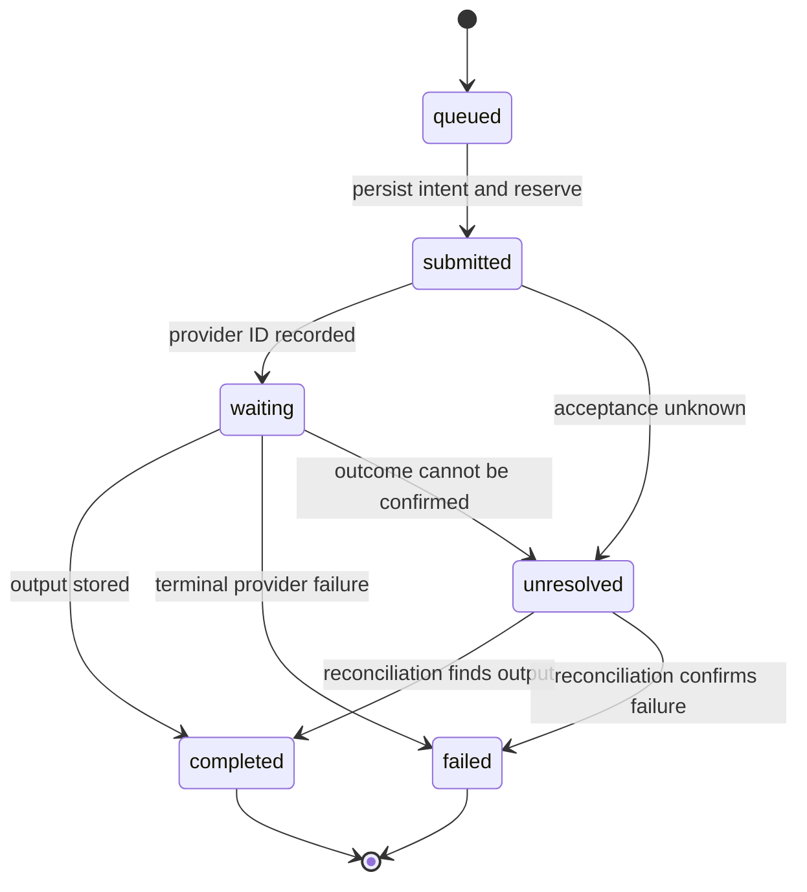

# Dynamic Scaling of Agentic Workloads: implementation handout

Proposed interfaces and paper fixtures. Prices are invented; vendor behavior on the ecosystem slide was checked against public docs on 2026-09-06.

## Batch-tool contract

```json
{
  "operation": "generate-image-batch",
  "jobId": "batch-1042",
  "tenantId": "tenant-from-authenticated-session",
  "maxItems": 10,
  "maxProviderConcurrency": 5,
  "maxAttemptsPerItem": 2,
  "maxRunSpendUsd": 2,
  "deadlineSeconds": 600,
  "return": ["jobId", "acceptedItemIds", "rejectedItems"],
  "status": ["queued", "submitted", "waiting", "completed", "failed", "unresolved"],
  "cancellation": "stop dispatch; request provider cancellation; reconcile outstanding work"
}
```

The server derives tenant identity and entitlement; a caller-supplied tenant ID is not authority. Batch size, agent-runtime parallelism, provider concurrency and rate limits are separate settings resolved at dispatch.

## Compute request

```json
{
  "jobId": "batch-1042",
  "shape": "provider-wait",
  "size": {"class": "sandbox-small", "count": 8},
  "durationSeconds": 360,
  "region": "us-east",
  "costCapUsd": 1.5,
  "billTo": "tenant-4471",
  "egress": ["provider.example", "storage.example", "callbacks.example"]
}
```

The scheduler resolves the request against a catalog of approved classes, the tenant's plan and remaining budget, residency rules and capacity, then returns a lease:

```json
{
  "leaseId": "lease-88f1",
  "granted": {"class": "sandbox-small", "count": 8},
  "expiresAt": "2026-09-06T02:06:00Z",
  "teardown": "automatic",
  "credential": "scoped, single-use, expires with lease",
  "billedTo": "tenant-4471"
}
```

The agent chooses within the catalog. It cannot name a class, region or egress domain that the catalog does not list. Lease expiry proves the worker is gone; it does not prove remote work stopped, so reservations outlive leases until reconciliation.

## Admission protocol

1. Authenticate the caller and resolve server-owned tenant, provider, region and operation policies.
2. Deduplicate the logical request and item identities. Four legitimate callers with the same request get the same job ID back.
3. In one coordinated transaction, check deadline, entitlement and available spend, then reserve the approved item set. Queue or explicitly reject the rest; return exactly what was accepted.
4. Before each external attempt, atomically acquire provider concurrency and rate capacity and confirm the run reservation and deadline still hold.
5. Persist dispatch intent and an idempotency key where supported, then dispatch; save provider job IDs immediately.
6. Release local leases on worker shutdown or spot reclaim, but retain accounting for remote operations whose outcome is unknown. Fence stale workers from committing state or dispatching.
7. Reconcile confirmed outcomes and charges. Settle spend and release unused reservations only when justified. A deadline or cancellation is not proof of zero charge.

A lock around reading the budget is insufficient if work starts after the lock is released without a reservation. A lease cannot fence an already-issued external request.

## Illustrative $2 ledger

Assume $0.10 per attempt, ten items, two attempts each. Infrastructure cost is excluded only to keep the arithmetic visible.

| Event | Settled | Reserved | Available | Explanation |
| --- | ---: | ---: | ---: | --- |
| Start | $0.00 | $0.00 | $2.00 | No work admitted |
| Caller A reserves 10 items × 2 attempts | $0.00 | $2.00 | $0.00 | Full allowance reserved |
| Caller B asks for the same capacity | $0.00 | $2.00 | $0.00 | Queued with reason: reserved by batch-1042 |
| Nine items succeed on first attempt | $0.90 | $0.20 | $0.90 | Nine unused retry allowances released |
| Last item has an uncertain first attempt | $0.90 | $0.20 | $0.90 | Its allowance is held |
| Reconciliation confirms one completion | $1.00 | $0.00 | $1.00 | Settle $0.10, release the unused retry |

Invariant: settled plus reserved never exceeds $2.

**Reservation tightness.** This ledger reserves pessimistically, so caller B waited behind $0.90 that was never spent. The alternative reserves one attempt per item and grants retries lazily from the remaining balance; it admits more real work and can overshoot when many retries land at once. Pick one, name it in the policy, and show the queued caller why it is waiting.

## Durable state and notification



Retries after a confirmed retryable failure create a new attempt under the same item, subject to remaining budget and deadline. Keep an append-only attempt trail. Commit output state and a notification outbox event together where storage permits. Notification workers deduplicate; a notification failure changes delivery state only.

## Three design briefs

Shared task: the ten-image batch API with shared tenant limits, a durable lifecycle, a recoverable notification step, and a compute substrate that may be reclaimed. Every candidate faces the same gates. Each gets one isolated artifact, a fixed deadline and a sub-budget from one run budget.

| Attempt | Priority | Required artifact |
| --- | --- | --- |
| Minimalist | Smallest operationally adequate design | Interface, persistence needs, explicit rejected complexity |
| Maintainer | Clear ownership and recoverable state | State machine, restart trace, migration and rollback plan |
| Security/performance | Tenant boundaries and bounded throughput | Abuse cases, admission protocol, queue and capacity analysis |

Candidates do not see each other's drafts before submission. A final reviewer gets the artifacts, the rubric and recorded checks. It may select, reject all, or produce a combined candidate, which must pass the gates again.

## Judge rubric

Hard gates precede preferences:

- Concurrent callers cannot spend the same reservation or cross tenant boundaries.
- A restart, including a reclaimed spot worker, does not blindly repeat an externally accepted job.
- A notification retry cannot trigger generation.
- Uncertain outcomes stay visible and charged against unresolved reservations.
- Dispatch after the deadline is rejected.

Among eligible designs, compare operational complexity, latency, cost and maintainability with stated evidence. Mark untested properties untested. The reviewer invents no additional success criteria and awards no certainty for polished prose.
