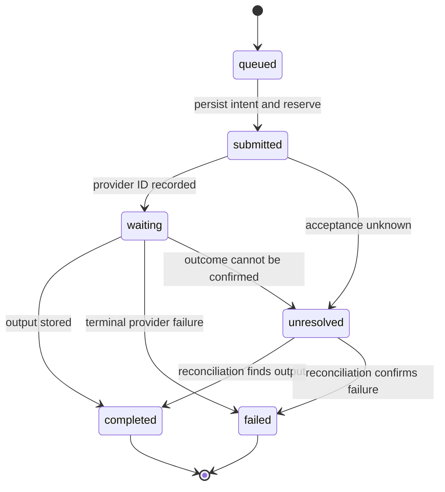

# Parallelization: implementation handout

These are proposed interfaces and paper fixtures, not production code or measured prices.

## Batch-tool contract

```json
{
  "operation": "generate-image-batch",
  "jobId": "batch-1042",
  "tenantId": "tenant-from-authenticated-session",
  "maxItems": 10,
  "maxProviderConcurrency": 5,
  "maxAttemptsPerItem": 2,
  "maxRunSpendUsd": 2,
  "deadlineSeconds": 600,
  "return": ["jobId", "acceptedItemIds", "rejectedItems"],
  "status": ["queued", "submitted", "waiting", "completed", "failed", "unresolved"],
  "cancellation": "stop dispatch; request provider cancellation; reconcile outstanding work"
}
```

The server derives tenant identity and entitlement. A caller-supplied tenant ID is not authority. Maximum batch size, parallel calls allowed by the agent runtime, provider concurrency and rate limits are separate settings. Resolve their intersection at dispatch.

## Admission protocol

1. Authenticate the caller and resolve server-owned tenant, provider, region and operation policies.
2. Deduplicate the logical request and item identities.
3. In one coordinated transaction, check the deadline, entitlement and available spend, then reserve the approved item set. Queue or explicitly reject the rest; return exactly what was accepted.
4. Before each external attempt, atomically acquire provider concurrency and rate capacity and check the still-valid run reservation and deadline.
5. Persist dispatch intent and an idempotency key where supported. Dispatch using that identity; save provider job IDs.
6. Release local execution leases on worker shutdown, but retain accounting for remote operations whose outcome remains unknown. Fence stale workers from committing state or initiating new dispatch. A provider may need its own idempotency support to protect the external side effect.
7. Reconcile confirmed outcomes and charges. Settle spend and release unused reservations only when justified. Deadline or cancellation is not proof of zero charge.

A lock around reading the budget is insufficient if work starts after the lock is released without a reservation. A lease alone cannot fence an already-issued external request. If the provider cannot bound charges or report uncertain outcomes, the application cannot promise a hard ceiling using estimates alone; constrain supported operations accordingly.

## Illustrative $2 ledger

Assume a fixed $0.10 per attempt, at most ten items, and at most two attempts per item. This example excludes infrastructure costs solely to keep the arithmetic visible. A production budget includes all relevant billable operations.

| Event | Settled | Reserved | Available | Explanation |
| --- | ---: | ---: | ---: | --- |
| Start | $0.00 | $0.00 | $2.00 | No work admitted |
| Caller A reserves 10 items × 2 attempts | $0.00 | $2.00 | $0.00 | Full run allowance reserved |
| Caller B asks for the same capacity | $0.00 | $2.00 | $0.00 | Queued or rejected |
| Nine items succeed on first attempt | $0.90 | $0.20 | $0.90 | Nine unused retry allowances released |
| Last item has an uncertain first attempt | $0.90 | $0.20 | $0.90 | Do not release its allowance |
| Reconciliation confirms last item completed once | $1.00 | $0.00 | $1.00 | Settle $0.10 and release unused retry |

Invariant: settled plus reserved never exceeds $2. Capacity released here may be usable by other authorized work, but it does not create more than the customer's ten-image entitlement for this job. Duplicate requests return the existing job identity.

## Durable state and notification



Retries after a confirmed retryable failure create a new attempt under the same logical item and existing policy. They require remaining budget and deadline. Keep an append-only attempt trail. Commit output state and a notification outbox event together where the storage system permits it. Notification workers deduplicate delivery events; notification failure changes delivery state only.

## Three independent design briefs

Shared task: design the ten-image batch API with shared tenant limits, a durable lifecycle and a recoverable notification step. All candidates must satisfy the same hard gates. Each gets one isolated artifact, a fixed deadline and a sub-budget reserved from one run budget.

| Attempt | Priority | Required artifact |
| --- | --- | --- |
| Minimalist | Smallest operationally adequate design | Interface, persistence needs, explicit rejected complexity |
| Maintainer | Clear ownership and recoverable state | State machine, restart trace, migration and rollback plan |
| Security/performance | Tenant boundaries and bounded throughput | Abuse cases, admission protocol, queue and capacity analysis |

Do not show candidates each other's drafts before independent submission. A final reviewer gets the artifacts, common rubric and recorded checks. It may select, reject all, or produce a new combined candidate. That combined candidate must pass validation again.

## Judge rubric

Hard gates precede preferences:

- Concurrent callers cannot spend the same reservation or cross tenant boundaries.
- A restart does not blindly repeat an externally accepted job.
- A notification retry cannot trigger generation.
- Uncertain outcomes remain visible and charged against unresolved reservations.
- Expensive dispatch after a deadline is rejected.

Among eligible designs, compare operational complexity, latency, cost and ease of maintenance with stated evidence. Mark untested properties as untested. The reviewer does not invent additional success criteria or award certainty from polished prose.
