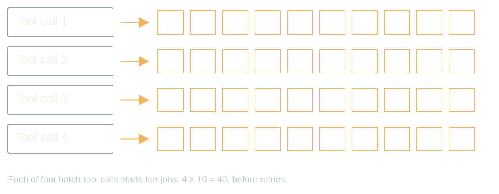
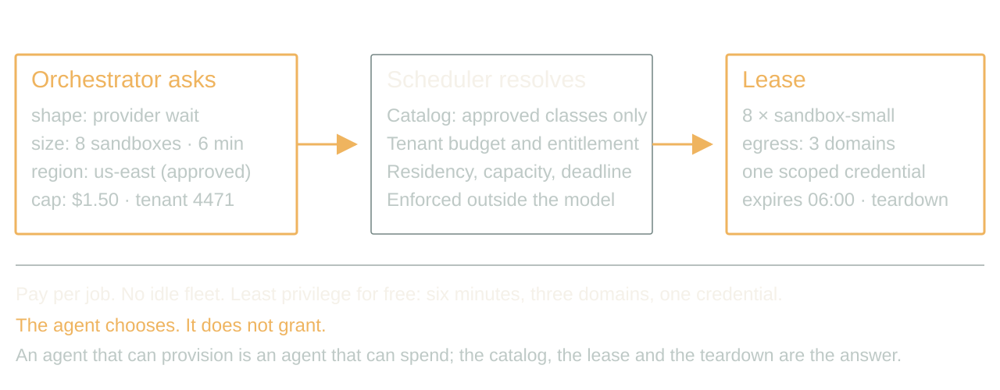
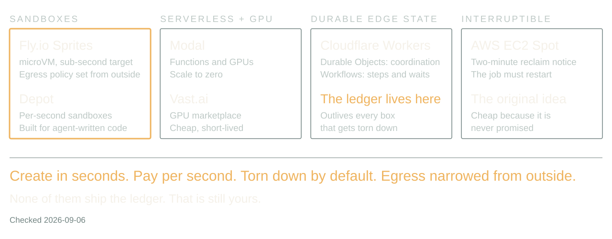
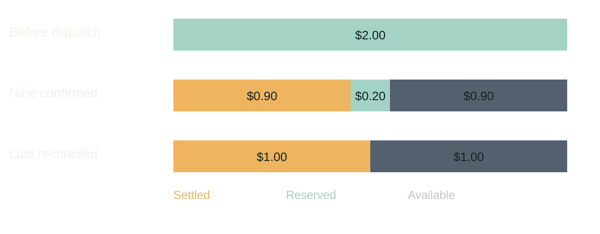
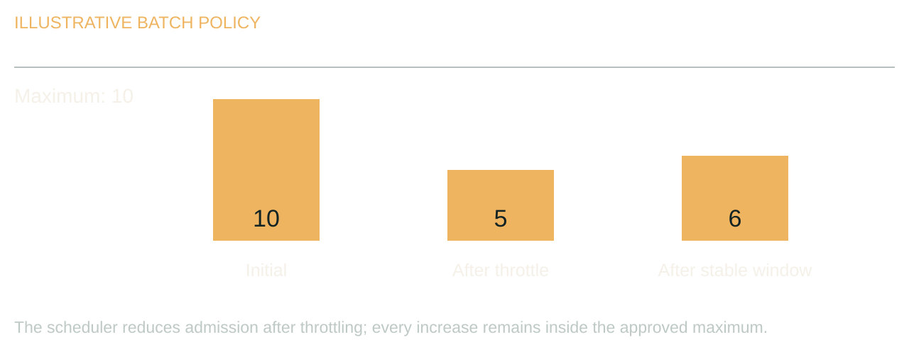
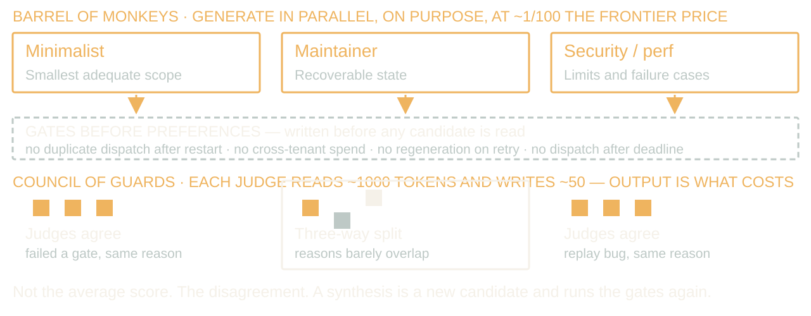

# Compute, Please (and a Receipt)

Your agent chooses the compute, and the bill still has your name on it.

Rewritten 2026-09-06 from Dan's notes; arc rebuilt 2026-09-07. 40 minutes, 14 slides, seven audience-response beats (slides 1, 2, 3, 7, 10, 11 and 13), no Q&A. Add five minutes for a 45-minute booking. Job counts and prices are fixtures; the vendors on slide 3 are real and were checked on 2026-09-08. Say the scope once, on slide 1. Story allowances are included in the timing, not added. [Per-slide spoken and interaction budgets](pacing.md): 32.25 spoken minutes plus 7.75 interaction minutes = 40. Guided diagrams on other slides use spoken time; do not open extra audience discussions.

The arc in three acts: the inversion (slides 1 to 4, the new thing and its real substrate), the ledger (slides 5 to 10, everything the lease is enforced against, paid off by the walkthrough), and the third axis (slides 11 to 13, attempts, with Amdahl as the brake before the barrel and the council). Slide 14 lands.

[Presenter scripts](script-40min.md) · [Contracts](contracts.md) · [Worked example](demo.md) · [Supporting code](https://github.com/justsml/scaling-ai-agents) · [Evidence](evidence-bank.md)

## 1. Four callers, forty images, one customer

00:00 to 02:00 · warm

> A chat turn, a retry, a cron job, a second tab
> Each legal. Each ten images.
> The customer bought ten.

A customer asks for ten images. Four things happen within a minute, and every one of them is legitimate. The chat turn calls the batch tool. A worker crashed halfway and its replacement retries. A nightly job re-runs anything not marked done. The customer opened a second tab because the first one looked stuck.

Four callers, ten images each. Every local limit passed. The provider is rendering forty. Your dashboard proudly reports four tool calls. We put the limit on the wrong unit of work.

Your agent chooses the compute, and the bill still has your name on it. Numbers here are fixtures; the vendors later are real.

Stage direction: Let the room multiply before you show forty. Then ask which component knew the customer's entitlement. Silence is the answer.

## 2. Infra Is a Tool Call

02:00 to 06:00 · peak

> `replicas: 12`, decided by ops in 2023, for everyone
> `{ shape: provider-wait, n: 8, ttl: 6m, cap: $1.50 }`, decided by the job, at job start
> Resolve: catalog, tenant budget, lease with a teardown

For twenty years scaling was an infra question answered once for everyone. Add replicas or buy a bigger box, then let an autoscaler watch CPU and guess. The workload never got a say. Now it does. The orchestrator knows this batch is mostly waiting on a provider, that this one needs a GPU for ninety seconds, that this one is untrusted code and wants a sandbox, and it knows at the moment the job starts.

Here is the part that is actually new. The orchestrator asks for compute the way it asks for a tool. Eight sandboxes for six minutes, this region, this cost cap. The scheduler resolves that against a catalog of approved classes and the tenant's budget, and returns a lease with a teardown.

What you get is per-job economics. A customer can buy a faster turnaround. Finance can cap one workflow instead of one environment. Nobody pays for a warm fleet sized for the worst Tuesday of the year. And short lifetimes help limit exposure: an instance that lives six minutes, reaches three domains, and holds one scoped credential limits the reach of a confused agent.

What you risk is obvious. An agent that can provision is an agent that can spend. The catalog, the lease and the teardown are the answer, and they are enforced outside the model. The agent chooses; it does not grant. Everything the lease is enforced against is still yours to build, and that is the middle of this talk. First, proof that the substrate exists.

Story: Replace up to 40 words of the per-job economics paragraph with a first-hand capacity-planning example. This is substitution, not extra material; at most 25 seconds within the spoken budget.

Stage direction: Contrast one autoscaler threshold with one job request. Ask which one you could put on an invoice.

## 3. Torn Down by Default

06:00 to 09:00 · steady

> Sandboxes: Fly.io Sprites, Depot
> Serverless compute and GPUs: Modal, Vast.ai
> Durable edge state: Cloudflare Workers, Durable Objects, Workflows
> Interruptible capacity: AWS EC2 Spot

The pieces exist, and they are shaped for this. Fly.io Sprites are microVMs whose stated creation target is under a second, checkpoint and restore, and take an egress policy from outside so the agent inside cannot loosen it. Depot sandboxes bill by the second for exactly this: run agent-generated code, throw it away.

Modal gives you functions and GPUs that scale to zero; Vast.ai is a marketplace where a spare GPU is cheap and short-lived. Cloudflare Workers with Durable Objects and Workflows hold durable coordination state. Dynamic Workflows, shipped in May 2026, lets workflow code vary per tenant or request. EC2 Spot is the old version of the same idea: capacity that can vanish, so the job had better be restartable.

These are different products, not one isolation or billing contract. The scheduler must enforce lifetime, budget and network policy for the class it grants. That is the substrate an agent-directed scheduler needs. What none of them give you is the ledger; that is still yours.

Stage direction: Ask who runs agent code on something with a lifetime under an hour. Then ask who has an egress policy on it.

## 4. Fifty Containers Don't Render Faster

09:00 to 11:00 · steady

> Waiting on a provider → durable step, not a GPU
> CPU or GPU work → compute worker, spot if restartable
> Untrusted code → sandbox with egress policy

If the provider is rendering the image, you are waiting on the network. Fifty containers do not make it render faster. For long waits, persist state and resume from callbacks or bounded polling. For real computation, use a worker sized for it. For code you did not write, use a sandbox and take the egress policy seriously.

These combine. The decision that matters is where execution happens and where recovery state lives; get those two right and the vendor list is a detail. Where execution happens, you just saw. Where the money and the state live is the next eleven minutes, and it starts by counting.

Stage direction: Place a local graph solver, a remote image request and an agent-written script into their classes.

## 5. Count items and attempts, not tool slots

11:00 to 13:00 · steady

> Agent slots ≠ tool batch size ≠ provider attempts ≠ entitlement

Back to the forty. It is worse. A runtime's concurrency limit counts tool calls. A batch tool multiplies each one. A retry layer multiplies again. Forty logical items become eighty provider attempts when every item gets one retry, and the visible count still says four.

Record logical items and external attempts separately. A retry is another attempt at an item, not a new entitlement. And read the batch tool's actual contract: maximum batch size, resource estimate, cancellation behavior, what a partial result looks like.

Stage direction: Draw four callers, ten children, one retry layer. Count to eighty out loud.

## 6. Put admission below every caller

13:00 to 15:30 · build

> Reserve before dispatch
> Share tenant and provider limits
> Queue or reject what does not fit

A prompt that says only run one expensive tool is guidance. It is not a lock. The chat turn, the retry, the cron job and the second tab arrive at once, and none of them can see the others.

So every external dispatch crosses one shared admission controller. It atomically checks tenant entitlement, budget, provider concurrency, rate and deadline, then reserves. If the request does not fit, it queues or returns an explicit rejection. If admission is unavailable, queue durably or reject explicitly; never dispatch without a reservation. Measure its p99: this coordinated write is on the hot path. A process-local semaphore only works when that process owns all the work, and in an agentic system it never does.

Stage direction: Walk two simultaneous callers in contracts.md. Read-balance-then-write loses; atomic reservation admits one.

## 7. Money, concurrency and rate are three limits

15:30 to 17:30 · steady

> Concurrency ≠ requests per minute ≠ dollars
> Reserved ≠ charged. Cancelled ≠ refunded.
> Pessimistic reservations refuse real work; choose your tightness

You can satisfy any one of these and blow the other two. Reserve a defensible maximum per operation, reconcile against the bill when the answer arrives, and keep unresolved provider jobs charged until you know. A worker lease expiring revokes its dispatch authority, not that the remote render stopped.

There is a real trade here. Reserve the full retry allowance up front and a second legitimate caller gets queued behind money that may never be spent. Reserve each retry atomically and the cap still holds, but a retry may be refused. Pick a tightness on purpose and write it down.

Stage direction: Use the $1.50 ledger in contracts.md: seven items reserve $1.40, three refused. Ask why the remaining ten cents cannot fund another allowance.

## 8. A durable job survives the caller

17:30 to 20:00 · build

> queued → submitted → waiting → completed / failed / unresolved
> Callbacks: authenticate, deduplicate, valid transitions only
> Notification is its own job

Accept ten prompts, return a stable job ID, persist item IDs, provider IDs, reservations, attempts, output locations and terminal states. The conversation can end. The sandbox can be reclaimed. The job continues.

Callbacks arrive twice and out of order; authenticate, deduplicate, apply only valid transitions. A restart rebuilds pending work from storage, not from replaying the conversation. And when the output is stored, enqueue the notification through an outbox so an email failure never regenerates an image. Naming something durable does not make an in-flight promise survive a lifecycle transition; the recovery protocol is yours to write.

Stage direction: Draw the state machine in contracts.md. Crash after submission and before the provider ID is saved. Discuss unresolved.

## 9. Adapt pressure inside a fixed ceiling

20:00 to 22:00 · steady

> Throttled → wait and reduce
> Healthy window → cautious increase
> Deadline → stop dispatch, report honestly

An agent can propose that a batch of ten becomes five after the provider starts failing. Good. The scheduler still owns the range, the same way it owned the lease. For known throttling, deterministic policy is enough: respect retry guidance, add jitter, reduce admission, increase cautiously after a healthy window. Never let each worker double its own throughput because its last call worked.

When the deadline arrives, stop new work and report completed, pending and unresolved separately. The user needs an accurate result, not a cheerful completion message over a pile of missing images. That is every rule. Now run them all at once.

Stage direction: Walk ten to five, then a cautious recovery that never exceeds the original ceiling.

## 10. Walkthrough: restart the batch

22:00 to 27:00 · peak

> Two callers, one entitlement
> lease-88f1 expires mid-batch
> One response lost, one email fails

Seven items reserve $1.40 of the $1.50 cap; three are refused. The next batch queues. Duplicate calls get the existing job ID.

Lease-88f1 expires after six minutes. The sandboxes stop; the provider keeps rendering and reservations stay held. A new worker reloads the job and queries saved provider IDs. A missing response remains unresolved until reconciled; nobody resubmits it blindly. All seven outputs eventually land. The email fails. Retry notification, never generation.

The batch survives its caller and its compute. One lifecycle owns the reservations, provider identities and delivery state. The disappearing box never owned the truth.

Story: Optional bill-before-dashboard example from Dan's records: replace at most 30 existing words, maximum 25 seconds. Do not append; preserve the accounting and recovery facts.

Stage direction: The trace in demo.md; compress rows 1 and 2 on the short routes. Ask the room for each next transition before revealing it.

## 11. Ten Workers Buy You Five

27:00 to 29:30 · steady

> Serial tenth: ten workers → 5.26×, a hundred → 9.17×
> Latency: dispatch + queue + slowest branch + merge + verify
> Cost: every candidate, every retry, every held reservation, review time

Three decisions were hiding in that walkthrough. Placement: where it runs, which you have seen. Tasks: split the work, which the batch did. Attempts: try several complete answers, which nobody has budgeted yet. Before we do, the arithmetic, because it is unkind.

Starting ten workers does not delete the serial parts. That is Amdahl, 1967: if a tenth of the job is serial, ten workers get you five and a quarter times, and a hundred workers get you nine. That is an optimistic ceiling for fixed work: perfect division of the parallel part and free coordination. Waiting on every branch can make a finished task slower. Count the whole thing: all candidates, failed work, reserved uncertainty, judging and human review, and compare against one competent attempt on the same task set.

Measure accepted outcomes, not launched workers. We are trying to buy useful work, not maximize the number of things blinking. Amdahl prices speed. The third axis buys something else.

Source: Amdahl (1967), Validity of the single processor approach to achieving large scale computing capabilities, AFIPS Conference Proceedings 30, 483 to 485.

Stage direction: Hide the answer line until the room computes 1 / (0.1 + 0.9 / 10); reveal 5.26 after the response.

## 12. The Barrel-of-Monkeys Maneuver

29:30 to 33:00 · build

> Somebody will cite Knight and Leveson. Cite it first.
> Race · Synthesize · Rank · Catch
> Fan-out is one node with an env var; the next stage handles the barrel

Change the unit of work from images to whole designs. Same batch API, three competing designs, from three cheap models with three different priorities.

Somebody is going to cite Knight and Leveson at me, so let me do it first. 1986, twenty-seven programmers, one specification, a million tests, and the separately written versions failed together far more than independence predicts. True, important, and about N-version programming as a correctness strategy. Not this. I am not voting three models toward the truth.

The generation side has a name I am not sorry about: the barrel-of-monkeys maneuver. Lead with cheap parallel generation on purpose — models chosen against a declared generation budget — and hand the barrel to the next stage. Four reasons. Race: take the first draft that passes the gate. Synthesize: a frontier model reads them all, input tokens being the cheap ones, and writes one coherent output. Rank: more candidates for the judges, so the best whole answer goes downstream. Catch: sample multiple outputs to expose failure modes one draft can hide. Count the review cost; ten samples do not guarantee finding a rare mistake.

Speculative optimization in a lab coat? Possibly. Ship it with an env var that sets fan-out to one, and ideally let the system tune that knob itself. Right? Right. That is the companion talk. Something still has to handle the barrel.

Source: Knight and Leveson (1986), [An Experimental Evaluation of the Assumption of Independence in Multiversion Programming](https://doi.org/10.1109/TSE.1986.6312924), IEEE Transactions on Software Engineering SE-12(1), 96 to 109. Cited to set aside: it is a result about redundancy as a correctness strategy, which this slide does not claim.

Stage direction: Name the four reasons and let the room choose silently. Do not open another discussion.

## 13. Council of Guards

33:00 to 37:30 · peak

> Same-rate example: five verdicts 1.025¢; one draft 0.78¢
> Five judges, different models. Report the disagreement, not the average.
> Gates before preferences; the council may reject the room

The Council of Guards has a bill. At Haiku 4.5 rates, a draft with 300 input and 1,500 output tokens costs 0.78 cents. Five judges, each reading 1,800 tokens and writing fifty at those same rates, cost 1.025 cents: 131 percent of generation. Reading dominates. A real council uses different models; sum their actual rates, with no assumed cache sharing. You are buying disagreement. A split buys human review, never automatic release.

Write the gates before you read the candidates: no duplicate dispatch after restart, no cross-tenant spend, no regeneration on notification retry, no dispatch after deadline. A synthesis is a new candidate. Stop at the review budget.

Stage direction: Score the three candidates in demo.md. Have the room find each candidate's failed gate before revealing it. Then show the council split per candidate: high agreement on the minimalist's failure, low overlap on the maintainer's, and ask which one deserves the human's afternoon.

None of this looks like the engineering we were raised on. Do not do the work twice. Do not spend compute speculatively. One right answer per ticket. Those were axioms when the expensive thing was the engineer. When the expensive thing is being wrong and a second draft costs cents, doing it three times and reading what disagrees is the frugal move. I am not a shill for Big Token. Cheaper, safer and faster now sometimes come from spending exactly where yesterday's wisdom told you not to.

## 14. Put the limit where the work begins

37:30 to 40:00 · land

> One ledger across every caller
> Durable state across every restart
> A lease on every box, a gate on every candidate

Back to the four callers. Forty jobs were legal by four local counters. The missing piece was one shared account of what the application had promised and what it had already started.

The inversion is real: the workload can now describe its own shape and ask for its own compute, and the substrate to grant it in seconds already exists. That is a better world than a warm fleet and a guess. The catalog, ledger and expiring boxes limit what a mistaken request can spend or reach.

The bill still has your name on it. Inspect one expensive tool and count the work underneath it. Put the limit where the work begins.

Stage direction: Close on the multiplication and the shared admission line. Do not add a vendor. Stop talking.
