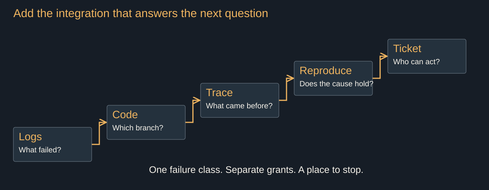
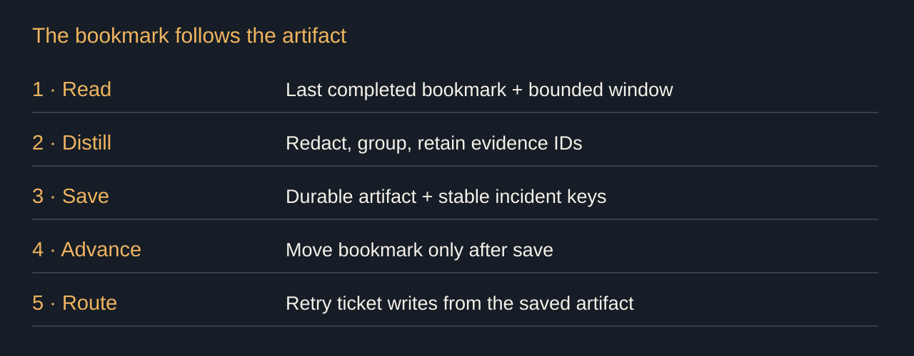

# Automating Improvement From Failure

40 minutes. Timings include the exercises and delivery pauses, without Q&A. Sources checked 6 September 2026. Story prompts belong in speaker notes and require Dan’s own records before delivery.

## 1. Nobody reads the scroll

00:00 to 02:30 · warm

> The pager trained you to ignore it
> The next improvement is already in the scroll

The logs are still arriving. Stack traces, retries, the same customer clicking the same broken button. Somewhere in that scroll is work we will eventually call urgent. Usually after somebody sends an angry email.

This talk owns the offline improvement loop, including the people reviewing its output. The examples are teaching fixtures until I attach a production record. Runtime recovery, and how much authority a running agent earns for itself, belongs to Adaptive, agentic apps.

There is a name for training people to ignore the channel that is supposed to warn them. Alert fatigue. Cvach measured it on hospital monitors. Your pager is the same instrument. If our new agent creates a ticket for every log line, we have automated the thing that made the logs unreadable.

Story: The failure that sat in your logs until a customer reported it. Bring the first log timestamp, the report, and what you missed.

Stage direction: Scroll a sanitized export. Take a show of hands: who learned about a logged failure from a customer? Allow 30 seconds.

Source: Maria Cvach (2012), [Monitor alarm fatigue: an integrative review](https://pubmed.ncbi.nlm.nih.gov/22839984/), Biomedical Instrumentation & Technology 46(4), 268–277.

## 2. Step one: hand an agent the logs

02:30 to 04:30 · warm

> Already better than the nobody who was doing it before
> Read access. One question. One saved answer.

Give a coding agent a sanitized export. Ask what broke since yesterday. That is the first version. A file and a question.

It may group unrelated failures together. It may miss the one line you care about. Inspect the answer against the input before you wire it to anything. But for the queue nobody was reading, we finally have a candidate reader. Already better than the nobody who was doing it before.

Save the answer with the input window. Tomorrow, you want to know whether it found something new or just described yesterday more confidently.

## 3. Enrichment earns the next step

04:30 to 07:30 · build

> Logs → code → trace → reproduction → ticket
> One failure class at a time

A stack trace tells you where an exception surfaced. The code tells you which branch produced it. The trace shows what happened before it. A reproduction tells you whether your explanation survives a second attempt.

Add the integration that answers the next question. Read access to code does not require write access to production. Looking at queue depth does not require permission to resize the cluster. Access is a set of individual grants, not a graduation ceremony.

The assistant with access to everything is coming anyway, and I am not arguing against it. This loop is one job with a countable tool list. An agent reading everything writes you a summary of the noise. Pick one failure class. If the class turns out to contain three different mechanisms, split it. That discovery is useful work.

Stage direction: Walk up the ladder using one timeout. Stop at the first rung that supports an action. Use the contracts handout for the integration table.

## 4. The out-of-band check

07:30 to 10:30 · build

> Schedule → bookmark → distill → artifact
> Advance the bookmark after durable output

Run outside the request path. A scheduled job reads the last completed bookmark, fetches a bounded window, strips secrets, and produces an artifact. Each family gets a count, first seen, last seen, and links to the evidence.

Only advance the bookmark after the artifact is saved. If ticket creation fails, retry from that artifact using a stable incident key. Otherwise the failure-improvement system gets its own failure-improvement system, and we are all going home late.

Keep the collection window and the classifier version beside the result. Late-arriving logs need an overlap window and deduplication. A cron expression does not solve delivery semantics.

Stage direction: Open contracts.md and trace one interrupted run. Show which artifact survives and why repeating it does not open another ticket.

## 5. Distill, then classify

10:30 to 13:00 · build

> Count occurrences before guessing causes
> Severity · evidence · owner · unknown

Distillation removes repetition. Classification decides where the remaining work goes. Keep those outputs separate so a reviewer can inspect a group without accepting its diagnosis.

Two matching strings are a family candidate. They are not a root cause. Keep the trace IDs and the counterexample that did not fit. A low-severity label needs a reason because a wrong low can leave a customer stranded without anyone looking.

Give the classifier an unknown result and a queue that receives it. If every answer must be one of the happy categories, the prompt has already decided what the agent is allowed to notice.

## 6. The retry that hid the auth failure

13:00 to 16:00 · build

> A retry hides an auth failure
> A sleep hides a race
> Successful workaround ≠ repaired system

A request fails. The agent retries. It works. Score the loop on eventual success and the lesson is obvious: retry more.

Now make the failure an authorization error. A second credential works, but the first request was forbidden for a reason. The green result hid the boundary violation. A sleep that hides a race teaches the same lesson more slowly.

Diane Vaughan called the organizational pattern normalization of deviance. Her Challenger analysis shows how repeated acceptance of anomalies made them ordinary. A repair loop needs evidence that the defect is gone. Successful workarounds are very persuasive evidence of the wrong thing.

Story: A workaround you left running after it stopped the symptom. Name the underlying defect and the test that eventually exposed it.

Stage direction: Take two short answers about fixes that hid a problem. Budget 45 seconds; do not invite incident-length stories.

Source: Diane Vaughan, [The Challenger Launch Decision](https://press.uchicago.edu/ucp/books/book/chicago/C/bo22781921.html), University of Chicago Press, original 1996; linked enlarged edition 2016.

## 7. Tickets are cheap. Review is not.

16:00 to 18:30 · build

> Tickets are cheap. Review is not.
> A proposed diagnosis travels with its evidence

A useful ticket says what happened, how often, who was affected, and what remains unexplained. It links the evidence. It does not announce a root cause just because the model found a similar issue from last month.

Opening a PR spends somebody else's attention. Require a reproduction, a bounded change, and a named reviewer before the agent adds to that queue. Deduplicate by the incident key. Cap new proposals per run. When the queue is full, hold the artifact and report the backlog.

Match ceremony to consequence. A documentation correction and a payment retry do not get the same permissions because they happen to arrive through the same agent.

## 8. Nothing leaves without evidence

18:30 to 24:00 · peak

> Regression · holdout · scope · human
> The useful result is permission denied

In the supporting example, the candidate removes the visible failure. That is the beginning of the review, not the result.

Run the regression. Now run the held-out authorization case. It fails. The proposed retry used authority that belonged to somebody else. The gate holds the change without asking the agent whether it feels finished.

Toyota calls stopping at an abnormality jidoka. That is the useful part to borrow. Detect the defect and stop producing it. The andon summons help; it is not a story about one cord stopping an entire company.

Now give the classifier the case it cannot explain. Unknown is an output. It lands in review with the evidence intact. No automatic promotion, no invented diagnosis. Similarity did not establish cause.

Stage direction: Walk through the saved test output from the supporting repository. Show the passing regression, the failed authorization holdout, and the unknown classification. Link the repository for the implementation; do not switch to a live application.

Source: Toyota, [Toyota Production System](https://global.toyota/en/company/vision-and-philosophy/production-system/), jidoka and the andon response.

## 9. Who reviews the robot's PRs?

24:00 to 27:00 · build

> The easy cases disappear
> The reviewer keeps the exceptions

The robot opens good PRs for a month. What happens to the person reviewing them?

Bainbridge's Ironies of Automation asks what remains for the human after automation takes the routine work. Monitoring and difficult interventions remain, while opportunities to practise shrink. That paper is from 1983. The problem did not wait for a chat interface.

My design response is to rotate review duty, reserve time for it, and practise recovery on known failures outside production. Sample accepted work for missed defects. Keep evaluation cases separate from the repair agent's tuning loop. A sampling policy is for the audit; it does not wave through a payment or a data deletion.

If the queue is too big to inspect, reduce what enters it. Giving one engineer a hundred green suggestions is not giving them a hundred reasons to trust the next one.

Source: Lisanne Bainbridge (1983), [Ironies of automation](https://www.sciencedirect.com/science/article/pii/0005109883900468), Automatica 19(6), 775–779.

## 10. Compile what repeats

27:00 to 30:00 · build

> Nondeterminism finds the path. Determinism runs it.
> Save the script, its tests, and its invalidation rule

Let the agent explore a changed flow in a browser. Once it finds the login path, save that path as a script. Stop buying the same discovery on every run.

The scheduled check is the same move. Memory and search over prior work help identify repetition. A skill describes when to turn a repeated task into a file. The output gets reviewed, tested, versioned, and scheduled. When the page or the log schema changes, invalidate it.

This is where Adaptive, agentic apps hands work back. A runtime agent earns its own authority there; the compiled procedure it keeps reusing gets evaluated here, offline, like any other change.

Selecting tests from a diff is another candidate. Compare it against the full suite on retained changes before trusting the selection. Count missed regressions as well as runtime. Keep the full suite on a schedule. Cheap selection that skips the failing test has excellent unit economics right up to the incident.

Story: The repeated agent task you turned into a script. Bring the file and a case where it needed invalidating.

## 11. Feedback is the same loop

30:00 to 32:30 · build

> Thumbs down + a sentence of rage = a useful input
> Feedback → evidence → candidate → opt-in flag

A thumbs-down tells you where to look. The sentence after it tells you why. Preserve the customer's wording and the session link before you ask the agent to summarize it.

The pipeline now proposes a change instead of a failure diagnosis. Put it behind a flag for the consenting user, check whether it solves their problem, then decide whether a wider cohort belongs in the experiment. Similar usage is a hypothesis about who benefits, not permission to enroll them.

Keep feature requests and incident fixes visibly distinct in the queue. They share machinery. They do not share an acceptance criterion.

Story: A complaint that became a change, including what the first proposed fix misunderstood.

## 12. Correlate, escalate, and the money gate

32:30 to 35:00 · build

> Session ID → linked trace → incident candidate
> Detect. Recommend. Draft. A person presses the button.

A customer reports lost data. Their session links to an error. Escalate with the trace attached. Do not wait for the model to invent a full causal story before a person investigates.

Three address complaints and a shipping error suggest a shared incident. Check tenant, time window, and operation before merging the tickets. A matching word is not a matching outage.

Draft the notice before the fourth customer asks. A person approves the recipients and the message. The same rule covers credits and data deletion. Detect, recommend, draft. A person presses the button.

## 13. The metrics that will lie to you

35:00 to 37:00 · build

> 100 tickets. 90 wrong. Ten worth reading.
> Measure recurrence and wrong tickets, with denominators

Suppose the agent files a hundred tickets and a reviewer closes ninety as wrong. Time-to-ticket looks terrific. Ten percent were worth reading. That is our arithmetic fixture, and it is the number I want next to the throughput chart.

Goodhart is the warning here: once we reward a proxy, we change the behavior producing it. Faster tickets are very easy to manufacture. Faster learning is harder.

Track recurring failures after a fix, with exposure counts. Track wrong tickets among reviewed tickets, and audit the cases the agent ignored. A low false-positive rate bought by filing nothing is another beautiful dashboard. Record backlog age too. Otherwise the reviewer silently pays for the metric win.

Source: Marilyn Strathern (1997), [Improving ratings: audit in the British University system](https://gwern.net/doc/statistics/decision/1997-strathern.pdf), European Review 5(3), 305–321. The familiar target-and-measure wording is Strathern’s formulation of Goodhart’s law.

## 14. Start Monday

37:00 to 38:30 · land

> One failure class
> One integration
> One place the loop must stop

Write down one failure class you could hand this loop on Monday. Name the input and the person who would inspect its first output.

Now name the one integration it needs next. Leave the rest blank. Last, write the condition under which it must stop and ask. That is enough for a first version.

Stage direction: Give the room a full 60 seconds. Do not fill it with a recap.

## 15. Fail to win

38:30 to 40:00 · land

> Alert fatigue · normalization of deviance
> Jidoka · automation irony · Goodhart

The scroll is still arriving. Now the loop leaves a smaller pile of inspectable work, and it knows where to stop.

Alert fatigue explains the unread channel. Normalization of deviance explains the successful workaround. Jidoka gives the stop a job. Automation irony asks what we did to the reviewer. Goodhart asks whether the dashboard rewarded the wrong thing.

The model did not get smarter. The system around it got a job.

Stage direction: Replay the opening scroll beside the distilled artifact. End there. Stop talking.
