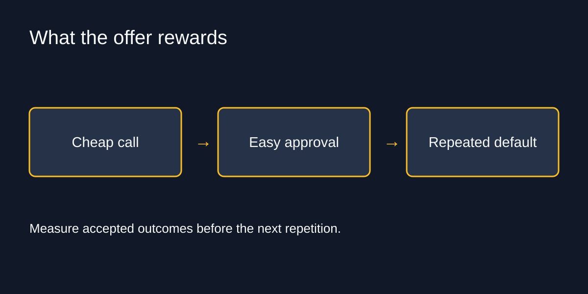
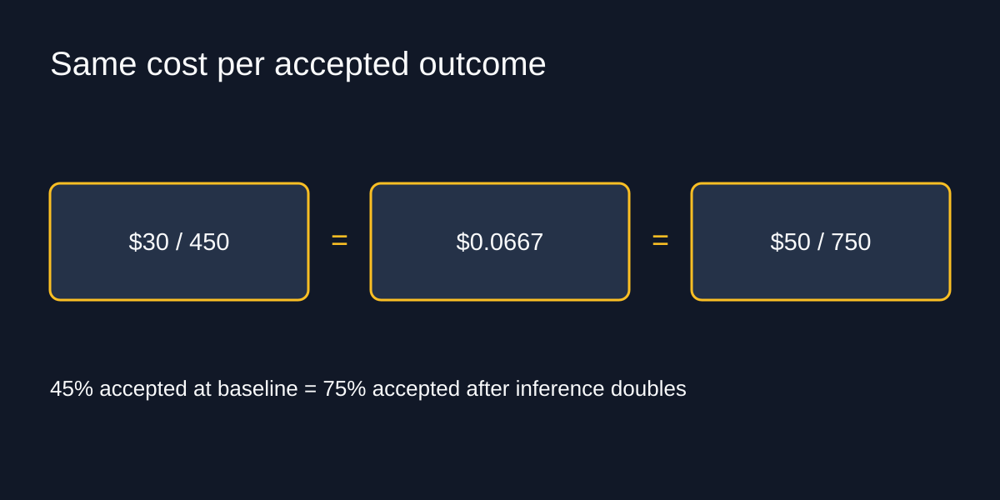

# Buy Me a Free Tier

What the cheap input taught your architecture to expect.

Revised 2026-09-08. 40 minutes, 15 slides, six audience moments, no Q&A. All slide IDs retained for existing short links. [Presenter script](script-40min.md) · [Packet](packet.md) · [Evidence](evidence-bank.md) · [Timing](timing.md) · [Visuals](visuals.md).

Eight terms, not a numbered countdown: externality, induced demand, Jevons paradox, path dependence, moral hazard, credible commitment, asset specificity, real option. Hold-up is the consequence attached to asset specificity. Training and habit are incentive analogies, not a measured claim about subscriber behavior.

## 1. Unlimited for $9.95

00:00 to 03:00 · warm

> August 2017: $9.95 monthly offer; $8.97 average US ticket.
> Don't fear training the model, worry how it's training you.

August 2017. MoviePass offers one movie a day for nine ninety-five a month. The average American ticket costs eight dollars and ninety-seven cents. MoviePass buys the tickets at retail. Pay for one movie, see thirty.

By June 2018, three million subscribers. About ten months after the cheap offer launched. Service suspended in September 2019; the brand later returned with a different offer.

Think about the incentive: another film costs the subscriber nothing. That price rewards another visit. Swap the ticket for a token and ask what your design reviews have been rewarding.

Don't fear training the model, worry how it's training you. Training is the analogy here: repeated cheap decisions become defaults. Nobody outside a provider knows its margins; our workload dollars are synthetic. MoviePass is a completed case, not a prediction about an AI vendor.

Stage direction: Pause after the ticket arithmetic. The optional Story replaces prose within this budget; it is not extra time.

Story: The first time a bill, quota or rate change broke an assumption in something you built. Optional; replace at most 30 seconds of prose with a verified example.

Source: [NATO annual ticket-price release](https://cinemaunited.org/wp-content/uploads/2018/01/2017-Q4-and-Annual-Average-Ticket-Price.pdf), 2017 average $8.97; [Helios and Matheson June 2018 Form 10-Q](https://www.sec.gov/Archives/edgar/data/1040792/000121390018011086/f10q0618_heliosandmatheson.htm), approximately 3M subscribers at June 30. See [verification record](../../reviews/corrections-2026-09-08-free-tier.md) for shutdown and relaunch sources.

## 2. Four boxes, one invoice

03:00 to 05:00 · warm

> Price paid · Resources consumed · Cost allocated · Value delivered
> The gap between the last two is why nobody is measuring

The invoice tells you what you paid. It does not tell you what the machine consumed, how the provider allocated its costs, or what the customer got. Those are four different boxes.

The useful gap for your own design review is between what you spent and what the customer accepted. A cheap attempt can still be an expensive failure. A costly attempt can be excellent value.

When the invoice looks trivial, measuring that gap feels like more work than it saves. That is the first reward: skipping the measurement gets the feature shipped faster. Which box does your dashboard actually measure?

Stage direction: Show of hands, 15 seconds: which box can your dashboard answer?

## 3. Why would anyone sell below cost?

05:00 to 08:00 · warm

> Penetration pricing · Loss leader in a bundle · Predation · It is genuinely cheap
> The price cannot tell you which. What happens next can.

Four explanations for a low price. Penetration pricing buys adoption now. A loss leader supports another paid product. Predation seeks to remove rivals; the US Brooke Group decision requires below-cost pricing and a dangerous probability of recoupment. Or production really is getting cheaper.

The price alone cannot choose among them. Renewal terms and usage restrictions give you more evidence, though they do not prove a motive.

The FTC's 2021 MoviePass complaint alleged password invalidation for the seventy-five thousand heaviest users, misleading fraud explanations, ticket verification and undisclosed caps. Those allegations settled without admission of liability. Watch what access your payment buys, not just the number on the invoice.

Customers who used the advertised allowance were responding to the offer. If your economics depend on customers forgetting to use what you sold them, the customers are not your bug.

Source: Brooke Group Ltd. v. Brown & Williamson Tobacco Corp., 509 U.S. 209 (1993), on the recoupment requirement in predatory-pricing claims.

Source: [FTC, 7 June 2021](https://www.ftc.gov/news-events/news/press-releases/2021/06/operators-moviepass-subscription-service-agree-settle-ftc-allegations-they-limited-usage-failed), settlement with MoviePass Inc., Helios and Matheson Analytics, Lowe and Farnsworth, on password invalidation, ticket verification and undisclosed caps. Allegations settled without monetary relief; both companies were already bankrupt.

Source: Rochet and Tirole (2003), Platform Competition in Two-Sided Markets, Journal of the European Economic Association, on cross-subsidy between sides of a market.

## 4. Burn the boats

08:00 to 10:30 · build

> A purchase commitment is not a margin disclosure.
> $250B incremental Azure services · Microsoft, 28 Oct 2025
> Credible commitment

Microsoft's October 2025 announcement says OpenAI contracted for an incremental two hundred and fifty billion dollars of Azure services. That is a purchase commitment, not a disclosure of cost per token or margin.

Schelling's credible commitment names the strategic idea: making retreat costly can change what other players expect. The announcement is evidence of a commitment. Its size does not prove an irreversible contract or a war of attrition.

Somebody is buying your free tier, and it is not you. You are not a combatant. You are the terrain. The useful question for your architecture is what that offer makes easy to repeat, and what you will have to undo when its terms change.

Source: [Microsoft, 28 Oct 2025](https://blogs.microsoft.com/blog/2025/10/28/the-next-chapter-of-the-microsoft-openai-partnership/) · [Amazon, Apr 2026](https://www.aboutamazon.com/news/company-news/amazon-invests-additional-5-billion-anthropic-ai) · [AWS Activate, accessed 8 Sep 2026](https://aws.amazon.com/startups/credits/).

Source: Schelling (1960), The Strategy of Conflict, Harvard University Press. Nobel 2005.

## 5. Free parking was never free

10:30 to 12:45 · build

> The driver sees no meter, so demand looks infinite
> The cost moves into rents, prices, and land
> externality

Shoup's free parking gives us externality: a cost borne outside the decision that creates it. Parking requirements put costs into land, rents and retail prices even when the driver saw no meter.

The analogy has limits. A provider's discounted invoice does not itself establish an externality. You need to identify a cost and who bears it.

In your system, start with recovery work. A model call can look almost free while a support team repairs the output. The engineering dashboard sees the call. Someone else's afternoon disappears. Find that afternoon before congratulating the architecture.

Source: Shoup (2005, updated 2011), The High Cost of Free Parking, American Planning Association. Also Shoup (2011), [Free parking or free markets](https://www.accessmagazine.org/spring-2011/free-parking-free-markets/), ACCESS Magazine.

## 6. Jevons, coal, and the extra lane

12:45 to 16:00 · build

> 1865: less coal per unit of work; more coal used in total
> Add a lane, get traffic. Elasticity near one.
> Spend = price × jobs × calls per job × tokens per call

Jevons wrote about coal in 1865. More efficient engines used less coal per unit of work, while Britain consumed more coal overall. Efficiency can expand the uses of an input enough to increase total demand. Backfire is a possibility, not a law.

Induced demand is the related transport idea. Duranton and Turner found road travel growing roughly with highway capacity across US cities in their 2011 study. That is a finding about roads, not a measured elasticity for tokens.

For software, use the equation: spend equals price times jobs times calls per job times tokens per call. A lower first term can coexist with a bigger product. It need not.

Epoch's March 2025 series, ending in February 2025, documents falling prices at fixed benchmark milestones. It does not establish today's production costs. Measure your own four terms and the value they bought.

Source: Jevons (1865), The Coal Question, chapter VII. Duranton and Turner (2011), The Fundamental Law of Road Congestion, American Economic Review 101(6).

Source: Cottier, Snodin, Owen, Adamczewski (Epoch AI, March 2025), [LLM inference prices have fallen rapidly but unequally across tasks](https://epoch.ai/data-insights/llm-inference-price-trends). Check for a newer edition before each delivery.

## 7. Now do it to software

16:00 to 18:30 · build

> Cheap call → easy approval → repeated default
> What did the extra call buy?

A frontier call where a lookup would do. More context because it fits. Another retry because it is cheap. A customer contract promising unlimited usage because last month's bill was tiny.

Each decision gets an immediate reward: less implementation work, a smoother demo, an easier sale. Measuring the extra call's value comes later, if at all. The promotional price becomes a curriculum; every design review is another rep.

Those calls may be worth it. Parallel attempts and long context sometimes buy exactly the result you need. The question is whether the extra spend bought more accepted outcomes. If you never measured, you have learned a habit without learning its price.

Stage direction: Show of hands, 15 seconds: who has shipped a frontier call where a lookup would do? Do not imply a personal admission without a verified example.

Story: A design review where inference is basically free ended the discussion. Optional; replace at most 30 seconds of prose with a verified example.

## 8. The lots are already built

18:30 to 20:45 · build

> Repealing the parking minimum does not remove the asphalt
> path dependence
> The test: try to remove one model call and count the hours

Path dependence means the route you took changes the routes still available. The offer ends; your defaults and contracts do not rewrite themselves.

QWERTY is the famous example, and the evidence behind that story is disputed. We do not need to borrow its certainty. Your own removal work is observable.

Suppose a model writes a field that three downstream services now expect. Replacing the model is not just changing an API key. The output contract has become part of the system. On the asset inventory shortly, count the work needed to replace that dependency. The useful number is hours, not a declaration that you are locked in.

Source: David (1985), Clio and the Economics of QWERTY, American Economic Review 75(2). Contested by Liebowitz and Margolis (1990), The Fable of the Keys, Journal of Law and Economics 33(1). Arthur (1989), Competing Technologies, Increasing Returns, and Lock-In by Historical Events, The Economic Journal 99(394).

## 9. Whoever chooses is not whoever pays

20:45 to 23:15 · build

> moral hazard
> The architecture is chosen in a design review. The bill arrives 60 days later, somewhere else.
> Shoup's fix was never a ban. It was a meter.

Moral hazard describes how decisions change when the person choosing does not bear their costs. It is about incentives, not bad people.

An engineer gets credit for shipping on Tuesday. Finance sees the bill later. Support repairs the failures. The reward is immediate and visible; the costs arrive elsewhere.

A MoviePass subscriber using one movie a day was reading the offer. An engineer using the available context window is responding to the same kind of invitation. Neither needs a lecture about virtue.

Put cost per accepted outcome next to the latency budget in the design review. Now the person choosing can see what the choice buys. The meter changes the next rep.

Stage direction: Show of hands, 15 seconds: who sees per-feature cost without filing a ticket?

Source: Holmstrom (1979), Moral Hazard and Observability, Bell Journal of Economics 10(1), 74 to 91. Nobel 2016.

## 10. Doubling on a Tuesday

23:15 to 26:15 · peak

> Cost per accepted outcome = total spend ÷ accepted jobs
> Fixture: 2¢ inference + 1¢ other cost per attempt
> 3¢ ÷ 45% = 5¢ ÷ 75% = 6.67¢

Define an accepted outcome before doing the division. A result a human quietly repairs has recovery cost. Count that work alongside inference, tools and infrastructure.

Our fixture: a thousand attempts, two cents inference and one cent other cost each, seventy-five percent accepted. Thirty dollars divided by seven hundred and fifty outcomes: four cents each.

At forty-five percent acceptance, the same thirty dollars buys four hundred and fifty outcomes: six point six seven cents each. Double inference instead, holding acceptance at seventy-five percent: fifty dollars divided by seven hundred and fifty. The same answer.

That equivalence belongs to this two-cent-plus-one-cent fixture. One of those changes is on the front page. The other one is a Tuesday.

Stage direction: Thirty seconds: write one sentence defining an accepted outcome. Spend another 15 seconds writing the two divisions.

## 11. Turn the dial

26:15 to 28:15 · build

> Sensitivity, not prediction.
> Multiply by your volume before you feel anything about it.

| Inference price | Monthly cost | Cost / accepted outcome |
| --- | --- | --- |
| 1× | $30 | $0.040 |
| 2× | $50 | $0.067 |
| 5× | $110 | $0.147 |
| 10× | $210 | $0.280 |

Read the first and last rows: thirty dollars becomes two hundred and ten; four cents per accepted outcome becomes twenty-eight. Only inference price changes; acceptance stays fixed.

Multiply by your volume before you feel anything about it. Spending three weeks optimizing a thirty-dollar bill because a conference talk made you anxious is also a cost problem.

Stage direction: Walk the printed table for 15 seconds, then ask for 45 seconds: which assumption would you test before funding optimization?

## 12. Till Renewal Do Us Part

28:15 to 31:00 · peak

> Asset specificity. Hold-up is what it lets your counterparty do.
> An investment worth a lot inside this relationship and little outside it
> Your prompts, evals, fine-tunes, and that unlimited-usage clause

Williamson called investments worth more inside one relationship than outside it asset specificity. Hold-up is the bargaining exposure that can follow: after you invest, switching gets harder and your counterparty has more room at renewal.

Inventory your prompts tuned to one model, provider-specific evals, fine-tunes and latency assumptions. Then the sharpest one: an unlimited-usage promise to customers, priced against an input you cannot control. That sentence is the entire MoviePass balance sheet.

Your architecture is the collateral. Pick one model call and count the hours to remove it. Include output compatibility, evaluation, latency and recovery. That turns the argument into work you can price, rather than a diagram that says portable.

Source: Williamson (1985), The Economic Institutions of Capitalism; Nobel 2009. Hold-up: Klein, Crawford and Alchian (1978), Vertical Integration, Appropriable Rents, and the Competitive Contracting Process, Journal of Law and Economics 21(2).

## 13. Reversible is a line item

31:00 to 34:00 · land

> real option
> The option has value. It also has a premium: abstraction tax, eval upkeep, rehearsal time.
> Same project, different answer, depending on which world you are in

A real option is a right you can exercise later. Keeping a second provider usable buys flexibility, and the premium includes eval upkeep, abstraction work and rehearsal. Compare that premium with the exposure you measured.

Take a router that halves inference while preserving acceptance. In this fixture it saves one cent per attempt today, ten cents at ten times the inference price.

At a million attempts a month, that ten cents is a hundred thousand dollars. At a thousand attempts, it is a hundred dollars; only ten at today's price. Same project, different funding decision.

If building and operating the router costs more than it saves, keep the money. Cheap production can make the optimization unnecessary. That is a result too.

Source: Dixit and Pindyck (1994), Investment Under Uncertainty, Princeton University Press.

## 14. Three prices for the next design review

34:00 to 37:00 · land

> What we pay today · What we pay without the offer · What we can survive paying
> Record gross usage separately from credits
> Keep an acceptance suite · Rehearse one replacement · Price the portability

Bring three prices to the next design review: what you pay today, what you pay without promotional treatment, and the highest price the product can survive.

Record gross usage separately from credits. Keep an acceptance suite so a cheaper configuration has to earn its savings. Rehearse one replacement, including latency and recovery. Price that work against the exposure.

The third price needs a business answer: what is an accepted outcome worth, and how much of that value can inference consume? If nobody knows, start there. You cannot solve a missing product decision with a cheaper model.

Stage direction: 45 seconds in pairs: identify the third price. No report-back inside this budget.

## 15. Cheap intelligence changes incentives first

37:00 to 40:00 · land

> Externality · Induced demand · Jevons paradox · Path dependence
> Moral hazard · Credible commitment · Asset specificity · Real option
> The habit can outlive the offer.

Back to MoviePass. The original service suspended; the brand returned with a different offer. Theater operators also sell memberships. Owning the screens changes the economics of selling access to them. Promising unlimited access to someone else's retail input is another business.

The eight terms are on screen for your next budget meeting. Use them to name a decision, not to win a vocabulary contest. The number to remember is the acceptance denominator: a worse result can erase a cheaper input.

Use the cheap inference. Measure what it rewards you for repeating. Keep the expensive decisions reversible while you find out.

The habit can outlive the offer.

Stage direction: Stop talking. If questions follow, leave the acceptance arithmetic on slide 10 visible.

