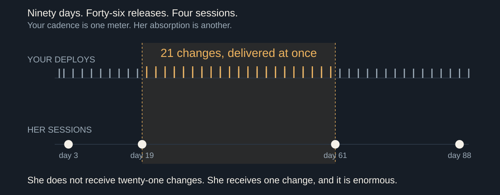
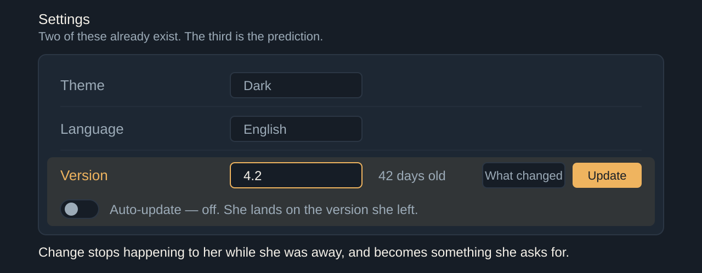

# Turn Your Thinkin' Tokens Up to 11

40 minutes. Timings include the exercise, the arithmetic and delivery pauses, without Q&A. Sources checked 7 September 2026. Story prompts belong in speaker notes and require Dan's own records before delivery.

Budget: 37.25 spoken minutes including bounded Story substitutions and bridges + 2.75 interaction minutes = 40. [Per-slide spoken-time checks](pacing.md) include exercise narration. Supporting code: [10 council reliability](https://github.com/justsml/scaling-ai-agents/blob/main/examples/src/10-council-of-guards.ts) and [12 select or synthesize](https://github.com/justsml/scaling-ai-agents/blob/main/ai-sdk/src/snippets/12-business-advice.ts).

## 1. These go to eleven

00:00 to 02:30 · warm

> Generating got cheap.
> Attention is the budget.

Four features shipped before lunch. All four work. All four have tests. Your best customer opens the app for the first time in six weeks and cannot find the button she used every Friday. Nobody filed a bug.

Here is the line this talk has to earn. Don't count what the feature cost you to build, count what it costs them to relearn.

Turn the reasoning budget up to eleven. More tokens can buy a more carefully reasoned proposal. They do not buy taste, and they do not tell you which Tuesday.

Scope, once. The arithmetic later is counting, not a measurement of your team, and the two futures at the end are labeled predictions I have not measured.

Story: Substitute at most 40 existing words / 25 seconds from this slide, preserving the argument; never append an anecdote: The feature you were proudest of that a long-absent customer experienced as a broken workflow. Bring the ticket, the gap between their sessions, and what they actually said.

## 2. What got cheap, and what didn't

02:30 to 05:00 · warm

> Someone has to want it · build it · learn it
> We only automated the middle one

Three things used to gate a feature. Someone had to want it, someone had to build it, and someone had to learn it. AI makes the middle one cheaper. Wanting and learning still take human time. These are old product questions; cheaper generation makes them arrive with working code already attached.

When building gets much cheaper, it stops filtering as many proposals. Scarcity was doing your prioritization for free. When the constraint dies, the decision it was quietly making lands on your desk, unlabeled.

So the interesting question stopped being what can we build. It is which of these should exist, who should see it, and when. Those are three separate decisions and most roadmaps answer only the first.

## 3. Nobody lives in your app

05:00 to 08:00 · build

> 90 days · 46 releases · 4 sessions
> Between visits two and three: 21 changes, at once

Here is ninety days. The top track is your deploys: forty-six of them, roughly every other day, which says something about frequency, not whether the changes are useful. The bottom track is one customer's sessions: four. Day three, day nineteen, day sixty-one, day eighty-eight.

Between her second visit and her third you shipped twenty-one changes. She does not receive twenty-one changes. She receives one change, all at once, and it is enormous. Your release cadence and her absorption rate are different meters, and only one of them is on a dashboard.

The 2018 DORA four-key model measures delivery capability: deployment frequency, lead time, change failure rate, time to restore. They are good measures of your pipeline. None of them describes what a returning user walks into. That measurement does not exist at most companies, and it is the one this talk is about.

Stage direction: Ask for a show of hands on median return interval before revealing the bottom track. Most rooms have never measured it; say so and move on.

Source: Nicole Forsgren, Jez Humble and Gene Kim (2018), [Accelerate: The Science of Lean Software and DevOps](https://itrevolution.com/product/accelerate/), IT Revolution. The four key metrics describe delivery performance, not user absorption; the tracks in this diagram are an illustration, not measured telemetry.

## 4. Feature fatigue is a measured effect

08:00 to 11:00 · build

> Before use: capability wins
> After use: usability wins
> Delighters decay into expectations

Thompson, Hamilton and Rust ran this in 2005 and named it feature fatigue. Before use, people prefer the product with more capabilities. After using it, satisfaction tracks usability instead. The same person picks the loaded one and then resents it.

That is not a quirk, it is a structural problem. Applied to software, that raises a question: does capability win the signup while usability keeps the renewal? Measure both; the consumer experiment does not establish your retention effect.

Kano's model from 1984 splits attributes into must-be, one-dimensional and attractive. The attractive ones are the delighters, and Kano's own point is that they do not stay attractive. Today's delight is next year's baseline expectation, and the year after that its absence is a defect.

Source: Debora Viana Thompson, Rebecca W. Hamilton and Roland T. Rust (2005), [Feature Fatigue: When Product Capabilities Become Too Much of a Good Thing](https://doi.org/10.1509/jmkr.2005.42.4.431), Journal of Marketing Research 42(4), 431–442. Noriaki Kano, Nobuhiko Seraku, Fumio Takahashi and Shinichi Tsuji (1984), Attractive Quality and Must-Be Quality, Journal of the Japanese Society for Quality Control 14(2), 39–48.

## 5. A change is a loss before it is a gain

11:00 to 13:30 · build

> Status quo bias · endowment effect
> Recognition, not recall
> The gain is yours. The loss is theirs, today.

Samuelson and Zeckhauser named status quo bias in 1988: across lab and field decisions, people over-select the option they already hold. Kahneman, Knetsch and Thaler measured the endowment effect the same way — you want more for the mug once it is yours. Your user owns a workflow, and you are proposing to take it.

Nielsen's heuristic says recognition rather than recall. A returning user recognizes; she does not recall. Move the button and you have converted a recognition task into a recall task, against a memory that has been decaying since her last visit.

The gain from a redesign is real, and it arrives later, spread thin. The loss is small, specific and arrives on first login. Individually every change was an improvement. In aggregate, at your cadence, it reads as instability.

Source: William Samuelson and Richard Zeckhauser (1988), [Status Quo Bias in Decision Making](https://doi.org/10.1007/BF00055564), Journal of Risk and Uncertainty 1(1), 7–59. Daniel Kahneman, Jack L. Knetsch and Richard H. Thaler (1990), [Experimental Tests of the Endowment Effect and the Coase Theorem](https://doi.org/10.1086/261737), Journal of Political Economy 98(6), 1325–1348. Jakob Nielsen (1994), [Ten Usability Heuristics for User Interface Design](https://www.nngroup.com/articles/ten-usability-heuristics/).

## 6. "Ship it Tuesday"

13:30 to 16:30 · build

> "Ship it Tuesday."
> That is the whole request.

Ship it Tuesday. Somebody senior said it; everyone nodded.

Sixty seconds with the person next to you. Write what else must be true for Tuesday to be right. You get no second page of context.

Which customers? Alone or with the other three changes? Who covers support, docs and Thursday's renewal? Can we reverse it?

These are engineering, support and product questions. Cheaper building leaves the sequencing expensive.

Stage direction: Read the request once, exactly as written. Give pairs sixty seconds. The 15-minute route drops this slide. Collect two short answers within fifteen seconds, then name the renewal date and support roster.

## 7. Five axes, one of them a date

16:30 to 19:30 · build

> What · who · when · shape · reversibility
> Every axis commits somebody who is not in this room

| Axis | Question | Commits |
| --- | --- | --- |
| What | Should it exist at all? | Docs, support surface |
| Who | Everyone, or a cohort? | Sales, contracts |
| When | Tuesday, or next quarter? | Marketing, renewals |
| Shape | One batch or rolling? | Rollback, triage |
| Reversible | Flag, migration, one-way? | On-call, data model |

Five axes, not one. Most roadmap tools model exactly one of them, the date, which is why the date is the only one that ever gets argued about.

Read the right-hand column. Every one of these commits a person who is not in this room: support staffing, a documentation rewrite, an account executive who already promised it, a renewal conversation on Thursday. Marketing wants a date it can build a campaign against, and a campaign is a promise you cannot flag off.

You also have to keep all of it flexible, because a competitor ships something on a Wednesday and now you want to pull a feature forward. Pulling it forward is not free. It costs you the sequence, and the sequence was the part you had actually reasoned about.

Story: Substitute at most 40 existing words / 25 seconds from this slide, preserving the argument; never append an anecdote: The release you pulled forward to answer a competitor. Bring what slipped, what support absorbed, and whether it worked.

## 8. Turn the tokens up

19:30 to 23:30 · peak

> Half a million candidate plans. At most sixteen arms.
> 6! × 3⁶ = 524,880
> 48,000 distinct eligible users; two-arm sizing heuristic

Six distinct features, every ordering allowed, each assigned to one of three cohorts. Six factorial times three to the sixth: 524,880 plans, before batching or dates.

Now buy evidence. Assume forty-eight thousand distinct, eligible users over four weeks, one independent outcome each. At an eight percent baseline, a two-point absolute lift needs about three thousand users per arm by a two-arm heuristic. At most sixteen arms fit, including a control, before multiplicity or attrition. That is thirty-two thousand, eight hundred and five plans per arm. Repeated weekly users do not multiply your sample size.

Why not make ten the top number? Because these go to eleven.

Chollet, 2019: intelligence as skill-acquisition efficiency relative to priors and experience. Familiar-task performance alone does not establish it. Your next release still needs evidence about these users.

There is a paper about exactly this: the Apple group's Illusion of Thinking, 2025, reporting that reasoning models collapse past a complexity threshold and spend fewer tokens as problems get harder. Alex Lawsen's unrefereed arXiv comment argues that output-token limits and unsolvable River Crossing instances explain part of the collapse.

The model can use customer evidence, but a larger reasoning budget does not create that evidence. Your judgment is biased too. We need not test every plan: constraints and prior results narrow the space. The difference is that you can write your prediction down before the release and check it afterward.

Stage direction: Use forty-five seconds for the board: 6! × 3⁶, then distinct eligible users divided by the displayed per-arm heuristic, then the quotient. Assumptions are prewritten.

Source: François Chollet (2019), [On the Measure of Intelligence](https://arxiv.org/abs/1911.01547), arXiv:1911.01547. Parshin Shojaee and colleagues (2025), [The Illusion of Thinking](https://machinelearning.apple.com/research/illusion-of-thinking), Apple Machine Learning Research; and A. Lawsen (2025), [Comment on The Illusion of Thinking](https://arxiv.org/abs/2506.09250), arXiv:2506.09250 (unrefereed comment). Present as a contested exchange, not a settled result.

## 9. What the machine is actually for

23:30 to 26:00 · build

> Cluster 4,000 support threads → yes
> Choose the order → no
> It proposes. You sequence.

Cluster four thousand support threads by complaint. Find the twelve accounts whose usage pattern matches the cohort you are about to change. Draft the rollout plan, the docs diff and the support macro at once.

Better, have it hunt the conflict you would have missed. Your release week is the week two of your three support engineers are at a conference. The workflow you are about to move belongs to your top three renewals this quarter. That is a search problem, and search is what it is good at.

Its recommendations still need customer evidence and an accountable owner. It proposes. You sequence. Then you own the sequence.

## 10. Prediction: the version picker

26:00 to 29:30 · build

> Theme · Language · Version
> "You're on 4.2. It's 42 days old. Update, or turn on auto-update."

You still own the supported choices, defaults, patch deadlines and rollout policy. A user choosing among those options supplies feedback; it does not take away your responsibility.

First prediction. Version becomes a first-class user-facing control, sitting in settings beside theme and language, because those two are already there for exactly this reason. They are preferences about how the software meets you.

A returning user lands on the version she left. The banner reads: you are on 4.2, it is forty-two days old, here is what changed, update now or turn on auto-update. Change stops being something that happened to her while she was away and becomes something she asks for. That is the whole move.

The web spent twenty years removing this control and calling it a feature. Everyone runs current, nobody sits on an old build, support reasons about one thing. That trade simplifies operations and security updates. Ask whether it is still the right trade at forty-six deploys a quarter.

The picker also makes the cost visible to you. If users pin, you can observe a preference you previously overrode. Pinning is a signal to investigate: compatibility, training schedules, habit and fatigue can all produce it. Compare reasons and task outcomes before calling it a fatigue measure.

## 11. What that costs to build

29:30 to 32:00 · build

> One option: versioned runtime + scoped sandbox
> Scoped isolation helps. Shared risks remain.
> Every live version is a live contract

Now the engineering bill, because the prediction is easy and the architecture is not. Serving many live versions means a versioned runtime against a shared data model, or a data model versioned per user: a semi-persistent sandbox holding their build and their state, resumed on arrival and suspended after.

That buys something real on privacy. Per-tenant isolation can limit a compromised worker's reach. Shared credentials, control planes, exports and backups can still expose many tenants. You are trading a class of problem you understand for one you do not: a fleet with compatibility promises that complicate patching.

Every live version is also a live contract. Hyrum's law: with enough users, every observable behavior of your system gets depended on, including the ones you consider bugs. Choose how many versions you support on purpose, and give the number an expiry date.

Source: Hyrum Wright, [Hyrum's Law](https://www.hyrumslaw.com/). Stated as an observation about interface consumers, not a measured result.

## 12. Prediction: the app your neighbor configured

32:00 to 35:00 · build

> "Turn on what people like me have on"
> Shareable configuration profiles
> Developers have done this for thirty years

Second prediction. Feature flags stop being your deployment tool and become the user's preference surface. Not a wall of switches: a profile. Turn on what people who use this the way I do have turned on. Follow this person's setup. Adopt my team's.

This is not new, it is unevenly distributed. Dotfiles. VS Code extension packs. Home Assistant blueprints. Excel templates. Figma community files. Mod lists. Shared configurations already travel well beyond developers. I expect more general-purpose apps to make them a first-class user preference.

Von Hippel's lead-user work found users at the leading edge of a market inventing what the rest will want, and his toolkit work in 2002 is about shipping them the means to do it. Rogers gives you the shape of who adopts first. A shared profile is a toolkit and a diffusion channel in the same object.

Source: Eric von Hippel (1986), [Lead Users: A Source of Novel Product Concepts](https://doi.org/10.1287/mnsc.32.7.791), Management Science 32(7), 791–805. Eric von Hippel and Ralph Katz (2002), [Shifting Innovation to Users via Toolkits](https://doi.org/10.1287/mnsc.48.7.821.2817), Management Science 48(7), 821–833. Everett M. Rogers (2003), Diffusion of Innovations, 5th edition, Free Press.

## 13. Everyone runs a different app now

35:00 to 38:00 · build

> Support: "which app do you have?"
> Screenshots · A/B baselines · accessibility defaults
> Same as it ever was: defaults still win

Support opens with a new first question: which app do you have. Your documentation screenshots are wrong for most readers. Your A/B test has no common baseline, because the control group configured itself. Accessibility defaults are the ones people turn off first and need most.

A user can also configure themselves into a corner and never meet the thing that would have helped. Call it a filter bubble for functionality rather than opinion.

Choice overload is the obvious objection and I will raise it myself: Iyengar and Lepper's jam study, 2000. A 2010 meta-analysis covered 63 conditions from fifty published and unpublished experiments: mean effect near zero, substantial variation between studies. So I cite it and set it aside. That average does not rule out overload in a particular interface. Count is not the only design variable.

It is that nobody is curating them. Somebody owns the default profile, somebody decides which shared setups get promoted, and somebody decides what a new user gets before they have a neighbor. Distribution still concentrates. Same as it ever was: defaults still win.

Source: Sheena S. Iyengar and Mark R. Lepper (2000), [When Choice is Demotivating](https://doi.org/10.1037/0022-3514.79.6.995), Journal of Personality and Social Psychology 79(6), 995–1006. Benjamin Scheibehenne, Rainer Greifeneder and Peter M. Todd (2010), [Can There Ever Be Too Many Options?](https://doi.org/10.1086/651235), Journal of Consumer Research 37(3), 409–425. Cited to set aside.

## 14. Knowing what not to ship

38:00 to 40:00 · land

> Don't count what it cost you to build.
> Count what it costs them to relearn.

Back to the two tracks. Forty-six releases, four sessions. You did not get slower and she did not get dumber. You filled the space between her visits with work she has to do.

Turn the reasoning up as far as it goes. It will hand you a better-argued plan for a market it has never seen. You remain responsible for checking which proposals help these users, and when they can absorb them.

A bigger dial does not choose their Tuesday.

Stage direction: Recall the two tracks from slide 3; stay on this closing slide. Stop talking.
