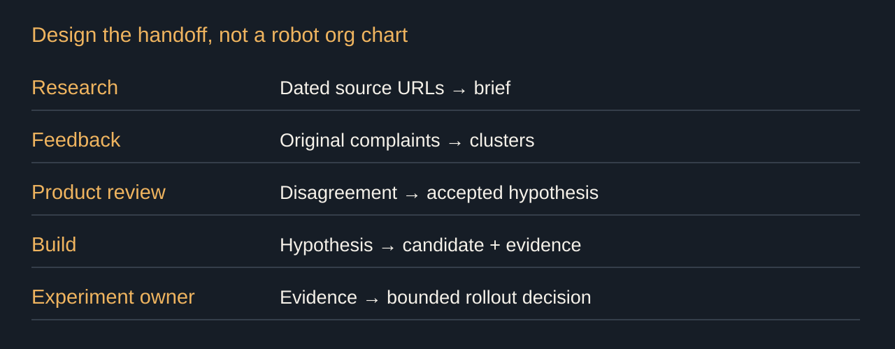
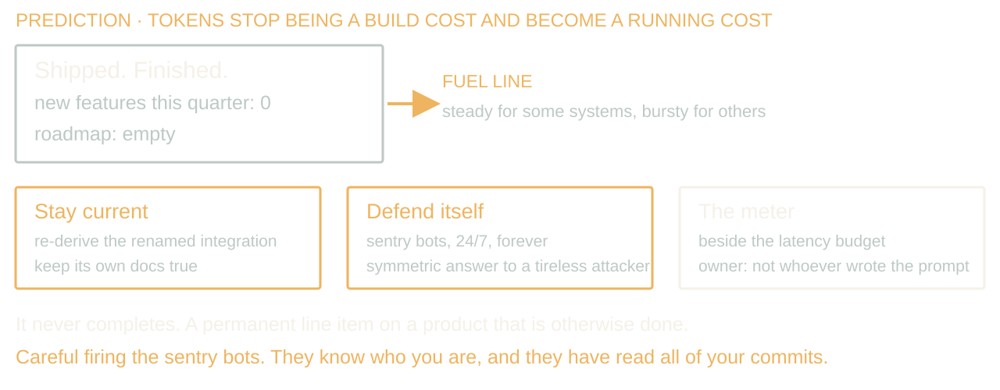
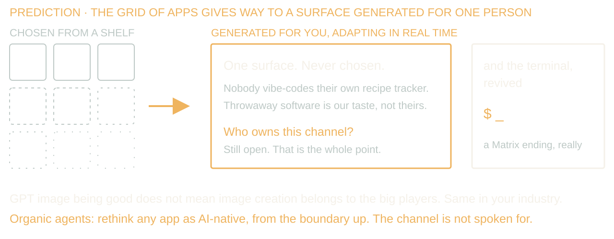

# Break the Mirror on Purpose

40 minutes, 17 source slides. Sources checked or bounded 8 September 2026. [Timing](timing.md) separates spoken delivery from audience work; [demo](demo.md) has route-specific clocks. Story prompts require Dan’s records and replace prose within the slot. Predictions 14/15 are labelled once.

## 1. The architecture you could read off the org chart

00:00 to 02:15 · warm

> You design the agents; your org chart chooses their handoffs.
> Conway, 1968: communication structures constrain designs

You design the agents; your org chart chooses their handoffs. Unless you make those handoffs a decision too.

Conway's 1968 argument connects a system's design with the communication structure of its builders. The wires matter more than the boxes. Research writes a brief. Product translates it into tickets. Engineering translates tickets into software. Support translates software back into complaints. Which translations carry judgment, and which carry the same sentence into another tool?

This is a proposed operating model, and the worked example uses synthetic numbers to explain policy. My bet is that cheaper evidence collection changes what some handoffs cost. Measure that before copying those boundaries onto agents.

Story: A system whose API boundaries reproduced the team handoffs, and the change that got stuck between them.

Source: Melvin E. Conway (1968), [How Do Committees Invent?](https://melconway.com/Home/pdf/committees.pdf), Datamation, April, 28–31.

## 2. Mirroring is measured. It is not destiny.

02:15 to 04:45 · warm

> Industry/firm descriptive subset: 50 studies
> 35 strong / 11 partial / 4 no support = 70% / 22% / 8%
> Map dependencies before splitting the work

Colfer and Baldwin reviewed a hundred and forty-two studies. In the fifty descriptive studies of industries and firms, thirty-five strongly supported mirroring, eleven partly supported it, and four did not: seventy, twenty-two and eight percent. Those are studies, not percentages of companies that deliberately broke the mirror.

The same review found ten poorly performing unmirrored cases in its normative firm sample. The common problem was premature modularization: hidden technical dependencies outlived the organizational split. Partial mirroring keeps knowledge broader than the work boundary.

So map what depends on what before reorganizing it. The research supports exceptions and a warning, not a guarantee that a new org chart improves software. MacCormack and colleagues also studied associations between development arrangements and modularity. Neither paper ran our proposed agent organization as an experiment.

Source: Colfer and Baldwin (2016), [The mirroring hypothesis: theory, evidence, and exceptions](https://doi.org/10.1093/icc/dtw027), Industrial and Corporate Change 25(5), 709–738. MacCormack, Rusnak, and Baldwin (2012), [Exploring the duality between product and organizational architectures](https://www.hbs.edu/ris/Publication%20Files/Research%20Policy%2041%20%282012%29%201309%E2%80%93%201324_c5c2350e-013c-4065-a2f9-d95eb32177d5.pdf), Research Policy 41(8), 1309–1324.

## 3. Who Ordered This Handoff?

04:45 to 07:00 · build

> Coase, 1937: coordination has a cost
> Reprice the handoff before copying it

Coase's 1937 question was why firms exist when transactions could go through markets. Compare the cost of using the market with organizing work inside the firm. Lower internal costs can support a larger firm; Coase does not prescribe deleting departments.

Here is my narrower application. An agent may make collecting, translating and transmitting evidence across a handoff cheaper. Verification, permissions and maintenance can grow at the same time. Price both changes.

A weekly brief that took two days to assemble might no longer need the same preparation process. The decision meeting may still be valuable. Start with the outcome and the handoff cost, not one agent per box on the current org chart.

Source: Ronald H. Coase (1937), [The Nature of the Firm](https://onlinelibrary.wiley.com/doi/10.1111/j.1468-0335.1937.tb00002.x), Economica 4(16), 386–405. The agent-design application is the speaker’s argument.

## 4. The spectrum, and the two ways to lose

07:00 to 09:00 · build

> Committee at one end. Five people at the other.
> The suffering arrives later than the speed does.

At one end, thousands of employees and millions of customers. Change procedures, risk analysis, a prioritization rubric. At the other, five people around a laptop who can all hear the person making the decision.

The small team can acquire research and feedback capacity it could never afford to staff. The large team can shorten a handoff. Both can also generate proposals faster than anyone understands them.

Automate the right things and keep the taste. Trade judgment for AI vibes and the suffering arrives later than the speed does. That delay is what makes the trade look good.

Stage direction: Take 30 seconds: where is your team on the spectrum, and what is its heaviest handoff? Keep the answers for the close.

## 5. Draw the wires between agents

09:00 to 11:15 · build

> Research → sourced brief → product review
> Feedback → cited clusters → product review
> Review → accepted hypothesis → build

Draw one wire: feedback sends cited clusters to product review. What arrives, what leaves, who decides, and what did it cost last week?

Price collection and translation separately from checking the claims, resolving disagreement and maintaining the integration. If the agent saves an hour of collection and adds two hours of correction, the new wire costs more. That is a synthetic comparison, not a productivity result.

Research delivers dated sources. Feedback keeps original complaints. Review produces an accepted hypothesis; build consumes that artifact instead of guessing across six chat histories.

Thoughtworks popularized the inverse Conway manoeuvre. Team Topologies distinguishes collaboration, service consumption and facilitation. Collaborate while discovering the contract; make repeated delivery a service once understood. An agent roster without these wires is a seating plan.

Source: [Thoughtworks, Inverse Conway Maneuver](https://www.thoughtworks.com/en-br/radar/techniques/inverse-conway-maneuver), 2014/2015. Skelton and Pais, [Team Topologies interaction modes](https://teamtopologies.com/key-concepts).

## 6. Two directions of attention

11:15 to 13:15 · build

> Research looks out. Feedback looks in.
> Keep the meeting where the evidence disagrees.

The research agent watches competitors and people talking about your product. The feedback agent ingests support tickets, interviews, reviews, and in-app complaints. Both preserve the evidence behind their summaries.

Now make them disagree. Research says onboarding lacks a feature. Feedback says users cannot find the feature we already have. A clustering agent might merge those into "onboarding problems" and confidently bury the distinction.

Keep the review where somebody opens the source material and argues about what belongs at the top. It is the integrating interface in this system. Taste gets exercised in public there.

Price the disagreement separately from collecting the evidence. Making both summaries cheaper does not make deciding between them free.

Story: A feedback cluster that merged different complaints and changed the wrong priority. Bring one original complaint that the summary obscured.

## 7. Effort left the rubric. Argue with me.

13:15 to 14:45 · build

> Who estimated a ticket last week?
> Build cost · review cost · support cost · maintenance

Who estimated a ticket last week? The first implementation can be cheap while rollout, review, customer support and maintenance remain expensive.

Put those costs beside the evidence for the idea. If an agent removed research work but created a pile of proposals nobody can inspect, effort did not disappear. It changed owners.

Do not replace story points with a model's confidence and call that prioritization.

Stage direction: Take fifteen seconds for hands. Count hands without inventing a denominator. The former first-person claim about effort estimation is optional only after Dan verifies it; it is not required prose.

## 8. Gap analysis, past engineering

14:45 to 16:30 · build

> Walk the build. Attach screenshots and reasons.
> A candidate should be cheap to reject.

Have a browser agent walk onboarding and attach the screenshot, task and account state to each proposal.

Now make one proposal wrong. The screenshot shows a missing feature because the account lacks permission. That is a setup defect, not a reason to redesign the product. Account state makes the suggestion cheaper to reject.

Measure the review time per useful proposal against the old walkthrough. More screenshots are not a saving if a person has to reconstruct every session. Keep the integration only when the evidence it produces earns its maintenance and review cost.

## 9. Targeted beta enrollment, and the deluge

16:30 to 18:15 · build

> Keep the customers behind the cluster
> Invite an opt-in cohort. Keep the exit.

This idea came from a cluster of customers. Preserve that provenance. Find people with the same task, then ask whether they want to try the change. Similar company size is not necessarily a similar problem.

The invitation explains what changes, that it is a beta, and how to turn it off. A person approves the message and the recipients. Narrow feedback tells us what to try next. That is all it tells us.

Prepare the intake before inviting people. If customers answer and nobody follows up, you have taught your best customers that responding is a one-time event. The feedback loop needs an owner even when the summarizer runs itself.

Story: A beta invitation that selected users on the wrong axis, or feedback that arrived faster than the team could act on it.

## 10. Ship Friday

18:15 to 19:45 · build

> Onboarding activation
> A · B · C
> Which candidate gets your attention?

Friday's product review has three onboarding candidates. Their labels are A, B and C. The next screen shows activation rates.

Choose which candidate you would investigate first. You can choose one or ask for more information. We will open the rest of the record after the vote.

For now, write down the first fact you would request alongside the activation number. Keep it to one fact. We will use that answer when the record opens.

Stage direction: Allow fifteen seconds to choose the additional fact. Do not name Campbell, urgency, support ceilings or a metric trap before the vote.

## 11. Open the Rest of the Record

19:45 to 24:15 · peak

> A · 40% activation
> B · 48% activation
> C · 45% activation

Which candidate gets your attention? A is forty percent activation, B forty-eight, C forty-five. Vote before we open the rest of the record.

B's support rate is nine percent against a five-percent ceiling. Its copy invents urgency. Raise the ceiling to ten and it still fails the urgency rule. A metric win cannot buy off a product principle.

C has forty-five percent activation, four percent support and no fabricated urgency. It is eligible for human review. It is not shipped.

Write the rule you wish you had before the vote, then compare it with the policy saved before the scorecard. That policy belongs to the owner of the decision; an optimizer does not get to rewrite it.

Stage direction: Neutral A/B/C activation only at first. Give thirty seconds to vote, thirty to read the reveal, twenty of silence after the rejection, forty-five to write a rule, and fifteen to compare it with the saved policy. demo.md specifies each route. Do not name Campbell until slide 12.

## 12. Where guards go, including the two we forgot

24:15 to 26:30 · build

> Wider rollout · expensive runs · infrastructure changes
> Customer messaging · customer data deletion

Campbell described what decision pressure can do to a quantitative indicator and the activity it measures. Now we have a reason to name it: the activation winner failed the product rules.

Put the guard where consequences change, before the action. Wider rollout spends customer exposure. Expensive runs spend money. Infrastructure changes create obligations or remove recovery paths. Name the budget, owner and evidence at each crossing.

Customer messaging and data deletion affect another person even when the API call is cheap. A person approves them; the tool layer enforces that permission. Consent to a beta is permission for a bounded experience, not every future experiment.

Source: Donald T. Campbell (1979), [Assessing the impact of planned social change](https://doi.org/10.1016/0149-7189%2879%2990048-X), Evaluation and Program Planning 2(1), 67–90.

## 13. How many agents can one person own?

26:30 to 28:45 · build

> 6 × (32 + 5) = 222 possible relationships
> Ownership costs attention. Budget it.

Six agents, six owners. Somehow you own four and are on call for all six.

Graicunas's 1933 relationship count, reprinted in 1937, gives six times the quantity thirty-two plus five. Six times thirty-seven: two hundred and twenty-two possible relationships. A maximum combinatorial count is not a validated staffing limit. Count the interfaces you actually require.

Bainbridge's 1983 warning is about the work left for people: monitoring and exceptional intervention, with less routine practice. My design response is to assign recovery drills and review time with the agent. An owner field without capacity is a forwarding address for blame.

Stage direction: Do 6 × (32 + 5) aloud. Ask who owns more automated jobs than they could inspect in one afternoon. Take 20 seconds.

Source: V. A. Graicunas (1933; reprinted 1937), [Relationship in Organization](https://nickols.us/relationship.pdf), Papers on the Science of Administration, maximum-basis table. Bainbridge (1983), [Ironies of automation](https://doi.org/10.1016/0005-1098(83)90046-8), Automatica 19(6), 775–779.

## 14. Software Runs on Petrol Now

28:45 to 31:30 · build

> Tokens stop being a build cost and become a running cost
> Sentry bots hunting your own vulnerabilities, 24/7, forever
> Be careful firing the security bots. They know who you are.

Two predictions to close, labelled once: this is where I think the operating model goes. First, software will need a steady or bursty token stream just to keep running, staying current and defending itself. Tokens become fuel instead of only a build cost.

Some of that burn is sentry bots looking for weaknesses in your own system around the clock. Be careful firing them. They know who you are. They have read all your commits. Revoking their access is part of owning the service.

Price the fuel line. At an invented two dollars a day, a continuing agent costs seven hundred and thirty dollars a year before maintenance and review. No new feature required. Record your actual rate and assign the meter to someone who can change the budget.

If maintained products keep working without continuing inference, this prediction weakens. Track ongoing operation separately from feature-building calls. Buy Me a Free Tier owns the detailed arithmetic; this design needs the owner.

Stage direction: Allow fifteen seconds to read 2×365=$730 and identify the budget owner silently. Do not solicit credential details from the audience.

Story: The first time an always-on agent showed up as a recurring cost nobody had budgeted.

## 15. Minority Report, With Terminals

31:30 to 35:30 · land

> Generated UI, adapting in real time, per person
> Yes, the software you mastered is going away. As you know it.
> The channel is not spoken for.

Second prediction: more software reaches people as an interface generated for their task, adapting in real time, rather than a grid of apps they chose off a shelf.

Throwaway software is a taste this room has and the world does not. Normal people do not want to vibe-code a recipe tracker, never mind a Slack replacement. They may accept an interface generated for them that they never had to build.

Who owns that software channel: the assistant through which a person finds, uses and shares the tool? Should the frontier labs own all of it? Collaboration inside assistants could move work out of email and specialist apps. The product categories we mastered can change underneath us.

It looks a little like Minority Report, with a surprise revival of the terminal. Thanks, AI. Skynet is not so bad if I get to keep my CLIs.

Here is the opportunity. GPT image being good does not mean image creation belongs to the big players. Those of us outside frontier labs, the organic agents in the room, get to rethink every app as an AI-native system. The channel is not spoken for.

If people keep choosing stable specialist apps instead of returning to generated task interfaces, that weakens the prediction. Watch repeated use, not a launch demo.

Stage direction: Ask which product they use daily that would not survive somebody else rebuilding it AI-native. Take one answer. Do not resolve it.

## 16. Every experiment reports its hypothesis

35:30 to 38:00 · land

> If we do X, we expect Y to move
> Report success, failure, and surprise where the team looks

Every beta and feature flag gets a hypothesis: if we change this, we expect that. State who it is for, what would make us stop, and when we will look.

Generate the report with the change: exposure count, intended and unwanted outcomes, and the owner who will act. Remembering to check a dashboard is a bad dependency.

Take the handoff you named earlier. Write the artifact an agent would produce, who receives it, and what would make them reject it. If that last field is blank, you designed a suggestion machine.

Stage direction: Give 45 seconds to write, then 15 seconds to inspect one answer. Both are outside the spoken budget.

Source: Microsoft ExP (2020), [Patterns of trustworthy experimentation: pre-experiment stage](https://www.microsoft.com/en-us/research/articles/patterns-of-trustworthy-experimentation-pre-experiment-stage/).

## 17. Break the mirror on purpose

38:00 to 40:00 · land

> Reprice the handoffs. Draw the interfaces.
> Automate the right things. Keep the taste.

Back to the handoff you named. Some boundaries protect real differences in the work. Others survive because the spreadsheet used to live in another department.

What arrives, what leaves, who decides, and what did it cost last week? Make collection cheaper without erasing the disagreement the handoff exposed. Price verification, ownership and fuel alongside the saving.

Your org chart can choose the agents' handoffs for you, or you can make those choices explicit. The same is true of the product category you work inside. Builders outside frontier labs can redraw those boundaries too.

Break the mirror on purpose.

Stage direction: Return to the opening handoff. Stop talking.
