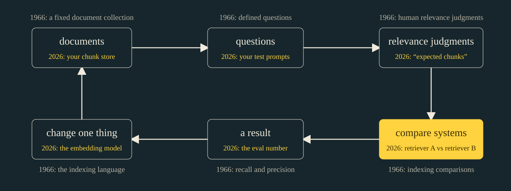

# Three Search Methods in a Fundable Trenchcoat

40 minutes. Timings include the exercises and delivery pauses, without Q&A. Sources checked 8 September 2026. Story prompts belong in speaker notes and require Dan’s own records before delivery.

Delivery order uses stable slide IDs: 1, 2, 8, 9, 10, 3–7, 11–15. The exercise comes before the historical diagnosis. [Per-slide budgets](timing.md).

## 1. The sentence

00:00 to 02:30 · warm

> RAG · embeddings · memory · MCP · judges · traces
> Your retriever finds the hole in your ruler.

Our agent uses RAG over an embedding store, adds memories to context, calls MCP tools, emits structured outputs, gets evaluated by an LLM judge, and traces the whole thing through our agent observability platform.

That sentence used to be the talk. Translate the nouns and everybody feels less behind. But knowing what the nouns mean does not tell us whether the retrieval works. The useful question is what the people who studied it already found out.

We spent years calling it search. Then we called it a vector database and raised a round. The product category changed. The problem of deciding whether the returned material is useful did not wait for the funding announcement.

Stage direction: Read the opening sentence quickly and straight-faced. Pause after it. Keep this hook in every route.

## 2. You are joining an old field late

02:30 to 04:30 · warm

> You are joining an old field late
> Term specificity → assessor disagreement

This is an engineer's reading of information retrieval, with synthetic exercises and sources attached. The claim is that we skipped useful evaluation work, not that IR researchers solved every problem in RAG.

Eight words will do the work: term specificity, vector space model, vocabulary problem, passage retrieval, relevance judgment, the Cranfield paradigm, pooling, and assessor disagreement.

Lexical, dense, hybrid: those are the three search methods in the trenchcoat. Before the reading list, judge five documents. Then we will ask how the field learned to catch the failure you just saw.

Story: Optional verified retrieval improvement outside the expected set; replace at most 35 words of existing prose, never add time. Bring query, labels, result and rejudgment.

## 8. Judge these five documents

04:30 to 08:30 · build

> A · current generic policy; 30-day notice
> B · signed Acme addendum; “see Schedule R”
> C · expired Acme terms; immediate cancellation
> D · current terms for another customer
> E · support note; “probably immediate”

Acme asks whether it can cancel today without a fee. Which documents belong in the evidence supplied to answer it? Work in pairs for sixty seconds.

A is current but generic. B is signed and specific, but refers to a schedule we have not supplied. C has the answer we might like and is expired. D is about somebody else. E is an employee's guess.

Now compare answers. Topical relevance, applicability, authority, and sufficiency are different criteria. For our score, a positive label means current evidence that governs Acme: generic policy or executed customer terms. A and B qualify; C is expired, D is another customer, E is an unchecked guess. This is an applicability rubric, not a topical-relevance rubric. A positive label still does not mean we have enough to answer.

Stage direction: Give 60 seconds in pairs and collect two judgments with reasons, before showing stamps or labels. If everyone agrees, ask whether the set is sufficient to authorize cancellation. Do not manufacture disagreement for the punchline. Do not reveal the missing schedule until slide 10. Use contracts.md for the full synthetic fixture.

## 9. Cranfield, Bedfordshire, 1966

08:30 to 11:30 · build

> Corpus + queries + relevance judgments
> 1966 → 2026 = 60 years

Cleverdon, Mills, and Keen's Cranfield report is dated 1966. Fix a document collection, define questions, judge relevance, and compare systems under the same conditions. Sixty years later, that is a recognizable shape for an eval harness.

The name is the Cranfield paradigm. It gives you a controlled comparison. It also forces choices about who writes the questions, who judges the evidence, and what the collection represents.

Your golden dataset is a test collection with a flattering filename. Write down its collection protocol. If it consists of whatever your first retriever happened to find, the next slide is about you.

Source: Cleverdon, Mills, and Keen (1966), [Factors Determining the Performance of Indexing Systems, Volume I, Design, Part 2, front matter](https://sigir.org/files/museum/Factors%20Determining%20the%20Performance%20of%20Indexing%20Systems%20Volume%20I.%20Design%20-%20Part%202.%20Appendices/pdfs/frontmatter.pdf).

## 10. Fool's Golden Dataset

11:30 to 16:30 · peak

> Old pool: A, B, C, D, E
> New result: F · signed Schedule R
> Unjudged is not a relevance judgment

The old retrievers contributed A through E to the judgment pool. Our new retriever finds F: the signed Schedule R referenced by B. It permits Acme to cancel immediately without a fee. Nobody judged it because nobody retrieved it.

Before the scores: does the new run score higher, lower, or the same? Commit with a hand. Our scorer treats unjudged as negative. Old top two: B and A. New top two: B and F. Calculate both.

Two out of two: one. One out of two: point five. Now label F positive under the same applicability rubric. The new score is two out of two: one. No retrieval output changed. The evidence is more useful for answering, while this coarse metric only returns to a tie. Your retriever found the hole in your ruler.

TREC used pooling because judging every document for every query was impractical. Zobel investigated reliability with incomplete judgments. The risk is real; universal failure is not. Voorhees, Soboroff, and Lin's 2022 TREC-8 ad hoc recheck expanded the judgments using new runs, including three transformer models and two BM25 baselines. Rankings of all runs by mean evaluation score had Kendall's tau correlations above 0.99 between the official and expanded judgments. Deep, diverse pools held up. That is rank correlation, not a percentage of scores that changed.

That is the lesson we missed. They tested whether the shortcut damaged the comparison. We called our first results golden.

Stage direction: Reveal F first. Collect the higher/lower/same prediction before showing numbers. Walk precision@2 on the board: 2/2, 1/2, then 2/2 once F is judged positive. Explain that the metric uses our applicability labels, not answer sufficiency or action permission.

Source: Justin Zobel (1998), [How reliable are the results of large-scale information retrieval experiments?](https://doi.org/10.1145/290941.291014), SIGIR, 307–314. Voorhees, Soboroff, and Lin (2022), [Can Old TREC Collections Reliably Evaluate Modern Neural Retrieval Models?](https://arxiv.org/abs/2201.11086). [NIST TREC overview](https://trec.nist.gov/overview.html), started 1992.

## 3. 1972: rare words matter more

16:30 to 19:30 · build

> Karen Spärck Jones · term specificity
> 1972 → 2026 = 54 years

Karen Spärck Jones published a statistical interpretation of term specificity in 1972. A word that appears in almost every document tells you less about which document you want than a rare term does.

Think of an error code in a support query. The words "application error" occur everywhere. The exact identifier narrows the search. That is a concrete reason to keep lexical evidence in a retrieval system that also understands paraphrases.

Fifty-four years. We have had time to put her name on the slide. The point is that corpus frequency supplies evidence, and the evidence has a history and assumptions you can inspect.

Stage direction: Compare a generic support phrase with an exact error identifier. Ask the room which term it would retain in a hybrid query.

Source: Karen Spärck Jones (1972), A statistical interpretation of term specificity and its application in retrieval, Journal of Documentation 28(1), 11–21. [Paper](https://doi.org/10.1108/eb026526).

## 4. Vector Database, 1975

19:30 to 22:00 · build

> Salton, Wong, Yang · vector space model · 1975
> Deerwester and colleagues · latent semantic analysis · 1990

Salton, Wong, and Yang described a vector space model for automatic indexing in 1975. Documents become weighted representations that support comparisons. In 1990, Deerwester and colleagues described latent semantic analysis using a low-rank representation of term-document structure.

Modern neural embeddings differ in how they learn and what they represent. The useful continuity is representing text numerically so related material can be retrieved despite imperfect word matching.

A vector store gives you a place to search those representations. It does not choose the right relevance definition. It does not tell you that a highly similar contract governs this customer. That work is still ours.

Source: Salton, Wong, and Yang (1975), [A vector space model for automatic indexing](https://doi.org/10.1145/361219.361220), Communications of the ACM 18(11), 613–620. Deerwester, Dumais, Furnas, Landauer, and Harshman (1990), [Indexing by Latent Semantic Analysis](https://www.cs.csustan.edu/~mmartin/LDS/Deerwester-et-al.pdf), JASIS 41(6), 391–407.

## 5. The vocabulary problem, both ways

22:00 to 24:30 · build

> The customer says “stop billing”
> The document says “terminate renewal”

Two people can refer to the same thing using different words. Furnas, Landauer, Gomez, and Dumais studied that vocabulary problem in human-system communication in 1987.

Our customer says stop billing. The policy says terminate renewal. Exact matching has a problem. A semantic representation is one answer. So are aliases, expansion, and better indexing. An embedding is a method, not the reason the problem exists.

Now reverse it. Two documents both say cancel, but one cancels a meeting and one cancels a subscription. Shared words do not establish shared intent. Evaluation needs cases for both vocabulary mismatch and misleading overlap.

Stage direction: Ask for two phrases a customer uses that never appear in the internal docs. Allow 30 seconds.

Source: Furnas, Landauer, Gomez, and Dumais (1987), [The vocabulary problem in human-system communication](https://doi.org/10.1145/32206.32212), Communications of the ACM 30(11), 964–971.

## 6. Chunking is passage retrieval

24:30 to 26:30 · build

> Salton, Allan, Buckley · 1993
> The useful passage may cross your boundary

Passage retrieval was being studied before our chunk-size arguments acquired a token budget. Salton, Allan, and Buckley compared approaches in 1993. Chunk size was an open research question in 1993 and a forum thread in 2024. One of those had a control group.

Take a policy paragraph that says cancellation is allowed, followed by an exception for annual contracts. Split between those paragraphs and the first chunk becomes a very persuasive wrong answer. Make the chunk enormous and the exception competes with a page of irrelevant material.

The old papers do not contain the perfect chunk size for your current generator. They give you experimental questions. What unit are we retrieving? What counts as enough evidence? Are we measuring the passage, the document, or the answer produced from it? Change one and the score may mean something else.

Source: Salton, Allan, and Buckley (1993), [Approaches to passage retrieval in full text information systems](https://doi.org/10.1145/160688.160693), SIGIR, 49–58.

## 7. BM25 is still standing there

26:30 to 28:30 · build

> BEIR, 2021: a robust lexical baseline
> Compare lexical, dense, and hybrid on your task

BEIR's 2021 experiments found BM25 a robust baseline across heterogeneous retrieval tasks. Reranking and late-interaction models performed best on average in that study, at higher computational cost.

That is a dated experimental result, not a claim that BM25 wins in 2026. It is a reason to include a cheap lexical baseline when measuring a new retriever. Exact identifiers and unfamiliar domain language are places where a semantic-looking system can disappoint you.

Run the comparison on the same corpus, queries, and judgments. Otherwise you have compared two demonstrations and called the difference a model improvement.

Source: Thakur et al. (2021), [BEIR: A Heterogeneous Benchmark for Zero-shot Evaluation of Information Retrieval Models](https://arxiv.org/abs/2104.08663), NeurIPS Datasets and Benchmarks.

## 11. Assessors disagree. Rankings can survive.

28:30 to 31:30 · build

> Voorhees, 2000: changed judgments, stable comparisons
> Test your comparison under more than one assessor

Voorhees varied relevance judgments and examined the resulting system rankings. The comparative results stayed stable despite substantial judgment differences in those experiments.

An absolute score and an A-versus-B ordering make different demands on the labels. That does not mean a model judge is trustworthy because it ranks two answers. It means we have a specific test to run: relabel a sample independently, then see which conclusions survive.

The twelve marks on screen are an authored illustration, not a population disagreement estimate or data from Voorhees. Four positions differ. They show where to investigate; they do not measure how often assessors disagree.

Keep disagreement as data. Was the case ambiguous? Did the rubric ask two questions at once? Did one assessor have the signed schedule and another not? A consensus label without that explanation can conceal exactly the distinction the next system needs.

Source: Ellen M. Voorhees (2000), [Variations in Relevance Judgments and the Measurement of Retrieval Effectiveness](https://www.nist.gov/publications/variations-relevance-judgments-and-measurement-retrieval-effectiveness), Information Processing & Management 36(5), 697–716.

## 12. The Reader Stopped Being a Person

31:30 to 34:30 · build

> Useful to inspect ≠ sufficient to answer
> Score retrieval and the resulting answer separately

A person inspecting a ranked list can notice that the signed addendum refers to a missing schedule and go looking. A missing schedule is not a creative-writing prompt. Our generator may instead turn the generic thirty-day policy into a fluent answer about Acme.

We can build abstention and verification into that system. We cannot infer that it will use them from a good retrieval score. The retrieved material must be applicable, sufficiently complete, and represented with the qualifiers the answer needs.

Evaluate the handoff. Did retrieval find B and F? Did context assembly keep their relationship? Did the answer cite the actual exception? If the answer is wrong, those checks locate the failure instead of blaming the nearest model. Then name who updates Schedule R and what invalidates a cached answer when it changes.

## 13. Retrieved text now sits beside instructions

34:30 to 37:00 · build

> Relevance gives evidence, not authority
> A document cannot grant a tool permission

Put a sentence in the retrieved support note telling the assistant to ignore policy and issue a credit. It may be relevant text in a support corpus. It is still untrusted input.

The ranking score answers how well the content matches a retrieval objective. It does not authorize an action. Keep tool permissions and policy checks outside the retrieved document's control. A signed cancellation exception can supply facts for a decision; it cannot change which account the tool is permitted to modify.

Keep this boundary in the end-to-end evaluation. Retrieval success, answer correctness, and action authorization are separate results. A useful citation does not turn a document into a supervisor.

Stage direction: Use a harmless printed instruction in the synthetic support note. Do not connect the exercise to live tools.

## 14. Who updates Schedule R?

37:00 to 38:00 · land

> McDermott’s R1: a real configuration system
> Who updates the knowledge when the product changes?

McDermott's R1 configured computer systems at DEC; the paper is from 1982. Working software still needed maintained domain knowledge.

Who owns Schedule R when it changes? Name the owner, what supersedes it, and which answers must be invalidated. A model makes stale knowledge easier to turn into a confident sentence. Put the update path beside the retrieval path.

Source: John McDermott (1982), [R1: A rule-based configurer of computer systems](https://www.sciencedirect.com/science/article/abs/pii/0004370282900212), Artificial Intelligence 19(1), 39–88.

## 15. Eight words. Sixty years. One instruction.

38:00 to 40:00 · land

> Three search methods. One instrument nobody checked.
> Go find the documents your eval never judged.

Term specificity. Vector space model. Vocabulary problem. Passage retrieval. Relevance judgment. The Cranfield paradigm. Pooling. Assessor disagreement.

Those words tell us why rare identifiers matter, why synonyms are hard, why a passage needs its exception, and why the score depends on who judged which documents. They are tools for investigating a failure, not a history quiz.

Lexical, dense, hybrid: we inherited all three. What we left behind was sixty years of checking whether the score was telling the truth. Your retriever found the hole in your ruler. Go find the documents your eval never judged.

Stage direction: Leave the B/F example up during questions. Land on the instruction. Stop talking. Leave the B/F example up during questions. Keep all eight terms in the notes; the screen closes on the instruction.
