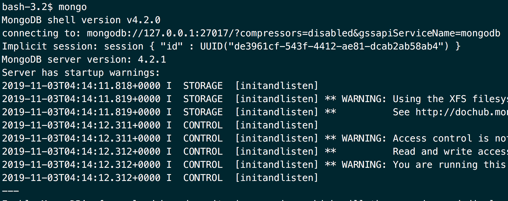

# Docker Server Setup

## Who's this guide for?

- Have you ever wanted to test an app with a 'throw-away' database?
- Inherited a suspicious codebase? Prefer not sharing access to your existing database?
- Work with security sensitive clients? Don't risk cross-contamination! Use containers & control data persistance!
- Can't upgrade your dev environment to the latest database version because your legacy apps depend on a 12 year old version of mysql?

> Never let those reasons get in your way again!

## Quick Links To 1-liners

This article features 1-line commands to start some of the most popular databases, including:

<section class="font-lg">

- [ Postgres](#postgres-server)
- [ MongoDB](#mongodb-server)
- [ MySQL](#mysql-server)
- [ ElasticSearch](#elasticsearch-server)

</section>

**Note:** The commands work in production. However they are mainly designed to accelerate your development workflow.

> **Advanced Docker Users:** If you are familiar with `docker-compose` you may want to convert the shell commands below for use in your `docker-compose.yml` files.

## Postgres Server

##### Start a container, naming it `pg-server`

```sh
# Store db files on a local path, outside the container
mkdir -p $HOME/.postgres-data

docker run \
  --name pg-server \
  -v $HOME/.postgres-data:/var/lib/postgresql/data \
  -p 127.0.0.1:5432:5432 \
  --restart on-failure:5 \
  --detach \
  --shm-size=256mb \
  postgres:12-alpine \
  postgres -c 'listen_addresses=*' \
    -c 'password_encryption=scram-sha-256' \
    -c 'shared_memory_type=sysv' \
    -c 'shared_buffers=256MB' \
    -c 'max_connections=200'
```

> Adjust the command line options as needed. (The postgres daemon arguments start following the docker image name `postgres:12-alpine`. See `postgres -c 'listen_addresses=*'...`)

##### Access the `psql` prompt as postgres user

```sh
docker exec --user postgres -it pg-server psql
```

##### Access the container's shell as root

```sh
docker exec -it pg-server bash
```

**Note:** The above command uses the official Alpine Linux base images. _It is not your typical debian environment._

> To use the debian/ubuntu base image, change `postgres:12-alpine` to `postgres:12`.

## MongoDB Server

```sh
mkdir -p $HOME/.mongodb/data

docker run -d \
  --name mongodb \
  --restart on-failure:5 \
  -p 127.0.0.1:27017:27017 \
  -v $HOME/.mongodb:/data \
  mongo:4 bash -c 'mongod --bind_ip 0.0.0.0 --storageEngine=wiredTiger'
```

Now that your server is setup, verify your data is at `$HOME/.mongodb` with:

```sh
ls -lach $HOME/.mongodb
```

Let's connect to the server with `mongo` CLI tool. (If you don't have it installed see below.)

```sh
#> Using default arguments:
mongo
```

And you should see something like this:



### Setup mongo CLI tools

#### Using brew & OSX

```sh
brew tap mongodb/brew
brew install mongodb-community-shell
```

## Mysql Server

> **WARNING:** CHANGE THE PASSWORD IN `MYSQL_ROOT_PASSWORD` BELOW.

```sh
mkdir -p $HOME/.mysql

docker run -d \
  -v $HOME/.mysql:/var/lib/mysql \
  -p 127.0.0.1:3306:3306 \
  --name mysql-$USER \
  -e MYSQL_DATABASE=$USER \
  -e MYSQL_ROOT_HOST='172.*.*.*' \
  -e MYSQL_ROOT_PASSWORD='p@ssw0rd' \
  mysql/mysql-server:8
```

## ElasticSearch Server

```sh
mkdir -p $HOME/.elastic

docker run -d \
  --name elastic \
  -p 127.0.0.1:9200:9200 \
  -p 127.0.0.1:9300:9300 \
  -v $HOME/.elastic:/data \
  elasticsearch bash -c 'elasticsearch --cluster.name elastic_cluster --node.name elastic01 --path.data /data/elastic-data --path.logs /data/elastic-logs '
```

#### Security Notes

> **NOTE:** the `-p 127.0.0.1:27017:27017`-style port option prevents access to your instance except from the docker server's localhost network.
> To 'publish' the exposed ports, remove the local IP address prefix to allow external access: `-p 27017:27017`. **Make sure you have taken necessary security precautions.**

**Recommended:** Always use a port scanning tool (like nmap/masscan) to verify your network configuration (from separate system on another network.)

> Now that you have the commands to start your database servers, the next step is to package up your application as a docker image. Part 2 continued below:

# Packaging a NodeJS Web App

1.  Add a blank file named `Dockerfile` in your project root.
1.  _(Optional, Recommended)_ Add a `.dockerignore` using .gitignore rules to exclude large non-essential paths. By default all project files are included.

### Create a `Dockerfile` in your apps root

```dockerfile
# Example for NodeJS
FROM node:12
EXPOSE [3000]
COPY . /app/
WORKDIR /app
RUN apt-get update && apt-get dist-upgrade -yqq
RUN ["npm", "install"]

# Overridable Command
CMD ["npm", "start"]
```

It's easier to show how to start using the Dockerfile and demonstrate the results via console (see commands below).

In terminal, `cd` to your project folder and run the following `build` command _everytime_ you deploy changes - or want to change/upgrade OS or Env config)

```sh
docker build -t app-name-here .
```

<!--
#### Docker Install

If you don't have Docker installed, use the following command to install on Linux or macOS:

```sh
curl -sSL https://get.docker.com/ | sh
``` -->

### Key Docker Commands Reference

#### Build Docker Image

```sh
docker build -t app-name-here .
```

#### Create/Run Web App w/ Links to DB Servers

```sh
docker run -d --name webapp01 -p 3000:3000 --link mongo:mongo --link elastic:elastic app-name-here
```

#### Run Interactively (non-daemon, in terminal)

```sh
docker run -it --name webapp01 -p 3000:3000 --link mongo:mongo --link elastic:elastic app-name-here bash
```

#### Delete Container Instance or Image

> Important: Any data not stored on a mounted volume path will be lost!!

```sh
# Delete Image
docker rmi -f app-name-here
docker rm -f webapp01
# now re-run your `docker run...` from ^^^
# So for example, let's kill your db instances above, run: ( start with something like `docker stop {mongo,elastic}` )
docker rm -f mongo elastic
```

<!--

## Optional Config & Monitoring Tools

```sh
# Debian/BSD Requirements / Updates + monitoring tools: atop & htop
apt-get update && apt-get install -y vim-nox git-core curl atop htop build-essential libssl-dev linux-image-amd64 linux-headers-amd64 sudo

# OSX, Debian & RHEL: Host OS Tuning
sysctl -w vm.max_map_count=262144

# Updates Profile init scripts before appending new scripts below
mkdir ~/backups
cp ~/.bash* ~/backups/

# Debian/BSD:  Append Shell Environment Shortcuts + XTERM Colors
curl -o- https://raw.githubusercontent.com/justsml/system-setup-tools/master/modules/vim-update.sh | bash

curl -sSL https://raw.githubusercontent.com/justsml/system-setup-tools/master/home-scripts/.bashrc >> ~/.bashrc
curl -sSL https://raw.githubusercontent.com/justsml/system-setup-tools/master/home-scripts/.bash_aliases >> ~/.bash_aliases

# Read into current shell (login steps already missed the aliases file)
source ~/.bashrc

# Docker pre reqs
# sudo apt-get install -y linux-image-virtual linux-image-extra-virtual
```

> Only for SELinux Enabled Systems

```sh
# SELinux fixes (optional)
# chcon -Rt svirt_sandbox_file_t /mongodb
# chcon -Rt svirt_sandbox_file_t /elastic
```

-->
