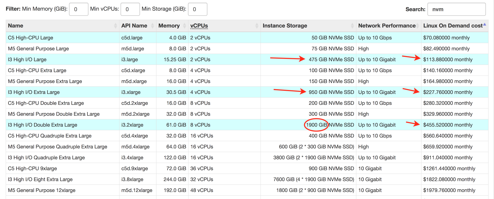

# Boost Cloud Performance up to 70%

> General notes & sections for select hosting providers below (mid-2017).

- [AWS (Amazon Web Services), EC2 (Elastic Compute Cloud), EBS (Elastic Block Storage), etc.](#aws_tips)
- [Digital Ocean](#do_tips)
- [Packet.net](#packet_tips)

## Amazon Web Services / EC2 / EBS / S3

> TLDR; While AWS usually offers restrictive hardware & intimidating pricing tiers, the **i3.large** (and larger) hardware is the most efficient in terms of Price vs. I/O Performance, AND is the Fastest in Overall Performance.

> EC2 **i3.large** with a **475GB NVMe SSD** typically costs around **$110/month!** >  
> An **i3.2xlarge with 1.9TB NVMe** costs about **$450/month** * >   > \_*USA/2018\_

 
 

## Head to Head

\[[full-screen data view](https://docs.google.com/spreadsheets/d/1qQ62m1RFj73YScdS77Q9R2GpRqJOk7JHuTEOFDR4jJE/pubchart?oid=116848524&format=interactive)\]

<iframe style="position: relative; left: -150px; height: 650px; width: 990px; min-width: 100%;" seamless frameborder="0" scrolling="no" src="https://docs.google.com/spreadsheets/d/1qQ62m1RFj73YScdS77Q9R2GpRqJOk7JHuTEOFDR4jJE/pubchart?oid=116848524&amp;format=interactive"></iframe>

[View Prices on EC2](https://www.ec2instances.info/?filter=nvm&region=us-east-2&cost_duration=monthly&selected=c5d.large,i3.large,i3.xlarge,i3.2xlarge)

Note the **i3.\*xlarge** is the only hardware to feature competitively priced NVMe storage (ultra-fast +1GB/s speeds). The major limiting factor I found was the real network speed. Servers with advertised speeds "up to 10/Gb/s" struggled to get close to 1/Gb/s (60-80MB/s).

Network tests used up to 9 additional instances in the same availability zone. Any erroneous data points I replaced with a 0. Additional tests are needed as only 1-2 samples were collected.

\[[full-screen data view](https://docs.google.com/spreadsheets/d/1qQ62m1RFj73YScdS77Q9R2GpRqJOk7JHuTEOFDR4jJE/pubchart?oid=13370750&format=interactive)\]

<iframe style="position: relative; left: -150px; height: 790px; width: 950px; min-width: 100%;" seamless frameborder="0" scrolling="no" src="https://docs.google.com/spreadsheets/d/1qQ62m1RFj73YScdS77Q9R2GpRqJOk7JHuTEOFDR4jJE/pubchart?oid=13370750&amp;format=interactive"></iframe>

### Credits

- [ec2instances.info](https://www.ec2instances.info/?filter=nvm&region=us-east-2&cost_duration=monthly&selected=c5d.large,i3.large,i3.xlarge,i3.2xlarge)
