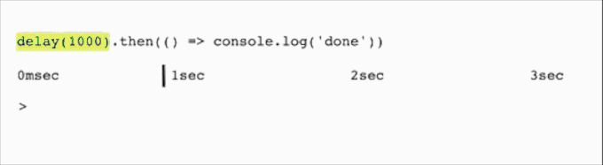
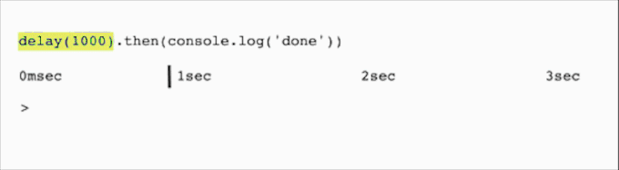
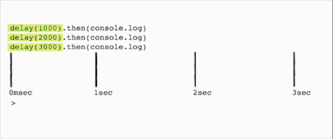

In order to visualize how Promises execute, let's define a new method `delay(millisecs)`.

```js
function delay(millisecs) {
  return new Promise(resolve => {
    setTimeout(() => resolve(millisecs), millisecs)
  })
}
```

This is a utility method which will resolve once the timeout has passed.

The delay in milliseconds will be passed to `.then`'s callback.

Let's look at 4 examples (w/ a corresponding timeline)...

#### Example #1/4

This shows how `console.log()`'s execution will be delayed by `delay(msec)`.

```js
delay(1000).then(() => console.log('done'))
```



<!-- ```
delay(1000) --------|.then(fn)
                    | console.log('done')
|-------------------|--------------------|--------------------|-----------------
0msec             1sec                 2sec                 3sec
``` -->

#### Example #2/4

This shows what happens when you execute the function, rather than pass a reference to a function.
For example: `console.log` vs. `console.log()`.

_This shows a common mistage using `console.log`._ Generally the desired behavior is shown in Example #1.

```js
delay(1000).then(console.log('done'))
```



<!-- ```
delay(1000) --------|.then(null)
console.log('done')
|-------------------|--------------------|--------------------|-----------------
0msec             1sec                 2sec                 3sec
``` -->


#### Example #3/4

3 Promises execute simultaneously.

```js
delay(1000).then(console.log)
delay(2000).then(console.log)
delay(3000).then(console.log)
```



<!-- ```
delay(1000) ------|.then(console.log)
delay(2000) ------|--------------------|.then(console.log)
delay(3000) ------|--------------------|--------------------|.then(console.log)
|-----------------|--------------------|--------------------|-------------------
|                 |                    |                    |
0msec           1sec                 2sec                 3sec
``` -->

#### Example #4/4

`Promise.all` with 3 `delay` Promises. They will execute simultaneously.

```js
Promise.all([delay(1000), delay(2000), delay(3000)])
  .then(console.log)
```


<!--
```
delay(1000) ---| [resolved]------------------v
delay(2000) ---|--------------| [resolved]---v
delay(3000) ---|--------------|--------------v [resolved]
Promise.all()  |--------------|-------------- > console.log([1000, 2000, 3000])
|--------------|--------------|--------------|--------------------------------
|              |              |              |
0msec        1sec           2sec           3sec
```
-->


> Credit: Inspiration for this article is largely due to: https://pouchdb.com/2015/05/18/we-have-a-problem-with-promises.html

