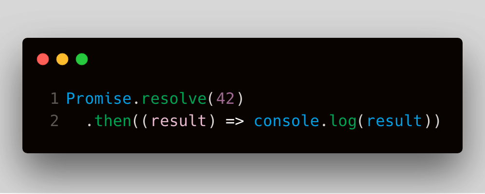

> [Fun quiz below!](#fun-quiz)

<!--
## Fundamentals

### Key Details

### Illustrated
-->

## Techniques

1. Logging values
1. Creating Promises
  1. Parameter tricks

## Applied Solutions

1. Show `Promise.all()` Progress
1. `Auto-Retry` helper function


## Test Your Understanding!
<!-- QUIZ HTML HERE WILL BE AUTO-EXTRACTED BY
  `AutoLoader` COMPONENT HELPER CLASS  -->

<section class="challenge" group="Syntax + Functions">
  <div class="description">

# What type does \`getCustomers()\` return?

#### An H4 Test!

```js
const dummyData = []
function getCustomers() {
  return Promise.resolve(dummyData)
}
```

> Select best answer:

  </div>
  <ul class="options">
    <li>Customer Data</li>
    <li>Array</li>
    <li class="answer">Promise</li>
    <li>Other</li>
  </ul>
  <div class="explanation">
    The Promise helper method `.resolve(value)` wraps any value in a Promise and then returns that Promise.
    <br />
    Here, we are wrapping up an array called dummy data.
  </div>
</section>


<div class="challenge" title="Logging 2">
  <div class="description">
    What does the following code print?



  </div>
  <ul class="options">
    <li>1</li>
    <li>2</li>
    <li class="answer">42</li>
    <li>Other</li>
  </ul>
  <div class="explanation">The Promise method `.then()` must be given a function.

  Here, we are executing a `console.log` with an undefined variable `result`. The essential problem here is that `console.log` isn't being passed as a function to `.then()`, instead it executes immediately and passes `undefined` into `.then()`. This leads to some confusing behavior, see later challenges will</div>
</div>