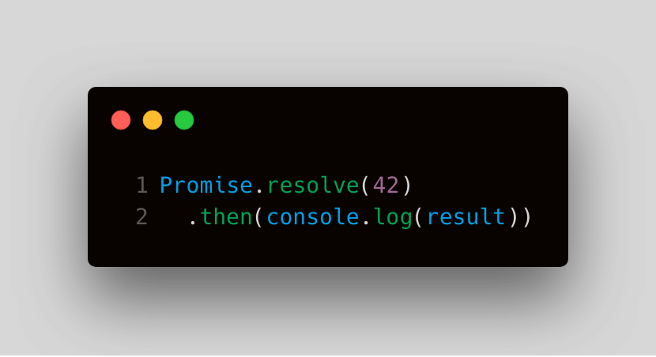

> [Fun quiz below!](#fun-quiz)

<!--
## Fundamentals

### Key Details

### Illustrated
-->

## Techniques

1. Logging values
1. 2 ways to create Promises
1. 3 parameter tricks with Promises
1. Show `Promise.all()` Progress
1. `Auto-Retry` helper function

## Fun quiz!

  

    What does the following code print?

  

  <ul class="options">
    <li>1</li>
    <li>2</li>
    <li>42</li>
    <li class="answer">Other</li>
  </ul>
  
The Promise method `.then()` must be given a function.

  Here, we are executing a `console.log` with an undefined variable `result`. The essential problem here is that `console.log` isn't being passed as a function to `.then()`, instead it executes immediately and passes `undefined` into `.then()`. This leads to some confusing behavior, see later challenges will

  

    What does the following code print?

  

  <ul class="options">
    <li>1</li>
    <li>2</li>
    <li class="answer">42</li>
    <li>Other</li>
  </ul>
  
The Promise method `.then()` must be given a function.

  Here, we are executing a `console.log` with an undefined variable `result`. The essential problem here is that `console.log` isn't being passed as a function to `.then()`, instead it executes immediately and passes `undefined` into `.then()`. This leads to some confusing behavior, see later challenges will

