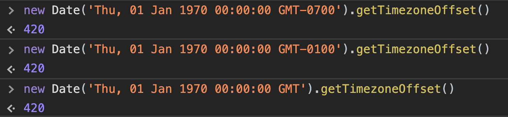
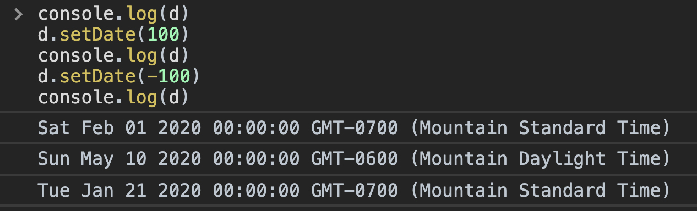

# How well do you know the `Date` class?

> * **Prove your JavaScript skillz!** 🚀
> * No login or signup required. ✨
> * Multiple choice. 🤖 ... _How difficult can it be, eh?_

## Outline

The `Date` class in JavaScript has a notoriously difficult API. It was inherited from Java...

This situation leads many developers to use 3rd party libraries without question. While often a safe and reliable choice, these libraries are rarely needed for formatting dates or localization!

This quiz is designed to test (and deepen) your knowledge of the native `Date` API. Use the green buttons for hints & explanations! Hopefully by the end of the challenge you'll have solidified your understanding of `Date`'s in JavaScript.

<!-- There are 3 big areas around dates that each have unique risks & tradeoffs. These 3 areas are listed in order of **'native API is broken'** to **'the native API can handle this'**:

1. ☢️ **Modify Dates with Math.** Examples include extending subscriptions, trials, etc. (e.g. Add 1 week/year to `expiresDate`)
    - _Write operation, not read-only._
    - Handle timezones
    - Business rules (How many days is in a `Month`? Based on current month? Fixed #, e.g. 30? Dynamic?)
      - Do you add to existing `expiresDate` or from current date? (Affects those paying early/late.)
      - What if the expiry date is _way_ expired (by years) and customer renews for 1 month?
2. ⚠️ **Formatting** (in timezone aware ways).
    - _Can be read-only._
    - Handle timezones
      - Preserve UTC/GMT for DB storage 😭
    - Locale rules (e.g. `en-US` uses `MM/DD/YYYY` vs `en-GB`'s `DD/MM/YYYY`)
3. 👍 **Coordinated Client-side Data** (for logging, 3rd party APIs, etc.)
    - _Can be read-only._
    - Need to know if your APIs require UTC dates.

While most _write operations_ should avoid using the native `Date` class in favor of far more intuitive 3rd party libraries, it certainly doesn't hurt to learn the native API.

As for 3rd party libraries, check out [date_fns](https://npmjs.com/package/date-fns), [dayjs](https://npmjs.com/package/dayjs), or [momentjs](https://npmjs.com/package/momentjs).
 -->

### If you get stuck

1. **Read the Hints** (Green button, lower right corner). Some include a few animated answers w/ detailed annotations, while others offer only a few clues. I can't give away all the answers so easy!  <br>Seriously though, this is intentional, the answers are there. Skip ahead or try the code snippets out, then change it, and play some more.
2. Try the code in your browser's Console (try shortcut `F12` on Windows, or `Command + Option + J` on Mac).
3. Please feel free to [Tweet at me @justsml](https://twitter.com/intent/tweet?text=Hey%20Dan%2C%20I%20was%20taking%20your%20Date%20quiz%2E%2E%2E&url=https://danlevy.net/). **I'd love to hear your thoughts!**


### **NOTE:** Assume all examples run with GMT-7 timezone offset.


<div style="text-align: center; width: 75%; margin: 0 auto 10rem auto; white-space: nowrap; font-size: 1.4em;" class="quiz-loading">

  <svg class="loading-spinner" xmlns="http://www.w3.org/2000/svg" width="50" height="50" viewBox="0 0 24 24">
    <path d="M17.65 6.35C16.2 4.9 14.21 4 12 4c-4.42 0-7.99 3.58-7.99 8s3.57 8 7.99 8c3.73 0 6.84-2.55 7.73-6h-2.08c-.82 2.33-3.04 4-5.65 4-3.31 0-6-2.69-6-6s2.69-6 6-6c1.66 0 3.14.69 4.22 1.78L13 11h7V4l-2.35 2.35z" />
    <path d="M0 0h24v24H0z" fill="none" />
  </svg>
  <h4 style="text-align: left">Loading...<br />A few more seconds...</h4>

</div>

<div style="text-align: center; display: none;" class="quiz-ready">

## 👇 Complete 14 Questions Below 👇

</div>


<!-- #6 -->
<section class="challenge" group="Handling Dates">
  <div class="description">

# Date Constructor Part 1

```js
const d1 = new Date(2020, 1, 1)
console.log(d1)
```

## What will the output include?

  </div>
  <ul class="options">
    <li>Jan 01 2020</li>
    <li class="answer">Feb 01 2020</li>
    <li>RangeError: Invalid argument.</li>
  </ul>
  <div class="explanation">

The Month argument is zero-based. With a range of 0-11 (using western calendars.)

'February' has an index value of one. (Think of it like an array lookup.)

  </div>
</section>

<!-- #7 -->
<section class="challenge" group="Handling Dates">
  <div class="description">

# Date Constructor Part 2

```js
const d2 = new Date(2020, 0, 1)
console.log(d2)
```

## What will the output include?

  </div>
  <ul class="options">
    <li class="answer">Jan 01 2020</li>
    <li>Feb 01 2020</li>
    <li>RangeError: Invalid argument.</li>
  </ul>
  <div class="explanation">

The Month argument is zero-based. With a range of 0-11 (using western calendars.)

'January' has an index value of zero. (Think of it like an array lookup.)

  </div>
</section>

<!-- #8 -->
<section class="challenge" group="Handling Dates">
  <div class="description">

# Date Constructor Part 3

```js
const d3 = Date('Thu, 01 Jan 1970 00:00:00 GMT')
console.log(d3)
```

## What will the output include?

  </div>
  <ul class="options">
    <li>01 Jan 1970</li>
    <li>Unix Epoch of 0</li>
    <li>Current Date, in UTC/GMT</li>
    <li class="answer">Current Date</li>
    <li>NaN</li>
  </ul>
  <div class="explanation">

This is a **common gotcha** that's **easy to overlook**, even in code review.

A `Date` instance created with `Date([args])` will always return today's date. In other words, the arguments are ignored. `Date('blah')` is an alias for `new Date()`.

The missing piece is the `new` keyword: `new Date(dateString)`.

  </div>
</section>

<!-- #1 -->
<section class="challenge" group="Handling Dates">
  <div class="description">

# Date String Parsing

> Assume all examples run with GMT-7 timezone offset.

```js
const d1 = new Date('2020-01-01')
const d2 = new Date('2020-01-01T00:00')
console.log(d1.getFullYear(), d2.getFullYear())
```

## What value will print to the console?

  </div>
  <ul class="options">
    <li class="answer">2019 2020</li>
    <li>2020 2021</li>
    <li>2020 2020</li>
    <li>2020 2019</li>
  </ul>
  <div class="explanation">

The `Date` constructor parses date strings using **either UTC/GMT or local time.**

The trick is knowing if your local timezone will be used... The `T00:00` causes it to use UTC/GMT time.

  </div>
</section>

<!-- #2 -->
<section class="challenge" group="Handling Dates">
  <div class="description">

# Formatting

## Given the following date...

```js
const date = new Date('2020-01-01T00:00')
```

## Select an _incorrect_ formatting method:

  </div>
  <ul class="options">
    <li class="answer">date.toLocaleFormat('en-US', { timeZone: 'UTC', timeZoneName: 'short' })</li>
    <li>date.toLocaleDateString('en-US', { timeZone: 'UTC', timeZoneName: 'short' })</li>
    <li>date.toLocaleTimeString('en-GB', { timeZone: 'UTC' })</li>
    <li>new Intl.DateTimeFormat('en-US').format(date)</li>
  </ul>
  <div class="explanation">

The method [`Date.toLocaleFormat()`](https://developer.mozilla.org/en-US/docs/Web/JavaScript/Reference/Global_Objects/Date/toLocaleFormat) is not standard, or well supported.

Before I reach for a 3rd party library, I prefer to use the native [`toLocaleDateString`](https://developer.mozilla.org/en-US/docs/Web/JavaScript/Reference/Global_Objects/Date/toLocaleDateString) method. It's behavior is documented under [`Intl.DateTimeFormat`](https://developer.mozilla.org/en-US/docs/Web/JavaScript/Reference/Global_Objects/DateTimeFormat).

  </div>
</section>

<!-- #3 -->
<section class="challenge" group="Handling Dates">
  <div class="description">

# Formatting

```js
const date = new Date(2020)
console.log(date.getFullYear())
```

## What will the output include?

  </div>
  <ul class="options">
    <li class="answer">1969</li>
    <li>1970</li>
    <li>2019</li>
    <li>2020</li>
    <li>2021</li>
  </ul>
  <div class="explanation">

A Date instance cannot be created with a single integer as an argument. It is invalid, and will default to the start of 'computer time' (milliseconds since Jan 1st, 1970.)

The reason the answer is not 1970 is because you'd need to use [`.getUTCFullYear()`](https://developer.mozilla.org/en-US/docs/Web/JavaScript/Reference/Global_Objects/Date/getUTCFullYear) to get the year without timezone offset (for these questions, GMT-7 is assumed.)

You won't observe this effect if you live at GMT-0 (or greater than GMT+1.)

  </div>
</section>

<!-- #4 -->
<section class="challenge" group="Handling Dates">
  <div class="description">

# UTC Dates Part 1

```js
var date = new Date(Date.UTC(2020, 0, 1))
console.log(date.getUTCFullYear(), date.getFullYear())
```

## What will the output include?

  </div>
  <ul class="options">
    <li>2020 2020</li>
    <li class="answer">2020 2019</li>
    <li>2019 2020</li>
    <li>2019 2019</li>
  </ul>
  <div class="explanation">

The [`getFullYear()`](https://developer.mozilla.org/en-US/docs/Web/JavaScript/Reference/Global_Objects/Date/getFullYear) method is based off a local offset of GMT-07:00. Which means it will give the previous year, as the date is represented locally is `Dec 31 2019 17:00:00`.

  </div>
</section>

<!-- #5 -->
<section class="challenge" group="Handling Dates">
  <div class="description">

# UTC Dates Part 2

```js
const d = Date.UTC(2020, 0, 1)
console.log(d)
```

## What will the output include?

  </div>
  <ul class="options">
    <li>A UTC-based date instance</li>
    <li>A date instance adjusted for local time-zone</li>
    <li class="answer">Milliseconds since Jan 1st, 1970</li>
    <li>An error</li>
  </ul>
  <div class="explanation">

The helper method [`Date.UTC`](https://developer.mozilla.org/en-US/docs/Web/JavaScript/Reference/Global_Objects/Date/UTC) doesn't return a date instance. It returns an integer in milliseconds.

  </div>
</section>

<!-- #9 -->
<section class="challenge" group="Handling Dates">
  <div class="description">

# UTC Dates Part 3

```js
// Assume local TZ is -07:00
const d = new Date(Date.UTC(2020, 0, 1))
console.log(d.getTimezoneOffset())
```

## What will the output include?

  </div>
  <ul class="options">
    <li>0</li>
    <li class="answer">420</li>
    <li>700</li>
    <li>1400</li>
    <li>null</li>
  </ul>
  <div class="explanation">

Date's will be implicitly presented in local time, with an unchanging [`.getTimezoneOffset()`](https://developer.mozilla.org/en-US/docs/Web/JavaScript/Reference/Global_Objects/Date/getTimezoneOffset).

Date instances do not store 'original' timezone data. Date instances essentially store only the # of milliseconds since the Unix Epoch (Jan 1, 1970). The timezone is accounted for when Date String parsing. And the default display behavior is automatically determined based on the system or browser's locale settings.



  </div>
</section>

<!-- #10 -->
<section class="challenge" group="Handling Dates">
  <div class="description">

# Date Setters Part 1

```js
const d = new Date(2020, 0, 1)
d.setDate(1)
console.log(d)
```

## What will the output include?

  </div>
  <ul class="options">
    <li class="answer">Jan 01 2020</li>
    <li>Feb 01 2020</li>
    <li>RangeError: Invalid argument.</li>
  </ul>

  <aside class="hint">`setDate` sets the day of the month, typically in the range 1-31.</aside>

  <div class="explanation">

The [`.setDate()`](https://developer.mozilla.org/en-US/docs/Web/JavaScript/Reference/Global_Objects/Date/setDate) method sets the day of the month, based on the given instance's current month.

If a value is provided outside of the number of days available, the date instance month value will be adjusted (e.g. A `setDate(32)` in January will calculate as February 1st.)

  </div>
</section>

<!-- #11 -->
<section class="challenge" group="Handling Dates">
  <div class="description">

# Date Setters Part 2

```js
const d = new Date(2020, 0, 1)
d.setDate(0)
console.log(d)
```

## What will the output include?

  </div>
  <ul class="options">
    <li>Jan 01 2020</li>
    <li>Jan 00 2020</li>
    <li>Feb 01 2020</li>
    <li class="answer">Dec 31 2019</li>
    <li>RangeError: Invalid argument.</li>
  </ul>

  <aside class="hint">`setDate` sets the day of the month, typically in the range 1-31.</aside>

  <div class="explanation">

The [`setDate`](https://developer.mozilla.org/en-US/docs/Web/JavaScript/Reference/Global_Objects/Date/setDate) method sets the day of the month, based on the given instance's current month.

If you invoke `setDate(0)` the date instance will adjust to the last day of the previous month.

  </div>
</section>

<!-- #12 -->
<section class="challenge" group="Handling Dates">
  <div class="description">

# Date Setters Part 3

```js
const d = new Date(2020, 0, 1)
d.setDate(32)
console.log(d)
```

## What will the output include?

  </div>
  <ul class="options">
    <li>Jan 01 2020</li>
    <li>Jan 32 2020</li>
    <li class="answer">Feb 01 2020</li>
    <li>RangeError: Invalid argument.</li>
  </ul>

  <aside class="hint">`setDate` sets the day of the month, typically in the range 1-31.</aside>
  <aside class="hint">Negative numbers and any numbers greater than `31` will cause the day & month to adjust, sometimes in surprising ways.</aside>

  <div class="explanation">

If a positive integer is provided to `setDate` outside of the number of days available, the date instance's month and day will be adjusted as necessary. (e.g. A `setDate(32)` in January will calculate as February 1st.)

  </div>
</section>

<!-- #13 -->
<section class="challenge" group="Handling Dates">
  <div class="description">

# Date Setters Part 4

```js
const d = new Date(2020, 1, 1)
d.setDate(100)
console.log(d)
```

  </div>
  <ul class="options">
    <li>Jan 01 2020</li>
    <li>Feb 01 2020</li>
    <li>May 01 2020</li>
    <li class="answer">May 10 2020</li>
    <li>RangeError: Invalid argument.</li>
  </ul>
  <div class="explanation">

**Hint:** Setting the date with `setDate(X)` isn't the same as adding `X` days.

  </div>
</section>


<!-- #14 -->
<section class="challenge" group="Handling Dates">
  <div class="description">

# Date Setters Part 5

```js
const d = new Date(2020, 1, 1)
d.setDate(100)
d.setDate(-100)
console.log(d)
```

  </div>
  <ul class="options">
    <li>Feb 01 2020</li>
    <li>Feb -100 2020</li>
    <li class="answer">Jan 21 2020</li>
    <li>Jan 01 2020</li>
    <li>RangeError: Invalid argument.</li>
  </ul>

  <aside class="hint">Months are non-uniform, range between 28-31 days.</aside>
  <aside class="hint">`setDate` sets the day of the month, typically in the range 1-31. Negative numbers and any numbers greater than `31` will cause the day & month to adjust, sometimes in surprising ways.</aside>

  <div class="explanation">

This is perhaps one of the stranger questions here.

The reason this even comes up is the likely scenario: You know `setDate(1)` goes to the first day of the month. And that `setDate(-1)` will select the last day of the previous month, "wow, that's handy" you say. Then, a requirement comes down: we need be able to extend (and cancel) subscriptions by 120-day increments.
 This question simulates this scenario.

Hopefully you don't find yourself with code attempting tricks like this with `setDate`. Use a 3rd party library, check out [date_fns](https://npmjs.com/package/date-fns), [dayjs](https://npmjs.com/package/dayjs), or [momentjs](https://npmjs.com/package/momentjs). They feature a vastly more practical interface.


Here's a screenshot of what the values are after each change:



  </div>
</section>
