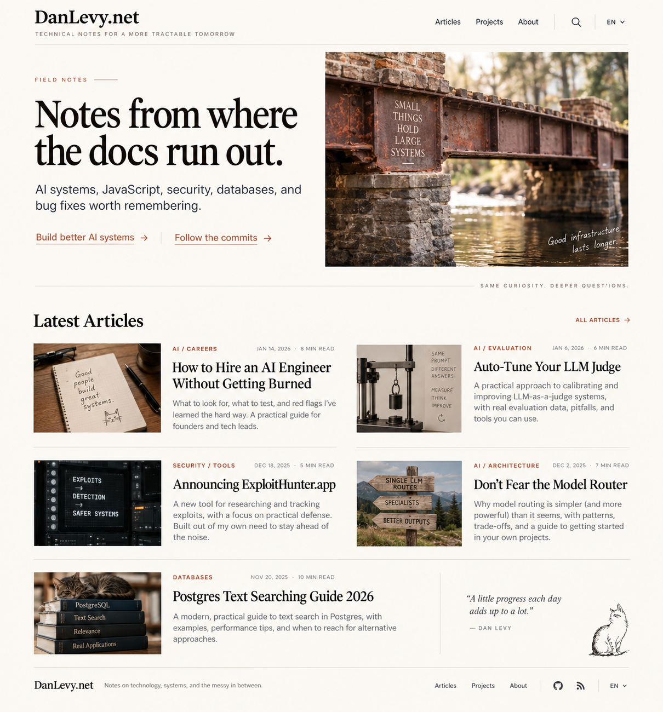
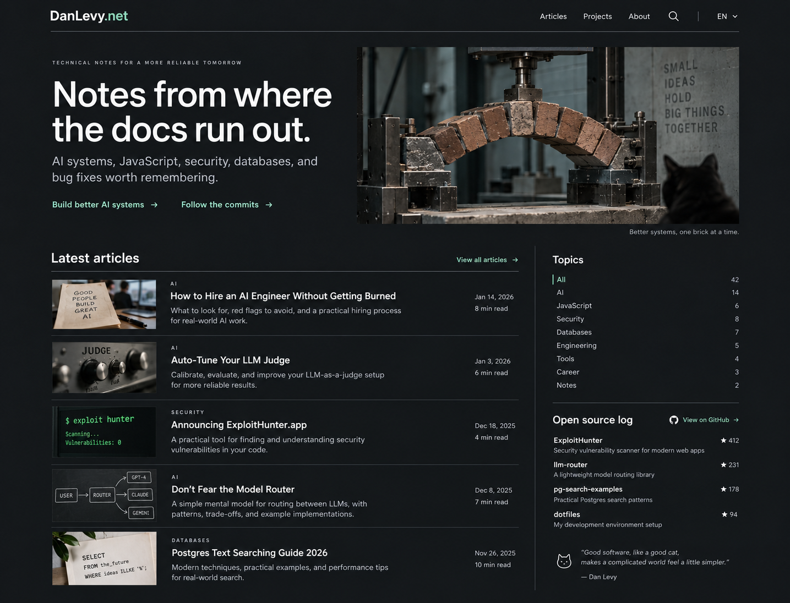
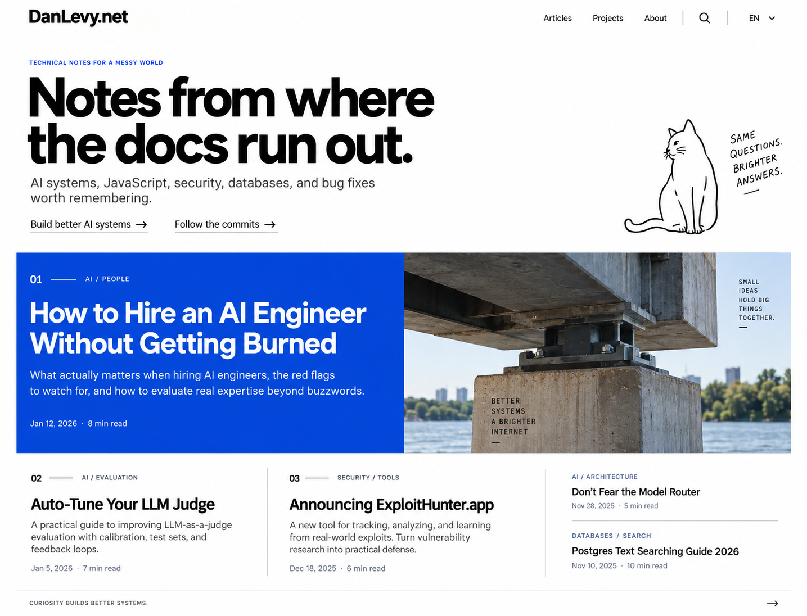
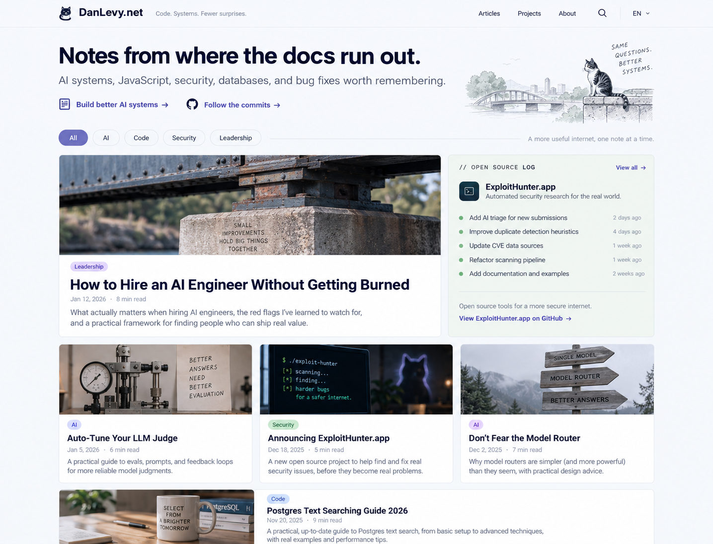

# Blog design mockups

Generated with the built-in imagegen tool on 2026-10-02 after inspecting the local homepage. These are visual concepts; generated summaries, dates, quotations, repository statistics, and commit activity are illustrative placeholders. The website implementation has not changed.

## Warm editorial

### Generation prompt

Use case: ui-mockup. Create one polished high-fidelity alternate homepage design mockup image for DanLevy.net, Dan Levy’s personal technical blog. A flat front-on desktop website screenshot, approximately 1440px wide by 1100px tall, no device frame, no perspective, no surrounding presentation canvas. Treat this as a sophisticated bespoke editorial site, with realistic legible UI typography, generous spacing and excellent hierarchy. Preserve the real brand name "DanLevy.net". Navigation: "Articles", "Projects", "About", search icon, "EN". Real hero text: "Notes from where the docs run out." Supporting copy: "AI systems, JavaScript, security, databases, and bug fixes worth remembering." Use these actual article titles: "How to Hire an AI Engineer Without Getting Burned", "Auto-Tune Your LLM Judge", "Announcing ExploitHunter.app", "Don’t Fear the Model Router", "Postgres Text Searching Guide 2026". Show article categories, small dates and reading times. Feature subtle secondary links "Build better AI systems" and "Follow the commits". Images may be editorial photography of a small engineered bridge bearing bricks, mechanical evaluation apparatus, or tasteful abstract security diagrams. A tiny cat motif is welcome as subtle personality. No invented product pricing, no SaaS dashboard, no fake testimonials, no gigantic CTA, no unnecessary gradients. The result must feel buildable as a real modern personal blog.
Art direction: warm ivory background, near-black ink, muted terracotta accent. A beautifully typeset large serif hero paired with crisp utilitarian sans-serif UI. Wide centered content, fine hairline rules, small uppercase eyebrow FIELD NOTES. Asymmetric lead story, with large photographic bridge image on right and headline/summary on left; below, two editorial columns with smaller articles. Understated print journal influence, lots of whitespace, strong readable hierarchy, quietly personal and timeless. Not all elements in boxes.

## Dark studio

### Generation prompt

Use case: ui-mockup. Create one polished high-fidelity alternate homepage design mockup image for DanLevy.net, Dan Levy’s personal technical blog. A flat front-on desktop website screenshot, approximately 1440px wide by 1100px tall, no device frame, no perspective, no surrounding presentation canvas. Treat this as a sophisticated bespoke editorial site, with realistic legible UI typography, generous spacing and excellent hierarchy. Preserve the real brand name "DanLevy.net". Navigation: "Articles", "Projects", "About", search icon, "EN". Real hero text: "Notes from where the docs run out." Supporting copy: "AI systems, JavaScript, security, databases, and bug fixes worth remembering." Use these actual article titles: "How to Hire an AI Engineer Without Getting Burned", "Auto-Tune Your LLM Judge", "Announcing ExploitHunter.app", "Don’t Fear the Model Router", "Postgres Text Searching Guide 2026". Show article categories, small dates and reading times. Feature subtle secondary links "Build better AI systems" and "Follow the commits". Images may be editorial photography of a small engineered bridge bearing bricks, mechanical evaluation apparatus, or tasteful abstract security diagrams. A tiny cat motif is welcome as subtle personality. No invented product pricing, no SaaS dashboard, no fake testimonials, no gigantic CTA, no unnecessary gradients. The result must feel buildable as a real modern personal blog.
Art direction: contemporary dark graphite background, soft white text, a single restrained pale mint accent. Precise modern grotesk typography, big clean hero, no neon glow. Wide content, a thin top nav rule, a compact featured story with large cinematic engineering photo and elegant text block. Below feature, a very readable list of recent posts with small square thumbnails, metadata and fine divider lines. Small right sidebar for Topics and Open source log. Architectural, confident, sharp, technically literate. Minimal rounded corners and excellent contrast.

## Bold type

### Generation prompt

Use case: ui-mockup. Create one polished high-fidelity alternate homepage design mockup image for DanLevy.net, Dan Levy’s personal technical blog. A flat front-on desktop website screenshot, approximately 1440px wide by 1100px tall, no device frame, no perspective, no surrounding presentation canvas. Treat this as a sophisticated bespoke editorial site, with realistic legible UI typography, generous spacing and excellent hierarchy. Preserve the real brand name "DanLevy.net". Navigation: "Articles", "Projects", "About", search icon, "EN". Real hero text: "Notes from where the docs run out." Supporting copy: "AI systems, JavaScript, security, databases, and bug fixes worth remembering." Use these actual article titles: "How to Hire an AI Engineer Without Getting Burned", "Auto-Tune Your LLM Judge", "Announcing ExploitHunter.app", "Don’t Fear the Model Router", "Postgres Text Searching Guide 2026". Show article categories, small dates and reading times. Feature subtle secondary links "Build better AI systems" and "Follow the commits". Images may be editorial photography of a small engineered bridge bearing bricks, mechanical evaluation apparatus, or tasteful abstract security diagrams. A tiny cat motif is welcome as subtle personality. No invented product pricing, no SaaS dashboard, no fake testimonials, no gigantic CTA, no unnecessary gradients. The result must feel buildable as a real modern personal blog.
Art direction: bold typography-driven Swiss editorial site. Almost white background, ink black oversized sans-serif headline, vivid cobalt blue used strategically in a small eyebrow and one graphic panel. Brand wordmark black. Strong asymmetric grid and clear numeric article indexing 01 02 03. Split hero with huge type left and a small outlined cat doodle integrated in the right margin. Lead article in a large cobalt editorial panel with white headline and a cropped image of engineered bridge; the remaining articles below are text-focused, fine ruled columns with only one small image. Spacious, distinctive, sophisticated independent publishing rather than brutalist chaos. Square edges and crisp alignment.

## Modular magazine

### Generation prompt

Use case: ui-mockup. Create one polished high-fidelity alternate homepage design mockup image for DanLevy.net, Dan Levy’s personal technical blog. A flat front-on desktop website screenshot, approximately 1440px wide by 1100px tall, no device frame, no perspective, no surrounding presentation canvas. Treat this as a sophisticated bespoke editorial site, with realistic legible UI typography, generous spacing and excellent hierarchy. Preserve the real brand name "DanLevy.net". Navigation: "Articles", "Projects", "About", search icon, "EN". Real hero text: "Notes from where the docs run out." Supporting copy: "AI systems, JavaScript, security, databases, and bug fixes worth remembering." Use these actual article titles: "How to Hire an AI Engineer Without Getting Burned", "Auto-Tune Your LLM Judge", "Announcing ExploitHunter.app", "Don’t Fear the Model Router", "Postgres Text Searching Guide 2026". Show article categories, small dates and reading times. Feature subtle secondary links "Build better AI systems" and "Follow the commits". Images may be editorial photography of a small engineered bridge bearing bricks, mechanical evaluation apparatus, or tasteful abstract security diagrams. A tiny cat motif is welcome as subtle personality. No invented product pricing, no SaaS dashboard, no fake testimonials, no gigantic CTA, no unnecessary gradients. The result must feel buildable as a real modern personal blog.
Art direction: soft pale cool-gray background, deep navy text, muted lavender and sage accents. Modern humanist sans-serif typography. Balanced modular editorial homepage with a compact intro and a three-column grid: one large lead story spanning two columns, an Open source log card at right, below three smaller image-led article cards. Very subtle borders, moderate 12px corner radius, no floating shadows. A topic filter row with All, AI, Code, Security, Leadership. Distinct tasteful editorial images, comfortable reading density, friendly polished independent magazine, not generic bento marketing. Add a discreet tiny cat icon next to the brand.
