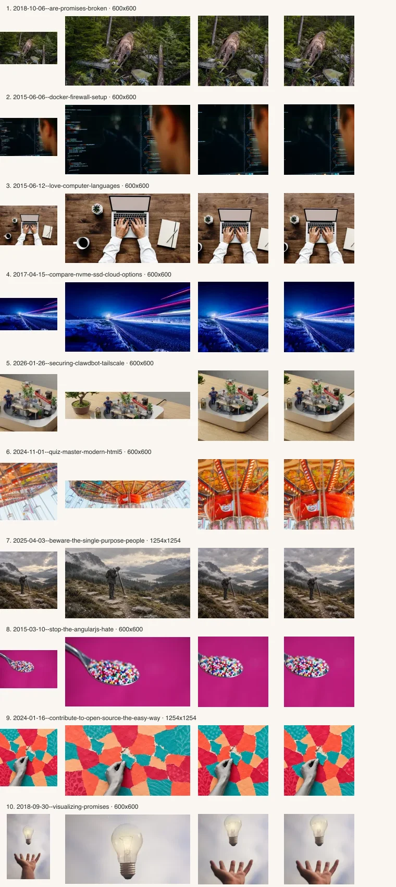
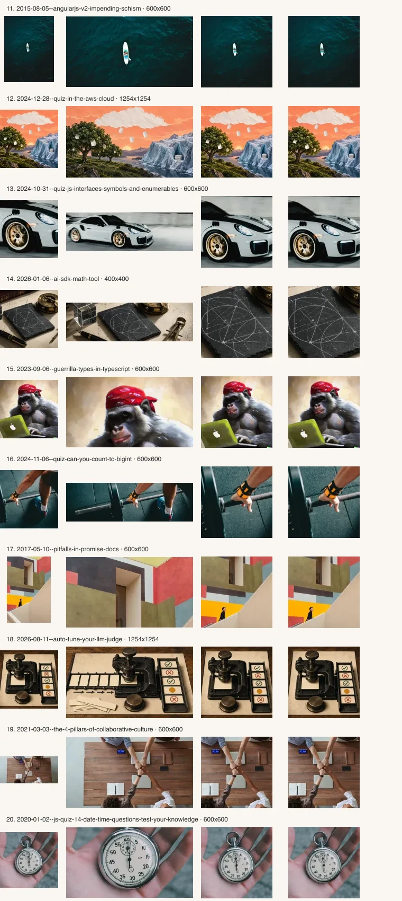
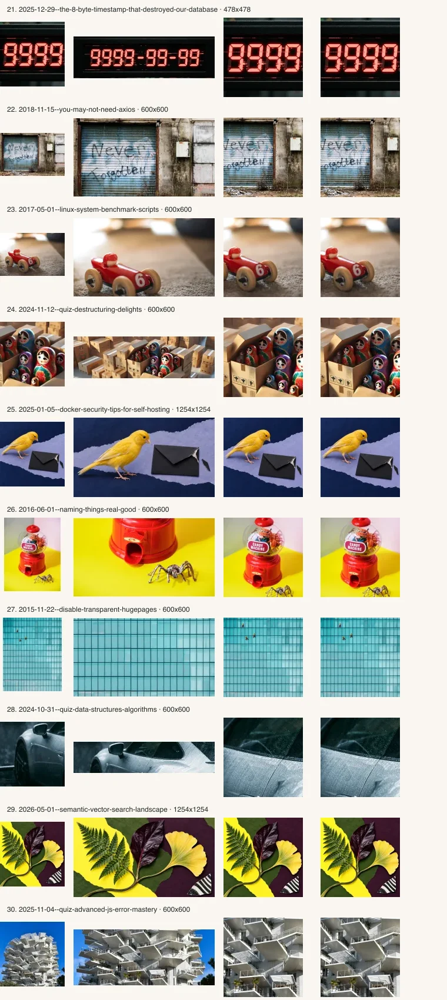
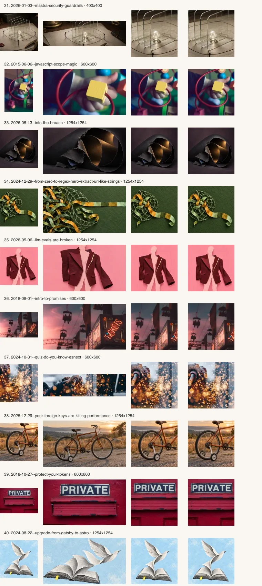
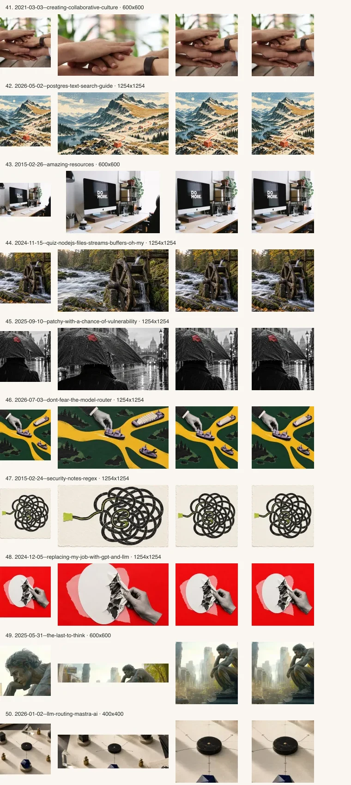
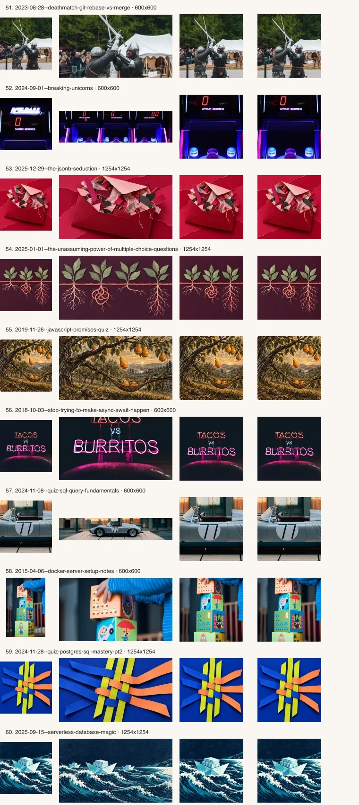
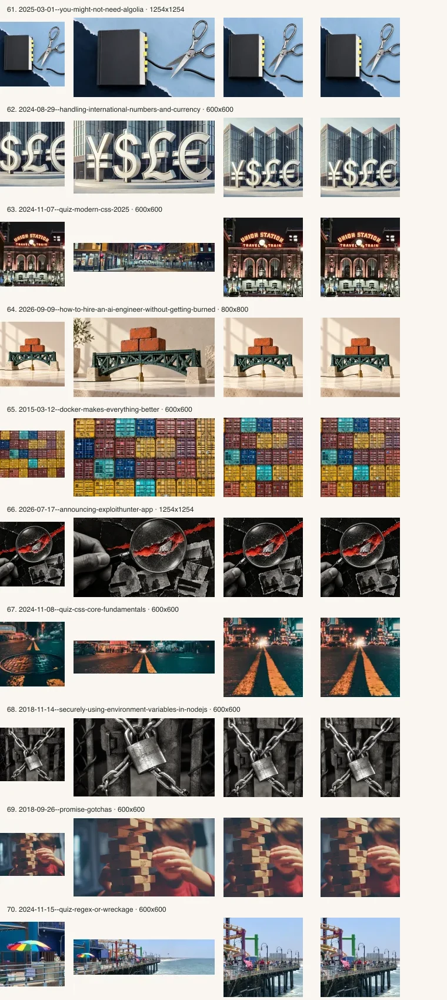
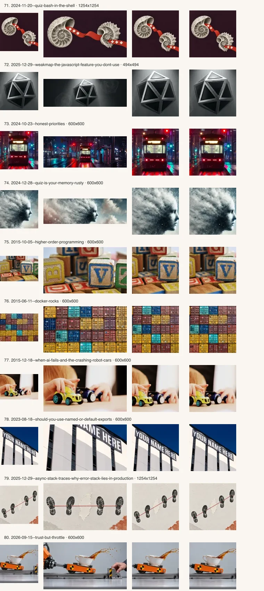
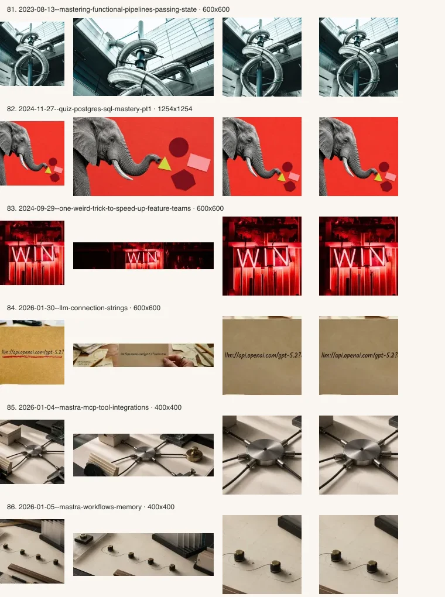

# Complete responsive hero formats

80 published articles have a landscape hero, a square of at least 400px, and a separate 200px search icon. Original artwork is preserved. No raster sources were enlarged.

73 published squares are 600px or larger. 7 retain native 400–494px compositions rather than upscaling or switching artwork.

LLM connection strings keeps its original informative landscape hero on mobile and desktop. Its 600px square is available for previews. Two private drafts without assigned art remain unchanged: Less effort, please; Security Agents Need Model Routers, Not Model Rankings.

## Crop review

Each strip shows the previous thumbnail, wide format, square on ivory, and square on charcoal.

## Asset inventory

| Article | Wide | Square | Mobile hero |
| --- | --- | --- | --- |
| are-promises-broken | [1280x711](../../src/content/posts/2018-10-06--are-promises-broken/hero-responsive-wide.webp) | [600x600](../../src/content/posts/2018-10-06--are-promises-broken/hero-responsive-square.webp) | Square |
| docker-firewall-setup | [1280x711](../../src/content/posts/2015-06-06--docker-firewall-setup/hero-responsive-wide.webp) | [600x600](../../src/content/posts/2015-06-06--docker-firewall-setup/hero-responsive-square.webp) | Square |
| love-computer-languages | [1280x711](../../src/content/posts/2015-06-12--love-computer-languages/hero-responsive-wide.webp) | [600x600](../../src/content/posts/2015-06-12--love-computer-languages/hero-responsive-square.webp) | Square |
| compare-nvme-ssd-cloud-options | [1280x711](../../src/content/posts/2017-04-15--compare-nvme-ssd-cloud-options/hero-responsive-wide.webp) | [600x600](../../src/content/posts/2017-04-15--compare-nvme-ssd-cloud-options/hero-responsive-square.webp) | Square |
| securing-clawdbot-tailscale | [5496x1195](../../src/content/posts/2026-01-26--securing-clawdbot-tailscale/hero_wide.webp) | [600x600](../../src/content/posts/2026-01-26--securing-clawdbot-tailscale/hero-responsive-square.webp) | Square |
| quiz-master-modern-html5 | [4200x923](../../src/content/posts/2024-11-01--quiz-master-modern-html5/jakob-owens-FBih1nqPi0w-unsplash-wide.webp) | [600x600](../../src/content/posts/2024-11-01--quiz-master-modern-html5/hero-responsive-square.webp) | Square |
| beware-the-single-purpose-people | [1600x900](../../src/content/posts/2025-04-03--beware-the-single-purpose-people/paper-editorial-v5-missing-the-whole-landscape.webp) | [1254x1254](../../src/content/posts/2025-04-03--beware-the-single-purpose-people/paper-editorial-v5-missing-the-whole-landscape-square.webp) | Square |
| stop-the-angularjs-hate | [1280x711](../../src/content/posts/2015-03-10--stop-the-angularjs-hate/hero-responsive-wide.webp) | [600x600](../../src/content/posts/2015-03-10--stop-the-angularjs-hate/hero-responsive-square.webp) | Square |
| contribute-to-open-source-the-easy-way | [1600x900](../../src/content/posts/2024-01-16--contribute-to-open-source-the-easy-way/paper-editorial-v4-share-the-repair.webp) | [1254x1254](../../src/content/posts/2024-01-16--contribute-to-open-source-the-easy-way/paper-editorial-v4-share-the-repair-square.webp) | Square |
| visualizing-promises | [853x474](../../src/content/posts/2018-09-30--visualizing-promises/hero-responsive-wide.webp) | [600x600](../../src/content/posts/2018-09-30--visualizing-promises/hero-responsive-square.webp) | Square |
| angularjs-v2-impending-schism | [959x533](../../src/content/posts/2015-08-05--angularjs-v2-impending-schism/hero-responsive-wide.webp) | [600x600](../../src/content/posts/2015-08-05--angularjs-v2-impending-schism/hero-responsive-square.webp) | Square |
| quiz-in-the-aws-cloud | [1600x900](../../src/content/posts/2024-12-28--quiz-in-the-aws-cloud/paper-editorial-v3-storage-climates.webp) | [1254x1254](../../src/content/posts/2024-12-28--quiz-in-the-aws-cloud/paper-editorial-v3-storage-climates-square.webp) | Square |
| quiz-js-interfaces-symbols-and-enumerables | [4200x1272](../../src/content/posts/2024-10-31--quiz-js-interfaces-symbols-and-enumerables/logan-weaver-lgnwvr-96ES9AOLRzQ-unsplash.webp) | [600x600](../../src/content/posts/2024-10-31--quiz-js-interfaces-symbols-and-enumerables/hero-responsive-square.webp) | Square |
| ai-sdk-math-tool | [1376x420](../../src/content/posts/2026-01-06--ai-sdk-math-tool/wide.webp) | [400x400](../../src/content/posts/2026-01-06--ai-sdk-math-tool/hero-responsive-square.webp) | Square |
| guerrilla-types-in-typescript | [1024x569](../../src/content/posts/2023-09-06--guerrilla-types-in-typescript/hero-responsive-wide.webp) | [600x600](../../src/content/posts/2023-09-06--guerrilla-types-in-typescript/hero-responsive-square.webp) | Square |
| quiz-can-you-count-to-bigint | [4200x1275](../../src/content/posts/2024-11-06--quiz-can-you-count-to-bigint/victor-freitas-hOuJYX2K5DA-unsplash-wide.webp) | [600x600](../../src/content/posts/2024-11-06--quiz-can-you-count-to-bigint/hero-responsive-square.webp) | Square |
| pitfalls-in-promise-docs | [853x474](../../src/content/posts/2017-05-10--pitfalls-in-promise-docs/hero-responsive-wide.webp) | [600x600](../../src/content/posts/2017-05-10--pitfalls-in-promise-docs/hero-responsive-square.webp) | Square |
| auto-tune-your-llm-judge | [1672x941](../../src/content/posts/2026-08-11--auto-tune-your-llm-judge/wide.webp) | [1254x1254](../../src/content/posts/2026-08-11--auto-tune-your-llm-judge/square.webp) | Square |
| the-4-pillars-of-collaborative-culture | [1600x889](../../src/content/posts/2021-03-03--the-4-pillars-of-collaborative-culture/hero-responsive-wide.webp) | [600x600](../../src/content/posts/2021-03-03--the-4-pillars-of-collaborative-culture/hero-responsive-square.webp) | Square |
| js-quiz-14-date-time-questions-test-your-knowledge | [1600x889](../../src/content/posts/2020-01-02--js-quiz-14-date-time-questions-test-your-knowledge/hero-responsive-wide.webp) | [600x600](../../src/content/posts/2020-01-02--js-quiz-14-date-time-questions-test-your-knowledge/hero-responsive-square.webp) | Square |
| the-8-byte-timestamp-that-destroyed-our-database | [1408x419](../../src/content/posts/2025-12-29--the-8-byte-timestamp-that-destroyed-our-database/wide.webp) | [478x478](../../src/content/posts/2025-12-29--the-8-byte-timestamp-that-destroyed-our-database/square.webp) | Square |
| you-may-not-need-axios | [1280x711](../../src/content/posts/2018-11-15--you-may-not-need-axios/hero-responsive-wide.webp) | [600x600](../../src/content/posts/2018-11-15--you-may-not-need-axios/hero-responsive-square.webp) | Square |
| linux-system-benchmark-scripts | [1280x711](../../src/content/posts/2017-05-01--linux-system-benchmark-scripts/hero-responsive-wide.webp) | [600x600](../../src/content/posts/2017-05-01--linux-system-benchmark-scripts/hero-responsive-square.webp) | Square |
| quiz-destructuring-delights | [4088x1205](../../src/content/posts/2024-11-12--quiz-destructuring-delights/boxes-of-nesting-dolls.webp) | [600x600](../../src/content/posts/2024-11-12--quiz-destructuring-delights/hero-responsive-square.webp) | Square |
| docker-security-tips-for-self-hosting | [1600x900](../../src/content/posts/2025-01-05--docker-security-tips-for-self-hosting/paper-editorial-v4-canary-notices.webp) | [1254x1254](../../src/content/posts/2025-01-05--docker-security-tips-for-self-hosting/paper-editorial-v4-canary-notices-square.webp) | Square |
| naming-things-real-good | [1600x889](../../src/content/posts/2016-06-01--naming-things-real-good/hero-responsive-wide.webp) | [600x600](../../src/content/posts/2016-06-01--naming-things-real-good/hero-responsive-square.webp) | Square |
| disable-transparent-hugepages | [1024x569](../../src/content/posts/2015-11-22--disable-transparent-hugepages/hero-responsive-wide.webp) | [600x600](../../src/content/posts/2015-11-22--disable-transparent-hugepages/hero-responsive-square.webp) | Square |
| quiz-data-structures-algorithms | [4200x932](../../src/content/posts/2024-10-31--quiz-data-structures-algorithms/redcharlie-mugDbuNnbd0-unsplash-wide.webp) | [600x600](../../src/content/posts/2024-10-31--quiz-data-structures-algorithms/hero-responsive-square.webp) | Square |
| semantic-vector-search-landscape | [1600x900](../../src/content/posts/2026-05-01--semantic-vector-search-landscape/paper-atelier-hero-v2-botanical.webp) | [1254x1254](../../src/content/posts/2026-05-01--semantic-vector-search-landscape/paper-atelier-hero-v2-botanical-square.webp) | Square |
| quiz-advanced-js-error-mastery | [3656x1440](../../src/content/posts/2025-11-04--quiz-advanced-js-error-mastery/ahmed-slimene-c09hZthLq_s-unsplash-wide.webp) | [600x600](../../src/content/posts/2025-11-04--quiz-advanced-js-error-mastery/hero-responsive-square.webp) | Square |
| mastra-security-guardrails | [1376x420](../../src/content/posts/2026-01-03--mastra-security-guardrails/wide.webp) | [400x400](../../src/content/posts/2026-01-03--mastra-security-guardrails/hero-responsive-square.webp) | Square |
| javascript-scope-magic | [853x474](../../src/content/posts/2015-06-06--javascript-scope-magic/hero-responsive-wide.webp) | [600x600](../../src/content/posts/2015-06-06--javascript-scope-magic/hero-responsive-square.webp) | Square |
| into-the-breach | [1600x900](../../src/content/posts/2026-05-13--into-the-breach/paper-atelier-hero-v2.webp) | [1254x1254](../../src/content/posts/2026-05-13--into-the-breach/paper-atelier-hero-v2-square.webp) | Square |
| from-zero-to-regex-hero-extract-url-like-strings | [1600x900](../../src/content/posts/2024-12-29--from-zero-to-regex-hero-extract-url-like-strings/paper-editorial-v3-ribbon-capture.webp) | [1254x1254](../../src/content/posts/2024-12-29--from-zero-to-regex-hero-extract-url-like-strings/paper-editorial-v3-ribbon-capture-square.webp) | Square |
| llm-evals-are-broken | [1600x900](../../src/content/posts/2026-05-06--llm-evals-are-broken/paper-editorial-tuxedo-v2.webp) | [1254x1254](../../src/content/posts/2026-05-06--llm-evals-are-broken/paper-editorial-tuxedo-v2-square.webp) | Square |
| intro-to-promises | [1280x711](../../src/content/posts/2018-08-01--intro-to-promises/hero-responsive-wide.webp) | [600x600](../../src/content/posts/2018-08-01--intro-to-promises/hero-responsive-square.webp) | Square |
| quiz-do-you-know-esnext | [4200x1136](../../src/content/posts/2024-10-31--quiz-do-you-know-esnext/christopher-burns-8KfCR12oeUM-unsplash-wide.webp) | [600x600](../../src/content/posts/2024-10-31--quiz-do-you-know-esnext/hero-responsive-square.webp) | Square |
| your-foreign-keys-are-killing-performance | [1600x900](../../src/content/posts/2025-12-29--your-foreign-keys-are-killing-performance/paper-editorial-v5-protection-has-a-cost.webp) | [1254x1254](../../src/content/posts/2025-12-29--your-foreign-keys-are-killing-performance/paper-editorial-v5-protection-has-a-cost-square.webp) | Square |
| protect-your-tokens | [1280x711](../../src/content/posts/2018-10-27--protect-your-tokens/hero-responsive-wide.webp) | [600x600](../../src/content/posts/2018-10-27--protect-your-tokens/hero-responsive-square.webp) | Square |
| upgrade-from-gatsby-to-astro | [1600x900](../../src/content/posts/2024-08-22--upgrade-from-gatsby-to-astro/paper-editorial-v3-archive-takes-flight.webp) | [1254x1254](../../src/content/posts/2024-08-22--upgrade-from-gatsby-to-astro/paper-editorial-v3-archive-takes-flight-square.webp) | Square |
| creating-collaborative-culture | [1071x595](../../src/content/posts/2021-03-03--creating-collaborative-culture/hero-responsive-wide.webp) | [600x600](../../src/content/posts/2021-03-03--creating-collaborative-culture/hero-responsive-square.webp) | Square |
| postgres-text-search-guide | [1600x900](../../src/content/posts/2026-05-02--postgres-text-search-guide/paper-editorial-v5-retrieval-landscape.webp) | [1254x1254](../../src/content/posts/2026-05-02--postgres-text-search-guide/paper-editorial-v5-retrieval-landscape-square.webp) | Square |
| amazing-resources | [1280x853](../../src/content/posts/2015-02-26--amazing-resources/carl-heyerdahl-181868-unsplash.webp) | [600x600](../../src/content/posts/2015-02-26--amazing-resources/hero-responsive-square.webp) | Square |
| quiz-nodejs-files-streams-buffers-oh-my | [1600x900](../../src/content/posts/2024-11-15--quiz-nodejs-files-streams-buffers-oh-my/paper-editorial-v5-river-portions.webp) | [1254x1254](../../src/content/posts/2024-11-15--quiz-nodejs-files-streams-buffers-oh-my/paper-editorial-v5-river-portions-square.webp) | Square |
| patchy-with-a-chance-of-vulnerability | [1600x900](../../src/content/posts/2025-09-10--patchy-with-a-chance-of-vulnerability/paper-editorial-v5-rain-is-still-getting-in.webp) | [1254x1254](../../src/content/posts/2025-09-10--patchy-with-a-chance-of-vulnerability/paper-editorial-v5-rain-is-still-getting-in-square.webp) | Square |
| dont-fear-the-model-router | [1600x900](../../src/content/posts/2026-07-03--dont-fear-the-model-router/paper-editorial-harbour-v2.webp) | [1254x1254](../../src/content/posts/2026-07-03--dont-fear-the-model-router/paper-editorial-harbour-v2-square.webp) | Square |
| security-notes-regex | [1600x900](../../src/content/posts/2015-02-24--security-notes-regex/paper-editorial-v4-backtracking-labyrinth.webp) | [1254x1254](../../src/content/posts/2015-02-24--security-notes-regex/paper-editorial-v4-backtracking-labyrinth-square.webp) | Square |
| replacing-my-job-with-gpt-and-llm | [1600x900](../../src/content/posts/2024-12-05--replacing-my-job-with-gpt-and-llm/paper-editorial-v3-friction-and-judgment.webp) | [1254x1254](../../src/content/posts/2024-12-05--replacing-my-job-with-gpt-and-llm/paper-editorial-v3-friction-and-judgment-square.webp) | Square |
| the-last-to-think | [2912x500](../../src/content/posts/2025-05-31--the-last-to-think/banner-thinking-decay-wide.webp) | [600x600](../../src/content/posts/2025-05-31--the-last-to-think/hero-responsive-square.webp) | Square |
| llm-routing-mastra-ai | [1376x420](../../src/content/posts/2026-01-02--llm-routing-mastra-ai/wide.webp) | [400x400](../../src/content/posts/2026-01-02--llm-routing-mastra-ai/hero-responsive-square.webp) | Square |
| deathmatch-git-rebase-vs-merge | [900x500](../../src/content/posts/2023-08-28--deathmatch-git-rebase-vs-merge/hero-responsive-wide.webp) | [600x600](../../src/content/posts/2023-08-28--deathmatch-git-rebase-vs-merge/hero-responsive-square.webp) | Square |
| breaking-unicorns | [3808x1068](../../src/content/posts/2024-09-01--breaking-unicorns/your-score-zero.webp) | [600x600](../../src/content/posts/2024-09-01--breaking-unicorns/hero-responsive-square.webp) | Square |
| the-jsonb-seduction | [1600x900](../../src/content/posts/2025-12-29--the-jsonb-seduction/paper-editorial-v3-overflowing-envelope.webp) | [1254x1254](../../src/content/posts/2025-12-29--the-jsonb-seduction/paper-editorial-v3-overflowing-envelope-square.webp) | Square |
| the-unassuming-power-of-multiple-choice-questions | [1600x900](../../src/content/posts/2025-01-01--the-unassuming-power-of-multiple-choice-questions/paper-editorial-v3-hidden-roots.webp) | [1254x1254](../../src/content/posts/2025-01-01--the-unassuming-power-of-multiple-choice-questions/paper-editorial-v3-hidden-roots-square.webp) | Square |
| javascript-promises-quiz | [1600x900](../../src/content/posts/2019-11-26--javascript-promises-quiz/paper-editorial-v5-orchard-recovery.webp) | [1254x1254](../../src/content/posts/2019-11-26--javascript-promises-quiz/paper-editorial-v5-orchard-recovery-square.webp) | Square |
| stop-trying-to-make-async-await-happen | [1280x711](../../src/content/posts/2018-10-03--stop-trying-to-make-async-await-happen/hero-responsive-wide.webp) | [600x600](../../src/content/posts/2018-10-03--stop-trying-to-make-async-await-happen/hero-responsive-square.webp) | Square |
| quiz-sql-query-fundamentals | [3406x653](../../src/content/posts/2024-11-08--quiz-sql-query-fundamentals/peter-thomas-os14nsuXdI4-unsplash-wide.webp) | [600x600](../../src/content/posts/2024-11-08--quiz-sql-query-fundamentals/peter-thomas-os14nsuXdI4-unsplash-square.webp) | Square |
| docker-server-setup-notes | [853x474](../../src/content/posts/2015-04-06--docker-server-setup-notes/hero-responsive-wide.webp) | [600x600](../../src/content/posts/2015-04-06--docker-server-setup-notes/hero-responsive-square.webp) | Square |
| quiz-postgres-sql-mastery-pt2 | [1600x900](../../src/content/posts/2024-11-28--quiz-postgres-sql-mastery-pt2/paper-editorial-v3-relational-weave.webp) | [1254x1254](../../src/content/posts/2024-11-28--quiz-postgres-sql-mastery-pt2/paper-editorial-v3-relational-weave-square.webp) | Square |
| serverless-database-magic | [1600x900](../../src/content/posts/2025-09-15--serverless-database-magic/paper-editorial-v3-files-on-the-tide.webp) | [1254x1254](../../src/content/posts/2025-09-15--serverless-database-magic/paper-editorial-v3-files-on-the-tide-square.webp) | Square |
| you-might-not-need-algolia | [1600x900](../../src/content/posts/2025-03-01--you-might-not-need-algolia/paper-editorial-v3-one-fewer-tether.webp) | [1254x1254](../../src/content/posts/2025-03-01--you-might-not-need-algolia/paper-editorial-v3-one-fewer-tether-square.webp) | Square |
| handling-international-numbers-and-currency | [1024x531](../../src/content/posts/2024-08-29--handling-international-numbers-and-currency/currency-banner-wide.webp) | [600x600](../../src/content/posts/2024-08-29--handling-international-numbers-and-currency/hero-responsive-square.webp) | Square |
| quiz-modern-css-2025 | [4021x825](../../src/content/posts/2024-11-07--quiz-modern-css-2025/dan-levy-downtown-denver-at-night-wide.webp) | [600x600](../../src/content/posts/2024-11-07--quiz-modern-css-2025/hero-responsive-square.webp) | Square |
| how-to-hire-an-ai-engineer-without-getting-burned | [1600x900](../../src/content/posts/2026-09-09--how-to-hire-an-ai-engineer-without-getting-burned/wide.webp) | [800x800](../../src/content/posts/2026-09-09--how-to-hire-an-ai-engineer-without-getting-burned/square.webp) | Square |
| docker-makes-everything-better | [1280x711](../../src/content/posts/2015-03-12--docker-makes-everything-better/hero-responsive-wide.webp) | [600x600](../../src/content/posts/2015-03-12--docker-makes-everything-better/hero-responsive-square.webp) | Square |
| announcing-exploithunter-app | [1600x900](../../src/content/posts/2026-07-17--announcing-exploithunter-app/paper-atelier-hero-v3-investigative.webp) | [1254x1254](../../src/content/posts/2026-07-17--announcing-exploithunter-app/paper-atelier-hero-v3-investigative-square.webp) | Square |
| quiz-css-core-fundamentals | [4200x976](../../src/content/posts/2024-11-08--quiz-css-core-fundamentals/yeshi-kangrang-Qq7A85iCzhQ-unsplash-wide.webp) | [600x600](../../src/content/posts/2024-11-08--quiz-css-core-fundamentals/hero-responsive-square.webp) | Square |
| securely-using-environment-variables-in-nodejs | [853x474](../../src/content/posts/2018-11-14--securely-using-environment-variables-in-nodejs/hero-responsive-wide.webp) | [600x600](../../src/content/posts/2018-11-14--securely-using-environment-variables-in-nodejs/hero-responsive-square.webp) | Square |
| promise-gotchas | [1280x711](../../src/content/posts/2018-09-26--promise-gotchas/hero-responsive-wide.webp) | [600x600](../../src/content/posts/2018-09-26--promise-gotchas/hero-responsive-square.webp) | Square |
| quiz-regex-or-wreckage | [4200x1045](../../src/content/posts/2024-11-15--quiz-regex-or-wreckage/dan-lounsbury-uHZ2-nzYuIs-unsplash-wide.webp) | [600x600](../../src/content/posts/2024-11-15--quiz-regex-or-wreckage/hero-responsive-square.webp) | Square |
| quiz-bash-in-the-shell | [1600x900](../../src/content/posts/2024-11-20--quiz-bash-in-the-shell/paper-editorial-v3-shell-pipeline.webp) | [1254x1254](../../src/content/posts/2024-11-20--quiz-bash-in-the-shell/paper-editorial-v3-shell-pipeline-square.webp) | Square |
| weakmap-the-javascript-feature-you-dont-use | [1408x468](../../src/content/posts/2025-12-29--weakmap-the-javascript-feature-you-dont-use/wide.webp) | [494x494](../../src/content/posts/2025-12-29--weakmap-the-javascript-feature-you-dont-use/square.webp) | Square |
| honest-priorities | [4000x1496](../../src/content/posts/2024-10-23--honest-priorities/new-priority-city.webp) | [600x600](../../src/content/posts/2024-10-23--honest-priorities/hero-responsive-square.webp) | Square |
| quiz-is-your-memory-rusty | [3578x1094](../../src/content/posts/2024-12-28--quiz-is-your-memory-rusty/fade-to-clouds-wide.webp) | [600x600](../../src/content/posts/2024-12-28--quiz-is-your-memory-rusty/hero-responsive-square.webp) | Square |
| higher-order-programming | [1280x711](../../src/content/posts/2015-10-05--higher-order-programming/hero-responsive-wide.webp) | [600x600](../../src/content/posts/2015-10-05--higher-order-programming/hero-responsive-square.webp) | Square |
| docker-rocks | [1280x711](../../src/content/posts/2015-06-11--docker-rocks/hero-responsive-wide.webp) | [600x600](../../src/content/posts/2015-06-11--docker-rocks/hero-responsive-square.webp) | Square |
| when-ai-fails-and-the-crashing-robot-cars | [1280x711](../../src/content/posts/2015-12-18--when-ai-fails-and-the-crashing-robot-cars/hero-responsive-wide.webp) | [600x600](../../src/content/posts/2015-12-18--when-ai-fails-and-the-crashing-robot-cars/hero-responsive-square.webp) | Square |
| should-you-use-named-or-default-exports | [900x500](../../src/content/posts/2023-08-18--should-you-use-named-or-default-exports/hero-responsive-wide.webp) | [600x600](../../src/content/posts/2023-08-18--should-you-use-named-or-default-exports/hero-responsive-square.webp) | Square |
| async-stack-traces-why-error-stack-lies-in-production | [1600x900](../../src/content/posts/2025-12-29--async-stack-traces-why-error-stack-lies-in-production/paper-editorial-v4-context-crosses-the-gap.webp) | [1254x1254](../../src/content/posts/2025-12-29--async-stack-traces-why-error-stack-lies-in-production/paper-editorial-v4-context-crosses-the-gap-square.webp) | Square |
| trust-but-throttle | [1664x936](../../src/content/posts/2026-09-15--trust-but-throttle/wide.webp) | [600x600](../../src/content/posts/2026-09-15--trust-but-throttle/hero-responsive-square.webp) | Square |
| mastering-functional-pipelines-passing-state | [1200x667](../../src/content/posts/2023-08-13--mastering-functional-pipelines-passing-state/hero-responsive-wide.webp) | [600x600](../../src/content/posts/2023-08-13--mastering-functional-pipelines-passing-state/hero-responsive-square.webp) | Square |
| quiz-postgres-sql-mastery-pt1 | [1600x900](../../src/content/posts/2024-11-27--quiz-postgres-sql-mastery-pt1/paper-editorial-v3-type-impostor.webp) | [1254x1254](../../src/content/posts/2024-11-27--quiz-postgres-sql-mastery-pt1/paper-editorial-v3-type-impostor-square.webp) | Square |
| one-weird-trick-to-speed-up-feature-teams | [5760x1092](../../src/content/posts/2024-09-29--one-weird-trick-to-speed-up-feature-teams/wide_danny-howe-98KlbUsOO_w-unsplash.webp) | [600x600](../../src/content/posts/2024-09-29--one-weird-trick-to-speed-up-feature-teams/hero-responsive-square.webp) | Square |
| llm-connection-strings | [2812x472](../../src/content/posts/2026-01-30--llm-connection-strings/hero-wide.webp) | [600x600](../../src/content/posts/2026-01-30--llm-connection-strings/hero-responsive-square.webp) | Original wide |
| mastra-mcp-tool-integrations | [1376x420](../../src/content/posts/2026-01-04--mastra-mcp-tool-integrations/wide.webp) | [400x400](../../src/content/posts/2026-01-04--mastra-mcp-tool-integrations/hero-responsive-square.webp) | Square |
| mastra-workflows-memory | [1376x420](../../src/content/posts/2026-01-05--mastra-workflows-memory/wide.webp) | [400x400](../../src/content/posts/2026-01-05--mastra-workflows-memory/hero-responsive-square.webp) | Square |
