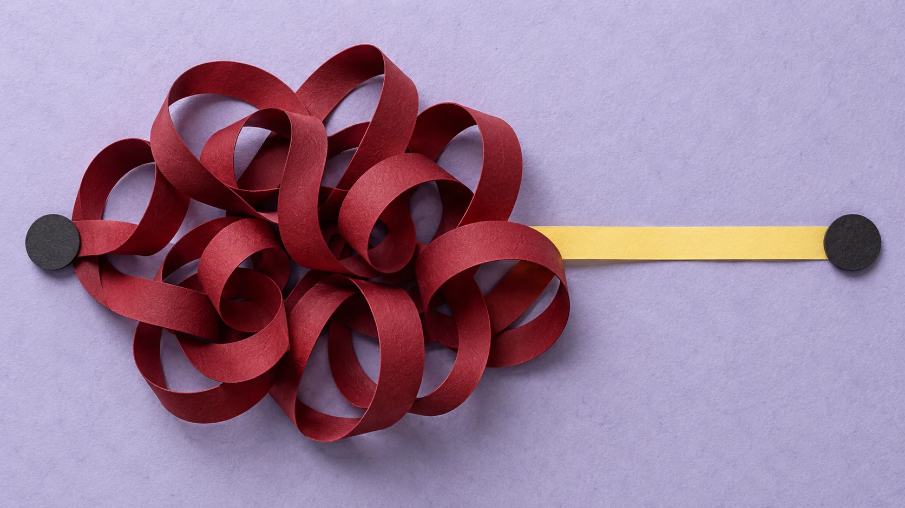
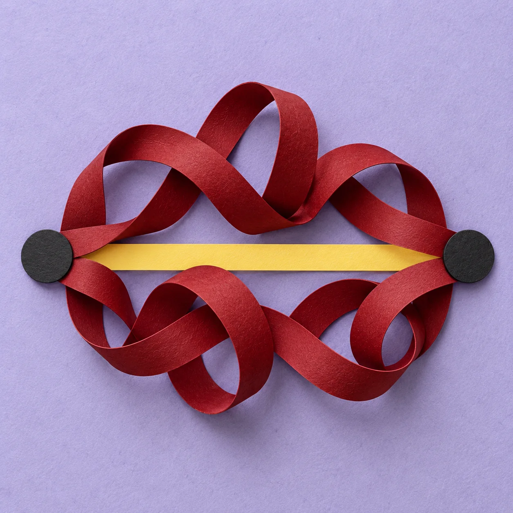
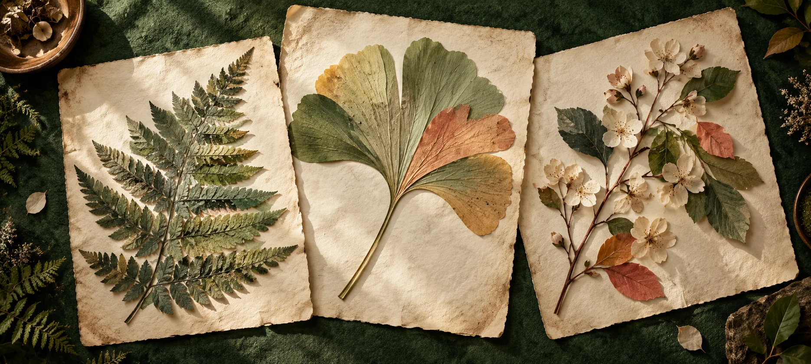
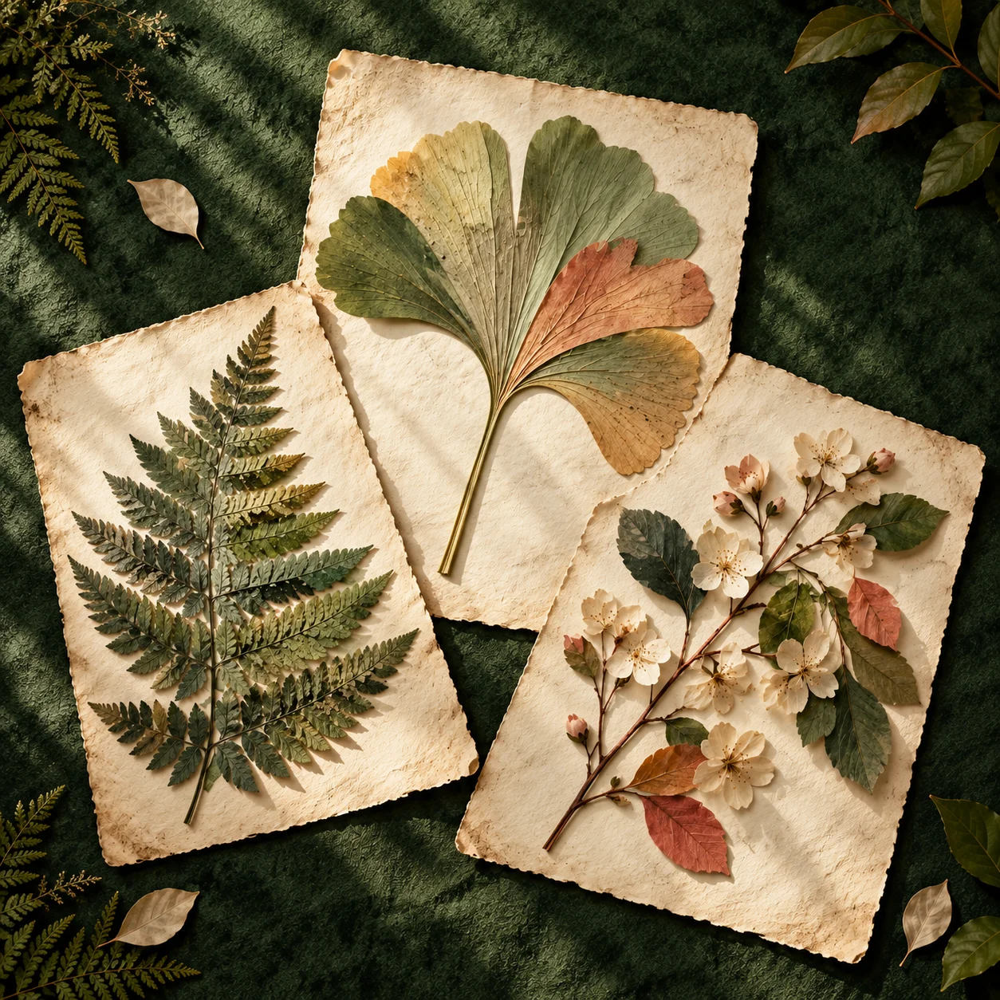

# Artwork for private drafts

Generated with the built-in image generator. Squares are freshly recomposed from their wide references, not cropped. Native pixels were preserved; no upscaling. The articles retain `draft: true`, `hidden: true`, `unlisted: true`, and `publish: false`.

| Article | Wide | Square |
| --- | --- | --- |
| Less effort, please |  |  |
| Security Agents Need Model Routers, Not Model Rankings |  |  |

## Art direction and prompts

### Less effort, please — External detour

Thesis: eliminating internal reasoning can relocate the effort into a costly external tool loop. Concrete mechanisms: reasoning knob, tool calls, retries, latency, cost. Tension: apparently less thinking can cost more overall. Considered metaphors: overflowing receipt spool; wandering footprints; looping versus direct paper routes. Selected the routes for their immediate small-size contrast and distinct lavender/oxblood palette.

Wide prompt: landscape editorial paper assemblage, 16:9, requested 2048×1152 native. A long oxblood folded ribbon makes a dense tangle of repeated loops while a short pale-yellow paper strip makes a direct crossing between charcoal paper endpoints. Pale cool lavender rag paper, uneven ink grain, front-on daylight, sharp cut edges and real interlayer shadows. Modern independent journal art, not a miniature machine. No thread, hands, gates, parcels, labels, words, arrows, numbers, charts, UI, logos, watermark or outer framing. Preserve the relationship within a shallow 2.25:1 crop.

Square prompt: freshly recompose the referenced wide image into 1:1, requested native 2048×2048. Preserve materials, palette and lighting. Both the looping red ribbon and the short horizontal yellow path connect the same two charcoal endpoints. Place endpoints inside the square; loops above and below the direct route. Fewer loops, bold thumbnail shapes, breathing room. No new props, words, labels, arrows or borders.

### Security agent model router — Complementary specimens

Thesis: route different work to complementary strengths and preserve evidence rather than choosing a universal champion. Concrete mechanisms: task families, evidence artifacts, quality/cost tradeoffs, verification. Tension: top score does not imply the best route for every task. Considered metaphors: tailored tools; mixed orchestral instruments; a preserved botanical specimen collection. Selected the herbarium to vary the batch away from machinery and transport diagrams.

Wide prompt: a contemporary paper herbarium photographed overhead on deep forest-green linen. Three radically different botanical silhouettes assembled from cut photographic textures and translucent hand-tinted paper: fern, broad ginkgo leaf, flowering twig. Each on a separate aged cream archival sheet, corners informally overlapping. Differences and careful preservation convey complementary strengths and evidence. Sage, moss, coral, cream; paper fibers, specimen shadows, upper-left sunlight. Bold readable forms. No writing, labels, tagged pins, words, diagrams, charts, numbers, fake metrics, logos, humans, thread, gates, robots, UI, border or mockup. Requested 16:9 native 2048×1152.

Square prompt: freshly recompose the referenced herbarium into 1:1, requested native 2048×2048. Three smaller archival sheets in a loose fan, each with one distinct whole specimen. Preserve green linen, cream stock, sage/moss/coral cut-paper botanicals and overhead sunlight. Simplify peripheral leaves and remove the bowl. Strong three-silhouette read at 200px. No writing, labels, numbers, pins, thread, logos, UI, border or mockup.

## Delivery

Actual native masters: effort wide 1672×941; router wide 1870×841; both squares 1254×1254. Each has a separate 200×200 WebP icon. Article layouts use the existing Astro build-time responsive picture/srcset pipeline. All ten router translations reference the shared image family. English sources include descriptive `cover_alt`; translated alt prose is left to the localization workflow.
