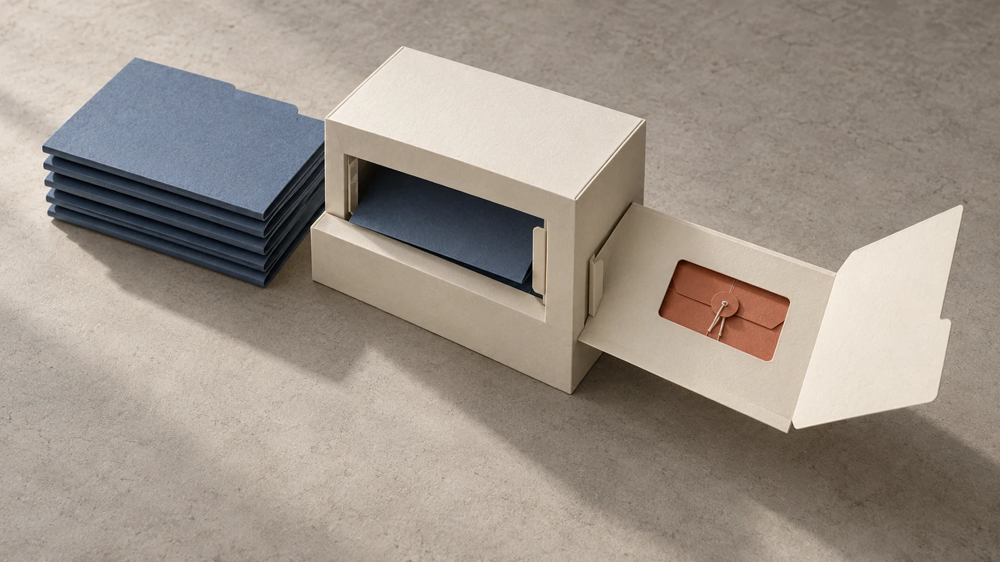
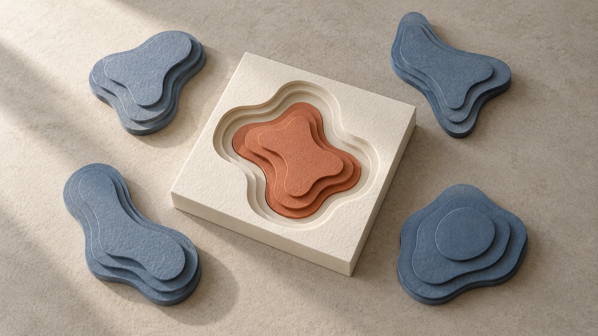
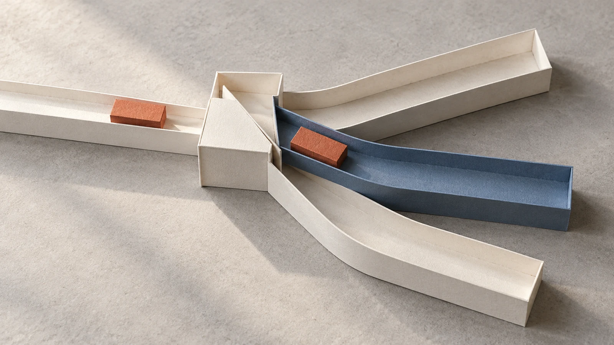
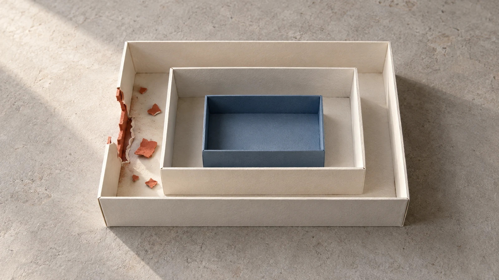
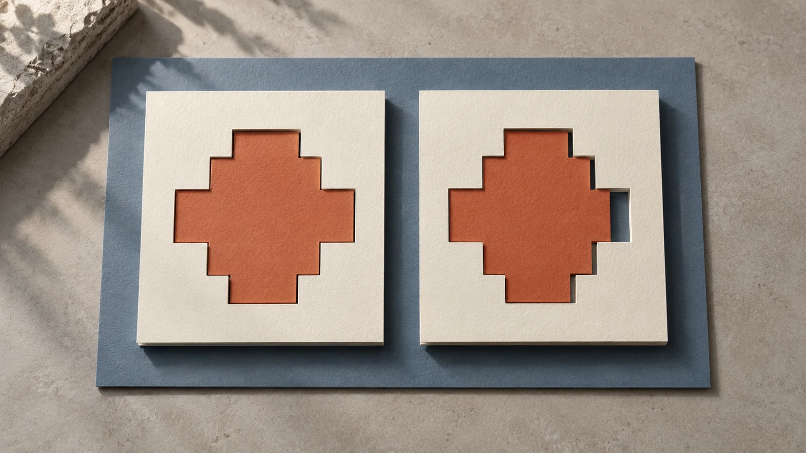
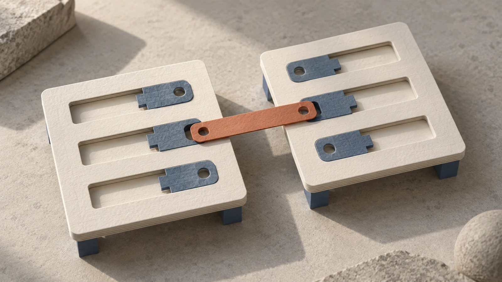
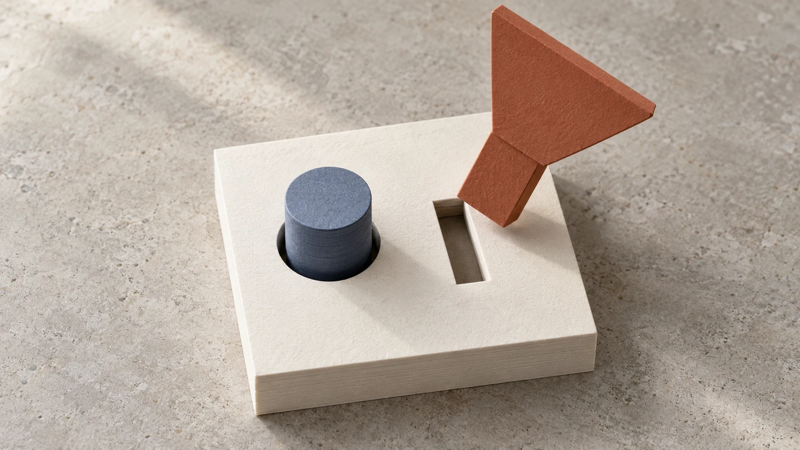

# Paper atelier hero proposals

Eight initial proposals in the selected paper aesthetic: ivory stock, slate blue, terracotta, precision cut edges, and natural daylight. Existing published covers are preserved until selection.

| 1. Announcing ExploitHunter.app | 2. Semantic Vector Search |
| --- | --- |
|  |  |
| **Evidence aperture** — Strong wide; evidence slip partly cropped at square right edge. Dedicated square advised before final promotion. | **Semantic fit** — Best natural square fit; one unmistakable central contour. |

| 3. Don't Fear the Model Router | 4. Into the Breach |
| --- | --- |
|  |  |
| **Routing gate** — Good central routing relationship; outer paths cropped but choice survives. | **Contained breach** — Strong compact containment; smaller paper fragments soften at 96px. |

| 5. Fight Evils with Evals! | 6. llm:// Connection Strings |
| --- | --- |
|  |  |
| **Shared reference** — Clear wide comparison; square crop loses part of left frame, and 96px regression notch is small. | **Portable connector** — Wide connection strong; square crops blocks, leaving connector as emblem. Dedicated square advised. |

| 7. Deep Postgres: Part 2 | 8. Deep Postgres: Part 1 |
| --- | --- |
|  |  |
| **Relational join** — Strong join metaphor, connection survives square and 96px. | **Constraint fit** — Use v2; v1 matched shape too neatly. v2 incompatible shoulder clearer; wide/shallow crop may clip top key, so use contain/recompose for final. |

The strongest compact compositions are semantic search, model routing, containment, and relational joins. ExploitHunter and connection strings need dedicated square compositions before final promotion.

[Full prompts and review notes](./manifest.json) · [HTML review gallery](./index.html)
