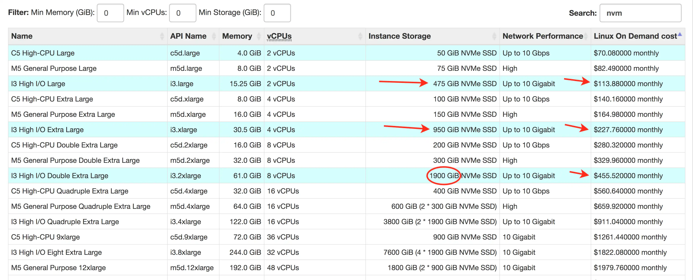

## क्लाउड प्रदर्शन में 70% तक की वृद्धि करें

> चुनिंदा होस्टिंग प्रदाताओं के लिए सामान्य नोट और अनुभाग (मध्य-2017)।

- [AWS (Amazon Web Services), EC2 (Elastic Compute Cloud), EBS (Elastic Block Storage), आदि](#aws_tips)
- [Digital Ocean](#do_tips)
- [Packet.net](#packet_tips)

### Amazon Web Services / EC2 / EBS / S3

> TLDR; जबकि AWS आमतौर पर प्रतिबंधात्मक हार्डवेयर और जटिल मूल्य निर्धारण टियर प्रदान करता है, **i3.large** (और बड़े) हार्डवेयर मूल्य बनाम I/O प्रदर्शन के मामले में सबसे कुशल है, और समग्र प्रदर्शन में सबसे तेज़ है।

> EC2 **i3.large** जिसमें **475GB NVMe SSD** है, इसकी लागत आमतौर पर लगभग **$110/माह** होती है! >  
> **1.9TB NVMe** वाले **i3.2xlarge** की लागत लगभग **$450/माह** होती है * >   > \_*USA/2018\_

 
 

### हेड टू हेड

\[[पूर्ण-स्क्रीन डेटा दृश्य](https://docs.google.com/spreadsheets/d/1qQ62m1RFj73YScdS77Q9R2GpRqJOk7JHuTEOFDR4jJE/pubchart?oid=116848524&format=interactive)\]

<iframe style="position: relative; left: -150px; height: 650px; width: 990px; min-width: 100%;" seamless frameborder="0" scrolling="no" src="https://docs.google.com/spreadsheets/d/1qQ62m1RFj73YScdS77Q9R2GpRqJOk7JHuTEOFDR4jJE/pubchart?oid=116848524&amp;format=interactive"></iframe>

[EC2 पर मूल्य देखें](https://www.ec2instances.info/?filter=nvm&region=us-east-2&cost_duration=monthly&selected=c5d.large,i3.large,i3.xlarge,i3.2xlarge)

ध्यान दें कि **i3.\*xlarge** ही एकमात्र हार्डवेयर है जिसमें प्रतिस्पर्धी मूल्य वाली NVMe स्टोरेज (अल्ट्रा-फास्ट +1GB/s गति) उपलब्ध है। मेरा पाया गया प्रमुख सीमित कारक वास्तविक नेटवर्क गति था। "10/Gb/s तक" की गति वाले सर्वर 1/Gb/s (60-80MB/s) के करीब पहुंचने के लिए संघर्ष करते थे।

नेटवर्क परीक्षणों में उसी उपलब्धता क्षेत्र में 9 अतिरिक्त इंस्टेंस का उपयोग किया गया। किसी भी त्रुटिपूर्ण डेटा बिंदु को मैंने 0 से बदल दिया। केवल 1-2 नमूने एकत्र किए गए थे, इसलिए अतिरिक्त परीक्षणों की आवश्यकता है।

\[[पूर्ण-स्क्रीन डेटा दृश्य](https://docs.google.com/spreadsheets/d/1qQ62m1RFj73YScdS77Q9R2GpRqJOk7JHuTEOFDR4jJE/pubchart?oid=13370750&format=interactive)\]

<iframe style="position: relative; left: -150px; height: 790px; width: 950px; min-width: 100%;" seamless frameborder="0" scrolling="no" src="https://docs.google.com/spreadsheets/d/1qQ62m1RFj73YScdS77Q9R2GpRqJOk7JHuTEOFDR4jJE/pubchart?oid=13370750&amp;format=interactive"></iframe>

#### क्रेडिट्स

- [ec2instances.info](https://www.ec2instances.info/?filter=nvm&region=us-east-2&cost_duration=monthly&selected=c5d.large,i3.large,i3.xlarge,i3.2xlarge)
