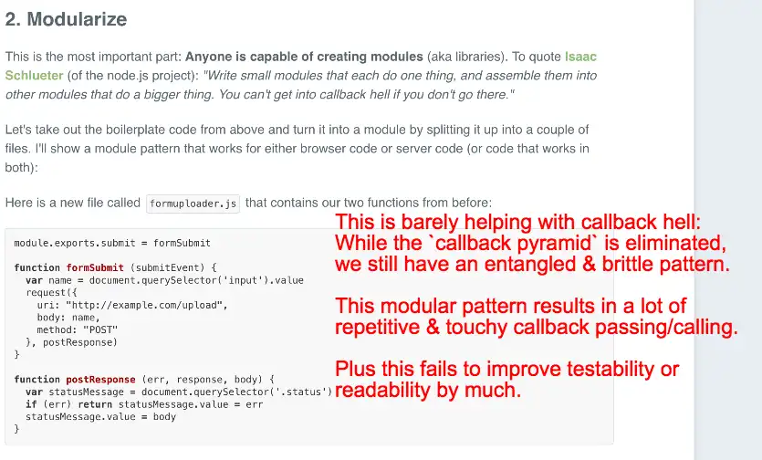
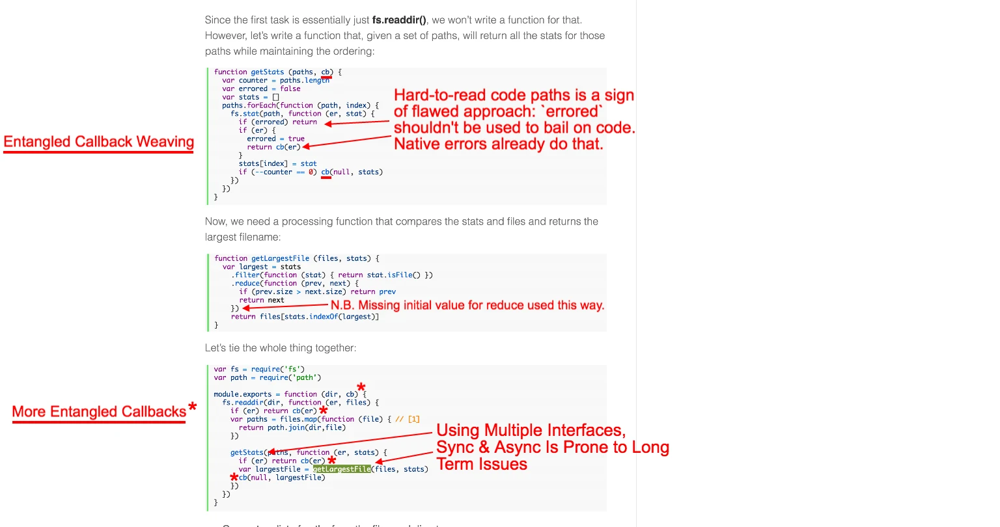
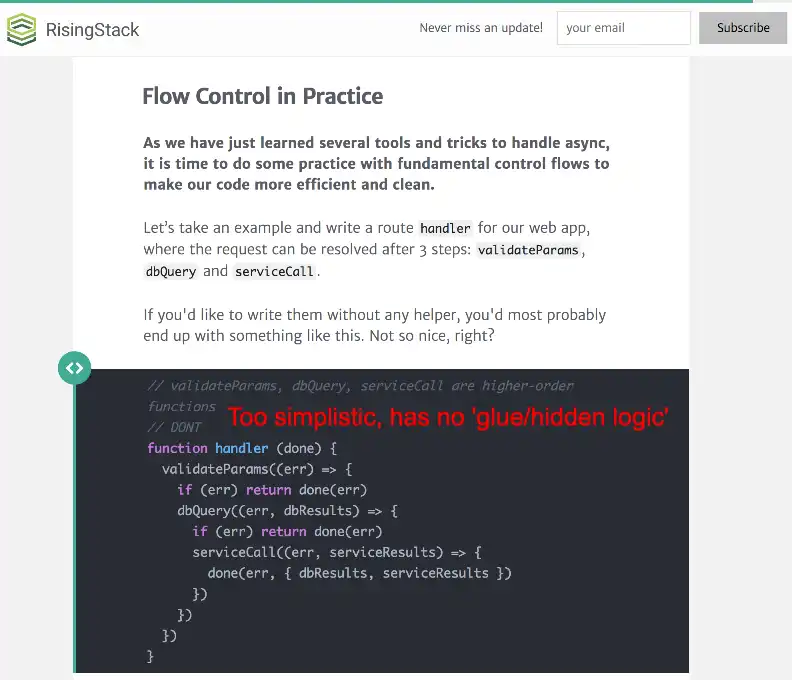
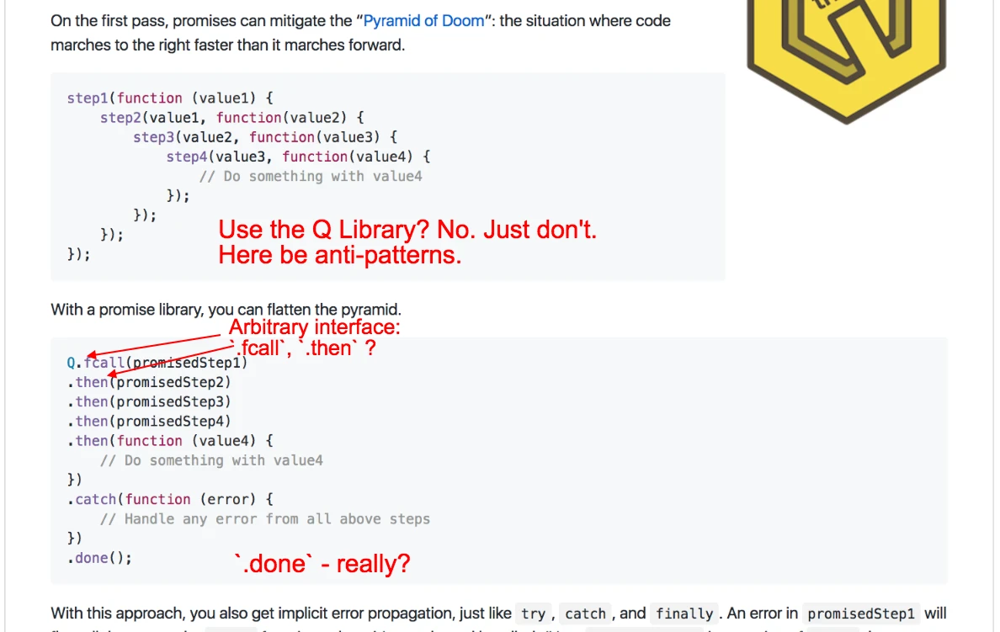
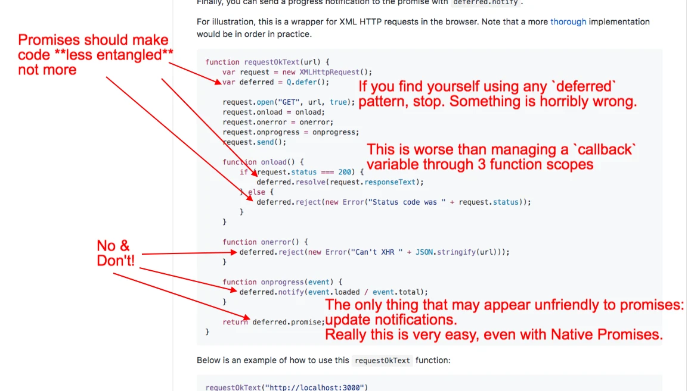

> Detectando anti-patrones de Promises en resultados de búsqueda de Google y bibliotecas populares.

Empecemos con una confesión: soy culpable de escribir los mismos "anti-patrones" que critico a continuación, como estoy seguro de que muchos desarrolladores de JS también lo son. Nada de lo que presento pretende ser personal ni dirigido a los autores originales. Solo estoy haciendo una revisión de código sobre patrones comunes; espero transmitir una comprensión de mis prioridades y procesos de pensamiento crítico.

> Con suerte, podrás identificar las señales de advertencia de las malas Promises después de asimilar este proyecto.

1. [CallbackHell.com](#callbackhellcom)
1. [StrongLoop](#strongloop)
1. [RisingStack](#risingstack)
1. [Q Library](#qlibrary)

--------------------------
### CallbackHell.com
> **CRÉDITO:** http://callbackhell.com/

----------------------
### StrongLoop
> **CRÉDITO:** `https://strongloop.com/strongblog/node-js-callback-hell-promises-generators/`

----------------
### RisingStack
> **CRÉDITO:** https://blog.risingstack.com/node-js-async-best-practices-avoiding-callback-hell-node-js-at-scale/
Este es un artículo bastante sólido. Solo tengo una observación:

------------------------
### Q Library
> **CRÉDITO:** https://github.com/kriskowal/q

La biblioteca Q es una de las más utilizadas y antiguas asociadas con "Promises". Por eso sufre de ejemplos envejecidos y su necesidad de mantener compatibilidad hacia atrás.
**Digo "asociada con 'Promises'" porque siento que Q realmente gira en torno al patrón `deferred`.**

Puede parecerse a las Promises, sin embargo insisto en que no lo es. Tiene una superficie demasiado grande por todas las razones equivocadas. Además, la convención de nombres abrevia inconsistentemente, lo que dificulta memorizar la interfaz. Métodos como `when` y `done` no son necesarios.

En resumen: el patrón `deferred` es un anti-patón doloroso; no mejora prácticamente nada respecto al enfoque típico de callbacks.

> Echa un vistazo a (y dale estrella a) el proyecto companion de GitHub de este artículo, [Escape From Callback Mountain](https://github.com/justsml/escape-from-callback-mountain)

> Objetivo del proyecto: investigar y desarrollar mejores patrones de lenguaje funcional en JavaScript.
