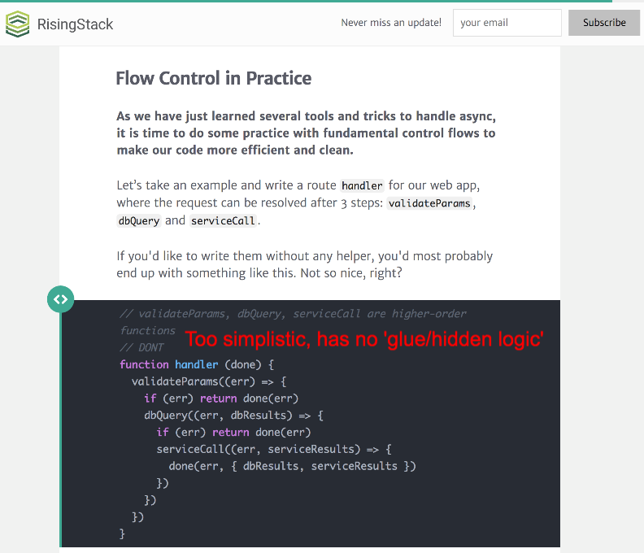

> Spotting Promise Anti-Patterns in google search results, and popular libraries.

Let me start with a confession: I'm guilty of writing the same 'anti-patterns' I criticize below, as I'm sure many JS developers are as well. Nothing I've laid out is meant to be personal or even directed at the original authors. I'm merely doing a code review on common patterns - I hope to pass along an understanding of my priorities & critical thinking processes.

> Hopefully you will be able to spot the warning signs of bad Promises after groking this project.

1. [CallbackHell.com](#callbackhellcom)
1. [StrongLoop](#strongloop)
1. [RisingStack](#risingstack)
1. [Q Library](#qlibrary)

--------------------------
### CallbackHell.com
> **CREDIT:** http://callbackhell.com/

----------------------
### StrongLoop
> **CREDIT:** https://strongloop.com/strongblog/node-js-callback-hell-promises-generators/

----------------
### RisingStack
> **CREDIT:** https://blog.risingstack.com/node-js-async-best-practices-avoiding-callback-hell-node-js-at-scale/
This is a pretty solid article. I only have 1 concern:

------------------------
### Q Library
> **CREDIT:** https://github.com/kriskowal/q

The Q library is one of the most used & oldest to be associated with "Promises." Hence it suffers from aging examples and it's need to maintain backwards compatibility.
**I say "associated with 'Promises'" since I feel Q is really about the `deferred` pattern.**

It may resemble Promises, however I insist it ain't. It has far too large a surface area for all the wrong reasons. Also the naming convention inconsistently abbreviates names, making it harder to memorize the interface. Methods like `when` and `done` are not necessary.

Bottom line: the `deferred` pattern is a painful anti-pattern - it improves virtually nothing over the typical callback approach.

> Please take a look at (& star) this article's companion Github project, [Escape From Callback Mountain](https://github.com/justsml/escape-from-callback-mountain)

> Project Goal: research & develop better functional language patterns in JavaScript.
