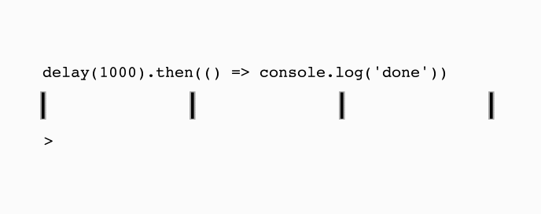
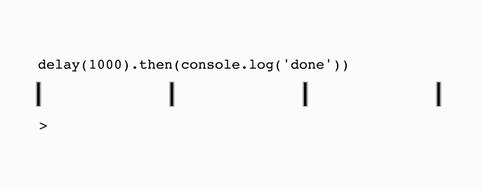
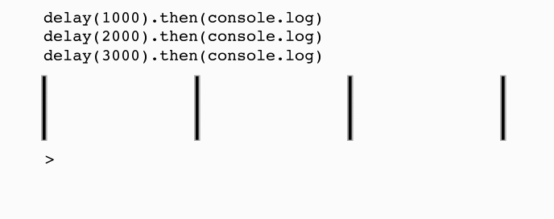
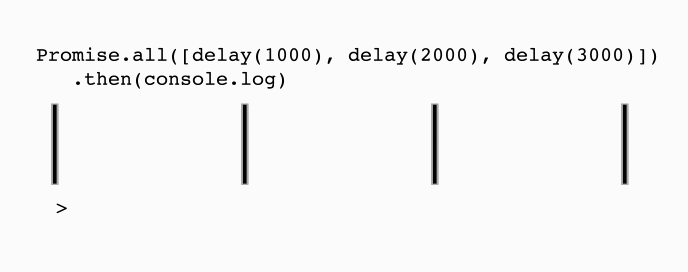

Para visualizar cómo se ejecutan las Promesas, definamos un nuevo método `delay(millisecs)`.

```js
function delay(millisecs) {
  return new Promise(resolve => {
    setTimeout(() => resolve(millisecs), millisecs);
  });
}
```

Este es un método utilitario que se resolverá una vez que haya pasado el timeout.

El delay en milisegundos se pasará al callback de `.then`.

Veamos 4 ejemplos (con líneas de tiempo animadas).

## Ejemplo #1/4

Esto muestra cómo la ejecución de `console.log()` será retrasada por `delay(msec)`.

```js
delay(1000).then(() => console.log("done"));
```



{/* ```
delay(1000) --------|.then(fn)
                    | console.log('done')
|-------------------|--------------------|--------------------|-----------------
0msec             1sec                 2sec                 3sec
``` */}

## Ejemplo #2/4

_Esto muestra un error común._

El `console.log` se dispara justo cuando **comienza** el `delay(1000)`. No **después** del delay como probablemente querías.

Como `console.log` retorna `undefined`, nuestro `.then()` se ignora silenciosamente.

Nota la diferencia entre `typeof console.log === 'function'` vs. `typeof console.log() === undefined`.

Generalmente el uso deseado para `console.log` se muestra en el Ejemplo #1. Asegúrate de pasar funciones a `.then` y `.catch`.

```js
delay(1000).then(console.log("done"));
```



{/* ```
delay(1000) --------|.then(null)
console.log('done')
|-------------------|--------------------|--------------------|-----------------
0msec             1sec                 2sec                 3sec
``` */}

## Ejemplo #3/4

3 Promesas se ejecutan simultáneamente.

```js
delay(1000).then(console.log);
delay(2000).then(console.log);
delay(3000).then(console.log);
```



{/* ```
delay(1000) ------|.then(console.log)
delay(2000) ------|--------------------|.then(console.log)
delay(3000) ------|--------------------|--------------------|.then(console.log)
|-----------------|--------------------|--------------------|-------------------
|                 |                    |                    |
0msec           1sec                 2sec                 3sec
``` */}

## Ejemplo #4/4

`Promise.all` con 3 Promesas `delay`. Se ejecutarán simultáneamente.

```js
Promise.all([delay(1000), delay(2000), delay(3000)]).then(console.log);
```



{/*
```
delay(1000) ---| [resolved]------------------v
delay(2000) ---|--------------| [resolved]---v
delay(3000) ---|--------------|--------------v [resolved]
Promise.all()  |--------------|-------------- > console.log([1000, 2000, 3000])
|--------------|--------------|--------------|--------------------------------
|              |              |              |
0msec        1sec           2sec           3sec
```
*/}

> Créditos:
>
> - Diagramas async animados por [Patrick Biffle](https://github.com/Piglacquer)
> - Inspiración para este artículo: https://pouchdb.com/2015/05/18/we-have-a-problem-with-promises.html

{/* <div class="challenge" title="Pregunta #1: Significado de la vida:">
  <ul class="options">
    <li>1</li>
    <li>2</li>
    <li class="answer">42</li>
    <li>3</li>
  </ul>
  <div class="description">¿Cuál es el significado de la vida?</div>
</div> */}
