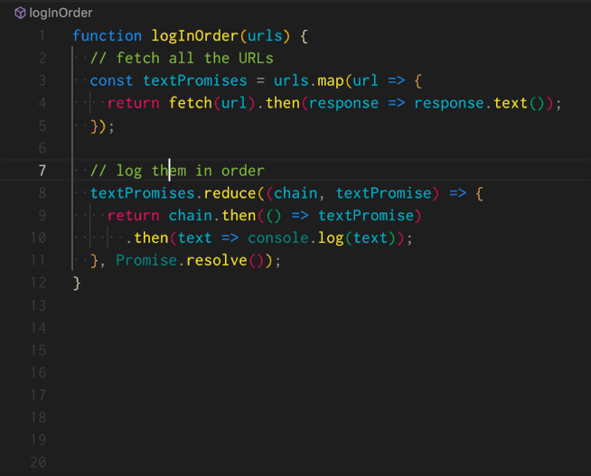
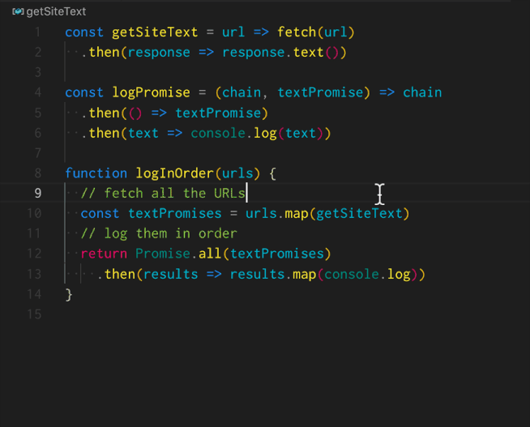

Seit Anbeginn der Zeit führen Entwickler viele alberne Streitereien. Vom klassischen „Tabs vs. Spaces" bis zur zeitlosen „Mac vs. PC"-Debatte – wir sind gut darin, ablenkende Argumente zu finden.
<br />
<small>_Antworten:_ Linux und Spaces.</small>

{/* We're going to look at 2 rules to improve your life with Promises. */}

## Der Kampf...?

### Promises vs. Async/Await!

Moment, ist das ein Kampf? Das muss doch ein Kampf sein, oder? Über Callbacks sprechen wir ja gar nicht mehr?

Nein, es ist kein Kampf. Letztlich ist es einfach ein weiteres potenzielles Werkzeug in deinem Werkzeugkasten. Weil `async`/`await` jedoch nicht die gesamte Promise-Funktionalität ersetzt (insbesondere `Promise.all`, `.race`) **ist es irreführend, es als Ersatz darzustellen.**

Es gibt viele einflussreiche Personen, die diesen Irrglauben fördern, `async`/`await` sei der Promise-[Ersatz](https://developers.google.com/web/fundamentals/primers/async-functions), auf den [alle](https://hackernoon.com/6-reasons-why-javascripts-async-await-blows-promises-away-tutorial-c7ec10518dd9) [gewartet](https://x.com/umaar/status/1045655069478334464) [haben](http://2ality.com/2017/08/promise-try.html#why-not-just-use-async-functions).

> **Hinweis: Nein, nope und noch nicht einmal ansatzweise.**


Eine kürzliche Ergänzung in VS Code treibt diese Voreingenommenheit voran. Wie [@umaar](https://x.com/umaar) tweetete:

<blockquote class="twitter-tweet" data-lang="en"><p lang="en" dir="ltr">Visual Studio Code can now convert your long chains of Promise.then()&#39;s into async/await! 🎊 Works very well in both JavaScript and TypeScript files. .catch() is also correctly converted to try/catch ✅ <a href="https://t.co/xb39Lsp84V">pic.x.com/xb39Lsp84V</a></p>&mdash; Umar Hansa (@umaar) <a href="https://x.com/umaar/status/1045655069478334464?ref_src=twsrc%5Etfw">September 28, 2018</a></blockquote>

{/* Sure, it's an impressive addition to an already amazing list of features. */}

Wenn du Promises hasst und diese Refactoring-Funktion willst, gebe ich dir keine Schuld.
<br />
_Ich empfinde mit. Ich verstehe._
<br />
Ich war dort. 🤗

<br />

Ich habe Promises früher gehasst. Heute bin ich komplett umgeschwenkt. **Promises sind großartig.** Sie können dich dazu befähigen/ermutigen, **Funktionskomposition auszunutzen.**

Es gibt 2 Bereiche, auf die ich mich zuerst zu konzentrieren empfehle, um deine Promise-Technik zu verbessern.

1. [Benannte Funktionen (keine anonymen)](#rule-1)
1. [Einzelziel-Funktionen](#rule-2)

<h2 id="rule-1">#1: Benannte Funktionen!</h2>

Töte deine anonymen Methoden. Die Verwendung **benannter Funktionen** macht, dass Code sich wie Poesie deiner Anforderungen liest.

Schauen wir uns ein gängiges Beispiel an:

Eine HTTP-GET-Anfrage mit `fetch` stellen:

{/* the fetch specification states [HTTP status codes](https://http.cat/) over 400 or 500 **do not automatically trigger an error.** The default in many AJAX libraries (jQuery, axios). */}

{/* Before we see the solution, look over a common "recommended" implementation: */}

### Anti-Pattern

```js
// ❌ Using anonymous inline functions 💩
fetch(url)
  .then(response => response.status < 400
    ? response
    : Promise.reject(new Error('Request Failed: ' + response.ststus)))
  .then(response => response.text())
```

### Lösung: Benannte Methoden

```js
// ✅ Clarity emerges: named functions
fetch(url)
  .then(checkResponse)
  .then(getText)


// Reusable general-purpose functions
function checkResponse(response) {
  return response.status < 400
    ? response
    : Promise.reject(new Error('Request Failed: ' + response.ststus))
}
function getText(response) {
  return response.text()
}
```

> Die Vorteile dieses Ansatzes werden immer offensichtlicher, je trockener dein Code wird.

**Zusätzliche Ressourcen:** Schau dir meine **1-Minuten-Videos** zu [basis Logging](https://youtu.be/xR_MZE1SIkk) und [fortgeschrittenem Debugging](https://youtu.be/P_tghqWj72M) mit dieser Technik an.

<h2 id="rule-2">#2: Einzelziel (Funktionen)</h2>

Es klingt _täuschend präzise_: Einzelziel.

Und doch ist es so subjektiv, willkürlich und sicher manchmal sogar bedeutungslos.

{/* Instead of arguing if a given function is sufficiently focused.

I came up with a rough measure for this: `Purpose Cost`. The higher the score, more likely it's doing too much.

```js
// 1 point: the return & ternary are effectively a one-liner
function checkResponse(response) {
  return response.status < 400
    ? response
    : Promise.reject(new Error('Request Failed: ' + response.ststus))
}
// 1 point: the return & expression are also effectively a one-liner
function getText(response) {
  return response.text()
}
```

Given a function's code, add 1 point for every line containing any of: `if`, `return`, ternary, `for`, `const`, `let`, `var`, `switch`, `while`, `[].map/filter/reduce/etc`. Add 1 point for each instruction (ignore extra lines from whitespace). A number of chained expressions or methods only count for 1 point.

Whew, that was a bit of jargon.
 */}

Interessanterweise berichten die meisten Entwickler, sie seien _verdammt gut_ darin, ihren Code auf **Einzelziel** zu trimmen. Nicht verwunderlich: Sie berichten auch, großartige Fahrer zu sein!

{/* This **isn't a unique issue with Promises**, array methods and all other HoF-based (Higher Order Function) APIs have the same ergonomics. */}

Schauen wir uns ein Beispiel an, das der (unglaublich talentierte) [Jake Archibald](https://x.com/jaffathecake) in seinem Async/Await-Artikel für die Google Developers-Seite vorstellt (Hinweis: 2024, Link entfernt).

{/*
Let's look at one of the so called "❌ Not recommended" Promise examples. (The description is "say we wanted to fetch a series URLs and log them as soon as possible, in the correct order.") */}

```js
// source: https://developers.google.com/web/fundamentals/primers/async-functions
function logInOrder(urls) {
  // fetch all the URLs
  const textPromises = urls.map(url => {
    return fetch(url).then(response => response.text());
  });

  // log them in order
  textPromises.reduce((chain, textPromise) => {
    return chain.then(() => textPromise)
      .then(text => console.log(text));
  }, Promise.resolve());
}
```

### Einzelziel?

Ich würde sagen: Nein. Was macht `logInOrder`?

1. Durch eine Liste von `urls` loopen
1. Auf sie einen Inline-HTTP-GET anwenden:
  1. HTTP `fetch`
  1. Response-Text-Body zurückgeben
1. Ein `.then(text => console.log(text))` nach jedem Promise in `textPromise` anhängen
  1. Ergebnisse seriell ausgeben

Es gibt 5 anonyme Methoden, die in dieser einzelnen Funktion definiert sind. Wie Jake sogar selbst anmerkt, ist das `.reduce` zu komplex. Es macht keinen Sinn, nuancierte Mechanismen überall im Code von Hand zu schreiben. Anders ausgedrückt: Wir schreiben keine DOM-Erstellungs-Code mit endlosen `document.createElement()`, `element.setAttribute()` usw. Stattdessen wählen wir das beste Werkzeug aus vielen Optionen: Hilfs-/Utility-Funktionen, Bibliotheken oder Frameworks.

{/* We need to isolate each 'step' that's going on: there's an HTTP request, a transform for a list of URLs into a list of results. Also a `console.log` is needed. */}

{/* > 🤔 Why do `Promises` cause developers to abandon practices we use elsewhere? */}

{/* **Note:** If the intention was to _initiate requests_ in a sequence, instead of merely printing the results out in order, this code doesn't actually do that. We'll refactor accordingly. */}


#### Lösung: Einzelziel-Funktionen

### Beginne mit dem **Extrahieren von Methoden**...



### Fahre fort, indem du das `.reduce()` und `logPromise()` durch ein `Promise.all` und ein `..map()` ersetzt...




### Zusammenfassung

Versuche, diese Techniken auf deinen eigenen Code anzuwenden! Dann [tweete mir](https://x.com/justsml) und lass mich wissen, wie es gelaufen ist. Oder wenn du Fragen oder Kommentare hast, melde dich ebenfalls!

Hilf mit, die #PromiseTruth zu verbreiten, und teile diesen Artikel. ❤️


#### Weiterführende Literatur

* [Daniel Brain](https://medium.com/@bluepnume/even-with-async-await-you-probably-still-need-promises-9b259854c161)
* [Eric Elliott](https://x.com/_ericelliott?lang=en)
