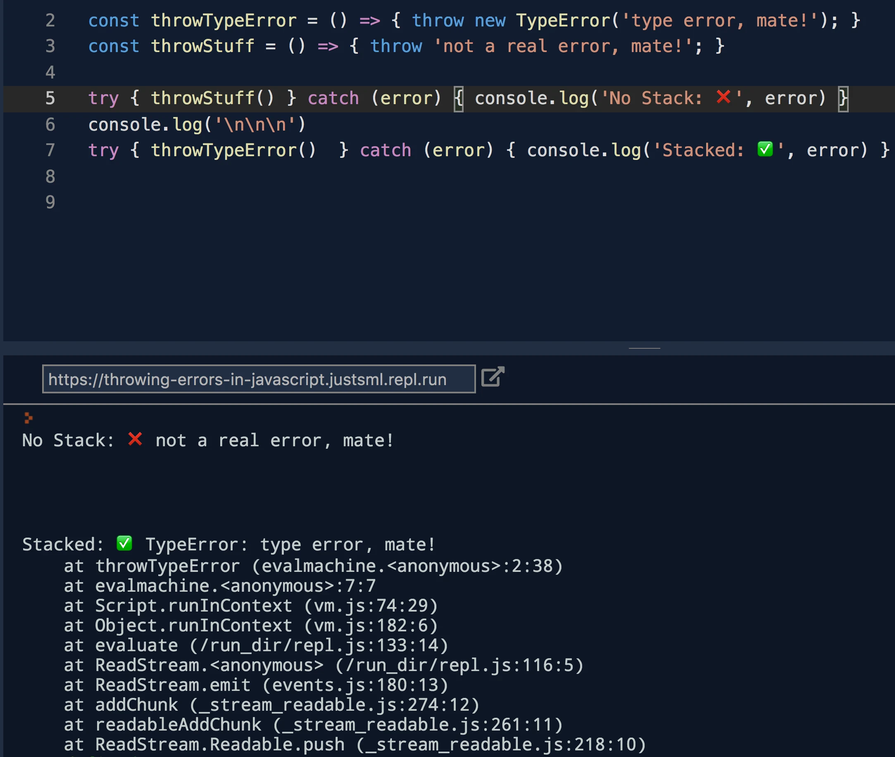

## JavaScriptのPromiseは壊れているのか？

### 昔々

Promiseに関する最も一般的な神話のひとつが、エラー処理の**所谓的な**欠点です。

**何年も前**、Promiseのエラー処理は実際にお粗末でした。**これを修正するために多くの作業が行われました。**

> そして見よ、**それは修正され**、**広く普及**したのです。

#### 人々は喜んだ

そして悲しいことに、一部の人々は気づきませんでした。

### 現代

その神話は今も残っており、至る所で目 にします：[Mediumの人気記事](https://hackernoon.com/6-reasons-why-javascripts-async-await-blows-promises-away-tutorial-c7ec10518dd9)、[DZone](#redacted)、そして[多くの](https://medium.com/@avaq/broken-promises-2ae92780f33)他の情報源で。

「公式」のリソースやドキュメントでさえ、主に[貧弱な例と悪い習慣](/promise-gotchas/)を提供しているのは認めましょう。これらはPromiseに対する否定的なケースを「証明」するためによく使われます。状況をさらに悪化させる「治療法」を提案するものさえあります。（注：リンクは削除済み）

{/* このようなヒントを何度か見たことがあります：`.catch`を一切使わず、代わりに`"unhandledRejection"`グローバルイベントを使うというもの。**絶対に**やってはいけません。unhandledRejectionは、差し迫ったシャットダウン前にデータベース接続のようなグローバル参照のクリーンアップのために設計されています。） */}

<br />
<br />

## トラブルを避けるためのルール

1. [Promiseは掴まるものが必要](#1-promises-need-something-to-hang-on-to)
    * 関数から**常に**`return`する。
1. [本物の`Error`インスタンスを使う](#2-use-real-error-instances)
    * **常に**`Error`インスタンスを使う。
1. [意味のある場所でエラーを処理する](#3-handle-errors-where-it-makes-sense)
    * 少なくとも一度は`.catch()`を**常に**使う。
1. [名前付き関数で明確さを加える 🦄✨](#4-add-clarity-with-named-functions-)
    * 名前付き関数を**推奨**する。

-------------------------------------------


#### #1 Promiseは掴まるものが必要

関数から**常に`return`する**ことは極めて重要です。

Promiseのコールバック関数は、`.then(callback)`や`.catch(callback)`において特定のパターンに従います。

返された値は次の`.then()`のコールバックに渡されます。

```js
function addTen(number) {
  return number + 10;
}

Promise.resolve(10)  // 10
  .then(addTen)      // 20
  .then(addTen)      // 30
  .then(addTen)      // 40
  .then(console.log) // "40" と出力
```

> 「常にreturnする」ボーナス：コードのユニットテストがはるかに容易になります。

**質問：** いくつの異なるPromise状態（resolvedとrejected）が作成されましたか？

**質問：** 前の例でいくつのPromiseが作成されましたか？

#### #2 本物の`Error`インスタンスを使う

JavaScriptにはエラーに関して興味深い動作があります（これは非同期**および**同期コードの両方に適用されます）。

<a href="https://repl.it/@justsml/throwing-errors-in-javascript" target="_blank">[<i>repl.itで例を見る: `throwing errors in javascript`</i>]</a>



**行番号やコールスタックに関する有用な詳細情報を取得するため**には、`Error`インスタンスを使う必要があります。文字列をthrowすることはPythonやRubyのように動作しません。

JavaScriptは`throw "string"`を処理できるように**見えます**が、`catch`ハンドラで文字列が表示されます。しかし、表示されるのはそのデータだけです*。以前の[スタックフレーム](https://en.wikipedia.org/wiki/Call_stack#Stack_and_frame_pointers)は含まれません。

正しい`new Error`の例：

```js
throw new Error('message')           // ✅
Promise.reject(new Error('message')) // ✅
throw Error('message')               // ✅
Promise.reject(Error('message'))     // ✅
```

以下は一般的なアンチパターンです：

```js
throw 'error message'  // ❌
Promise.reject(-42)    // ❌
```

<iframe height="400px" width="100%" src="https://repl.it/@justsml/throwing-errors-in-javascript?lite=true" scrolling="no" frameborder="no" allowtransparency="true" allowfullscreen="true" sandbox="allow-forms allow-pointer-lock allow-popups allow-same-origin allow-scripts allow-modals"></iframe>

#### #3 意味のある場所でエラーを処理する

Promiseは`.catch()`を使ったエレガントなエラー処理方法を提供します。これは基本的に特殊な`.then()`の一種で、先行する`.then()`からのエラーがここで処理されます。例を見てみましょう…

```js
Promise.resolve(42)
  .then(() => 'hello')
  .catch(() => console.log('will not get hit'))
  .then(() => throw new Error('totes fail'))
  .catch(() => console.log('WILL get hit'))
```

`.catch()`はDOMイベントハンドラ（例：`click`、`keypress`）のように見えるかもしれませんが、その配置が重要です。**自分より上**でthrowされたエラーしか「キャッチ」できないからです。

**エラーの上書きは比較的簡単**です。`.catch()`のコールバックで非エラー値を返すと、Promiseチェーンは`.then()`のコールバックを順に実行するモードに切り替わります。（実質的に。）

次の例のシーケンスを追ってみてください：

```js
Promise.resolve(42)
  .then(() => 'hello')
  .then(() => throw new Error('totes fail'))
  .catch(() => {
    return 99
  })
  .then(num => num + 1)
  .then(console.log) // 期待される出力: 100
```

**理解すべき重要なのはシーケンスです。**

これはばかげた例ですが、Promiseにおける**エラーとデータのフローを説明する**ために設計されています。

シーケンスの概要は以下の通りです：

1. 42が初期値。
1. 次のメソッドによって常に`hello`が返される。
1. 前の値を無視し、`'totes fail'`メッセージでエラーをthrowする。
1. `.catch()`がエラーをインターセプトし、代わりに`99`を返し、後続の`.then()`で処理される。
1. `num`をインクリメントして`100`を返す。
1. `console.log`メソッドが`100`を受け取り、出力する！ :tada:


**質問：** 2つの`.catch()`が連続している場合、何が起こりますか？2つ目が実行されることはありますか？ユースケースが思いつきますか？

**質問：** `.catch()`はどのようにしてエラーを無視できますか？`Promise.all`のエラーによる早期終了をどのように防げますか？


#### #4 名前付き関数で明確さを加える 🦄✨

次の2つの例の**可読性**を比較してください：

**無名関数：** ❌

```js
Promise.resolve(10)          // 10
  .then(x => x * 2)          // 20
  .then(x => x / 4)          // 5
  .then(x => x * x)          // 25
  .then(x => x.toFixed(2))   // "25.00"
  .then(x => console.log(x)) // 期待される出力: "25.00"
```


**名前付き関数：** ✅

```js
Promise.resolve(10) // 10
  .then(double)     // 20
  .then(quarter)    // 5
  .then(square)     // 25
  .then(format)     // "25.00"
  .then(log)        // 期待される出力: "25.00"

const double = x => x * 2
const quarter = x => x / 4
const square = x => x * x
const format = x => x.toFixed(2)
const log = x => console.log(x)

```

**ボーナス：** ✅

> 配列メソッド互換！！！

名前付き関数は`Array.prototype.`の仲間たちと再利用できます。`.map()`、`.filter()`、`.every()`、`.some()`、`.find()`を含む！

コレクションパイプライン #FTW：

```js
// まったく同じものだ :mindblown:

[10, 20]           // [ 10, 20 ]
  .map(double)     // [ 20, 40 ]
  .map(quarter)    // [ 5, 10 ]
  .map(square)     // [ 25, 100 ]
  .map(format)     // [ "25.00", "100.00" ]
  .map(log)        // 期待される出力: "25.00", "100.00" の2行

```

このリニアスタイルのコーディングをしたくない場合…シンプルな関数があります！

必要に応じて使えます：

```js
// ネストパターン
// ❌ ただし、これはやらないでください

const result = format(square(quarter(double(10))))

log(result)
// 期待される出力: "25.00"
```


**なぜ関数のネストがアンチパターンなのか？**

1. 多くの人にとって読みやすくない
2. git diffで誰が何を変更したかがすぐにわからない
3. ネストされた関数の途中からデバッグやログ出力が難しい
