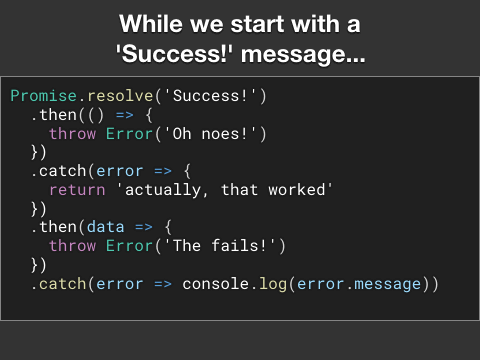

import Challenge from '../../../../components/QuizUI/Challenge';
import QuizUI from '../../../../components/QuizUI/QuizUI';


## Знаете ли вы JavaScript Promises?

> * **Докажите свои навыки JavaScript!** 🚀

1. **Проверьте подсказки** (Большая кнопка, нижний угол).
2. Попробуйте код в консоли браузера (попробуйте сочетание клавиш `F12` или найдите её) или используйте [repl.it](https://repl.it)*.
3. Пожалуйста, не стесняйтесь [написать мне в Твиттере @justsml](https://x.com/intent/tweet?text=Hey%20Dan%2C%20I%20was%20taking%20your%20promises%20quiz%2E%2E%2E&url=https://danlevy.net/). **Буду рад услышать ваши мысли!**

### 👇 Пройдите 9 вопросов ниже👇

<QuizUI>

<Challenge
  client:visible={{rootMargin: "150px"}}
  index={0}
  group="Обработка ошибок"
  title="Несколько `.catch` #1"
  options={[
    {text: 'вывести сообщение один раз'},
    {text: 'вывести сообщение дважды', isAnswer: true},
    {text: 'UnhandledPromiseRejectionWarning'},
    {text: 'процесс завершится'},
  ]}
>
  <slot name="question">
  <div className="question">
    Каким будет вывод следующего кода?
    ```js
    var p = new Promise((resolve, reject) => {
      reject(Error('The Fails!'))
    })
    p.catch(error => console.log(error.message))
    p.catch(error => console.log(error.message))
    ```
  </div>
  </slot>
  <slot name='explanation'>
  <div className="explanation">
    Мы создаём Promise с помощью конструктора, который сразу же вызывает ошибку через колбэк `reject`.

    Затем обработчики `.catch` работают как DOM-метод `.addEventListener(event, callback)` или Event Emitter'а `.on(event, callback)`, где **можно добавить несколько колбэков-обработчиков.** Каждый из них будет вызван с теми же аргументами.
  </div>
  </slot>
</Challenge>

<Challenge
  client:visible={{rootMargin: "150px"}}
  index={1}
  group="Обработка ошибок"
  title="Несколько `.catch` #2"
  options={[
    {text: 'вывести сообщение один раз'},
    {text: 'вывести сообщение дважды'},
    {text: 'необработанный отклонённый промис', isAnswer: true},
    {text: 'процесс завершается'},
  ]}
>
  <slot name="question">
  <div className="question">
    Каким будет вывод следующего кода?
    ```js
    var p = new Promise((resolve, reject) => {
      return Promise.reject(Error('The Fails!'))
    })
    p.catch(error => console.log(error.message))
    p.catch(error => console.log(error.message))
    ```
  </div>
  </slot>
  <slot name='explanation'>
  <div className="explanation">
    При использовании конструктора Promise вы должны вызвать один из колбэков `resolve()` или `reject()`. Конструктор Promise игнорирует возвращаемое значение исполнителя, поэтому дополнительный промис, созданный с помощью `Promise.reject()`, не привязывается к `p`. Два обработчика прикреплены к `p`, который остаётся в состоянии ожидания, в то время как возвращённый отклонённый промис сообщается как необработанный средой выполнения.
  </div>
  </slot>
</Challenge>

<Challenge
  client:only="react"
  index={2}
  group="Обработка ошибок"
  title="Цепочки `.then` и `.catch`"
  options={[
    {text: 'вывести ошибку и `undefined`', isAnswer: true},
    {text: 'вывести ошибку дважды'},
    {text: 'UnhandledPromiseRejectionWarning'},
    {text: 'undefined'},
  ]}
>
  <slot name="question">
  <div className="question">
    Каким будет вывод следующего кода?
    ```js
      var p = new Promise((resolve, reject) => {
          reject(Error('The Fails!'))
        })
        .catch(error => console.log(error))
        .then(error => console.log(error))
    ```
  </div>
  </slot>
  <slot name='explanation'>
  <div className="explanation">
    При построении цепочек из `.then` и `.catch` полезно представлять их как последовательность шагов. Каждый `.then` получает значение, возвращённое предыдущим `.then` (в качестве аргумента). Однако, если на каком-то «шаге» произошла ошибка, все последующие `.then` будут пропущены до тех пор, пока не встретится `.catch`. Если вы хотите переопределить ошибку, достаточно вернуть значение, не являющееся ошибкой. Оно будет доступно в любом последующем `.then`.
  </div>
  </slot>
</Challenge>

<Challenge
  client:only="react"
  index={3}
  group="Обработка ошибок"
  title="Цепочки `.catch`"
  options={[
    {text: 'вывести сообщение об ошибке один раз', isAnswer: true},
    {text: 'вывести сообщение об ошибке дважды'},
    {text: 'UnhandledPromiseRejectionWarning'},
    {text: 'процесс завершается'},
  ]}
>
  <slot name="question">
  <div className="question">
    Каким будет вывод следующего кода?
    ```js
      var p = new Promise((resolve, reject) => {
          reject(Error('The Fails!'))
        })
        .catch(error => console.log(error.message))
        .catch(error => console.log(error.message))
    ```
  </div>
  </slot>
  <slot name='explanation'>
  <div className="explanation">
    При цепочке `.catch` каждый из них обрабатывает только ошибки, возникшие в предыдущих шагах `.then` или `.catch`. В этом примере первый `.catch` возвращает `console.log`, к которому можно было бы получить доступ только добавив `.then()` после обоих `.catch`.
  </div>
  </slot>
</Challenge>

<Challenge
  client:visible={{rootMargin: "150px"}}
  index={4}
  group="Обработка ошибок"
  title="Несколько `.catch`"
  options={[
    {text: 'вывести сообщение один раз'},
    {text: 'вывести сообщение дважды'},
    {text: 'UnhandledPromiseRejectionWarning'},
    {text: 'ничего не выводится', isAnswer: true},
  ]}
>
  <slot name="question">
  <div className="question">
    Каким будет вывод для следующего кода?
    ```js
    new Promise((resolve, reject) => {
        resolve('Success!')
      })
      .then(() => {
        throw Error('Oh noes!')
      })
      .catch(error => {
        return "actually, that worked"
      })
      .catch(error => console.log(error.message))
    ```
  </div>
  </slot>
  <slot name='explanation'>
  <div className="explanation">
    **Подсказка:** `.catch` можно использовать для игнорирования (или переопределения) ошибок, просто возвращая обычное значение.

    Этот трюк работает только при наличии последующего `.then` для получения значения.
  </div>
  </slot>
</Challenge>

<Challenge
  client:visible={{rootMargin: "150px"}}
  index={5}
  group="Обработка данных"
  title="Поток между `.then`'ами"
  options={[
    {text: 'выведет "Success!" и "SUCCESS!"'},
    {text: 'выведет "Success!"'},
    {text: 'выведет "SUCCESS!"', isAnswer: true},
    {text: 'ничего не выведет'},
  ]}
>
  <slot name="question">
  <div className="question">
    Каким будет вывод следующего кода?
    ```js
    Promise.resolve('Success!')
      .then(data => {
        return data.toUpperCase()
      })
      .then(data => {
        console.log(data)
      })
    ```
  </div>
  </slot>
  <slot name='explanation'>
  <div className="explanation">
    **Подсказка:** `.then`'ы передают данные последовательно, от `return value` к следующему `.then(value => /* handle value */)`.

    `return` является ключевым для передачи значения в следующий `.then`.
  </div>
  </slot>
</Challenge>

<Challenge
  client:visible={{rootMargin: "150px"}}
  index={6}
  group="Обработка данных"
  title="Поток между `.then`"
  options={[
    {text: 'вывести "SUCCESS!"'},
    {text: 'вывести "Success!"'},
    {text: 'вывести "SUCCESS!" и "SUCCESS!"', isAnswer: true},
    {text: 'ничего не выводится'},
  ]}
>
  <slot name="question">
  <div className="question">
    Каким будет вывод следующего кода?
    ```js
    Promise.resolve('Success!')
      .then(data => {
        return data.toUpperCase()
      })
      .then(data => {
        console.log(data)
        return data
      })
      .then(console.log)
    ```
  </div>
  </slot>
  <slot name='explanation'>
  <div className="explanation">
    Будут выполнены 2 вызова `console.log`.
  </div>
  </slot>
</Challenge>

<Challenge
  client:visible={{rootMargin: "150px"}}
  index={7}
  group="Обработка данных"
  title="Поток между `.then`"
  options={[
    {text: 'print "SUCCESS!"'},
    {text: 'print "Success!"'},
    {text: 'print "SUCCESS!" and "SUCCESS!"'},
    {text: 'prints `undefined`', isAnswer: true},
  ]}
>
  <slot name="question">
  <div className="question">
    Каким будет вывод следующего кода?
    ```js
    Promise.resolve('Success!')
      .then(data => {
        data.toUpperCase()
      })
      .then(data => {
        console.log(data)
      })
    ```
  </div>
  </slot>
  <slot name='explanation'>
  <div className="explanation">
    **Подсказка:** `.then` передают данные последовательно, от `return value` к следующему `.then(value => /* handle value */)`.

    `return` является ключевым для передачи значения в следующий `.then`.
  </div>
  </slot>
</Challenge>

<Challenge
  client:visible={{rootMargin: "150px"}}
  index={8}
  group="Обработка данных"
  title="Поток между `.then` и `.catch`"
  options={[
    {text: 'выводит "О нет!" и "Провал!"'},
    {text: 'выводит "О нет!"'},
    {text: 'выводит "Провал!"', isAnswer: true},
    {text: 'выводит "на самом деле, это сработало"'},
    {text: 'ничего не выводится'},
  ]}
>
  <slot name="question">
  <div className="question">
    Каким будет вывод следующего кода?
    ```js
    Promise.resolve('Success!')
      .then(() => {
        throw Error('Oh noes!')
      })
      .catch(error => {
        return 'actually, that worked'
      })
      .then(data => {
        throw Error('The fails!')
      })
      .catch(error => console.log(error.message))
    ```
  </div>
  </slot>
  <slot name='explanation'>
  <div className="explanation">
    
  </div>
  </slot>
</Challenge>

</QuizUI>