## Pelea: ¡Git Rebase vs. Merge (Squash)!

¿Debo hacer Rebase? ¿O Squash Merge?

- ¿Es una preferencia personal?
  - _Respuesta: ¡No cuando intervienen uno o más equipos! **Cualquiera de las dos opciones afectará la usabilidad** del otro._

### ¿Por qué este tema evoca fervor religioso?

Algunos ingenieros usan el conocimiento de git (y la terminal) como una señal de su nivel de habilidad relativo. Y cualquier práctica ligada a nuestra identidad/ego puede ser imposible de analizar con imparcialidad, y mucho menos cambiar.

Otros factores incluyen la familiaridad y el sesgo de supervivencia, que pueden enturpiar aún más nuestra propia evaluación y suposiciones.

{/* Misplaced belief in the inherent virtue of certain OSS projects' processes. (The Linux Kernel uses rebasing, and if you don't, **_ArE yOu EvEn A rEaL eNgInEeR?!_**) */}

### Pregunta clave: ¿Cuál es el propósito de un commit de git?

1.  ¿Haces commit temprano y a menudo? ¿Usando una mentalidad de "punto de control" o respaldo?
    - ¿Donde todo queda registrado, incluso los falsos comienzos y experimentos? (p. ej. `git commit -am "Updated deps" && git push`, repetir regularmente)
    - ¿Quizás los mensajes de commit son menos importantes que el código para ti?
1.  O, ¿tus commits son una obra de arte cuidadosamente curada y esculpida?
    - ¿Cada commit es una unidad de trabajo atómica y autocontenida? (p. ej. `git add package.json && git commit -m "Updated deps"`)
    - ¿O simplemente no puedes soportar registros de commit "desordenados"?
    - ¿Tus revisiones de PR a menudo implican revisar commit por commit?

| 💡 ¿Qué otro(s) modelo(s) mental(es) definen cómo ves los commits? ¡Avísame @justsml!

¿Estás pensando en git de una manera que **proporciona el mayor valor** para ti, tu equipo y tu organización?

{/* What makes sense for an Open Source project like Postgres, or the Linux Kernel, may not be the best choice for you or your team. */}

Dado que existen mentalidades muy diferentes en torno a la estrategia de commits, no es de extrañar que haya tanta confusión sobre la forma "correcta" de usar git.

### Escenario: Crear una etiqueta de revisión para un lanzamiento

Comparemos el proceso de crear una etiqueta de lanzamiento excluyendo algunos commits recientes en `main`.

### La forma Rebase

Modelo mental: "Quiero crear una versión alternativa de un historial existente. (p. ej. cometí un error hace 16 merges y puedo necesitar un control de grano fino para corregirlo. Además, podría quedar atrapado en un ciclo aparentemente interminable de conflictos y `--continue`.)"

1.  Obtener lo último: `git checkout main` && `git pull`
2.  Crear nueva rama: `git checkout -b release/hot-newness-and-stuff`
3.  Iniciar rebase interactivo e incluir la referencia git a la que quieres volver en el tiempo. `git rebase -i HEAD~6` (Nota: `HEAD~6` es un 'git ref' abreviado para 'hace 6 commits')
4.  Elimina los commits deseados cambiando su prefijo a `drop`. Guarda y cierra el editor.
5.  Resuelve conflictos de merge, `git add .` && `git rebase --continue` (NO hagas `git commit`).
6.  Repite el paso anterior hasta completar.
7.  Etiqueta/envía usando el proceso actual. Ejemplo `git tag -a v1.2.3 -m 'Release v1.2.3'` && `git push --tags`

#### Pros

- 🔌 Poder absoluto. Puedes cambiar el historial.
  {/* - 🎭 Practice your Engineering Theater skills. */}

#### Contras

- 😰 Poder absoluto. Puedes cambiar el historial. (Vale, un Pro y un Contra...)
- 🔂 Puedes terminar en un ciclo aparentemente interminable de conflictos y `--continue`. (A veces incluso con `git rerere`)
- 🙀 Rompe funciones clave de colaboración: comentarios de PR perdidos/huérfanos. Grosero.
- 🖇️ Los enlaces permanentes pueden dejar de ser tan permanentes.

### La forma (Squash) Merge

Modelo mental: "Quiero un lanzamiento personalizado, comenzando en un punto dado e incluyendo las ramas deseadas."

1.  Obtener lo último: `git checkout main` && `git pull`
2.  Crear nueva rama: `git checkout -b release/hot-newness-and-stuff`
3.  Mergea las ramas y/o commits deseados: `git merge --no-ff feature/hot-newness bug/fix-123` (usa la bandera `--no-ff` siempre que sea posible.)
4.  Resuelve cualquier conflicto de merge (si surge).
5.  Etiqueta/envía usando el proceso actual. Ejemplo `git tag -a v1.2.3 -m 'Release v1.2.3'` && `git push --tags`

#### Pros

- 💪 Menos proceso, menos conflictos en general, y usa el conocimiento existente de comandos git.
- 🚀 Te permite pensar a un nivel superior de PR/rama, ignorando la granularidad a nivel de commit (a menos que sea necesaria.)
- 🦺 No destructivo. Puedes volver atrás y/o crear nuevas ramas en cualquier momento.
- 🎥 Deja los commits y mensajes existentes como un todo, lo que genera menos 'ruido' en el blame.

#### Contras

- 🔏 Más difícil cambiar mensajes de commit.
- 🤐 Más difícil ocultar tu trabajo.

### Conclusión

Al final del día, **un proceso más simple con menos riesgo debería ganar.**

{/* **Squash merge** is the clear winner here. It's **simpler** and **less error-prone**. It also **leaves the existing commit history intact**. This is a **huge win** for **collaboration** and **code review**. */}

{/* Include a diagram of a rebase flow with 2 feature branches */}

Aunque los _rebasers_ tienen formas de resolver (o evitar) sus problemas, **el hecho permanece: eventualmente necesitarás un cinturón negro en git fu.** (p. ej. Incluso un humilde `git push` puede enfrentar complejidad adicional: ¿fue `git push --force` o `git push --force-with-lease`? ¿Por qué lidiar con eso en absoluto?)

Hay otra razón por la que el **rebasing** para crear un historial revisado **siempre estará en desventaja** comparado con **`git merge ...`.** Un `git merge` permite que el CLI de `git` aplique algoritmos avanzados para evitar conflictos analizando el HEAD de cada rama.

Esto puede ser más inteligente porque cada merge solo se preocupa por el estado más reciente de cada rama deseada, mientras que **el rebasing debe reproducir (o eliminar) el historial de commits en la secuencia** especificada. Esto **limita la capacidad de `git` para optimizar** el merge ya que **solo compara 2 commits** a la vez.

En última instancia, **el rebasing significa que ocasionalmente te encontrarás reviviendo commits y conflictos antiguos irrelevantes**, incluso si sabes que desde entonces han sido eliminados o resueltos.

### Resumen

- 💃 Respuesta: **SQUASH MERGE** tus PRs en `main`.
  - El historial de tu rama estará ahí si lo necesitas, y `main` se mantendrá relativamente "limpio."
- _🔤 ¡Always Be Committing!_
  - En más del 95% de los proyectos corporativos, la mentalidad de "respaldo" es preferible a la mentalidad de "arte esculpido". Con el tiempo, el significado de tus mensajes de commit se desvanecerá, mucho más rápido que el código cuya lógica y pruebas mantendrán su significado.

{/*
#### Bonus: Releases Tip

Ever need just an individual file or a few folders from a branch? Without the commit history?

- You can use the special "--" separator with `git checkout` to stay in the current branch while copying the specified files:
- `git checkout feature/half-a-feature **--** <folder or file path>`
- Make sure you've committed any changes you want to keep first, as this will overwrite any local changes.
*/}
