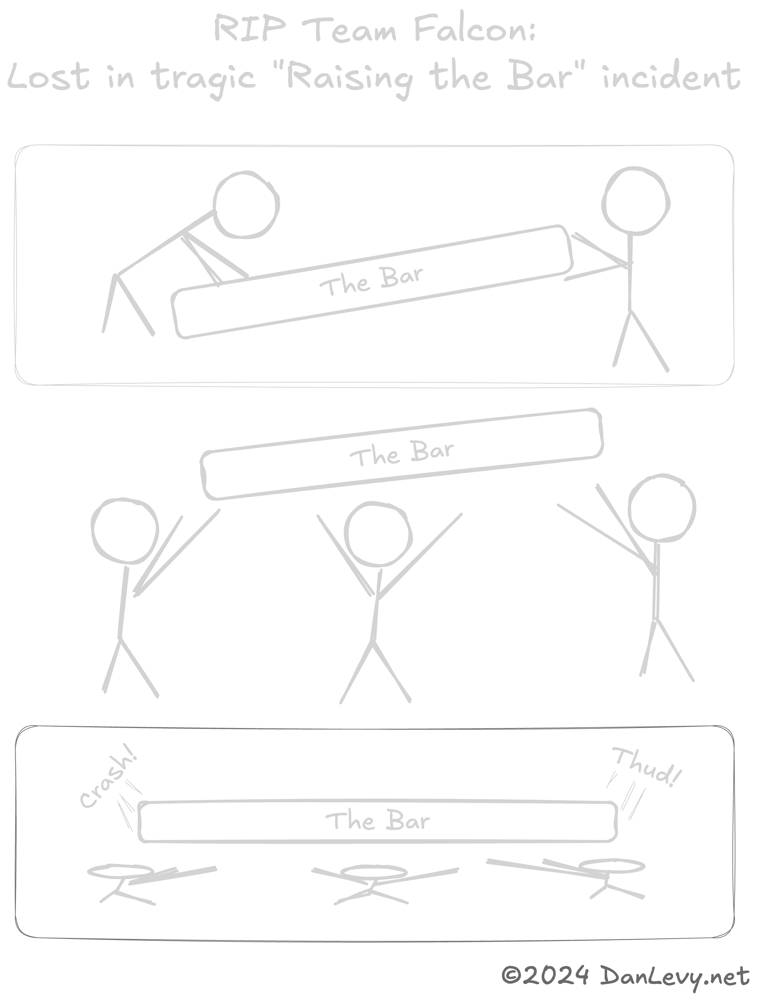
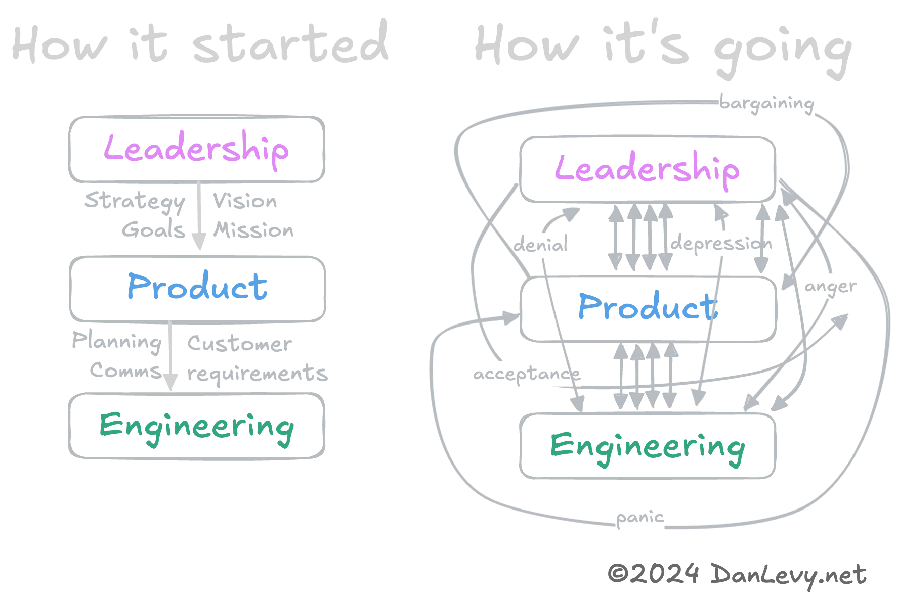

import {Timeline} from '../../../../../components/ui/timeline'

Observaciones de unicornios en la naturaleza. 🦄

<h3>Con la participación de…</h3>
<ul>
  <li>[Teatro Empresarial 🎭](#enterprise-theater-)</li>
  <li>[Elevando el Listón 💪](#raising-the-bar-)</li>
  <li>[¿Estás Disrumpido? 🚀](#are-you-disrupted-)</li>
  <li>[Club de Lectura Hasta la Muerte 📚](#book-clubbed-to-death-)</li>
</ul>

<section>
  <Timeline client:idle
    headline=''
  
    data={[
      {
        title: "Enterprise Theater 🎭",
        slot: "slotEnterpriseTheater",
      },
      /*{
        title: "The Savior",
        slot: "slotTheSavior",
      },*/
      {
        title: "Raising the Bar 💪",
        slot: "slotRaisingTheBar",
      },
      /* {
        title: "Bizno Babble",
        slot: "slotBiznoBabble",
      },
      {
        title: "The Big Raise & oops we spent it all",
        slot: "slotTheBigRaise",
      }, */
      /*{
        title: "How to be a Big Boi CEO",
        slot: "slotHowToBigBoiCEO",
      },*/
      {
        title: "Are You Disrupted? 🚀",
        slot: "slotAreYouARealDisruptor",
      },
      {
        title: "Book Clubbed to Death 📚",
        slot: "slotBookClubbing",
      }
    ]}>

<section slot="slotEnterpriseTheater">
¿Tu empresa sufre de `low-H`? (_Hustle_, no heroína.)

¿O de `low-F`? (Como en _no quedan putas._)

No hay problema, el **gran jefe** ya lo resolvió.

- ¡Es cultura! Necesitamos leer un libro. O contratar a un consultor. ¿Offsite en Hawái? _¡Qué cultured!_
- Son valores. _¡Adopta los nuevos valores obligatorios!_
- En realidad, es la _percepción_ de la gente. Gente tonta. _¡Hora de rebranding!_
- Olvidamos que necesitamos contratar a un adulto. ¡Un `savior`! Alguien que lo arregle todo. Alguien de una empresa real, respetado por amigos y enemigos por igual. Alguien que claramente pasó una [cantidad pretenciosa de tiempo en su sitio web.](https://danlevy.net)
- El salvador dijo que debemos ser data‑driven. Obvio, idiotas. Ahora _¡conducimos datos!_ Hacemos que los gráficos suban y a la derecha, brrr.
- Historia graciosa, resulta que son los empleados. `Fire key/random people.` _Haz saber a todos que hablamos en serio._

<blockquote style="margin-block: 2rem; width: 60%;">**Anuncio:** Si tu organización de ingeniería está contratando a un `savior`, por favor [contacta](/docs/resume.pdf) para conocer el último SaaS (Savior as a Service) de Dan.</blockquote>

</section>

<section slot="slotTheSavior">
  
¿Tu `<Insert Dept. Name>` está en caos?

  
¿Fueron los despidos? (Eh, _ajuste estratégico._) No, no, no puede ser eso…

  
No te preocupes por las causas, la empresa tiene una solución.

  
Entra: ¡un `savior`! ¡Alguien que lo arregle todo!

  
  
<b>Spoiler:</b> Siempre es “datos”. La “solución” (irónicamente) siempre es Jira.

</section>

<section slot="slotRaisingTheBar">
  
¿Así que levantaste una gran ronda? ¡Hora de gastarla toda!

  
_Podemos permitirnos gente nueva, mejor gente, **gente inteligente**._ 🍷

  
Sin relación, ¡presentamos Revisiones 360! (Nombradas por la cantidad de revisiones que te asignarán.)

  
¡Ahora es momento de `raise the bar`! (Eufemismo para _¡contratar y despedir gente!_)

<figure>

  <figcaption>RIP Team Falcon: Lost in tragic "Raising the Bar" incident.</figcaption>
</figure>
</section>

<figure slot="slotHowToBigBoiCEO">
 Lifecycle")
<figcaption>Cómo ser un CEO Big Boi</figcaption>
</figure>

<section slot="slotAreYouARealDisruptor">
  
¿Eres un `real disruptor`? ¡Sube al 11! ¡Hierve ese Océano Azul!

  <figure>

    <figcaption>Se el Disruptor</figcaption>
  </figure>
</section>

<section slot="slotBookClubbing">

<figure>

  <figcaption>Cómo ganar en el Club de Lectura</figcaption>
</figure>

  <h3>Anillo Decodificador del Libro</h3>

  {/* The selection of a book club book says a lot about where a company's heading. It can be a way to set the tone for the next quarter, or telegraph imminent layoffs. */}

  Mientras muchos de estos libros son fantásticos y altamente recomendados, eso **no debe impedir que la gente los mal‑utilice, mal‑interprete y mal‑aplique**.

  <section class="books-list">
    

      <h3 itemprop="name" itemscope itemtype="http://schema.org/Book">Crucial Conversations: Tools for Talking When Stakes are High</h3>
      <h5 itemprop="author" itemscope itemtype="http://schema.org/Person">Joseph Grenny, Kerry Patterson, Ron McMillan, Al Switzle</h5>
      
Con todo respeto, jódete.

    

    

      <h3 itemprop="name" itemscope itemtype="http://schema.org/Book">Flow: The Psychology of Optimal Experience</h3>
      <h5 itemprop="author" itemscope itemtype="http://schema.org/Person">Mihály Csíkszentmihály</h5>
      
¡Acelerad, plebeyos!

    

    

      <h3 itemprop="name" itemscope itemtype="http://schema.org/Book">What Got You Here Won't Get You There</h3>
      <h5 itemprop="author" itemscope itemtype="http://schema.org/Person">Marshall Goldsmith</h5>
      
Subid de nivel, amateurs de mierda.

    

    

      <h3 itemprop="name" itemscope itemtype="http://schema.org/Book">No Rules Rules: Netflix and the Culture of Reinvention</h3>
      <h5 itemprop="author" itemscope itemtype="http://schema.org/Person">Reed Hastings, Erin Meyer</h5>
      
Estás a punto de recibir mucho más trabajo.

    

    

      <h3 itemprop="name" itemscope itemtype="http://schema.org/Book">Super Pumped: The Battle for Uber</h3>
      <h5 itemprop="author" itemscope itemtype="http://schema.org/Person">Mike Isaac</h5>
      
Estás a punto de dormir mucho menos.

    

    

      <h3 itemprop="name" itemscope itemtype="http://schema.org/Book">The Everything Store: Jeff Bezos and the Age of Amazon</h3>
      <h5 itemprop="author" itemscope itemtype="http://schema.org/Person">Brad Stone</h5>
      
¡Espero que te guste orinar en una botella!

    

  </section>
</section>

  </Timeline>

</section>

{/* <aside class="disclaimer">I love the startup ride! I've had a few startups myself and worked at ~5 companies as they became unicorns. I've consulted with dozens of $100M+ companies.   I have seen some crazy shit In my work as engineer, manager and consultant.</aside> */}