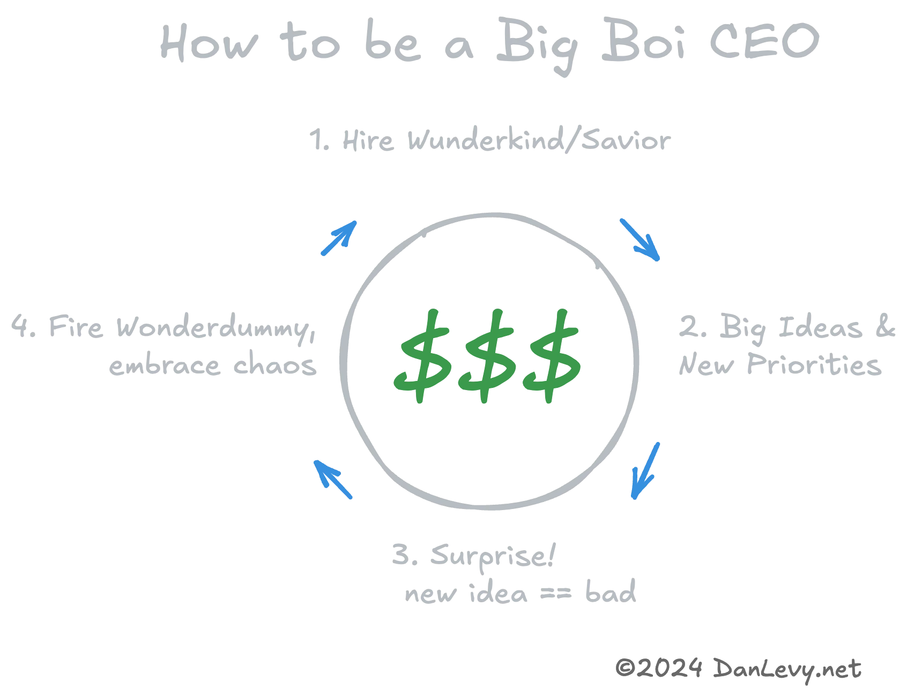

import {Timeline} from '../../../../../components/ui/timeline'

Observations des licornes dans la nature. 🦄

<h3>Featuring...</h3>
<ul>
  <li>[Théâtre d'entreprise 🎭](#enterprise-theater-)</li>
  <li>[Raising the Bar 💪](#raising-the-bar-)</li>
  <li>[Êtes-vous disruptif ? 🚀](#are-you-disrupted-)</li>
  <li>[Mort par club de lecture 📚](#book-clubbed-to-death-)</li>
</ul>

<section>
  <Timeline client:idle
    headline=''
  
    data={[
      {
        title: "Théâtre d'entreprise 🎭",
        slot: "slotEnterpriseTheater",
      },
      /*{
        title: "Le Sauveur",
        slot: "slotTheSavior",
      },*/
      {
        title: "Raising the Bar 💪",
        slot: "slotRaisingTheBar",
      },
      /* {
        title: "Bizno Babble",
        slot: "slotBiznoBabble",
      },
      {
        title: "Le Grand Salaire & oops on a tout dépensé",
        slot: "slotTheBigRaise",
      },
      */
      /*{
        title: "Comment être un grand patron",
        slot: "slotHowToBigBoiCEO",
      },*/
      {
        title: "Êtes-vous disruptif ? 🚀",
        slot: "slotAreYouARealDisruptor",
      },
      {
        title: "Mort par club de lecture 📚",
        slot: "slotBookClubbing",
      }
    ]}>

<section slot="slotEnterpriseTheater">
Souffre-t-on de `faible H` ? (_Hustle_, pas de l'héroïne.)

Ou de `faible F` ? (Comme _plus de coups à foutre_.)

Pas d'inquiétude, le **grand patron** a trouvé la solution !

- C'est la culture ! On doit lire un livre ! Ou embaucher un consultant ! Un séminaire d'entreprise ? Hawaï ? _Tellement culturel !_
- C'est les valeurs ! _Adoptez vos nouvelles valeurs imposées !_
- En fait, c'est la perception des gens. Des imbéciles. _Temps de rebranding !_
- On a oublié, il faut embaucher un adulte. Un `sauveur` ! Quelqu'un qui va tout réparer. Quelqu'un d'une vraie entreprise, respecté par ses amis et ses ennemis. Quelqu'un qui a clairement passé [un temps pretentieux à améliorer son site web.](https://danlevy.net).
- Le sauveur a dit qu'il fallait être data-driven. Évidemment, des cons. Maintenant, on _drive data !_ Faire monter les graphiques vers le haut et à droite, brrr !
- Histoire amusante, il s'agissait en fait du personnel. `Licencier des personnes clés/au hasard.` _Faire savoir que c'est sérieux._

<blockquote style="margin-block: 2rem; width: 60%;">**Annonce :** Si votre organisation d'ingénierie embauche un `sauveur`, veuillez [nous contacter](../docs/resume.pdf) pour découvrir le dernier SaaS (Savior as a Service) de Dan !</blockquote>

</section>

<section slot="slotTheSavior">
  
Est-ce que votre `<Insérer le nom du département>` est en déshérence ?

  
C'était les licenciements ? (Err, _ajustement stratégique._) Non, non, ce n'est pas ça...

  
Ne vous inquiétez pas des causes, l'entreprise a une solution !

  
Entrez : un `sauveur` ! Quelqu'un pour tout réparer !

  
  
<b>Spoiler :</b> C'est toujours "les données". La "solution" est (sans ironie) toujours Jira.

</section>

<section slot="slotRaisingTheBar">
  
Alors, vous avez levé un gros tour ? Il est temps de tout dépenser !

  
_On peut se permettre de nouveaux gens, de meilleurs gens, des **gens intelligents**._ 🍷

  
En passant, introduction des 360 Reviews ! (Nommé d'après le nombre de critiques que vous recevrez.)

  
Il est maintenant temps de `lever le niveau` ! (Euphémisme pour _embaucher et licencier !_)

<figure>

  <figcaption>RIP Team Falcon : Perdu dans l'incident tragique "Raising the Bar".</figcaption>
</figure>
</section>

<figure slot="slotHowToBigBoiCEO">

<figcaption>Comment être un grand patron</figcaption>
</figure>

<section slot="slotAreYouARealDisruptor">
  
Êtes-vous un `véritable disrupteur` ? Alors allez-y, montez à 11 ! Brûlez cette mer bleue !

  <figure>

    <figcaption>Soyez la disruption</figcaption>
  </figure>
</section>

<section slot="slotBookClubbing">

<figure>

  <figcaption>Comment gagner à un club de lecture</figcaption>
</figure>

  <h3>Décodeur de livres</h3>

  {/* Le choix d'un livre pour un club de lecture dit beaucoup sur la direction prise par une entreprise. C'est une façon de fixer le ton pour le trimestre à venir, ou d'annoncer des licenciements imminents. */}

  Bien que beaucoup de ces livres soient excellents et fortement recommandés, cela **n'empêche pas les gens de les utiliser, de les mal comprendre et de les appliquer de travers !**

  <section class="books-list">
    

      <h3 itemprop="name" itemscope itemtype="http://schema.org/Book">Conversations cruciales : Outils pour parler quand les enjeux sont élevés</h3>
      <h5 itemprop="author" itemscope itemtype="http://schema.org/Person">Joseph Grenny, Kerry Patterson, Ron McMillan, Al Switzle</h5>
      
Avec tout le respect que je vous dois, allez vous faire foutre.

    

    

      <h3 itemprop="name" itemscope itemtype="http://schema.org/Book">Flow : La psychologie de l'expérience optimale</h3>
      <h5 itemprop="author" itemscope itemtype="http://schema.org/Person">Mihály Csíkszentmihály</h5>
      
Des paysans plus rapides !

    

    

      <h3 itemprop="name" itemscope itemtype="http://schema.org/Book">Ce qui vous a fait réussir ne vous fera pas réussir</h3>
      <h5 itemprop="author" itemscope itemtype="http://schema.org/Person">Marshall Goldsmith</h5>
      
Montez le niveau, vous fumiers.

    

    

      <h3 itemprop="name" itemscope itemtype="http://schema.org/Book">Pas de règles : Netflix et la culture de l'innovation</h3>
      <h5 itemprop="author" itemscope itemtype="http://schema.org/Person">Reed Hastings, Erin Meyer</h5>
      
Vous allez avoir beaucoup plus de travail.

    

    

      <h3 itemprop="name" itemscope itemtype="http://schema.org/Book">Super Pumped : La bataille d'Uber</h3>
      <h5 itemprop="author" itemscope itemtype="http://schema.org/Person">Mike Isaac</h5>
      
Vous allez avoir beaucoup moins de sommeil.

    

    

      <h3 itemprop="name" itemscope itemtype="http://schema.org/Book">L'Usine à tout : Jeff Bezos et l'ère d'Amazon</h3>
      <h5 itemprop="author" itemscope itemtype="http://schema.org/Person">Brad Stone</h5>
      
J'espère que vous aimez pisser dans une bouteille !

    

  </section>
</section>

  </Timeline>

</section>