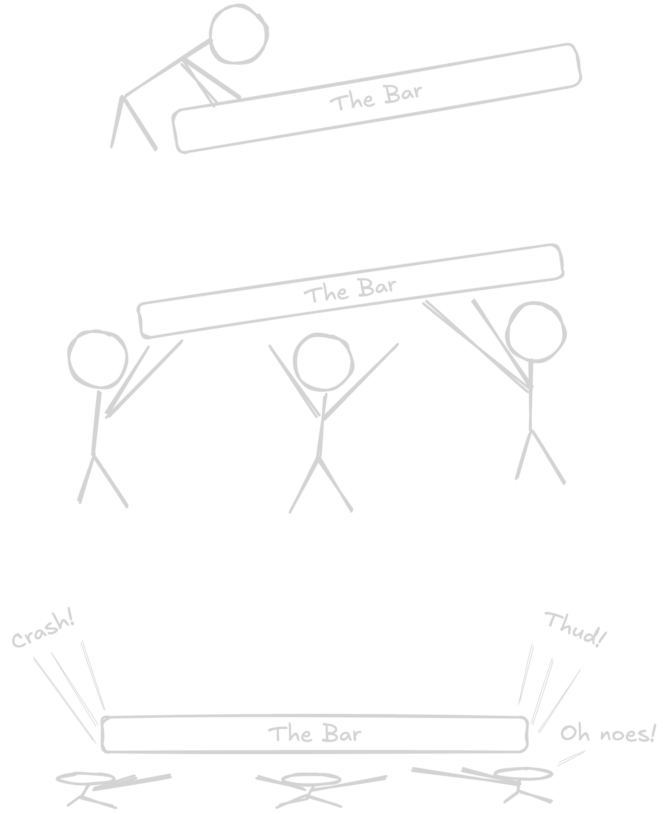

import {Timeline} from '../../../components/ui/timeline'

This series is a collection of observations on companies chasing a billion dollar valuation.

  <Timeline client:idle
    headline='Secret Startup Stages'
  
    data={[
      {
        title: "The Savior",
        slot: "slotTheSavior",
      },
      {
        title: "Raising the Bar",
        slot: "slotRaisingTheBar",
      },
      /* {
        title: "Bizno Babble",
        slot: "slotBiznoBabble",
      },
      {
        title: "The Big Raise & oops we spent it all",
        slot: "slotTheBigRaise",
      }, */
      {
        title: "Product Team Lifecycle",
        slot: "slotProductLifecycle",
      },
      {
        title: "Product: Theory vs Reality",
        slot: "slotProductTheoryVsReality",
      },
      {
        title: "Book Clubbing",
        slot: "slotBookClubbing",
      }
    ]}>

<section slot="slotTheSavior">
  
Is your `<Insert Dept. Name>` in chaos?

  
Was it the layoffs? (I mean _strategic adjustment._) No, no, it can't be that...

  
Don't worry about causes, the company has a fix!

  
A `savior`! Someone who will fix everything.

  
Someone from a real company, respected by friends & enemies alike, and who spent a pretentious amount of time on their website.

  
</section>

<section slot="slotRaisingTheBar">
  
It's a common startup story: a company raises a big round, and then the founders go on a hiring spree. They bring in a bunch of new people, better people, smarter people.

  
A funny thing happens to those raising the bar: they find themselves underneath it.

<figure>

  <figcaption>RIP Team Falcon: Lost to tragic "Raising the Bar" incident</figcaption>
</figure>
</section>

<figure slot="slotProductLifecycle">
 Lifecycle")
<figcaption>Product (Team) Lifecycle</figcaption>
</figure>

<section slot="slotProductTheoryVsReality">
  
So, you think you're a hyper-scale company? Only `true scalers` create the chaos necessary to win!

  <figure>

    <figcaption>Product Management: Theory vs Reality</figcaption>
  </figure>
</section>

<figure>

  <figcaption>How to win at Book Club</figcaption>
</figure>

  <h5>Understanding Management's Mood</h5>

  The selection of a book club book says a lot about where a company's heading. It can be a way to set the tone for the next quarter, or telegraph imminent layoffs.

  Here's a handy cheat sheet to decode your company's book club selections:

  <section class="books-list">
    

      <h3 itemprop="name" itemscope itemtype="http://schema.org/Book">Crucial Conversations: Tools for Talking When Stakes are High</h3>
      <h4 itemprop="author" itemscope itemtype="http://schema.org/Person">Joseph Grenny, Kerry Patterson, Ron McMillan, Al Switzle</h4>
      
Someone's getting fired!

    

    

      <h3 itemprop="name" itemscope itemtype="http://schema.org/Book">Flow: The Psychology of Optimal Experience</h3>
      <h4 itemprop="author" itemscope itemtype="http://schema.org/Person">Mihály Csíkszentmihály</h4>
      
Work faster!

    

    

      <h3 itemprop="name" itemscope itemtype="http://schema.org/Book">What Got You Here Won't Get You There</h3>
      <h4 itemprop="author" itemscope itemtype="http://schema.org/Person">Marshall Goldsmith</h4>
      
Level-up you fucking amatuers.

    

    

      <h3 itemprop="name" itemscope itemtype="http://schema.org/Book">No Rules Rules: Netflix and the Culture of Reinvention</h3>
      <h4 itemprop="author" itemscope itemtype="http://schema.org/Person">Reed Hastings, Erin Meyer</h4>
      
You're about to get a lot more work.

    

    

      <h3 itemprop="name" itemscope itemtype="http://schema.org/Book">Super Pumped: The Battle for Uber</h3>
      <h4 itemprop="author" itemscope itemtype="http://schema.org/Person">Mike Isaac</h4>
      
You're about to get a lot less sleep.

    

    

      <h3 itemprop="name" itemscope itemtype="http://schema.org/Book">The Everything Store: Jeff Bezos and the Age of Amazon</h3>
      <h4 itemprop="author" itemscope itemtype="http://schema.org/Person">Brad Stone</h4>
      
Get ready to pee in a bottle!

    

  </section>

  </Timeline>

{/* <aside class="disclaimer">I love the startup ride! I've had a few startups myself and worked at ~5 companies as they became unicorns. I've consulted with dozens of $100M+ companies.   I have seen some crazy shit In my work as engineer, manager and consultant.</aside> */}
