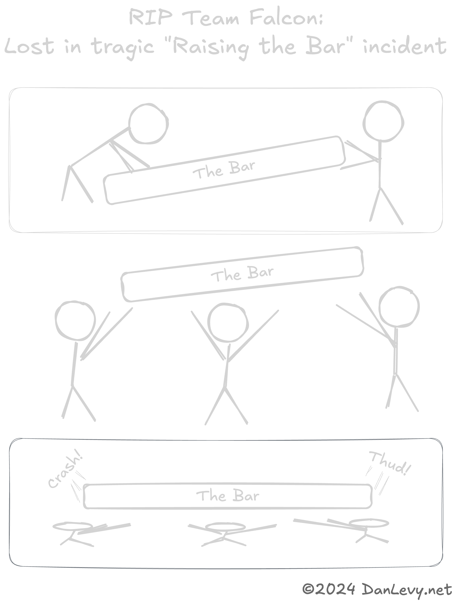
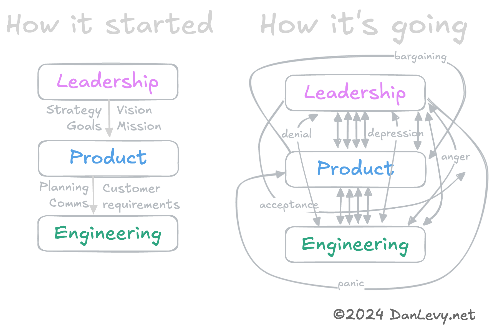

import {Timeline} from '../../../components/ui/timeline'

Observations of unicorns in the wild. 🦄

<h3>Featuring...</h3>
<ul>
  <li>[Enterprise Theater 🎭](#enterprise-theater-)</li>
  <li>[Raising the Bar 💪](#raising-the-bar-)</li>
  <li>[Are You Disrupted? 🚀](#are-you-disrupted-)</li>
  <li>[Book Clubbed to Death 📚](#book-clubbed-to-death-)</li>
</ul>

<section>
  <Timeline client:idle
    headline=''
  
    data={[
      {
        title: "Enterprise Theater 🎭",
        slot: "slotEnterpriseTheater",
      },
      /*{
        title: "The Savior",
        slot: "slotTheSavior",
      },*/
      {
        title: "Raising the Bar 💪",
        slot: "slotRaisingTheBar",
      },
      /* {
        title: "Bizno Babble",
        slot: "slotBiznoBabble",
      },
      {
        title: "The Big Raise & oops we spent it all",
        slot: "slotTheBigRaise",
      }, */
      /*{
        title: "How to be a Big Boi CEO",
        slot: "slotHowToBigBoiCEO",
      },*/
      {
        title: "Are You Disrupted? 🚀",
        slot: "slotAreYouARealDisruptor",
      },
      {
        title: "Book Clubbed to Death 📚",
        slot: "slotBookClubbing",
      }
    ]}>

<section slot="slotEnterpriseTheater">
Does your company suffer from `low-H`? (_Hustle_, not heroin.)

Or `low-F`? (As in _no fucks left._)

No worries, the **big boss** has figured it out!

- It's culture! We need to read a book! Or, hire a consultant! Company offsite? Hawaii? _So cultured!_
- It's values! _Embrace your new mandated values!_
- Actually, it's people's _perception_. Stupid people. _Rebranding time!_
- We forgot, we need to hire an adult. A `savior`! Someone who will fix everything. Someone from a real company, respected by friends & enemies alike. Someone who clearly spent a [pretentious amount of time on their website.](https://danlevy.net).
- The savior said we need to be data-driven. Duh, dummies. Now, we _drive data!_ Make charts go up and to the right, brrr!
- Funny story, turns out it's the staff. `Fire key/random people.` _Let folks know we're serious._

<blockquote style="margin-block: 2rem; width: 60%;">**Ad:** If your engineering organization is hiring a `savior`, please [reach out](/docs/resume.pdf) to learn about the latest SaaS (Savior as a Service) from Dan!</blockquote>

</section>

<section slot="slotTheSavior">
  
Is your `<Insert Dept. Name>` in chaos?

  
Was it the layoffs? (Err, _strategic adjustment._) No, no, it can't be that...

  
Don't worry about causes, the company has a fix!

  
Enter: A `savior`! Someone to fix everything!

  
  
<b>Spoiler:</b> It's always "data." The "fix" is (unironically) always Jira.

</section>

<section slot="slotRaisingTheBar">
  
So, you raised a big round? Time to spend it all!

  
_We can afford new people, better people, **smart people**._ 🍷

  
Unrelatedly, introducing 360 Reviews! (Named for the number of reviews you'll be assigned.)

  
Now it's time to `raise the bar`! (Euphamism for _hire & fire people!_)

<figure>

  <figcaption>RIP Team Falcon: Lost in tragic "Raising the Bar" incident.</figcaption>
</figure>
</section>

<figure slot="slotHowToBigBoiCEO">
 Lifecycle")
<figcaption>How to be a Big Boi CEO</figcaption>
</figure>

<section slot="slotAreYouARealDisruptor">
  
Are you a `real disruptor`? Turn it up to 11! Boil that Blue Ocean!

  <figure>

    <figcaption>Be the Disruption</figcaption>
  </figure>
</section>

<section slot="slotBookClubbing">

<figure>

  <figcaption>How to win at Book Club</figcaption>
</figure>

  <h3>Book Decoder Ring</h3>

  {/* The selection of a book club book says a lot about where a company's heading. It can be a way to set the tone for the next quarter, or telegraph imminent layoffs. */}

  While many of these books are fantastic & highly recommended, that **doesn't need to get in the way of folks mis-using, mis-understanding, and mis-applying them!**

  <section class="books-list">
    

      <h3 itemprop="name" itemscope itemtype="http://schema.org/Book">Crucial Conversations: Tools for Talking When Stakes are High</h3>
      <h5 itemprop="author" itemscope itemtype="http://schema.org/Person">Joseph Grenny, Kerry Patterson, Ron McMillan, Al Switzle</h5>
      
With all due respect, fuck you.

    

    

      <h3 itemprop="name" itemscope itemtype="http://schema.org/Book">Flow: The Psychology of Optimal Experience</h3>
      <h5 itemprop="author" itemscope itemtype="http://schema.org/Person">Mihály Csíkszentmihály</h5>
      
Faster peasants!

    

    

      <h3 itemprop="name" itemscope itemtype="http://schema.org/Book">What Got You Here Won't Get You There</h3>
      <h5 itemprop="author" itemscope itemtype="http://schema.org/Person">Marshall Goldsmith</h5>
      
Level-up you fucking amatuers.

    

    

      <h3 itemprop="name" itemscope itemtype="http://schema.org/Book">No Rules Rules: Netflix and the Culture of Reinvention</h3>
      <h5 itemprop="author" itemscope itemtype="http://schema.org/Person">Reed Hastings, Erin Meyer</h5>
      
You're about to get a lot more work.

    

    

      <h3 itemprop="name" itemscope itemtype="http://schema.org/Book">Super Pumped: The Battle for Uber</h3>
      <h5 itemprop="author" itemscope itemtype="http://schema.org/Person">Mike Isaac</h5>
      
You're about to get a lot less sleep.

    

    

      <h3 itemprop="name" itemscope itemtype="http://schema.org/Book">The Everything Store: Jeff Bezos and the Age of Amazon</h3>
      <h5 itemprop="author" itemscope itemtype="http://schema.org/Person">Brad Stone</h5>
      
I hope you like to pee in a bottle!

    

  </section>
</section>

  </Timeline>

</section>

{/* <aside class="disclaimer">I love the startup ride! I've had a few startups myself and worked at ~5 companies as they became unicorns. I've consulted with dozens of $100M+ companies.   I have seen some crazy shit In my work as engineer, manager and consultant.</aside> */}
