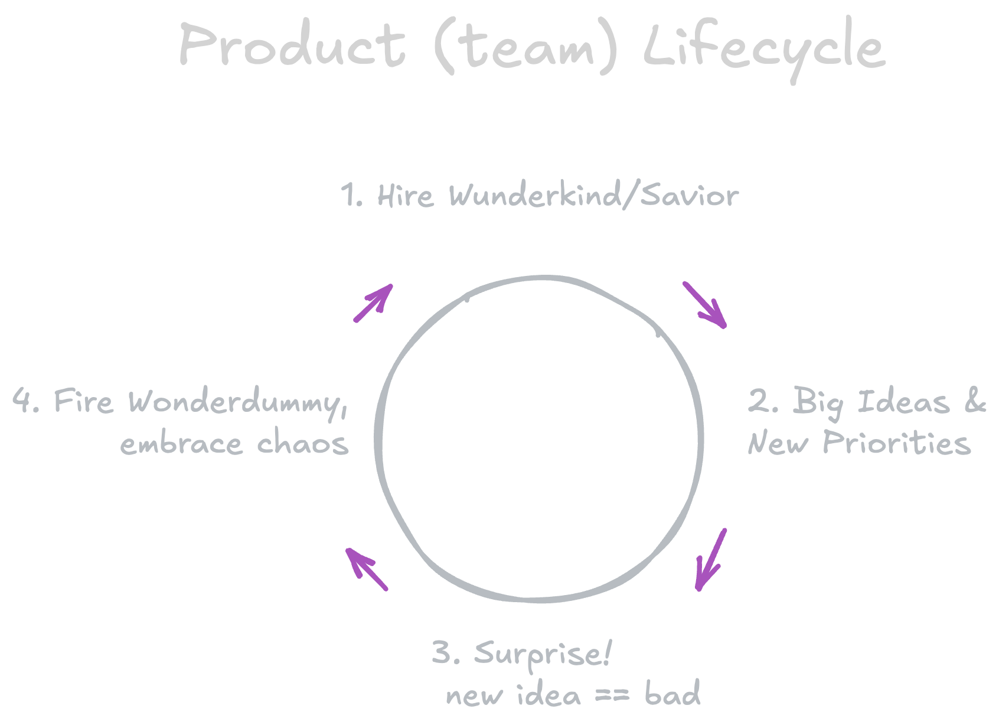

This series is a collection of observations on companies chasing a billion dollar valuation.

## The Product Team Lifecycle

<figure>

  <figcaption>Product (Team) Lifecycle</figcaption>
</figure>

## Product: Theory vs Reality

<figure>

  <figcaption>Product Development: Theory vs Reality</figcaption>
</figure>

<aside class="disclaimer">I love the startup ride! I've had a few startups myself and worked at ~5 companies as they became unicorns. I've consulted with dozens of $100M+ companies.   I have seen some crazy shit In my work as engineer, manager and consultant.</aside>
