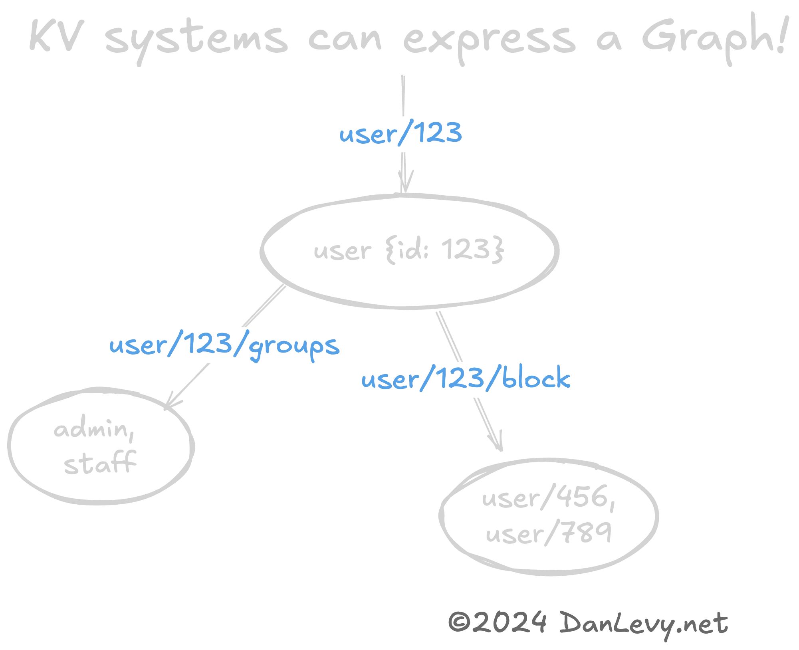

<details>
<summary>قائمة المحتويات</summary>

- [التفكير بالمفاتيح](#التفكير-بالمفاتيح)
  - [تصميم مع المفاتيح](#تصميم-مع-المفاتيح)
  - [KVs كشبكات وأشجار؟](#kvs-كشبكات-وأشجار)
  - [متى يجب استخدام أنماط KV](#متى-يجب-استخدام-أنماط-kv)
  - [متى يجب تجنب أنماط KV](#متى-يجب-تجنب-أنماط-kv)
  - [عندما تحتاج إلى أكثر من KV](#عندما-تحتاج-إلى-أكثر-من-kv)
- [الخطوات التالية](#الخطوات-التالية)
  - [خدمة الحقائق - مشروع مرجع](#خدمة-الحقائق---مشروع-مرجع)
- [الختام](#الختام)
  - [المزيد من القراءة](#المزيد-من-القراءة)

</details>

في بداية تصميم نظام جديد أو ميزة، فإن الانحراف بشأن التصميم البياناتي مريئًا. في هذا المقال سأشار إلى خلالة غريبة ومثيرة تسددت أجراتها عبر سنواتي المهنية.

<section class="breakout">
_حاول_ أن تستخدم طريقة الحفظ البسيطة الممكنة عند تصميم نظام أو ميزة جديدة.
</section>

ما زالت أشهر الملاحظات باختيار SQL. بالتأكيد، لن يتم إطلاق النار على أحد عن اختيار SQL. وما لو أخبرتك أن هناك طريقة أسهلة وأسرع ورخيصة للبدء؟

كانة بنية KV أو نموذج قيمة-مفتاح قد تكون ما يحتاجه العمل منك! مثل Redis أو S3.

ليس دائمًا الاختيار الصحيح، ولكن ربما **أكثر من ما تتخيله**.

طبقة تخزين بسيطة قد تزيد سرعة التطوير الأولي بكثير باستخدام الرمز البياناتي المتكرر وتجنب التكلفات المتعلقة بالتحول في التصميم البياناتي وإجراءات التحديثات الجماعية. وستحدث التحول أيضًا؛ لذا اجتنب التعامل مع التغييرات في نفس المكانين.

على سبيل المثال، يمكنك أن تحصل على أداء أفضل لأن البحث عن `المفتاح` محسوب بشكل جيد ويمكن أن يحصل الكتابة على فوائد من التحديثات الجماعية المجمعة.

{/* تجنب أنماط KV إذا كنت بحاجة إلى الانضمام أو الاستعلام بناءً على الخصائص في هذا المجموعة البياناتية. أو في حالات حيث لديك مجموعة بيانات غير محدودة/تنمو دائمًا. (`التعليقات`, `التسجيلات`, وغيرها) */}

## التفكير بالمفاتيح

قد يشعر البعض بالأسى عندما يتم تصميم النظام مع نموذج القيمة-مفتاح للبدء، كما أنك عادةً ما تستخدمها! يمكنك أن ترى أنماط KV في كل مكان، من التكوينات والURLs إلى التخزين النوعي S3! كل مرة تتعامل مع البيانات عبر قيمة مفردة `المفتاح`، فهذا هو نموذج قيمة-مفتاح آخر! (وليس بالضرورة نموذج قاعدة بيانات KV.)

### تصميم مع المفاتيح

بالتأكيد، يمكن تمثيل أغلب البيانات باستخدام أنماط KV. (في الحقيقة، يبني عدد كبير من القواعد البياناتية العالية الترتيب على أنماط KV الدنيا.) يمكننا أن ننظر إلى بعض الأمثلة:

```markdown
مستخدم/123          {id: 123, ...}
مستخدم/123/block    ['مستخدم/456', 'مستخدم/789']
مستخدم/123/groups   ['admin', 'staff']
مستخدم/420/friends  ['مستخدم/456', 'مستخدم/789']

مجموعة/admin       {user: '*:rw'}
مجموعة/default     {user: '*:r'}

منتج/42/discount/<UUID>	{percentOff: '10%'}
منتج/42/discount/<UUID>	{percentOff: '20%', minTotal: 100.0}
```

قد لاحظت أن المعرف هو المفتاح بنفسه! هذا هو نموذج مشهور في قواعد البيانات KV. المفتاح يمكن أن يكون أيضًا مركب من نوع الكائن ومعرف المميز. (مثل `مستخدم/123`, `مستخدم:456`)

### KVs كشبكات وأشجار؟

قد يكون قد يصبح مفيدًا تمثيل الأشكال المعقدة البياناتية مثل الشبكات باستخدام أنماط KV. (ولا شك أن REST URLs هي أمثلة على ذلك.)

الهرم المفتاح (`مستخدم/420` -> `مستخدم/420/friends`) يشرح علاقة الشبكة بين المستخدم وأصدقائه بشكل طبيعي.

هذا هو طريقة سريعة ورخيصة لتسير البيانات الشبكية. خاصة إذا لم تحتاج إلى  комплексية قاعدة بيانات الشبكات (مثل Neo4j).

<figure>

<figcaption>شبكة مستخدم/123</figcaption>
</figure>

### متى يجب استخدام أنماط KV

- عندما تحتاج إلى مقياس كبير. (ملايين أو حتى تريليونات مفاتيح KV.)
- عندما تحتاج أساسًا إلى الوصول إلى البيانات عن طريق مفتاح معين.
- عندما تحتاج إلى بنية بسيطة.
- عندما لديك بيانات بهيئة شبكة أو شجرة.

### متى يجب تجنب أنماط KV

لا تخزن الأشياء مثل التعليقات في **شريحة واحدة** KV. بالنسبة لك، لا يجب أن تخزن `التعليقات` في شريحة واحدة مثل `post/666 -> {comments: [...too many...]}`. بدلاً من ذلك، قد تستخدم `post/666/comments/1`, أو `post/666/comments/<UUID>`, وغيرها. أو انتق القاعدة البيانات SQL.

- عندما تحتاج إلى البحث في الخصائص (ليس المفتاح أو المعرف) في مجموعة البيانات.
- عندما تحتاج إلى الانضمام أو الاستعلام عبر الكائنات المتعددة.
- عندما تحتاج إلى إجراء قيود أو علاقات معقدة.

### عندما تحتاج إلى أكثر من KV

بمجرد أن تتطور المتطلبات المشروعية بشكل طبيعي، قد تحتاج إلى عمل أكثر من ما يدعمه KV. في هذه الحالة، ستحتاج إلى النظر في مهمة تحويلها إلى نظام بيانات أكثر تعقيدًا.

{/* المزيد من الحظة الجيدة هو أن يمكنك بدءًا من نموذج KV وتطويره إلى نظام أكثر تعقيدًا بشكل لاحق. S3 لديه ميزات تجاوز تخزين البيانات البسيط، من Athena للبحث في الملفات إلى Glacier وميزات إنهاء سير العمليات. كذلك، Redis قام بإضافة العديد من الميزات العالية المستوى (مثل Pub/Sub والمساحة الجغرافية الجوية والدفقات ومجموعات مرتبة) التي يمكنها أن تساعدك في ملاحظة المتطلبات. */}

مهمًا، فإن تحويل قاعدة بيانات KV واحدة إلى SQL بسيط جدًا بالنسبة لتحويل شيفرة SQL عالية الترتيب مع عدة جداول وفهرسات وقيود وعلاقات وغيرها. كنت قد فعلت ذلك عدة مرات باستخدام 50 سطرًا من الشيفرة.

عندي تجربة أن الجودة العالية من التصميمات SQL هي أفضل إذا بدأت من نموذج KV. ويزودك ذلك بفكرة جديدة حول البيانات بشكل مختلف، وبمعرفة أفضل حول ما يحتاجه من SQL حقًا.

## الخطوات التالية

أفضل طريقة للتعلم هي المحاولة! إذا كنت ترغب في التعمق في هذا النموذج بشكل أكبر، فأوصي بـ **بناء الأشياء** مع Redis أو DynamoDB أو S3.
كلها قواعد بيانات KV جيدة مع خصائص مختلفة.

### خدمة الحقائق - مشروع مرجع

تحقق من [خدمة الحقائق الخارجية الخاصة بي، مشروع مرجع على GitHub](https://github.com/justsml/fact-service).

هي API RESTful قابلة للإستخدام تنفذ خدمة بيانات KV.

تشملها العديد من [مزودي البيانات](https://github.com/justsml/fact-service/tree/main/lib/providers).
بما في ذلك لبنان Postgres وRedis وDynamoDB وFirestore وCassandra! (بما في ذلك [أوامر Docker](https://github.com/justsml/fact-service/tree/main/lib/providers) لبدء الأمر بسهولة.)

خدمة الحقائق مخصصة للبدء والمشاريع التعليمية، انسخها وأنشئ خدمة بيانات KV خاصة بك!

## الختام

أتمنى أن تجد هذا المقال نافعًا! إذا كان لديك أي أسئلة أو تعليقات، يرجى التعبير عنها في التعليقات أو `@` من فضلك على [Twitter](https://twitter.com/justsml).

### الاحترافية

- [Modeling Hierarchical Tree Data in PostgreSQL](https://leonardqmarcq.com/posts/modeling-hierarchical-tree-data)
- [Do's and Don'ts of Storing Large Trees in PostgreSQL](https://leonardqmarcq.com/posts/dos-and-donts-of-modeling-hierarchical-trees-in-postgres)

### المزيد من القراءة

- [Fact Service](https://github.com/justsml/fact-service)
- [Postgres](https://www.postgresql.org/)
- [Redis](https://redis.io/)
- [DynamoDB](https://aws.amazon.com/dynamodb/)
- [S3](https://aws.amazon.com/s3/)
- [Cassandra](https://cassandra.apache.org/)
- [Firestore](https://firebase.google.com/docs/firestore)
