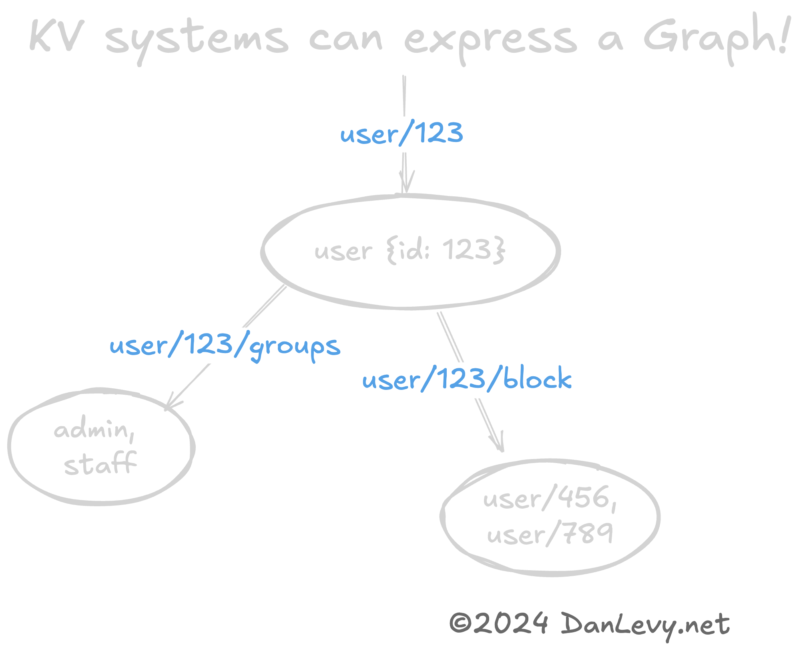

I will share a trick that has paid dividends over my career.

<section class="breakout">
  Try the simplest possible data persistence when designing a new system or feature.
</section>

Have you considered a KV or Key-value system before reaching for your go-to SQL (or MongoDB)? Something like Redis? Or S3? It's not always the right choice, but perhaps more often than you realize.

This can moderately speed up *early* development by reusing data-layer code and avoiding costs related to churn in schema design and migrations. Churn will happen anyway; let the code deal with it as long as possible. Better to avoid dealing with changes across two systems.

Performance gains are also possible since `key` lookups are highly optimized, and writes can benefit from batched updates.

Avoid KV patterns if you need JOINs or to query by properties in your dataset. Or in cases where you have an unbounded/infinitely growing datasets. (`Logs`, `Signups`, etc.)

## Thinking in Keys

It can feel strange to design with a Key-Value pattern first, especially if you're used to designing systems with object hierarchies or Enterprise Relationship Diagrams and directly implementing them in SQL.

You've probably ***used*** key-value patterns before! They are everywhere, from configs and URLs to S3-style Object Storage! Every time you deal with data via a unique `ID` value, guess what? Another Key-value pattern! (Though not necessarily a KV Store.)

```markdown
user/123          {id: 123, ...}
user/123/block    ['user/456', 'user/789']
user/123/groups   ['admin', 'staff']

group/admin    {user: '*:rw'}

product/42/discount/<UUID>	{percentOff: '10%'}
product/42/discount/<UUID>	{percentOff: '20%', minTotal: 100.0}
```

You may have noticed, but the `ID` is often a key in itself! This is a common pattern in KV stores. The key is often a composite of the entity type and the unique identifier. This allows for easy querying and grouping of related data.

It can also represent a graph! The `user/123/team` key is a list of references to other users. This is a simple graph structure. You can traverse this graph by following the keys in the list.

<figure>

<figcaption>Graph of user/123</figcaption>
</figure>

## Next Steps

The best way to learn is to try it out! If you're interested in exploring this pattern further, I recommend **building things** with Redis, DynamoDB or S3.
All are excellent KV stores with different trade-offs.

### Fact Service - Reference Project

Check out my Open Source ["Fact Service" reference project on GitHub](https://github.com/justsml/fact-service).

It's a stand-alone RESTful API that implements a KV data service.

It features many [data adapters](https://github.com/justsml/fact-service/tree/main/lib/providers).
Including for Postgres, Redis, DynamoDB, Firestore, and Cassandra!

This stand-alone project is a great way to see how you can abstract your data layer and test different data stores with minimal changes to your application code.

### Further Reading

- [Fact Service](https://github.com/justsml/fact-service)
- [Postgres](https://www.postgresql.org/)
- [Redis](https://redis.io/)
- [DynamoDB](https://aws.amazon.com/dynamodb/)
- [S3](https://aws.amazon.com/s3/)
- [Cassandra](https://cassandra.apache.org/)
- [Firestore](https://firebase.google.com/docs/firestore)

## Conclusion

I hope you found this article helpful! If you have any questions or feedback, please feel free to comment or `@` me on [Twitter](https://twitter.com/justsml).
