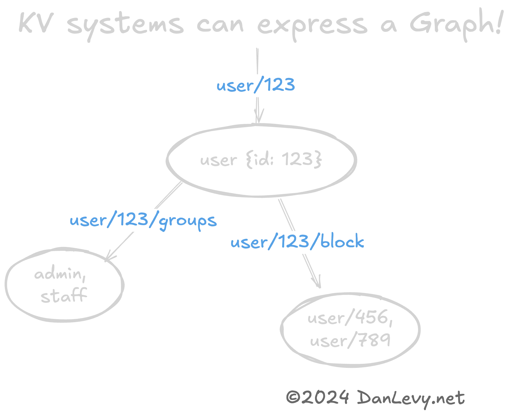

{/* Add html5 toggle element */}

<details>
<summary>Table of Contents</summary>

- [Pensare per Chiavi](#thinking-in-keys)
  - [Progettare con le Chiavi](#designing-with-keys)
  - [KV come Grafi e Alberi?](#kvs-as-graphs--trees)
  - [Quando Usare i Pattern KV](#when-to-use-kv-patterns)
  - [Quando Evitare i Pattern KV](#when-to-avoid-kv-patterns)
  - [Quando Serve Più di un KV](#when-you-need-more-than-kv)
- [Prossimi Passi](#next-steps)
  - [Fact Service - Progetto di Riferimento](#fact-service---reference-project)
- [Conclusione](#conclusion)
  - [Letture Consigliate](#further-reading)

</details>

Quando si progetta un nuovo sistema o una nuova feature, è facile rimanere bloccati nella progettazione dello schema. In questo articolo condividerò un trucco efficace che ha dato i suoi frutti durante la mia carriera.

<section class="breakout">
  _Provate_ la forma più semplice possibile di persistenza dei dati quando progettate un nuovo sistema o una nuova feature.
</section>

Fin troppo spesso vedo i team scegliere SQL o MongoDB come unica opzione per l'archiviazione dei dati. Certo, nessuno viene licenziato per aver scelto SQL. Ma se vi dicessi che esiste un modo più semplice, veloce ed economico per iniziare?

Un KV, ovvero un archivio chiave-valore, potrebbe essere tutto ciò che vi serve. Qualcosa come Redis o S3.

Non è sempre la scelta giusta, ma forse **più spesso di quanto pensiate.**

Un livello di archiviazione semplice può accelerare moderatamente lo sviluppo *iniziale* riutilizzando il codice del livello dati ed evitando i costi legati alle continue modifiche nella progettazione dello schema e nelle migrazioni. Il cambiamento avverrà comunque; lasciate che sia il codice a gestirlo il più a lungo possibile. Meglio evitare di dover gestire le modifiche in due posti diversi.

È probabile ottenere vantaggi in termini di prestazioni, poiché le ricerche per `chiave` sono altamente ottimizzate e le operazioni di scrittura possono beneficiare di aggiornamenti in batch.

{/* Avoid KV patterns if you need JOINs or to query by properties in your dataset. Or in cases where you have an unbounded/infinitely growing datasets. (`Logs`, `Signups`, etc.) */}

## Pensare per Chiavi

Può sembrare strano progettare prima con un pattern chiave-valore, soprattutto se si è abituati a progettare sistemi con gerarchie di oggetti o diagrammi entità-relazione e a implementarli direttamente in SQL.

Probabilmente avete **già usato** pattern chiave-valore! Sono ovunque, dalle configurazioni agli URL fino all'archiviazione oggetti in stile S3! Ogni volta che gestite dati tramite un valore `ID` univoco, indovinate un po'? Un altro pattern chiave-valore! (Anche se non necessariamente un KV Store.)

### Progettare con le Chiavi

Praticamente tutti i dati _possono_ essere rappresentati utilizzando pattern KV. (Infatti, molti database di livello superiore si basano su pattern KV di livello inferiore.) Vediamo alcuni esempi:

```markdown
user/123          {id: 123, ...}
user/123/block    ['user/456', 'user/789']
user/123/groups   ['admin', 'staff']
user/420/friends  ['user/456', 'user/789']

group/admin       {user: '*:rw'}
group/default     {user: '*:r'}

product/42/discount/<UUID>	{percentOff: '10%'}
product/42/discount/<UUID>	{percentOff: '20%', minTotal: 100.0}
```

Avrete notato che l'`ID` è spesso una chiave di per sé! Questo è un pattern comune nei KV store. La chiave è spesso composta dal tipo di entità e dall'identificatore univoco (es. `user/123`, `user:456`).

### KV come Grafi e Alberi?

Può essere utile rappresentare strutture dati complesse come grafi o alberi utilizzando pattern KV. (Ancora una volta, gli URL REST sono un ottimo esempio.)

La gerarchia delle chiavi (`user/420` -> `user/420/friends`) codifica naturalmente una relazione grafo tra l'`utente` e i suoi `amici`.

Questo è un modo rapido ed economico per serializzare strutture dati a grafo. Soprattutto se non serve la complessità di un database a grafo (come Neo4j).

<figure>

<figcaption>Grafo di user/123</figcaption>
</figure>

### Quando Usare i Pattern KV

- Quando serve una scalabilità elevata. (Miliardi o persino trilioni di coppie KV.)
- Quando si accede principalmente ai dati tramite una chiave univoca.
- Quando servono strutture dati semplici.
- Quando si hanno dati con una struttura gerarchica, a grafo o ad albero.

### Quando Evitare i Pattern KV

Non memorizzate cose come i commenti di un blog in un'**unica** coppia KV. Ad esempio, `post/666 -> {comments: [...troppi...]}`. Potreste invece usare `post/666/comments/1` o `post/666/comments/<UUID>`, ecc. Oppure optare per una tabella SQL.

- Quando serve cercare per proprietà (non per chiave o ID) nel dataset.
- Quando serve fare JOIN di dati tra più entità.
- Quando serve applicare vincoli o relazioni complesse.

### Quando Serve Più di un KV

Man mano che i requisiti del progetto evolvono naturalmente, potreste aver bisogno di fare più di quanto il vostro KV store supporti. A questo punto dovrete valutare la migrazione verso un archivio dati più complesso.

{/* The good news is that you can often start with a KV pattern and evolve it into a more complex system as needed. S3 has features beyond simple storage, from Athena for searching files, Glacier, and Expire policies there's a lot you can do with it. Also, Redis has added many high-level features (like Pub/Sub, Geo-spatial, Streams, and Sorted Sets) that can help you meet some requirements. */}

La buona notizia è che migrare un singolo KV store verso SQL è relativamente più facile che migrare uno schema SQL complesso in un KV store. (Con multiple tabelle, indici, vincoli, ecc.) L'ho fatto molte volte con uno script di 50 righe.

Per esperienza personale, ho scoperto che la qualità delle progettazioni SQL è maggiore se si parte da un pattern KV. Vi costringe a pensare ai dati in modo diverso e a capire meglio _esattamente_ cosa vi serve davvero da SQL.

## Prossimi Passi

Il modo migliore per imparare è provare! Se vi interessa esplorare questo pattern, vi consiglio di **costruire qualcosa** con Redis, DynamoDB o S3.
Sono tutti eccellenti KV store con compromessi diversi.

### Fact Service - Progetto di Riferimento

Date un'occhiata al mio progetto open source ["Fact Service," un progetto di riferimento su GitHub](https://github.com/justsml/fact-service).

È un'API RESTful autonoma che implementa un servizio dati KV.

Include molti [data adapter](https://github.com/justsml/fact-service/tree/main/lib/providers).
Tra cui Postgres, Redis, DynamoDB, Firestore e Cassandra! (Completi di [comandi Docker](https://github.com/justsml/fact-service/tree/main/lib/providers) per iniziare rapidamente.)

Fact Service è pensato come progetto iniziale e di apprendimento: fatene un fork e costruite il vostro servizio dati KV!

## Conclusione

Spero che questo articolo vi sia stato utile! Se avete domande o feedback, non esitate a commentare o a menzionarmi su [Twitter](https://x.com/justsml).

### Crediti

- [Modeling Hierarchical Tree Data in PostgreSQL](https://leonardqmarcq.com/posts/modeling-hierarchical-tree-data)
- [Do's and Don'ts of Storing Large Trees in PostgreSQL](https://leonardqmarcq.com/posts/dos-and-donts-of-modeling-hierarchical-trees-in-postgres)

### Letture Consigliate

- [Fact Service](https://github.com/justsml/fact-service)
- [Postgres](https://www.postgresql.org/)
- [Redis](https://redis.io/)
- [DynamoDB](https://aws.amazon.com/dynamodb/)
- [S3](https://aws.amazon.com/s3/)
- [Cassandra](https://cassandra.apache.org/)
- [Firestore](https://firebase.google.com/docs/firestore)
