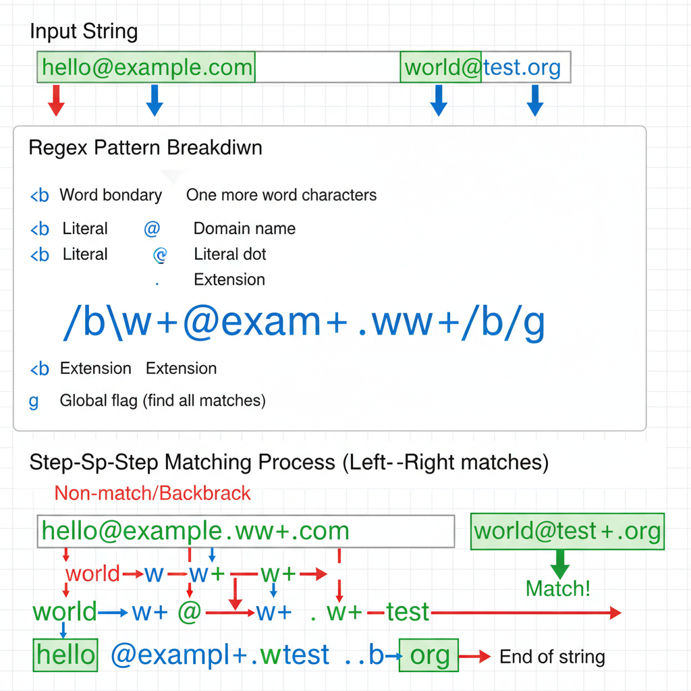

import Challenge from '../../../components/QuizUI/Challenge';
import QuizUI from '../../../components/QuizUI/QuizUI';

<p class="inset">Ready to wrestle with some Regular Expressions? 🤼‍♂️</p>

Test your RegEx knowledge with questions covering basic patterns, quantifiers, groups, and those tricky look-around assertions. From simple string matching to complex pattern validation - can you spot the correct regex?

<QuizUI>

<Challenge
  client:load
  index={0}
  group="Warmup"
  title="The `i` Flag"
  options={[
    {text: '["Cat"]'},
    {text: '["cat", "CAT", "Cat"]'},
    {text: '["cat"]', isAnswer: true},
    {text: '[]'}
  ]}
>
  <slot name="question">
  <div className="question">
    What matches?
    ```js
    'cat CAT Cat'.match(/cat/g)
    ```
  </div>
  </slot>

  <slot name='explanation'>
  <div className="explanation">
    The `i` flag makes the pattern case-insensitive:
    - `g` finds all matches
    - **`i` ignores case differences**

    Without the `i` flag, only lowercase "cat" matches.

    This is particularly useful when dealing with user input or HTML where case might vary.

    [Learn more about RegExp flags](https://developer.mozilla.org/en-US/docs/Web/JavaScript/Guide/Regular_Expressions#advanced_searching_with_flags)
  </div>
  </slot>
</Challenge>

<Challenge
  client:load
  index={1}
  group="Warmup"
  title="Simple Character Matching"
  options={[
    {text: '["cat", "hat"]', isAnswer: true},
    {text: '["cat", "hat", "what"]'},
    {text: '["cat"]'},
    {text: '[]'}
  ]}
>
  <slot name="question">
  <div className="question">
    What will this code return?
    ```js
    const words = ['cat', 'hat', 'what', 'bat'];
    words.filter(word => word.match(/^[ch]at/))
    ```
  </div>
  </slot>

  <slot name='explanation'>
  <div className="explanation">
    The pattern `/^[ch]at/` matches strings that:
    - Start (`^`) with either 'c' or 'h' (that's what `[ch]` means - a character class matching one character)
    - Followed by literally 'at'

    Therefore, only "cat" and "hat" match this pattern. The `filter()` method keeps only the matching elements.

    [Learn more about character classes on MDN](https://developer.mozilla.org/en-US/docs/Web/JavaScript/Guide/Regular_Expressions/Character_Classes)
  </div>
  </slot>
</Challenge>

<Challenge
  client:load
  index={2}
  group="Basic Matching"
  title="Greedy vs Non-Greedy"
  options={[
    {text: '["<div>Hello</div>"]'},
    {text: '["<div>", "</div>"]'},
    {text: '["<div>Hello</div><div>World</div>"]'},
    {text: '["<div>Hello</div>", "<div>World</div>"]', isAnswer: true},
    {text: '["Hello", "World"]'}
  ]}
>
  <slot name="question">
  <div className="question">
    What will this match?
    ```js
    '<div>Hello</div><div>World</div>'.match(/<div>.*?<\/div>/g)
    ```
  </div>
  </slot>

  <slot name='explanation'>
  <div className="explanation">
    The pattern `/<div>.*?<\/div>/g` uses non-greedy matching with `*?` which means:
    - Match `<div>`
    - Match any character (`.*`) but as few as possible (`?`)
    - Until finding `</div>`
    - The `g` flag makes it match all occurrences

    
    *Visual breakdown: Each regex component has a specific role in the matching process. The `?` quantifier makes `.*` "lazy" - it stops as soon as it finds the first `</div>`, rather than greedily consuming everything until the last one.*

    **Greedy vs Non-Greedy in action:**
    - **Greedy `.*`:** Matches `<div>Hello</div><div>World</div>` as ONE match
    - **Non-greedy `.*?`:** Matches `<div>Hello</div>` and `<div>World</div>` as TWO separate matches

    This distinction is crucial when parsing structured text like HTML, XML, or any nested content.

    [Learn more about greedy vs lazy matching](https://developer.mozilla.org/en-US/docs/Web/JavaScript/Guide/Regular_Expressions/Quantifiers#greedy_versus_non-greedy_lazy_matching)
  </div>
  </slot>
</Challenge>

<Challenge
  client:load
  index={3}
  group="Common Gotchas"
  title="The Dot Metacharacter"
  options={[
    {text: '["hello\nworld"]'},
    {text: '["hello", "world"]', isAnswer: true},
    {text: '["hello\n", "world"]'},
    {text: 'null'}
  ]}
>
  <slot name="question">
  <div className="question">
    What will this return?
    ```js
    'hello\nworld'.match(/\w+/g)
    ```
  </div>
  </slot>

  <slot name='explanation'>
  <div className="explanation">
    The `\w+` pattern matches one or more word characters. Even though there's a newline in the string, `\w` matches:
    - Letters (a-z, A-Z)
    - Numbers (0-9)
    - Underscore (_)

    So, the newline acts as a word boundary, and we get two matches. If we had used `.*`, it wouldn't match the newline by default (you'd need the `s` flag for that).

    [Learn more about metacharacters](https://developer.mozilla.org/en-US/docs/Web/JavaScript/Guide/Regular_Expressions/Character_Classes#types)
  </div>
  </slot>
</Challenge>

<Challenge
  client:load
  index={4}
  group="Look-ahead"
  title="Positive Look-ahead"
  options={[
    {text: '["$100", "€50"]'},
    {text: '["100", "50"]'},
    {text: '["$", "€"]'},
    {text: '[]'},
    {text: 'null', isAnswer: true},
  ]}
>
  <slot name="question">
  <div className="question">
    What will this match?
    ```js
    '$100 and €50'.match(/\d+(?=[\$€])/g)
    ```
  </div>
  </slot>

  <slot name='explanation'>
  <div className="explanation">
    This pattern won't match anything because the look-ahead is backwards! The correct pattern would be `/(?=[\$€])\d+/g`.

    Look-aheads check what comes *after* the current position. The pattern as written looks for:
    - One or more digits (`\d+`)
    - Followed by (`(?=...)`) either $ or € (`[\$€]`)

    Since there are no numbers followed by currency symbols (they're preceded by them), we get no matches.

    [Learn more about look-ahead assertions](https://developer.mozilla.org/en-US/docs/Web/JavaScript/Guide/Regular_Expressions/Assertions)
  </div>
  </slot>
</Challenge>

<Challenge
  client:load
  index={5}
  group="Basic Matching"
  title="Word Boundaries"
  options={[
    {text: '["cat", "cats"]'},
    {text: '["cat"]', isAnswer: true},
    {text: '["cats"]'},
    {text: '[]'}
  ]}
>
  <slot name="question">
  <div className="question">
    What will match?
    ```js
    'cat cats category'.match(/\bcat\b/g)
    ```
  </div>
  </slot>

  <slot name='explanation'>
  <div className="explanation">
    The `\b` represents a word boundary, which matches:
    - Between a word character and a non-word character
    - At the start/end of the string if there's a word character

    So `/\bcat\b/` matches "cat" only when it's a complete word, not part of another word.
    - ✅ "cat" (surrounded by spaces)
    - ❌ "cats" (no boundary after "cat")
    - ❌ "category" (no boundary after "cat")

    [Learn more about word boundaries](https://developer.mozilla.org/en-US/docs/Web/JavaScript/Guide/Regular_Expressions/Assertions#other_assertions)
  </div>
  </slot>
</Challenge>

<Challenge
  client:load
  index={6}
  group="Common Gotchas"
  title="The Global Flag"
  options={[
    {text: 'null'},
    {text: '["a"]'},
    {text: '["a", "a", "a"]', isAnswer: true},
    {text: '["b", "n", "n"]'},
    {text: 'Error'}
  ]}
>
  <slot name="question">
  <div className="question">
    What's the output?
    ```js
    'banana'.match(/a/g)
    ```
  </div>
  </slot>

  <slot name='explanation'>
  <div className="explanation">
    The `g` (global) flag changes how `match()` behaves:
    - Without `g`: Returns first match with capture groups
    - With `g`: Returns array of all matching strings

    In this case, it finds all occurrences of "a" in "banana".

    Note: If you need both all matches AND capture groups, use `matchAll()` or the `exec()` method in a loop.

    [Learn more about the global flag](https://developer.mozilla.org/en-US/docs/Web/JavaScript/Reference/Global_Objects/RegExp/global)
  </div>
  </slot>
</Challenge>

<Challenge
  client:load
  index={7}
  group="Look-behind"
  title="Negative Look-behind"
  options={[
    {text: '["123"]'},
    {text: '["123", "456"]'},
    {text: '["23", "456"]', isAnswer: true},
    {text: '["456"]'},
    {text: '[]'}
  ]}
>
  <slot name="question">
  <div className="question">
    What matches this pattern?
    ```js
    'abc123 def456'.match(/(?<!abc)\d+/g)
    ```
  </div>
  </slot>

  <slot name='explanation'>
  <div className="explanation">
    The negative look-behind `(?<!abc)` ensures that the digits aren't preceded by "abc":
    - ❌ "123" (preceded by "abc")
    - ✅ "23" (preceded by "abc1")
    - ✅ "456" (preceded by "def")

    Look-behinds must be fixed-length in most browsers (no `*` or `+`).

    Note: Look-behind support is relatively recent in JavaScript. Check [browser compatibility](https://developer.mozilla.org/en-US/docs/Web/JavaScript/Guide/Regular_Expressions#browser_compatibility) if you need to support older browsers.
  </div>
  </slot>
</Challenge>

<Challenge
  client:load
  index={8}
  group="Basic Matching"
  title="Capturing Groups"
  options={[
    {text: '["2029-12-31"]'},
    {text: '["2029", "12", "31"]', isAnswer: true},
    {text: '["20", "29", "12", "31"]'},
    {text: 'null'}
  ]}
>
  <slot name="question">
  <div className="question">
    What will this return?
    ```js
    '2029-12-31'.match(/(\d{4})-(\d{2})-(\d{2})/).slice(1)
    ```
  </div>
  </slot>

  <slot name='explanation'>
  <div className="explanation">
    The pattern uses three capturing groups:
    1. `(\d{4})` captures the year
    2. `(\d{2})` captures the month
    3. `(\d{2})` captures the day

    `match()` without the `g` flag returns:
    - Index 0: Full match
    - Index 1+: Capture groups

    `slice(1)` is a common trick to get just the capture groups.

    [Learn more about groups and capturing](https://developer.mozilla.org/en-US/docs/Web/JavaScript/Guide/Regular_Expressions/Groups_and_Backreferences)
  </div>
  </slot>
</Challenge>

<Challenge
  client:load
  index={9}
  group="Look-ahead"
  title="Negative Look-ahead"
  options={[
    {text: '["password123"]'},
    {text: '["abc123"]'},
    {text: '["123aBc"]'},
    {text: '["12"]', isAnswer: true},
    {text: '["abc"]'},
    {text: 'Error'}
  ]}
>
  <slot name="question">
  <div className="question">
    Which will be the result of this?
    ```js
    /^\d+(?![a-z])/ig.match("123aBc")
    ```
  </div>
  </slot>

  <slot name='explanation'>
  <div className="explanation">
    The negative look-ahead `(?![a-z])` ensures there are no lowercase letters after the digits. Because the "3aBc" part has a lowercase letter after the digits, its portion doesn't match. So only the beginning "12" matches.

    [Learn more about negative look-ahead](https://developer.mozilla.org/en-US/docs/Web/JavaScript/Guide/Regular_Expressions/Assertions)
  </div>
  </slot>
</Challenge>

<Challenge
  client:load
  index={10}
  group="Look-behind"
  title="Non-capturing Groups"
  options={[
    {text: '["a,", "b,", "c"]', isAnswer: true},
    {text: '["a,b,c"]'},
    {text: '["a", ",", "b", ",", "c"]'},
    {text: '["a,b,c", ""]'}
  ]}
>
  <slot name="question">
  <div className="question">
    What's returned?
    ```js
    'a,b,c'.split(/(?<=,)/)
    ```
  </div>
  </slot>

  <slot name='explanation'>
  <div className="explanation">
    The pattern `/(?<=,)/` is a look-behind that matches after a comma:
    - `a,` (after comma)
    - `b,` (after comma)
    - `c` (no comma after)

    The look-behind doesn't consume the comma, so it's not part of the split result.

    This is useful when you want to split a string based on what comes before it **without losing the split character(s).**

    [Learn more about look-behind assertions](https://developer.mozilla.org/en-US/docs/Web/JavaScript/Guide/Regular_Expressions/Assertions)
  </div>
  </slot>
</Challenge>

<Challenge
  client:load
  index={11}
  group="Common Gotchas"
  title="Escaping Special Characters"
  options={[
    {text: '["$100"]'},
    {text: '["100"]'},
    {text: '[]'},
    {text: 'null', isAnswer: true},
    {text: 'Error'},
  ]}
>
  <slot name="question">
  <div className="question">
    What matches?
    ```js
    '$100'.match(/$\d+/)
    ```
  </div>
  </slot>

  <slot name='explanation'>
  <div className="explanation">
    Special characters need escaping with `\` to match literally:
    - `$` is a special character (end of string)
    - To match a literal dollar sign, escape it: `\$`

    Common characters needing escape:
    ```js
    . * + ? ^ $ [ ] \ ( ) { } |
    ```

    Without escaping, many special characters have regex meanings that might not be what you want.

    [Learn more about escaping special characters](https://developer.mozilla.org/en-US/docs/Web/JavaScript/Guide/Regular_Expressions#escaping)
  </div>
  </slot>
</Challenge>

<Challenge
  client:load
  index={12}
  group="Look-behind"
  title="Positive Look-behind"
  options={[
    {text: '["$100"]'},
    {text: '["100"]', isAnswer: true},
    {text: '["$"]'},
    {text: '[]'}
  ]}
>
  <slot name="question">
  <div className="question">
    What's matched?
    ```js
    '$100'.match(/(?<=\$)\d+/)
    ```
  </div>
  </slot>

  <slot name='explanation'>
  <div className="explanation">
    The positive look-behind `(?<=\$)` ensures the digits are preceded by a dollar sign:
    - `(?<=\$)`: Look-behind for dollar sign
    - `\d+`: Match one or more digits

    Look-behind assertions don't consume characters; they only check what comes before.
    This is useful when you want to match something based on what comes before it without including the preceding part.

    [Learn more about look-behind assertions](https://developer.mozilla.org/en-US/docs/Web/JavaScript/Guide/Regular_Expressions/Assertions)
  </div>
  </slot>
</Challenge>

<Challenge
  client:load
  index={13}
  group="Basic Matching"
  title="Lazy vs Greedy Quantifiers"
  options={[
    {text: '["<b>bold</b>"]'},
    {text: '["bold"]', isAnswer: true},
    {text: '["<b>", "</b>"]'},
    {text: '[]'}
  ]}
>
  <slot name="question">
  <div className="question">
    What's matched?
    ```js
    '<b>bold</b>'.match(/<b>(.*?)<\/b>/).slice(1)
    ```
  </div>
  </slot>

  <slot name='explanation'>
  <div className="explanation">
    The pattern uses lazy matching with `*?`:
    - `<b>`: Match opening tag
    - `(.*?)`: Capture any chars (lazy)
    - `</b>`: Match closing tag

    The `?` after `*` makes it lazy, matching as few characters as possible.
    Without `?`, it would be greedy and match as much as possible.

    `slice(1)` returns just the captured group.

    [Learn more about greedy vs lazy matching](https://developer.mozilla.org/en-US/docs/Web/JavaScript/Guide/Regular_Expressions/Quantifiers#greedy_versus_non-greedy_lazy_matching)
  </div>
  </slot>
</Challenge>

<Challenge
  client:load
  index={14}
  group="Basic Matching"
  title="Unicode Flag"
  options={[
    {text: '["🙂"]'},
    {text: '["😀", "🙂"]', isAnswer: true},
    {text: 'null'},
    {text: 'Error'}
  ]}
>
  <slot name="question">
  <div className="question">
    What matches?
    ```js
    '😀 🙂'.match(/\p{Emoji}/gu)
    ```
  </div>
  </slot>

  <slot name='explanation'>
  <div className="explanation">
    The `u` flag enables:
    - Unicode property escapes (`\p{...}`)
    - Correct handling of surrogate pairs

    Without `u`, emoji and other Unicode characters might not match correctly.
    The pattern `\p{Emoji}` matches any emoji character.

    Note: Unicode property escapes require the `u` flag.

    [Learn more about Unicode mode](https://developer.mozilla.org/en-US/docs/Web/JavaScript/Guide/Regular_Expressions/Unicode_Property_Escapes)
  </div>
  </slot>
</Challenge>

<Challenge
  client:load
  index={15}
  group="Look-into-hell"
  title="Password Validation"
  options={[
    {text: '"sassword123"'},
    {text: '"Sass123!"', isAnswer: true},
    {text: '"SASSWORD123"'},
    {text: '"Sass word123"'}
  ]}
>
  <slot name="question">
  <div className="question">
    Apologies in advance! 😈<br />
    Which password matches this pattern?
    ```js
    /^(?=.*[A-Z])(?=.*[a-z])(?=.*\d)(?=.*[!@#$%^&*]).{8,}$/
    ```
  </div>
  </slot>

  <slot name='explanation'>
  <div className="explanation">
    Don't write anything like this in production! 😅

    This pattern uses multiple positive look-aheads to enforce:
    - At least one uppercase letter: `(?=.*[A-Z])`
    - At least one lowercase letter: `(?=.*[a-z])`
    - At least one digit: `(?=.*\d)`
    - At least one special character: `(?=.*[!@#$%^&*])`
    - Minimum length of 8: `.{8,}`

    Look-aheads are perfect for password validation because they can check for multiple criteria without consuming characters.

    [Learn more about password validation patterns](https://developer.mozilla.org/en-US/docs/Web/JavaScript/Guide/Regular_Expressions/Assertions)
  </div>
  </slot>
</Challenge>

</QuizUI>

<h2>How did you do? 🧐</h2>

Regular Expressions can be a beast to tame, but they're incredibly powerful once you get the hang of them (and all the newer syntax). Keep practicing, and you'll be a RegEx master in no time! 🧙‍♂️

<p class="inset">Looking for a break after all that RegEx?<br />Pftt, remember: break *after* skills! <br /><br />Hit [my gym](/challenges/) to crush some more challenges! 💪</p>
