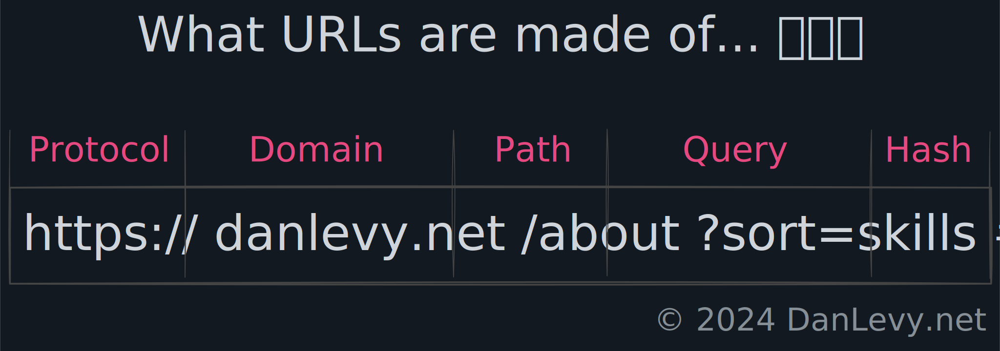
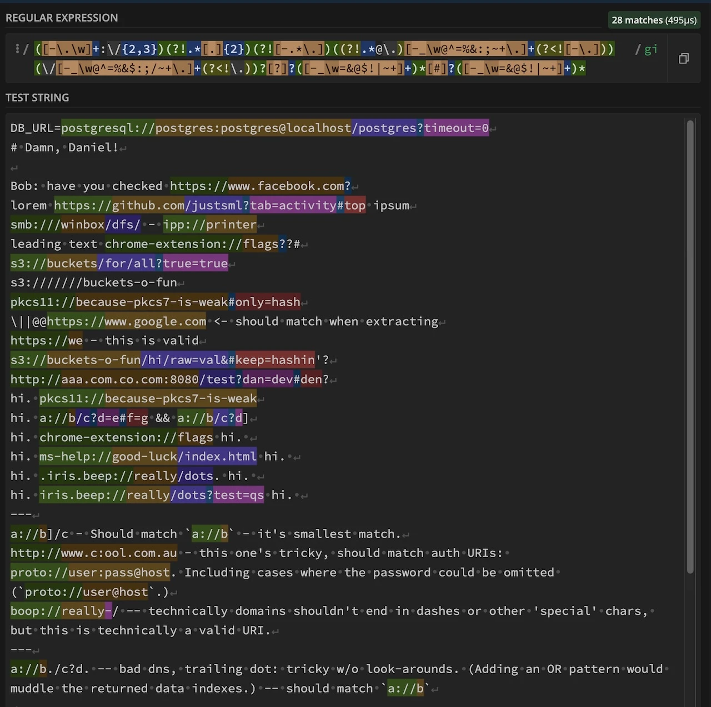

**Table of Contents**

- [Introduction](#introduction)
- [Extracting URLs from Text](#extracting-urls-from-text)
- [The 100+ Byte Regex](#the-100-byte-regex)
  - [Breaking It Down Step by Step](#breaking-it-down-step-by-step)
  - [Parsing Example](#parsing-example)
- [Next Steps](#next-steps)
  - [Different Projects, Different Needs](#different-projects-different-needs)
  - [Post-Processing and Validation](#post-processing-and-validation)
- [Summary](#summary)
- [Further Learning](#further-learning)

## Introduction

Extracting URLs from raw text can sometimes feel like playing a tedious game of whack-a-mole. Punctuation, parenthetical wrappers, and ambiguous formatting all conspire to frustrate your efforts. Whether you're building a web scraper, data analyzer, or a chat application, accurately extracting URLs is essential.

In this post, we'll tackle the problem head-on with a flexible, two-step approach. Our goal is to **capture all potential URL-like strings first** and then handle validation in a subsequent process.

> 💡 **Note:** This pattern is not for **validating** URLs! It's intentionally permissive, allowing for fine-tuning match rules for each part of the URL.

## Extracting URLs from Text

When extracting URLs from raw text, a two-step approach is effective:

1. **Capture Everything**: Cast a wide net to grab all strings that *could* be URLs. This is where our "100+ byte regex" shines.
2. **Validate**: Once you've captured these candidates, pass them through rigorous checks (e.g., DNS resolution, comparison against known domains) to weed out invalid entries.

### Visualizing the Challenge

Let me clarify some terms I'm using with intention:

- `Extract`: To remove a smaller part from a larger whole. For example, extracting URLs from BlueSky posts.
- `Parse`: To analyze an input and label its well-known parts (e.g. parts of Addresses, URLs, etc.)

When we talk about URLs, we're referring to the following parts:

<figure>
  <figcaption>The 5 Parts of all URLs</figcaption>

</figure>

Before we get too deep into the regex, let's use a visual tool to understand the challenge better.

<figure>
  <figcaption>Using [RegEx101.com](https://regex101.com/r/jO8bC4/69) to visualize multi-line matches</figcaption>

</figure>

## The 100+ Byte Regex

Below is a concise regex designed to extract and parse URLs in a single shot. It supports various protocols, domains, paths, and optional query/fragment sections.

Don't worry—we'll break it down step by step!

```js title="100+ Byte URL Regex" frame="code"
const urlRegex = /([-.a-z0-9]+:\/{1,3})([^-\/\.[\](|)\s?][^`\/\s\]?]+)([-_a-z0-9!@$%^&*()=+;/~\.]*)[?]?([^#\s`?]*)[#]?([^#\s'"`\.,!]*)/gi;
// Compatibility: ES5+
// Length: 100+ characters
```

### Breaking It Down Step by Step

Let's dissect the regex into its components to understand how it works:

#### 1. Protocol (Group 1): `([-.a-z0-9]+:\/{1,3})`

- **Purpose:** Matches the protocol part of the URL (e.g., `http://`, `ftp://`, `custom-scheme://`).
- **Explanation:**
  - `[-.a-z0-9]+`: Matches one or more lowercase letters, digits, hyphens, or periods (common in protocol schemes).
  - `:\/{1,3}`: Matches a colon followed by one to three slashes (`:/`, `://`, or `:///`).

#### 2. Domain (Group 2): `([^-\/\.[\](|)\s?][^`\/\s\]?]+)`

- **Purpose:** Captures the domain or host part of the URL.
- **Explanation:**
  - `[^-\/\.[\](|)\s?]`: Matches any character except specified special characters and whitespace.
  - `[^`\/\s\]?]+`: Matches one or more characters except backticks, slashes, whitespace, or closing square brackets.

#### 3. Path (Group 3): `([-_a-z0-9!@$%^&*()=+;/~\.]*)`

- **Purpose:** Matches the path component of the URL.
- **Explanation:**
  - `[-_a-z0-9!@$%^&*()=+;/~\.]*`: Matches zero or more URL-safe characters commonly found in paths.

#### 4. Query (Group 4): `[?]?([^#\s`?]*)`

- **Purpose:** Optionally matches a query string, starting with any `?` char.
- **Explanation:**
  - `[?]?`: Optionally matches a `?`. (The square brackets are not strictly necessary, however they are slightly more clear than the ultra terse double `??`. It also provides a visual parallel for the (similar) next matching group `[#]?`.)
  - `([^#\s`?]*)`: Matches zero or more characters that are not a hash, whitespace, backtick, or question mark.

#### 5. Fragment (Group 5): `[#]?([^#\s'"`\.,!]*)`

- **Purpose:** Optionally matches the fragment identifier starting with a `#`.
- **Explanation:**
  - `[#]?`: Optionally matches a `#`.
  - `([^#\s'"`\.,!]*)`: Matches zero or more characters that are not prohibited punctuation or whitespace.

### Parsing Example

Here's how you can use this regex to extract and parse URLs from a given input:

```js title="Example: Extract & Parse URLs" frame="code"
const text = `
Check this out: https://example.com/path?query=123#section
And also (ftp://files.server.org/index).
Plus a weird one: custom-scheme://host/param;weird^stuff
`;

const urlRegex =
  /([-.a-z0-9]+:\/{1,3})([^-\/\.[\](|)\s?][^`\/\s\]?]+)([-_a-z0-9!@$%^&*()=+;/~\.]*)[?]?([^#\s`?]*)[#]?([^#\s'"`\.,!]*)/gi;

const matches = [
  ...text.matchAll(urlRegex),
].map((match) => match[0]);
console.log("Extracted URLs:", matches);

const parts = [
  ...text.matchAll(urlRegex),
].map((match) => match.slice(1));
console.log("Extracted Parts:", parts);
```

**Extracted URLs:**

```json title="Extracted-URLs.json"
[
  "https://example.com/path?query=123#section",
  "ftp://files.server.org/index",
  "custom-scheme://host/param;weird^stuff"
]
```

**Extracted Parts:**

```json title="Extracted URL Parts"
[
  [
    "https://",    // Protocol
    "example.com", // Domain
    "/path",       // Path
    "query=123",   // Query
    "section"      // Fragment
  ],
  [
    "ftp://",           // Protocol
    "files.server.org", // Domain
    "/index",           // Path
    "",                 // Query
    ""                  // Fragment
  ],
  [
    "custom-scheme://",   // Protocol
    "host",               // Domain
    "/param;weird^stuff", // Path
    "",                   // Query
    ""                    // Fragment
  ]
]
```

## Next Steps

Depending on your use case, you might need to refine this regex or add more validation and post-processing steps.

### Different Projects, Different Needs

Projects have varied requirements and security concerns:

1. **Web Scraping**: Validate URLs to ensure they're reachable and trustworthy.
2. **Data Processing**: Extract URLs from user-generated content while ensuring safety.
3. **Data Analysis**: Filter out duplicates or irrelevant links for research or marketing purposes.
4. **User-facing Applications**: Automatically hyperlink URLs in chat apps or forums.

### Post-Processing and Validation

After gathering potential URLs, apply additional checks:

- **DNS Lookup**: Verify that domains resolve.
- **Safety Checks**: Use services to check for malicious or phishing sites.
- **Custom Rules**: Apply project-specific filters (e.g., allowed TLDs, maximum URL length).

## Summary

Extracting URL-like strings from raw text gets easier with a well-crafted regex pattern.

Here's a recap of the key takeaways:

- **Use a visual tool to write, test** & understand your [Regex patterns.](https://regex101.com/r/jO8bC4/69)
- **Use 'loose' match expressions, avoid strict spec conformance** when doing data ingestion.
- **Break down challenge into parts** solve each part separately. In a sense, capture groups provide us figurative 'trail markers' for our regex.
- **Applying validation steps** after the initial extraction is essential—always consider your project's security and specific needs.

By following these steps, you can effectively extract URL-like strings, setting the foundation for further processing and validation.

## Further Learning

- Remember to play with a [live demo on RegEx101.com](https://regex101.com/r/jO8bC4/69)!
- Original StackOverflow question, and a [link to my answer right here](https://stackoverflow.com/a/34669019/369727).
- [MDN Docs on Regular Expressions](https://developer.mozilla.org/en-US/docs/Web/JavaScript/Guide/Regular_Expressions)
- [Advanced Regex Techniques](https://www.regular-expressions.info/): Explore lookaheads, lookbehinds, and other advanced patterns for more precise matching.
- [RFC 3986 - URI Generic Syntax](https://datatracker.ietf.org/doc/html/rfc3986)


Let me know if you have any questions or need further assistance!
