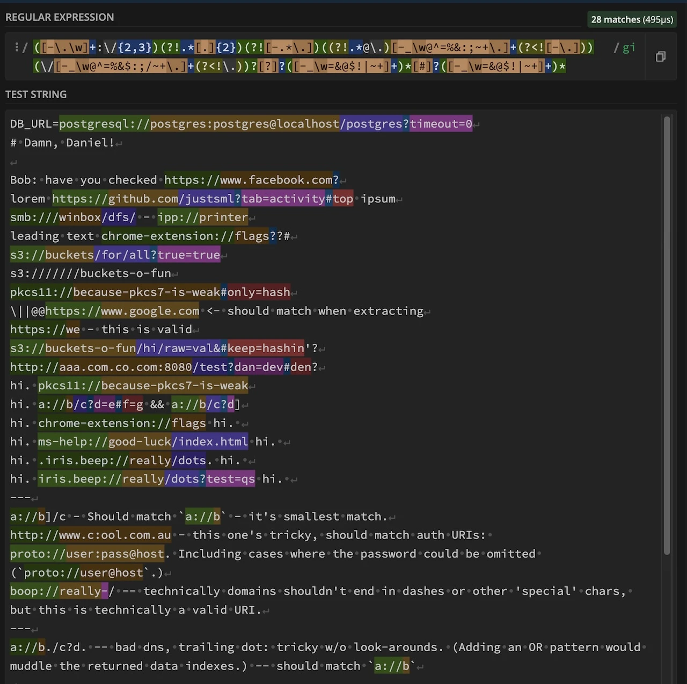

import { CodeTabs } from '../../../components/CodeTabs';

**Table of Contents**

- 🚀 [Introduction](#-introduction)
- 🔍 [Extracting URLs from Text](#-extracting-urls-from-text)
- 🛳️ [The 120+ Byte Regex](#️-the-120-byte-regex)
- 🧩 [Breaking It Down Step by Step](#-breaking-it-down-step-by-step)
- 🛠️ [Parsing Example](#-pa)
- ☑️ [Next Steps](#-next-steps)
- 📝 [Summary](#-summary)
- 📚 [Further Learning](#-further-learning)

**TL;DR:** Jump ahead to the [120+ Byte Regex](#️-the-120-byte-regex).

## 🚀 Introduction

Extracting URLs from raw text can sometimes feel like playing a tedious game of whack-a-mole. Punctuation, parenthetical wrappers, and ambiguous formatting all conspire to frustrate your efforts. Whether you're building a web scraper, data analyzer, or a chat application, accurately extracting URLs is essential.

In this post, we'll tackle the problem head-on with a flexible, two-step approach. Our goal is to **capture all _potential_ URL-like strings first** and then handle validation in a subsequent process.

> 💡 **Note:** This pattern is not for **_validating_** URLs! It's intentionally permissive with punctuation and bad spelling.

## 🔍 Goal: Extract URLs from Text

When extracting URLs from raw text, a two-step approach is effective:

1. **Capture Everything URL-like**: Cast a wide net to grab all strings that *could* be URLs. This is where our "120+ byte regex" shines.
2. **Validate**: Once you've captured these candidates, use secondary checks (e.g., DNS resolution, comparison against known domains) to weed out invalid entries.

### Visualizing the Challenge

Terms like `extract` and `parse` are often used interchangeably, however they refer to distinct processes. Extracting URLs involves identifying and capturing potential URLs from a larger body of text. Parsing, on the other hand, involves breaking down these URLs into their constituent parts.

When I mention parsing or 'URL parts', I'm referring to the following components:

<figure>
  <figcaption>The 5 Parts of all URLs</figcaption>

</figure>

<details class="inset breakout">
  <summary>Click to see a screenshot of RegEx101's substring matching.</summary>

  Before we get too deep into the regex, let's use a visual tool to see how well my pattern captures many matches:

  <figure>
    <figcaption>Using [RegEx101.com](https://regex101.com/r/jO8bC4/69) to visualize multi-line matches</figcaption>
    
  </figure>
</details>


# 🛳️ The 120+ Byte Regex

Below is a concise regex designed to extract and parse URLs in a single shot. It supports various protocols, domains, paths, and optional query/fragment sections.

Don't worry—we'll break it down step by step!

```js title="120+ Byte URL Regex" frame="code"
const urlRegex = /([-.a-z0-9]+:\/{1,3})([^-\/\.[\](|)\s?][^`\/\s\]?]+)([-_a-z0-9!@$%^&*()=+;/~\.]*)[?]?([^#\s`?]*)[#]?([^#\s'"`\.,!]*)/gi;
// Compatibility: ES5+

// Same pattern, split on newlines for readability:
([-.a-z0-9]+:\/{1,3})
([^-\/\.[\](|)\s?][^`\/\s\]?]+)
([-_a-z0-9!@$%^&*()=+;/~\.]*)
[?]?([^#\s`?]*)
[#]?([^#\s'"`\.,!]*)
```

<blockquote class="inset">Share the wildest regex's you've encountered (OR authored) in the <a href="#post-comments">comments below!</a> 🚀</blockquote>


## 🧩 Breaking It Down Step by Step

Let's dissect the regex into its components to understand how it works:

<h3>1. Protocol (Group 1): <code>{`([-.a-z0-9]+:\/{1,3})`}</code></h3>

<ul>
  <li>**Purpose:** Matches the Protocol part of the URL (e.g., `http://`, `ftp://`, `custom-scheme://`).</li>
  <li>
    **Explanation:**
    <ul>
      <li><code>[-.a-z0-9]+</code>: Matches one or more lowercase letters, digits, hyphens, or periods (common in protocol schemes).</li>
      <li><code>{`:\/{1,3}`}</code>: Matches a colon followed by one to three slashes (<code>:/</code>, <code>://</code>, or <code>:///</code>).</li>
    </ul>
  </li>
</ul>

<h3>2. Domain (Group 2): <code>{`([^-\/\.[\](|)\s?][^\`\/\s\]?]+)`}</code></h3>

<ul>
  <li>**Purpose:** Captures the domain or host part of the URL.</li>
  <li>
    **Explanation:**
    <ul>
      <li><code>[^-\/\.[\](|)\s?]</code>: Matches any character except specified special characters and whitespace.</li>
      <li><code>[^`\/\s\]?]+</code>: Matches one or more characters except backticks, slashes, whitespace, or closing square brackets.</li>
    </ul>
  </li>
</ul>

<h3>3. Path (Group 3): <code>{`([-_a-z0-9!@$%^&*()=+;/~\\.]*)`}</code></h3>

<ul>
  <li>**Purpose:** Matches the path component of the URL.</li>
  <li>
    **Explanation:**
    <ul>
      <li><code>[-_a-z0-9!@$%^&*()=+;/~\.]*</code>: Matches zero or more URL-safe characters commonly found in paths.</li>
    </ul>
  </li>
</ul>

<h3>4. Query (Group 4): <code>[?]?([^#\s`?]*)</code></h3>

<ul>
  <li>**Purpose:** Optionally matches a query string, starting with any <code>?</code> char.</li>
  <li>
    **Explanation:**
    <ul>
      <li><code>[?]?</code>: Optionally matches a <code>?</code>. (The square brackets are not strictly necessary, however they are slightly more clear than the ultra terse double <code>??</code>. It also provides a visual parallel for the (similar) next matching group <code>[#]?</code>.)</li>
      <li><code>([^#\s`?]*)</code>: Matches zero or more characters that are not a hash, whitespace, backtick, or question mark.</li>
    </ul>
  </li>
</ul>

<h3>5. Fragment (Group 5): <code>[#]?([^#\s'"`\.,!]*)</code></h3>

<ul>
  <li>**Purpose:** Optionally matches the fragment identifier starting with a <code>#</code>.</li>
  <li>
    **Explanation:**
    <ul>
      <li><code>[#]?</code>: Optionally matches a <code>#</code>.</li>
      <li><code>([^#\s'"`\.,!]*)</code>: Matches zero or more characters that are not prohibited punctuation or whitespace.</li>
    </ul>
  </li>
</ul>


## 🛠️ Parsing Example

Here's how you can put this monster regex to work, with a bit of JavaScript:

<CodeTabs client:only
 tabs={[
    "Code: Extract URLs",
    "Results: Extracted URLs",
    "Results: URL Parts",
  ]} >
```js title="extract-urls.js" frame="code"
const text = `
Check this out: https://example.com/path?query=123#section
And also (ftp://files.server.org/index).
Plus a weird one: custom-scheme://host/param;weird^stuff
`;

const urlRegex =
  /([-.a-z0-9]+:\/{1,3})([^-\/\.[\](|)\s?][^`\/\s\]?]+)([-_a-z0-9!@$%^&*()=+;/~\.]*)[?]?([^#\s`?]*)[#]?([^#\s'"`\.,!]*)/gi;

const matches = [
  ...text.matchAll(urlRegex),
].map((match) => match[0]);
console.log("Extracted URLs:", matches);

const parts = [
  ...text.matchAll(urlRegex),
].map((match) => match.slice(1));
console.log("Extracted Parts:", parts);
```

```json title="extracted-urls.json"
[
  "https://example.com/path?query=123#section",
  "ftp://files.server.org/index",
  "custom-scheme://host/param;weird^stuff"
]
```

```json title="urls-parts.json"
[
  [
    "https://",    // Protocol
    "example.com", // Domain
    "/path",       // Path
    "query=123",   // Query
    "section"      // Fragment
  ],
  [
    "ftp://",           // Protocol
    "files.server.org", // Domain
    "/index",           // Path
    "",                 // Query
    ""                  // Fragment
  ],
  [
    "custom-scheme://",   // Protocol
    "host",               // Domain
    "/param;weird^stuff", // Path
    "",                   // Query
    ""                    // Fragment
  ]
]
```

</CodeTabs>

## ☑️ Next Steps

Depending on your use case, you might need to refine this regex or add more validation and post-processing steps.

### Different Projects, Different Needs

Projects have varied requirements and security concerns:

1. **Web Scraping**: Validate URLs to ensure they're reachable and trustworthy.
2. **Data Processing**: Extract URLs from user-generated content while ensuring safety.
3. **Data Analysis**: Filter out duplicates or irrelevant links for research or marketing purposes.
4. **User-facing Applications**: Automatically hyperlink URLs in chat apps or forums.

### Post-Processing and Validation

After gathering potential URLs, apply additional checks:

- **DNS Lookup**: Verify that domains resolve.
- **Safety Checks**: Use services to check for malicious or phishing sites.
- **Custom Rules**: Apply project-specific filters (e.g., allowed TLDs, maximum URL length).

## 📝 Summary

Extracting semi-structured string data just might be the most satisfying part of regex mastery.

Here's a recap of the key takeaways:

- **Use a visual tool to write, test** & understand your [Regex patterns.](https://regex101.com/r/jO8bC4/69)
- **Break down challenge into parts** solve each part separately. In a sense, capture groups provide us figurative 'trail markers' for our regex.
- **Use 'loose' match expressions, avoid strict spec conformance** when doing data ingestion.
- **Applying validation steps** after the initial extraction is essential—always consider your project's security and specific needs.

By following these steps, you can effectively extract any semi-structured string data, setting the foundation for further processing and validation.

## 📚 Further Learning

- Remember to play with a [live demo on RegEx101.com](https://regex101.com/r/jO8bC4/69)!
- Original StackOverflow question, and a [link to my answer right here](https://stackoverflow.com/a/34669019/369727).
- [MDN Docs on Regular Expressions](https://developer.mozilla.org/en-US/docs/Web/JavaScript/Guide/Regular_Expressions)
- [Advanced Regex Techniques](https://www.regular-expressions.info/): Explore lookaheads, lookbehinds, and other advanced patterns for more precise matching.
- [RFC 3986 - URI Generic Syntax](https://datatracker.ietf.org/doc/html/rfc3986)
