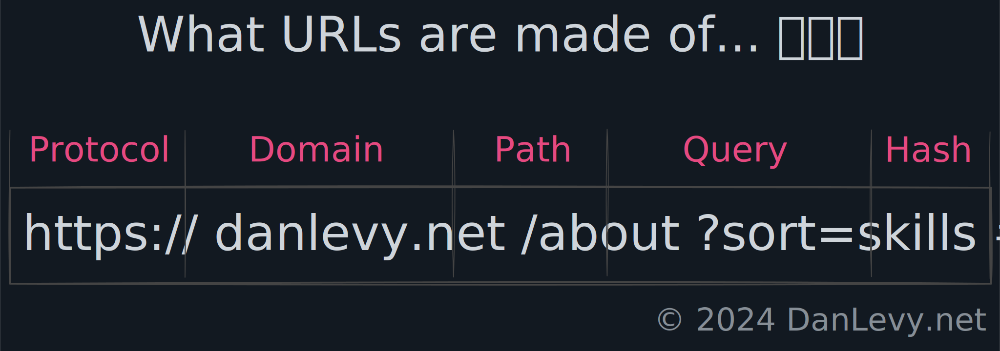
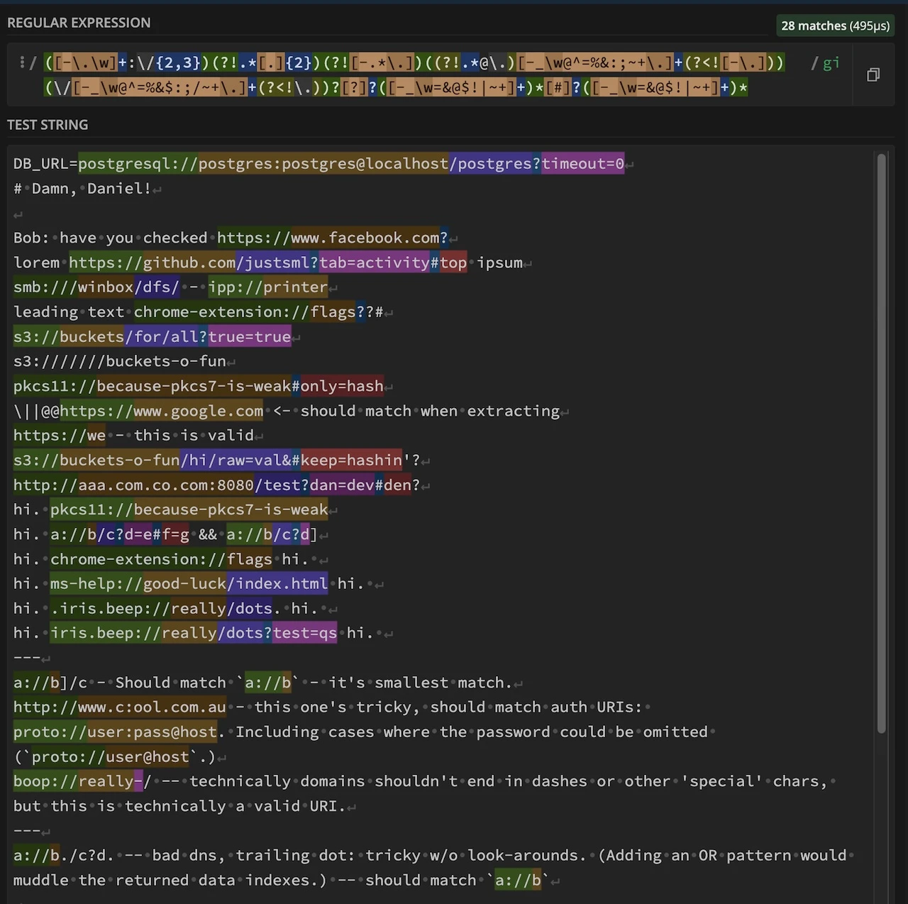

import { CodeTabs } from '../../../../../components/CodeTabs';

**Indice**

- 🚀 [Introduzione](#-introduction)
- 🔍 [Estrazione di URL dal testo](#-extracting-urls-from-text)
- 🛳️ [Il regex da 120+ byte](#️-the-120-byte-regex)
- 🧩 [Analisi passo passo](#-breaking-it-down-step-by-step)
- 🛠️ [Esempio di parsing](#-pa)
- ☑️ [Prossimi passi](#-next-steps)
- 📝 [Riepilogo](#-summary)
- 📚 [Approfondimenti](#-further-learning)

**TL;DR:** Salta subito al [regex da 120+ byte](#️-the-120-byte-regex).

## 🚀 Introduzione

Estrarre URL da testo grezzo può talvolta ricordare una noiosa partita a whack‑a‑mole. Punteggiatura, parentesi e formattazioni ambigue si combinano per ostacolare il tuo lavoro. Che tu stia costruendo un web scraper, un analizzatore di dati o un’app di chat, estrarre correttamente gli URL è fondamentale.

In questo post affronteremo il problema alla radice con un approccio flessibile a due fasi. Il nostro obiettivo è **catturare prima tutti i possibili stringhe simili a URL** e poi gestire la validazione in un processo successivo.

> 💡 **Nota:** Questo pattern non serve a **_validare_** gli URL! È intenzionalmente permissivo con punteggiatura e ortografia errata.

## 🔍 Obiettivo: Estrarre URL dal Testo

Quando si estraggono URL da testo grezzo, un approccio a due fasi è efficace:

1. **Cattura tutto ciò che assomiglia a un URL**: Lancia una rete ampia per afferrare tutte le stringhe che *potrebbero* essere URL. È qui che brilla il nostro “regex da 120+ byte”.
2. **Validazione**: Una volta catturati questi candidati, usa controlli secondari (ad esempio risoluzione DNS, confronto con domini noti) per eliminare le voci non valide.

Termini come `extract` e `parse` vengono spesso usati in modo intercambiabile, ma indicano processi distinti. L'estrazione di URL consiste nell'individuare e catturare potenziali URL da un corpo di testo più ampio. Il parsing, invece, comporta la scomposizione di quegli URL nelle loro parti costitutive.

Quando parlo di parsing o di “parti dell'URL”, mi riferisco ai seguenti componenti:

<figure>
  <figcaption>Le 5 parti di tutti gli URL</figcaption>

</figure>

<details class="inset breakout">
  <summary>Clicca per vedere uno screenshot del matching di sottostringhe di RegEx101.</summary>

  Prima di addentrarci troppo nel regex, usiamo uno strumento visuale per verificare quanto bene il mio pattern cattura molte corrispondenze:

  <figure>
    <figcaption>Uso di [RegEx101.com](https://regex101.com/r/jO8bC4/69) per visualizzare corrispondenze multilinea</figcaption>
    
  </figure>
</details>

## Il regex di 120+ byte

Di seguito trovi un regex conciso progettato per estrarre e analizzare gli URL in un unico passo. Supporta vari protocolli, domini, percorsi e sezioni opzionali di query/fragment.

Non preoccuparti—lo analizzeremo passo dopo passo!

```js title="120+ Byte URL Regex" frame="code"
const urlRegex = /([-.a-z0-9]+:\/{1,3})([^-\/\.[\](|)\s?][^`\/\s\]?]+)([-_a-z0-9!@$%^&*()=+;/~\.]*)[?]?([^#\s`?]*)[#]?([^#\s'"`\.,!]*)/gi;
// Compatibilità: ES5+

// Stesso pattern, suddiviso su più righe per leggibilità:
([-.a-z0-9]+:\/{1,3})
([^-\/\.[\](|)\s?][^`\/\s\]?]+)
([-_a-z0-9!@$%^&*()=+;/~\.]*)
[?]?([^#\s`?]*)
[#]?([^#\s'"`\.,!]*)

```

<blockquote class="inset">Condividi i regex più selvaggi che hai incontrato (O che hai scritto) nei <a href="#post-comments">commenti qui sotto</a>! 🚀</blockquote>

## 🧩 Analisi passo dopo passo

Analizziamo il regex pezzo per pezzo per capire come funziona:

<h3>1. Protocollo (Gruppo 1): <code>{`([-.a-z0-9]+:\/{1,3})`}</code></h3>

<ul>
  <li>**Scopo:** Corrisponde alla parte Protocollo dell'URL (ad es. `http://`, `ftp://`, `custom-scheme://`).</li>
  <li>
    **Spiegazione:**
    <ul>
      <li><code>[-.a-z0-9]+</code>: Corrisponde a una o più lettere minuscole, cifre, trattini o punti (comuni negli schemi di protocollo).</li>
      <li><code>{`:\/{1,3}`}</code>: Corrisponde a due punti seguito da una, due o tre barre oblique (<code>:/</code>, <code>://</code> o <code>:///</code>).</li>
    </ul>
  </li>
</ul>

<h3>2. Dominio (Gruppo 2): <code>{`([^-\/\.[\](|)\s?][^\`\/\s\]?]+)`}</code></h3>

<ul>
  <li>**Scopo:** Cattura la parte dominio o host dell'URL.</li>
  <li>
    **Spiegazione:**
    <ul>
      <li><code>[^-\/\.[\](|)\s?]</code>: Corrisponde a qualsiasi carattere eccetto i caratteri speciali specificati e gli spazi.</li>
      <li><code>[^`\/\s\]?]+</code>: Corrisponde a una o più occorrenze di caratteri diversi da backtick, barre oblique, spazi o parentesi quadre di chiusura.</li>
    </ul>
  </li>
</ul>

<h3>3. Percorso (Gruppo 3): <code>{`([-_a-z0-9!@$%^&*()=+;/~\\.]*)`}</code></h3>

<ul>
  <li>**Scopo:** Corrisponde alla componente di percorso dell'URL.</li>
  <li>
    **Spiegazione:**
    <ul>
      <li><code>[-_a-z0-9!@$%^&*()=+;/~\.]*</code>: Corrisponde a zero o più caratteri sicuri per gli URL, tipicamente presenti nei percorsi.</li>
    </ul>
  </li>
</ul>

<h3>4. Query (Gruppo 4): <code>[?]?([^#\s`?]*)</code></h3>

<ul>
  <li>**Scopo:** Corrisponde facoltativamente a una stringa di query, iniziando con qualsiasi carattere <code>?</code>.</li>
  <li>
    **Spiegazione:**
    <ul>
      <li><code>[?]?</code>: Corrisponde facoltativamente a un <code>?</code>. (Le parentesi quadre non sono strettamente necessarie, ma risultano leggermente più chiare rispetto al doppio <code>??</code> ultra conciso. Forniscono anche un parallelo visivo per il prossimo gruppo di corrispondenza simile <code>[#]?</code>.)</li>
      <li><code>([^#\s`?]*)</code>: Corrisponde a zero o più caratteri che non siano un cancelletto, spazio, backtick o punto interrogativo.</li>
    </ul>
  </li>
</ul>

<h3>5. Fragment (Gruppo 5): <code>[#]?([^#\s'"`\.,!]*)</code></h3>

<ul>
  <li>**Scopo:** Corrisponde facoltativamente all'identificatore di frammento, iniziando con un <code>#</code>.</li>
  <li>
    **Spiegazione:**
    <ul>
      <li><code>[#]?</code>: Corrisponde facoltativamente a un <code>#</code>.</li>
      <li><code>([^#\s'"`\.,!]*)</code>: Corrisponde a zero o più caratteri che non siano punteggiatura proibita o spazi.</li>
    </ul>
  </li>
</ul>

## 🛠️ Esempio di parsing

Ecco come mettere in pratica questo regex mostruoso, con un po' di JavaScript:

<CodeTabs client:only
 tabs={[
    "Code: Extract URLs",
    "Results: Extracted URLs",
    "Results: URL Parts",
  ]} >
```js title="extract-urls.js" frame="code"
const text = `
Check this out: https://example.com/path?query=123#section
And also (ftp://files.server.org/index).
Plus a weird one: custom-scheme://host/param;weird^stuff
`;

const urlRegex =
  /([-.a-z0-9]+:\/{1,3})([^-\/\.[\](|)\s?][^`\/\s\]?]+)([-_a-z0-9!@$%^&*()=+;/~\.]*)[?]?([^#\s`?]*)[#]?([^#\s'"`\.,!]*)/gi;

const matches = [
  ...text.matchAll(urlRegex),
].map((match) => match[0]);
console.log("Extracted URLs:", matches);

const parts = [
  ...text.matchAll(urlRegex),
].map((match) => match.slice(1));
console.log("Extracted Parts:", parts);
```

```json title="extracted-urls.json"
[
  "https://example.com/path?query=123#section",
  "ftp://files.server.org/index",
  "custom-scheme://host/param;weird^stuff"
]
```

```json title="urls-parts.json"
[
  [
    "https://",    // Protocol
    "example.com", // Domain
    "/path",       // Path
    "query=123",   // Query
    "section"      // Fragment
  ],
  [
    "ftp://",           // Protocol
    "files.server.org", // Domain
    "/index",           // Path
    "",                 // Query
    ""                  // Fragment
  ],
  [
    "custom-scheme://",   // Protocol
    "host",               // Domain
    "/param;weird^stuff", // Path
    "",                   // Query
    ""                    // Fragment
  ]
]
```

</CodeTabs>

## ☑️ Prossimi passi

A seconda del caso d'uso, potrebbe essere necessario affinare questo regex o aggiungere ulteriori fasi di validazione e post‑elaborazione.

### Progetti diversi, esigenze diverse

I progetti hanno requisiti e preoccupazioni di sicurezza differenti:

1. **Web Scraping**: convalidare gli URL per assicurarsi che siano raggiungibili e affidabili.  
2. **Data Processing**: estrarre gli URL da contenuti generati dagli utenti mantenendo la sicurezza.  
3. **Data Analysis**: filtrare duplicati o link irrilevanti per scopi di ricerca o marketing.  
4. **User-facing Applications**: ipertestualizzare automaticamente gli URL in app di chat o forum.  

### Post-Processing e Validazione

Dopo aver raccolto gli URL potenziali, applicare controlli aggiuntivi:

- **DNS Lookup**: verificare che i domini risolvano.  
- **Safety Checks**: utilizzare servizi per controllare la presenza di siti malevoli o di phishing.  
- **Custom Rules**: applicare filtri specifici al progetto (ad es., TLD consentiti, lunghezza massima dell'URL).  

## 📝 Riepilogo

Estrarre dati stringa semi‑strutturati potrebbe essere la parte più gratificante della padronanza delle regex.

Ecco un riepilogo dei punti chiave:

- **Usa uno strumento visuale per scrivere, testare** e comprendere i tuoi [pattern Regex.](https://regex101.com/r/jO8bC4/69)
- **Scomponi la sfida in parti** e risolvi ciascuna separatamente. In pratica, i gruppi di cattura fungono da “segnavia” figurativi per la nostra regex.
- **Preferisci espressioni di corrispondenza “lente”, evitando la conformità stretta alle specifiche** quando ingestisci dati.
- **Applica passaggi di validazione** dopo l'estrazione iniziale: è fondamentale tenere conto della sicurezza del progetto e delle esigenze specifiche.

Seguendo questi passaggi, puoi estrarre efficacemente qualsiasi dato stringa semi‑strutturato, ponendo le basi per ulteriori elaborazioni e validazioni.

## 📚 Approfondimenti

- Ricorda di sperimentare con una [demo live su RegEx101.com](https://regex101.com/r/jO8bC4/69)!
- Domanda originale su StackOverflow e un [link alla mia risposta qui.](https://stackoverflow.com/a/34669019/369727)
- [Documentazione MDN sulle espressioni regolari](https://developer.mozilla.org/en-US/docs/Web/JavaScript/Guide/Regular_Expressions)
- [Tecniche avanzate di Regex](https://www.regular-expressions.info/): esplora lookahead, lookbehind e altri pattern avanzati per una corrispondenza più precisa.
- [RFC 3986 – Sintassi generica URI](https://datatracker.ietf.org/doc/html/rfc3986)