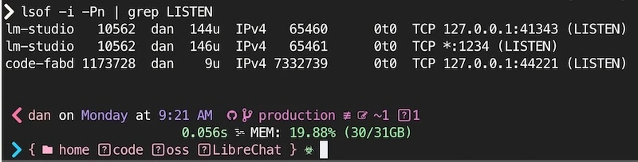

import {CodeTabs} from '../../../../components/CodeTabs';

**תוכן העניינים**

- 🧗‍♀️ [לאמיצים](#️-לאמיצים)
- 🔄 [ריקוד ה־`:latest`](#-ריקוד-ה־latest)
- 🔐 [ניהול סודות: הדרך הנכונה](#-ניהול-סודות)
- 🌐 [סכנת הרשת](#-סכנת-הרשת)
- 🛡️ [בקרות גישה](#️-בקרות-גישה)
- 🔍 [ניטור ואימות](#-ניטור-ואימות)
- ⏰ [טיפים שמתעלמים מהם לעיתים קרובות](#-טיפים-שמתעלמים-מהם-לעיתים-קרובות)
- 🚀 [רשימת בדיקה לפרודקשן](#-רשימת-בדיקה-לפרודקשן)
- 📚 [קריאה נוספת](#-קריאה-נוספת)

## 🧗‍♀️ לאמיצים

אם אתם מארחים בעצמכם שירותי Docker, האבטחה היא באחריותכם מקצה לקצה — אין ספק ענן שיגן עליכם מסריקות פורטים או מקונפיגורציה מרושלת. בין אם אתם מעלים אפליקציות ברשת הביתית ובין אם אתם שוכרים VPS מספקים כמו Vultr, DigitalOcean, Linode, AWS, Azure או Google Cloud, תצטרכו להקשיח את המערכת — ואז לוודא שעשיתם את זה נכון.

במדריך הזה נעבור על אבטחת Docker — מטכניקות `פחות מוכרות` ועד טכניקות `שקשה לבצע נכון`; נבחן canary tokens, אמצעי אחסון לקריאה בלבד, כללי חומת אש, סגמנטציה והקשחה של הרשת, הוספת פרוקסי מאומת ועוד.

נשווה גם בין רשתות ביתיות לסביבות ענן ציבורי, ונראה איך להגדיר פרוקסי עם אימות בסיסי באמצעות Nginx. בסוף יהיו לכם כמה אפשרויות להרחיק את כל ה־riff-raff (חברים, משפחה, ולפעמים אפילו את עצמכם...)

זה המון דברים! אבל חלק גדול מהם קשור זה בזה, ואתם יכולים לבחור רק את מה שרלוונטי ביותר למערכת שלכם. 🍀

## 🔄 ריקוד ה־`:latest`

שמירה על images מעודכנים חיונית לאבטחה. עם זאת, הסתמכות על `:latest` עלולה להכניס שינויים שוברים או builds פגיעים בלי שלב בדיקה.

### הדרך הבטוחה לעדכן

שלבו פקודות עדכון עם `pull` או `build`, כדי לרענן את ה־images במכוון, ואז בצעו restart בחלון זמן שבו תוכלו להבחין בתקלות.

```bash
#!/bin/bash
# update-and-run.sh
docker compose pull && \
  docker compose up -d
```

### נעילת גרסאות לעומת Latest

בחירת הגרסה שאליה נועלים היא איזון בין יציבות לאבטחה. הנה כמה אסטרטגיות נפוצות:

```yaml
# docker-compose.yml
# ...
  # Exact version pinning, best for critical services
  image: postgres:17.2

  # Patch version pinning, good for non-critical services
  image: postgres:17.2

  # Major version pinning, perfect for hobby projects
  image: postgres:17

  # Yolo, avoid if possible
  image: postgres:latest
```

השתמשו ב־[Dependabot](https://github.com/features/security) או ב־[Renovate](https://github.com/renovatebot/renovate) כדי לפתוח PRs לעדכונים שאפשר לבדוק. עבור כל דבר שהייתם מצטערים לבנות מחדש בשתיים לפנות בוקר, נעלו לגרסה או ל־digest ספציפיים ותנו לאוטומציה להודיע לכם מתי הגיע הזמן להתקדם.

_ספרו לי אילו כלים אתם הכי אוהבים כדי לשמור על Docker images מעודכנים!_

## 🔐 ניהול סודות

- [יצירת סודות חזקים](#יצירת-סודות-חזקים)
- [Canary Tokens](#canary-tokens)
- [שדרוג מ־`.env` ל־MacOS Keychain](#שדרוג-מ-env-ל-macos-keychain)
{/* - [Placeholder Validation](#placeholder-validation) */}

יש דרכים רבות לנהל סודות, אבל אחד הכללים החשובים ביותר שכדאי להיצמד אליהם הוא: **לעולם אל תקודדו סודות ישירות בתוך ה־Docker images שלכם ואל תבצעו להם commit ל־git.** זו אחת מטעויות האבטחה הנפוצות ביותר, היא יוצרת סיכון לטווח ארוך, וקשה לתקן אותה.

אחסון מאובטח של סודות הוא נושא רחב עם אפשרויות רבות — מקובצי `.env`, דרך [Docker secrets](https://docs.docker.com/compose/how-tos/use-secrets/), [1Password](https://1password.com/downloads/command-line)/[Bitwarden](https://bitwarden.com/developers/), ועד מנהל סודות כמו [HashiCorp Vault](https://www.vaultproject.io/) או AWS Secrets Manager.

תצטרכו לבחור את רמת ההשקעה והאבטחה ה"נכונה" למקרה השימוש שלכם.

{/*
TODO: Move to Maintainer's Guide
// TODO: Move to Maintainer's Guide

### אימות מצייני מקום

<blockquote>לא הייתם מאמינים כמה קל לפרוץ ל־JWT כשהסוד בכלל לא סודי!</blockquote>

<p className='inset'>💡 ודאו שהסודות תמיד ייחודיים. נסו להפוך הרצה עם ברירות מחדל לא בטוחות או מקודדות־קשיחה לבלתי אפשרית.</p>

אם אתם משתמשים במצייני מקום כמו `__WARNING_REPLACE_ME__` בסודות שלכם, מצוין — אולי מישהו ישים לב!

ליתר ביטחון, אפשר להוסיף גם שכבת בטיחות קטנה בזמן הריצה, במעט מאמץ. כך אפשר לעשות זאת ב־JavaScript, ב־Rust וב־Go:

<CodeTabs client:load tabs={["Helper commands", "Persist secrets in environment", "Use secrets per command"]}>

```javascript
// validateSecrets.js
const validateSecrets = () => {
  const unsafePlaceholder = /__WARNING_REPLACE_ME__/;
  const missingSecrets = Object.entries(process.env).filter(
    ([key, value]) => unsafePlaceholder.test(value)
  );

  if (missingSecrets.length) {
    console.error("Unsafe secrets detected:", missingSecrets);
    process.exit(1);
  }
};

validateSecrets();
```

```rust
// validate_secrets.rs
use std::env;

fn validate_secrets() {
    let unsafe_placeholder = "__WARNING_REPLACE_ME__";
    for (key, value) in env::vars() {
        if value.contains(unsafe_placeholder) {
            panic!("Unsafe secret in {}", key);
        }
    }
}

fn main() {
    validate_secrets();
}
```

```go
// validate_secrets.go
package main

import (
	"fmt"
	"os"
	"strings"
)

func validateSecrets() {
	placeholder := "__WARNING_REPLACE_ME__"
	for _, env := range os.Environ() {
		pair := strings.SplitN(env, "=", 2)
		if len(pair) == 2 && strings.Contains(pair[1], placeholder) {
			panic(fmt.Sprintf("Unsafe secret in %s", pair[0]))
		}
	}
}

func main() {
	validateSecrets()
}
```
</CodeTabs>

*/}

### יצירת סודות חזקים

הנה סקריפט קטן ליצירת סודות חדשים עבור קובץ `.env`:

```bash
#!/bin/bash
# generate-secrets.sh

generate_secret() {
    local length=${1:-30}
    local generate_length=$((length + 4))
    openssl rand -base64 "$generate_length" | tr -d '+=/\n' | cut -c1-"$length"
}

[ -f .env ] && { echo ".env file already exists!"; exit 1; }

cat > .env << EOL
POSTGRES_PASSWORD=$(generate_secret)
JWT_SECRET=$(generate_secret 64)
SESSION_KEY=$(generate_secret 24)
REDIS_PASSWORD=$(generate_secret 20)
UNSAFE_PLACEHOLDER=__WARNING_REPLACE_RANDOM_TEXT__
EOL

echo "New .env file generated with secure random values!"
```

### Canary Tokens

[**Canary Tokens**](https://canarytokens.org/) הם דרך מצוינת לזהות אם הסודות שלכם נחשפו (ונעשה בהם שימוש). הם כמו חוטי־מעידה שאפשר להוסיף לכל קובץ, כתובת URL או אסימון רגישים.

שקלו להציב אותם לצד הסודות שבאמת מדאיגים אתכם: קובצי `.env`, משתני CI, מנהלי סיסמאות, תיקיות גיבוי ופרטי גישה לענן. אל תהפכו את זה לתיאטרון; הציבו חוטי־מעידה במקומות שתוקף אמיתי, או טעות עתידית שלכם, עלולים לגעת בהם.

יש סוגים רבים של "אסימוני" canary שאפשר לבחור מתוכם — אסימוני AWS, מספרי [כרטיסי אשראי מזויפים](https://blog.thinkst.com/2024/12/its-baaack-credit-card-canarytokens-are-now-on-your-consoles.html), קובצי Excel ו־Word, קובצי Kubeconfig, פרטי גישה ל־VPN, ואפילו קובצי sql dump יכולים לכלול חוט־מעידה!

#### שיטות מומלצות ל־Canary Token

- **להציב בכל מקום**: בכל קובץ `.env`, בכל pipeline של CI/CD ובכל "מנהל סודות" שעולה בדעתכם.
  - הציבו קובץ `passwords.xlsx` או `passwords.docx` בתיקיית הבית שלכם.
  - הוסיפו פרופיל AWS בשם `billing_prod`, כשהסוד שלו הוא canary token.
  - צרו קובץ `private.key` בתיקיית `~/.ssh` שלכם.
  - צרו dump מסוג Canary SQL בשם `all_credit_cards.sql` בתיקיית `~/backups` שלכם.
- **לנטר**: הגדירו כללים או התראות בדוא"ל כדי לזהות הפעלה של canary token.

### שדרוג מ־`.env` ל־MacOS Keychain

למשתמשי Mac, אחת האפשרויות הפשוטות ביותר היא להשתמש ב־Keychain.

הנה דרך פשוטה לאוטומציה של טעינת סודות מ־OSX keychain, עם תמיכה ב־`TouchID`, ובאופן מאובטח מעט יותר מקובצי `.env`.

קרדיט מקורי: [Brian Hetfield](https://gist.github.com/bmhatfield/f613c10e360b4f27033761bbee4404fd) ו־[Jan Schaumann](https://www.netmeister.org/).

<CodeTabs client:load tabs={[
  "פקודות עזר",
  "שמירת סודות בסביבה",
  "שימוש בסודות לפי פקודה"]
}>
```bash title="keychain-secrets.sh"
### Functions for setting and getting environment variables from the OSX keychain ###
### Adapted from: https://www.netmeister.org/blog/keychain-passwords.html and 
Original credit: [Brian Hetfield](https://gist.github.com/bmhatfield/f613c10e360b4f27033761bbee4404fd) and [Jan Schaumann](https://www.netmeister.org/).

# Use: get-keychain-secret SECRET_ENV_VAR
function get-keychain-secret () {
    security find-generic-password -w -a ${USER} -D "environment variable" -s "${1}"
}

# Use: set-keychain-secret SECRET_ENV_VAR
# You will be prompted to enter the secret value!
function set-keychain-secret () {
    [ -n "$1" ] || print "Missing environment variable name"
    
    # prompt user for secret
    echo -n "Enter secret for ${1}"
    read secret
    [ -n "$secret" ] || return 1

    ( [ -n "$1" ] || [ -n "$secret" ] ) || return 1
    security add-generic-password -U -a ${USER} -D "environment variable" -s "${1}" -w "${secret}"
}
```

```bash title="~/code/app/.env-secrets.sh"
source ~/keychain-secrets.sh

# Load Env vars into the current shell
export AWS_ACCESS_KEY_ID=$(get-keychain-secret AWS_ACCESS_KEY_ID);
export AWS_SECRET_ACCESS_KEY=$(get-keychain-secret AWS_SECRET_ACCESS_KEY);
# Note: If an attack can run `env` in your shell, then these secrets could be exposed!
```

```bash title="~/code/app/scripts/env-run.sh"
#!/usr/bin/env bash
source ~/keychain-secrets.sh

# Specify all secrets for this project
AWS_ACCESS_KEY_ID=$(get-keychain-secret AWS_ACCESS_KEY_ID) \
AWS_SECRET_ACCESS_KEY=$(get-keychain-secret AWS_SECRET_ACCESS_KEY) \
  "$@"

# Note: Using a shell wrapper helps prevent secrets from staying
# around in the environment. And it's safe to commit.

# Usage:
# ./scripts/env-run.sh docker compose up -d
# ./scripts/env-run.sh docker run -e AWS_ACCESS_KEY_ID -e AWS_SECRET_ACCESS ...
```
</CodeTabs>

## 🌐 סכנת רשת

### רשתות מותאמות אישית ופורטים פנימיים

בידוד נכון של שירותים באמצעות רשתות Docker הוא דרך חשובה לצמצום משטח התקיפה שלכם.

היזהרו כשאתם פותחים חורים ברשת! העברת פורט אחת שהוגדרה לא נכון עלולה להסתיים רע מאוד.

כברירת מחדל, שירותים ברשת LAN פרטית לא יהיו חשופים לאינטרנט — צריך להעביר במפורש פורטים מהנתב שלכם.

### Docker ב־LAN

בין שאתם מפתחים שמריצים שרתי פיתוח באופן מקומי ובין שאתם מארחים שירותים עצמאית מהרשת המקומית שלכם, **הנחות לגבי מודל הרשת של Docker עלולות לגרום לצרות.**

מפתחים מופתעים לעיתים קרובות לגלות שהשיטות ה"מסורתיות" לאבטחת שרתי Linux (`iptables`, הגבלת אפשרויות `sysctl` של tcp/ip) עלולות **להיכשל בשקט** במארחי Docker! זה נכון במיוחד כש־**מארחים עצמאית — או מריצים בסביבת רשת ביתית טיפוסית.** (ולמי שלא שמע עד עכשיו: זה עלול לאפשר גישה לקונטיינרי פיתוח ב־MacBook שלכם!!!)

> ⚠️ **אזהרה מס' 1:** פורטים שפורסמו על ידי Docker עלולים לעקוף את כללי חומת האש שחשבתם שמגינים על המארח, במיוחד עם UFW ב־Ubuntu/Debian. זה לא הופך כל כלל חומת אש לחסר תועלת, אבל המשמעות היא ש־"UFW אומר deny" אינו הוכחה. [ראו issue #690: Docker עוקף את כללי חומת האש של ufw](https://github.com/moby/moby/issues/690).

> ⚠️ **אזהרה מס' 2:** קשירת פורטים לכתובות IP מקומיות (למשל, `-p 127.0.0.1:8080:80`) היא ברירת המחדל הנכונה, אבל בגרסאות Docker Engine שקדמו ל־28.0.0 היו מקרים שבהם מארחים באותה רשת L2 עדיין יכלו להגיע לפורטים שפורסמו על localhost. [Docker מתעד את הסייג הזה במדריך פרסום הפורטים שלו](https://docs.docker.com/engine/network/port-publishing/), וההרגל לאמת באמצעות nmap שמופיע בהמשך עדיין חשוב.

<p class="inset">אם הופתעתם לגלות את זה, גם אני!</p>

**קשירת פורטים לכתובות IP מקומיות היא עדיין נוהג טוב** ויש לה השפעה משמעותית **בסביבות ענן מנוהלות וברשתות שהוגדרו במיוחד.** 
{/* אל תחשבו על חומת האש או על הרשת הפרטית שלכם כעל קו ההגנה העיקרי או היחיד; הוסיפו לתמונה גם רשתות Docker לשיפור ה־**בידוד**, ותמיד בדקו אם בכלל צריך לחשוף פורטים. */}

### דוגמת Docker Compose

הנה דוגמה לקובץ `docker-compose.yml` שקושר את השירות `app` אל `127.0.0.1:8080` ומחבר את שני הקונטיינרים לרשת המותאמת אישית `backend`.

```yaml title="docker-compose.yml" {6-10,14-17}
networks:
  backend:

services:
  app:
    networks:
      - backend
    ports:
      # Bind to localhost if possible
      - "127.0.0.1:8080:8080"
    # ... other settings
  database:
    image: postgres:17.1
    # No ports needed; accessible inside backend network.
    networks:
      - backend

```

{/* #### בדיקה ואימות

כמו בכל אמצעי אבטחה, חשוב מאוד **לבדוק ולאמת** את הגדרת הרשת שלכם. */}

{/* בעוד שאבטחת רשת וביקורת הן אחריות במשרה מלאה ברוב החברות, רוב מפעילי השירותים העצמאיים לא משקיעים בזה שום זמן! */}

{/* תראו, אני מבין. זה יכול להרתיע. _(Subnets, net masks, CIDR, VLANs, and routing tables, oh my! אם זה לא אמר לכם כלום, זה בסדר — הגעתם למקום הנכון. וגם, כרגע אין צורך לדאוג לכל זה.)_ */}

### שיטות עבודה מומלצות לרשתות

- 🏆 **אל תפרסמו שום פורט** לאחרונה גיליתי שזה שימושי יותר מכפי שאפשר לצפות! כשמשתמשים ברשת בעלת שם (bridge), לקונטיינרים יש גישה לא מסוננת זה לזה. הם מתנהגים כאילו הם נמצאים מאחורי רשת מקומית (שער NAT).
  - זה לא אפשרי בכל תרחיש, אבל עשוי להיות שימושי לקונטיינרים שמריצים משימות אצווה, או שניגשים אליהם בעיקר דרך `attach` או `exec`.
- 🥇 **השתמשו ברשתות Docker** כדי לבודד קונטיינרים ולשלוט באילו קונטיינרים יכולים לתקשר זה עם זה.
- 🥉 **השתמשו בקשירה ל־localhost**: אף שהיא [לא מושלמת](https://github.com/moby/moby/issues/45610), בדרך כלל עדיף לקשור פורטים לכתובת loopback (למשל, `127.0.0.1:8080:80`). רק הקפידו [לאמת את ההגדרה שלכם.](#-ניטור-ואימות)

## 🛡️ בקרות גישה

בקרות גישה הן חלק קריטי באבטחת שירותי Docker. זה כולל הגבלת היכולות וההרשאות של קונטיינרים, הגבלת הגישה ל־Docker socket ועוד.

- [הגבלת יכולות של קונטיינרים](#הגבלת-יכולות-של-קונטיינרים)
- [גישה ל־Docker Socket](#גישה-ל-docker-socket)
- [חסימת מדינה!](#חסימת-מדינה)
- [הקשחת CloudFlare Proxy Host](#הקשחת-cloudflare-proxy-host)

### הגבלת יכולות של קונטיינרים

נוהג טוב נוסף בתחום בקרות הגישה הוא להגביל את היכולות של הקונטיינרים. כך מצמצמים את רדיוס הפגיעה של כמה סוגי איומים, מהסלמת הרשאות ועד חטיפת תעבורה. זו לא מערכת כוח, אבל היא מסירה הרשאות שרוב הקונטיינרים מעולם לא היו צריכים.

**מהן capabilities?** הרשאות או יכולות בעלות שם, המוגדרות על ידי ליבת Linux. (דף ה־[`capabilities`](https://man7.org/linux/man-pages/man7/capabilities.7.html) מכיל רשימה מלאה.) הן כוללות דברים כמו `CAP_CHOWN` (שינוי בעלות על קבצים), `CAP_NET_ADMIN` (הגדרת ממשקי רשת), `CAP_KILL` (הריגת כל תהליך) ועוד רבות אחרות.

יש שתי דרכים לקבוע אילו יכולות נדרשות:

1. **ניסוי וטעייה**: בשיטה הזו, איטית אך יעילה, מתחילים בלי שום יכולות ומוסיפים אותן בחזרה, אחת־אחת, עד שהאפליקציה עובדת.
2. **חיפוש עבודה קודמת**: חפשו "`project-name` `cap_drop` Dockerfile", או "`project-name` `cap_drop` docker-compose.yml", כדי לבדוק אם מישהו אחר כבר עשה את העבודה עבורכם. LLM יכול להציע נקודת פתיחה, אבל התייחסו להצעה כאל ניחוש עד שתבדקו את הקונטיינר ותקראו את תיעוד האימג׳.

#### שיטות עבודה מומלצות ליכולות

- **השמיטו את כל היכולות**: השתמשו ב־`cap_drop: [ ALL ]` כדי להשמיט מהקונטיינר את כל יכולות Linux.
- **ללא הרשאות חדשות**: השתמשו ב־`security_opt: [ no-new-privileges=true ]` כדי למנוע מהקונטיינר לקבל הרשאות חדשות.

```yaml title="Example: Drop/Limit Capabilities" {5-14}
services:
  database:
    image: postgres:17.1
    networks: [ db-network ]
    security_opt:
      - no-new-privileges:true
    cap_drop:
      - ALL
    cap_add:
      - CHOWN
      - DAC_READ_SEARCH
      - FOWNER
      - SETGID
      - SETUID
  db-admin:
    image: dpage/pgadmin4:4.1
    networks: [ db-network ]
    ports:
      - "8081:80"
    # ... other settings
networks:
  db-network:
```

כעת השירותים שלכם יכולים לתקשר זה עם זה דרך הרשת `db-network`. Docker Compose ייצור את הרשת הזו באופן אוטומטי.

השתמשו באפשרות `--external`/`external:` כדי להצטרף ל־**רשת קיימת מראש.** השמיטו אותה כדי ליצור רשת חדשה.

### גישה ל־Docker Socket

#### ⚠️ אזהרה: `docker.sock` הוא למעשה גישת מנהל מערכת ל־host

<blockquote class="inset">⚠️ האפשרות \`:ro\` לא משפיעה על קלט־פלט שנשלח דרך ה־socket!</blockquote>

היא רק מבטיחה שנתיב ה־socket עצמו יותקן לקריאה בלבד. קריאות ה־API שנשלחות דרך ה־socket עדיין יכולות ליצור קונטיינרים, לטעון נתיבים מה־host ולעשות דברים מרגשים מאוד אחרים, שככל הנראה לא התכוונתם להאציל.

{/* כל תהליך שיכול "לפתוח" את ה־socket יכול (כנראה) להשיג גישת root ל־host. */}

#### שיטות עבודה מומלצות ל־Socket

- 🥇 **הימנעו מטעינת ה־Docker socket,** כנראה יש חלופה טובה יותר.
- 🫣 אם אין ברירה, **הציבו לפניו proxy מצומצם** ואפשרו רק את נקודות הקצה של ה־API שהאפליקציה באמת צריכה. בדקו את פרויקט `docker-socket-proxy`, שנוצר במקור על ידי Tecnativa: [docker-socket-proxy](https://github.com/Tecnativa/docker-socket-proxy). לאחר מכן ודאו שהקריאות שנחסמו אכן נחסמות.
- 🤢 טוב, _אולי_ שיתוף שלו מקובל בסביבת בדיקות **בעלת רמת אמון גבוהה מאוד** ו־**סיכון נמוך**.

#### חסימת מדינה!

לפעמים זה שימושי, אבל זו לא גבול אבטחה אמיתי.

_אנחנו מדברים על ישות גיאופוליטית, לא על המוזיקה..._

אם אתם מארחים אפליקציות בעיקר עבור משפחה וחברים מקומיים, תוכלו לחסום תעבורה ממדינות שאינכם מצפים לקבל מהן תעבורה. לחלופין, אפשר לאפשר תעבורה רק ממדינות שמהן אתם כן מצפים לקבל אותה. זה מפחית רעש; זה לא עוצר VPN-ים, proxies, botnets או אנשים סבלניים.

הנה סקריפט שחוסם את כל התעבורה מסין:


```bash title="block-china.sh"
curl -fsSL https://www.ipdeny.com/ipblocks/data/countries/cn.zone | \
  while read line; do ufw deny from $line to any; done

```

באופן דומה, אפשר לאפשר תעבורה רק מארצות הברית:

```bash title="allow-usa.sh"
curl -fsSL https://www.ipdeny.com/ipblocks/data/countries/us.zone | \
  while read line; do ufw allow from $line to any; done
```

#### הקשחת מארח Proxy של CloudFlare

אם שרת הבית שלכם מוגן מאחורי כתובת IP של CloudFlare (במצב proxy), תוכלו להגביל את הגישה לכתובות ה-IP של CloudFlare בלבד ולרשת המקומית שלכם.

זה דומה במקצת ל[חסימת מדינה!](#חסימת-מדינה) שהוזכרה למעלה, אבל עם שליטה הדוקה הרבה יותר.

```bash title="whitelist-ingress-from-cloudflare.sh"
ufw default deny incoming # Block all incoming!!!
ufw default allow outgoing # Allow all outgoing
ufw allow ssh # Allow SSH

# Allow access for local subnet (preferably dedicated DMZ/VLAN for hosted services)
ufw allow from 10.0.0.0/8 to any port 443

# Allow CloudFlare IPs
curl -fsSL https://www.cloudflare.com/ips-v4 | \
  while read line; do ufw allow from $line to any port 443; done
# Add IPv6 support
# curl -fsSL https://www.cloudflare.com/ips-v6 | \
#   while read line; do ufw allow from $line to any port 443; done

```

כדי לבדוק שינויים המבוססים על מיקום גאוגרפי, VPN עם נקודות יציאה במדינה הרצויה יכול להיות שימושי. מידע נוסף נמצא בסעיף [ניטור ואימות](#-ניטור-ואימות).

### אבטחה בשכבת האפליקציה

אחרי ש[הקשחתם את אבטחת הרשת והמארח](#-סכנת-רשת), ייתכן שתגלו שיש עוד עבודה.

עכשיו צריך לחשוב על שכבת ה״אפליקציה״ של השירותים עצמם.

<p class="inset">האם למסד הנתונים יש סיסמה תקפה? האם הקונטיינר מטפל אוטומטית ב-HTTPS ובתעודות? האם האפליקציה כוללת אימות מובנה? האם יש הגבלות על כתובות האימייל שיכולות להירשם? האם קיימים פרטי התחברות או משתני סביבה ברירת מחדל שצריך לשנות?</p>


הדרך היחידה _לדעת_ היא לבדוק. במקרה הזה, התחילו ב-`README` ובקבצים חשובים נוספים כמו `docker-compose.yml`, `Dockerfile` ו-`.env.*`. בדקו גם את הפרויקט עצמו וגם, רצוי, את השירותים התומכים בו (למשל Postgres, Redis וכדומה).

#### Reverse Proxy

שכבת הגנה נוספת היא אימות בסיסי (basic auth). אל תשתמשו בו בלי HTTPS. בשירותים ישנים, הצבת basic auth לפני נתיב ניהול מספיקה לעיתים קרובות כדי לעצור בקשות אקראיות וסורקים לא מאומתים מלגשש ישירות בשירות.

```nginx

# /etc/nginx/conf.d/secure-admin.conf
location /admin {
    auth_basic "Restricted Access";
    auth_basic_user_file /etc/nginx/.htpasswd;
    proxy_pass http://internal_admin:80;
    proxy_set_header X-Real-IP $remote_addr;
}

```

צרו פרטי התחברות:

```bash

htpasswd -c /etc/nginx/.htpasswd admin

```

עם proxy של basic auth, לתוקפים יש מכשול נוסף — שם משתמש וסיסמה — לפני שהם מגיעים לשירות הפנימי שלכם.

אפשרות נוספת היא להשתמש בשירות כמו [Traefik](https://traefik.io/) או [Caddy](https://caddyserver.com/), שיכול להפוך את הגדרת ה-HTTPS וה-basic auth לאוטומטית עבורכם.

אם אתם רוצים לנהל דומיינים ושירותים רבים באמצעות ממשק גרפי, אני ממליץ על [Nginx Proxy Manager](https://nginxproxymanager.com/).

## 🔍 ניטור ואימות

- [בדיקת הפורטים שלכם](#בדיקת-הפורטים-שלכם)
- [הצגת פורטים פתוחים](#הצגת-פורטים-פתוחים)
- [ניטור קבצים](#ניטור-קבצים)

זהו **השלב החשוב ביותר, וזה שהכי נוטים לדלג עליו.** אתם יכולים להחזיק את חומת האש הטובה ביותר, את הרשת הטובה ביותר ואת נוהלי העבודה הטובים ביותר, אבל אם אינכם מאמתים אותם, אין לכם מושג אם הם עובדים.

בנוסף, היכרות עם קומץ פקודות בלבד — או עם המקום שבו אפשר למצוא אותן — עשויה להיות ההבדל בין מניעת פריצה לבין התמודדות איתה. התחושה שאתם האקרים היא רק בונוס. (לפרטים ולדוגמאות, דלגו לסעיף [ניטור ואימות](#-ניטור-ואימות).)

<p class="inset">אל תסמכו, אמתו פעמיים</p>

### בדיקת הפורטים שלכם

<p class="inset">⚠️ חשוב: אין לסרוק מארחים שאינם בבעלותכם.</p>


בין אם אתם נמצאים ברשת ביתית ובין אם ב-VPS, תרצו לדעת אילו פורטים פתוחים לעולם.

יש 2 דרכים לעשות זאת:

- לבדוק את הרשת (`nmap`, `masscan`)
- לשאול את מערכת ההפעלה (`lsof`, `netstat`, `ss`)

#### בדיקה מחוץ לרשת שלכם

תצטרכו את כתובת ה-IP הנוכחית (הציבורית) שלכם. קל להשיג אותה באמצעות שירותים כמו `ifconfig.me`: `curl https://ifconfig.me`. לחלופין, חפשו אותה בלוח הבקרה של ספק האחסון שלכם.

```bash title="Get Public IP"
curl -fsSL https://ifconfig.me
# --> CURRENT PUBLIC IP
```

אחרי שיש לכם את כתובת ה-IP הציבורית, עליכם **להתחבר לרשת חיצונית.** תוכלו להשתמש במחשב של חבר, בטלפון או בנקודת גישה סלולרית של 5G, או בשרת ייעודי אצל ספק אירוח.

```bash title="nmap External Scan"
target_host="$(curl -fsSL https://ifconfig.me)"

# Note: Ensure `target_host` is the desired IP

# Scan specific ports:
nmap -A -p 80,443,8080 --open --reason $target_host
# Top 100 ports:
nmap -A --top-ports 100 --open --reason $target_host
# All ports
nmap -A -p1-65535 --open --reason $target_host

```

#### בדיקה בתוך הרשת שלכם

תרגלו שימוש ב-`nmap`: סרקו את הרשת המקומית שלכם או אחד מהשרתים שלכם, ובדקו את הנתב, המדפסת והמקרר החכם.

{/* While port scans are a constant fact of life, it might be a violation of the CFAA (Computer Fraud and Abuse Act) in the US. So, only scan things you own. */}

#### דוגמאות לפקודות סריקה

```bash

# Scan your localhost for all open ports
nmap -sT localhost

# Scan your machine’s private IP for services
nmap -sV 192.168.1.10

# Find service details on your network
nmap -sn 192.168.0.0/24
nmap -sn 10.0.0.0/24
# Or on a docker 172.18.0.1/16
nmap -sn 172.18.0.1/16

```

```text title="nmap Scan" frame="terminal"
% nmap -A --open --reason 192.168.0.87

Starting Nmap 7.95 ( https://nmap.org ) at 2025-01-06 13:51 MST
Nmap scan report for dev02.local (192.168.0.87)
Host is up, received syn-ack (0.0067s latency).
Not shown: 995 closed tcp ports (conn-refused)
PORT     STATE SERVICE     REASON  VERSION
22/tcp   open  ssh         syn-ack OpenSSH 9.6p1 Ubuntu 3ubuntu13.5 (Ubuntu Linux; protocol 2.0)
| ssh-hostkey:
|_  256 {FINGERPRINT} (ED25519)
80/tcp   open  http        syn-ack Caddy httpd
|_http-server-header: Caddy
|_http-title: Dev02.DanLevy.net
443/tcp  open  ssl/https   syn-ack
|_http-title: Dev02.DanLevy.net
1234/tcp open  http        syn-ack Node.js Express framework
|_http-cors: GET POST PUT DELETE PATCH
|_http-title: Dev02.DanLevy.net (application/json; charset=utf-8).
Service Info: OS: Linux; CPE: cpe:/o:linux:linux_kernel

Service detection performed. Please report any incorrect results at https://nmap.org/submit/ .
Nmap done: 1 IP address (1 host up) scanned in 13.36 seconds
```

### הצגת פורטים פתוחים

כדאי להכיר את `lsof` — הוא זמין ב-MacOS וב-Linux. הוא מציג את מצב הרשת ואת פעילות הדיסק ברמת פירוט גבוהה.

```bash title="lsof Commands"
# Monitor specific port
sudo lsof -i:80 -Pn


# ניטור חיבורים במצב ESTABLISHED
sudo lsof -i -Pn | grep ESTABLISHED
# הצגת LISTEN
sudo lsof -i -Pn | grep LISTEN

# כדי לראות שמות רשת במקום כתובות IP (בדיקות DNS הפוכות עשויות להיות איטיות מאוד)
sudo lsof -i -P | grep LISTEN

# ניטור כל חיבורי הרשת
sudo watch -n1 "lsof -i -Pn"

```

#### פלט לדוגמה



### ניטור קבצים

כדי לזהות אילו **תהליכים** משתמשים ברוחב הפס הגדול ביותר של **הכונן הקשיח**, אפשר להשתמש ב־`iotop`:

```bash

sudo iotop

```

כדי לראות שינויים בקבצים בודדים, אפשר להשתמש ב־`inotifywait` ב־Linux או ב־`fswatch` ב־MacOS:

זה יכול לעזור לזהות התנהגות לא מורשית או חריגה, לפי תיקייה או בכל המערכת.

```bash

# Monitor all file changes in a directory
sudo inotifywait -m /path/to/directory

```

ב־MacOS אפשר להשתמש ב־`fswatch`:

התקינו באמצעות `brew install fswatch`

```bash

fswatch -r /path/to/directory

```

## ⏰ טיפים שלעתים קרובות מתפספסים

1. **הגבלת קצב** לניסיונות אימות ולכל נקודת קצה קריטית אחרת. בין אם באמצעות המודול `limit_req` של Nginx ובין אם באמצעות `fail2ban` לגישה ב־SSH, האטת ניסיונות brute-force היא _כנראה_ רעיון טוב. אני אומר _כנראה_ כי בעידן ה־IPv6 והבוטנטים הזולים, ובכן, זה כבר לא מה שהיה.

2. **השתמשו ב־Volumes לקריאה בלבד** היכן שאפשר:
   ```yaml

services:
     webapp:
       volumes:
         - ./config:/config:ro

```
   בשילוב עם שיטות עבודה מומלצות אחרות — משתמשים שאינם root והרשאות מינימליות לתיקיות — אפשרות ה־`:ro` ב־volume mount מספקת שכבת הגנה נוספת מפני שינויים מקריים ומפני ניסיונות כתיבה מסוימים מתוך הקונטיינר. היא אינה מגינה על ה־host מפני תהליך שכבר מחזיק בהרשאות רחבות יותר.

3. **בדקו באופן שגרתי את הגישה של הקונטיינרים**.
   אם קונטיינר לא זקוק ל־secret, לפורט או ל־mount מסוימים, הסירו אותם!

4. **היזהרו מה־Riff-Raff של ה־WiFi**
   אני בטוח שלעולם לא תמסרו את סיסמת ה־WiFi שלכם, במיוחד לא לאיזה טיפוס מפוקפק, נכון? טוב, חוץ מכמה חברים... אוקיי, אולי גם למשפחה. לעולם אי אפשר לדעת אילו אפליקציות מותקנות אצלם ואילו מהן עלולות לשתף את ה־SSID והסיסמה שלכם עם כל העולם.

### רשת ביתית לעומת ספק ציבורי לעומת מנהור

1. **בידוד וירטואלי/DMZ**: בשרתים ביתיים, העבירו אותם ל־VLAN נפרד או ל־DMZ, אם אפשר. כך המכשירים הפנימיים שלכם לא יהיו חשופים לפגיעה אפשרית שמקורה בצד השרת.
   - השתמשו בנתב נפרד או ב־VLAN נפרד עבור השרת הביתי.
   - השתמשו ברשת WiFi נפרדת עבור השרת הביתי.
   - השתמשו ב־subnet נפרד עבור השרת הביתי.

2. **ספקי ענן**: Hetzner, Vultr, DigitalOcean, Linode, AWS, Azure ו־Google Cloud מספקים יכולות Firewall שונות.
   - חלק מהספקים והשירותים חוסמים פורטים כברירת מחדל. חלקם מציעים אפשרויות הפעלה או תוספים. בדקו את התיעוד של ספק השירות שלכם.
   - ספקים רבים מציעים שירותי ניטור מתקדמים וזיהוי איומים.

3. **VPN ומנהור**: שקלו להשתמש באפשרות דמוית VPN או בשירות מנהור כדי לחבר שירותים באופן מאובטח דרך האינטרנט, בלי לחשוף אותם לאינטרנט הציבורי.
   - TailScale, ngrok, ZeroTier.
   - WireGuard, OpenVPN.

{/* 3. **Hardening Against Internal/Lateral Attacks**: One infected device can compromise an entire network. Segmenting Docker services on custom networks, using hardware, UFW rules, and blocking unneeded ports can all help reduce risk (when properly configured.) */}

## 🚀 רשימת בדיקה לפרודקשן

- [ ] **Secrets**: כל ה־secrets נוצרו באופן אקראי ונשמרים בצורה מאובטחת
- [ ] **עדכונים**: אסטרטגיית עדכון הקונטיינרים מתועדת ואוטומטית. (גם כמה פקודות בקובץ טקסט זה בסדר.)
- [ ] **רשת**: רק הפורטים הנחוצים חשופים, ורשתות פנימיות מוגדרות.
- [ ] **כללי Firewall**: ברירת המחדל היא חסימה, עם אישורים מפורשים; חסימות לפי מדינה אם נדרש.
- [ ] **Reverse Proxy**: ‏Nginx, ‏Caddy או ‏Traefik יכולים להוסיף שכבה של basic auth
- [ ] **Canary Tokens**: מקמו אותם ליד הקבצים הרגישים ופרטי ההתחברות שבאמת הייתם בודקים אילו מישהו היה נוגע בהם.
- [ ] **ניטור**: הכירו את המערכות שלכם באמצעות `nmap`, ‏`lsof`, ‏`inotifywait`, ‏`glances` וכלים דומים.
- [ ] **אסטרטגיית גיבוי**: נבדקה, רצוי אוטומטית, ומאוחסנת מחוץ לאתר.
- [ ] **ההרשאות המזעריות הנדרשות**: משתמשים שאינם root בקונטיינרים, ו־Volumes לקריאה בלבד.

## 📚 קריאה נוספת

- [שיטות מומלצות לאבטחת Docker](https://docs.docker.com/develop/security-best-practices/)
- [דף העזר של OWASP לאבטחת Docker](https://cheatsheetseries.owasp.org/cheatsheets/Docker_Security_Cheat_Sheet.html)
- [Benchmark של CIS ל־Docker](https://www.cisecurity.org/benchmark/docker)
- [Canarytokens.org עבור Canary Tokens](https://canarytokens.org/)

## תודות

תודה לכמה משתמשי Reddit חדי־עין:

- <em className="cite">[u/JCBird1012](https://www.reddit.com/user/JCBird1012/) - [דיון](https://www.reddit.com/r/selfhosted/comments/1hv8jn6/comment/m5rvlzi/).</em>
- <em className="cite">[u/Salzig](https://www.reddit.com/user/Salzig/)</em>
- <em className="cite">[u/Myelrond](https://www.reddit.com/user/myelrond/)</em>
- <em className="cite">[u/shrimpdiddle](https://www.reddit.com/user/shrimpdiddle/)</em>
- <em className="cite">[u/troeberry](https://www.reddit.com/user/troeberry/)</em>

תודה שקראתם! אני מקווה שהמדריך הזה היה שימושי. אם יש לכם שאלות או הצעות, אתם מוזמנים לפנות אליי ברשתות החברתיות שלי למטה, או ללחוץ על הקישור `Edit on GitHub` וליצור PR! ❤️