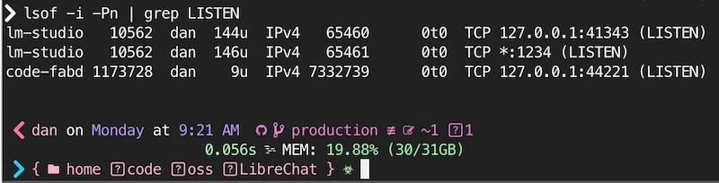

import {CodeTabs} from '../../../components/CodeTabs';

**Table of Contents**

1. [Introduction](#-introduction)
2. [The `:latest` Dance](#-the-latest-dance)
3. [Secrets Management: The Right Way](#-secrets-management-the-right-way)
4. [Network Security: The Devil’s in the Details](#-network-security-the-devils-in-the-details)
5. [Access Control Layers](#️-access-control-layers)
6. [Monitoring & Verification](#-monitoring--verification)
7. [Self-Hosting Security Tips](#-self-hosting-security-tips)
8. [Production Checklist](#-production-checklist)
9. [Further Reading](#-further-reading)


## 🏠 For the Brave

If you’re self-hosting Docker services, security is your responsibility from top to bottom—no cloud provider to shield you from port scans or sloppy config. Whether you’re spinning up apps on your home network or renting VPSes from providers like Vultr, DigitalOcean, Linode, AWS, Azure, or Google Cloud, you’ll need to lock things down - and verify you did it right.

In this guide, we’ll walk through Docker security essentials—covering canary tokens, read-only volumes, firewall rules, network segmentation, and everything in between. We’ll also compare home networks to public cloud setups and show you how to set up a basic auth proxy with Nginx. By the end, you’ll have several options to keep out the riff-raff (friends, family, or your own suspicious self).

Let’s dive in!

---

## 🔄 The `:latest` Dance

Keeping images updated is crucial for security. However, relying blindly on `:latest` can lead to breaking changes or vulnerabilities creeping in unnoticed.

### The Safe Way to Update

```bash
#!/bin/bash
# update-and-run.sh
docker compose pull && \
docker compose down && \
docker compose up -d
```

### Version Pinning vs Latest

```yaml
# docker-compose.yml
# ...
  # Exact version pinning, best for critical services
  image: postgres:17.2.1

  # Patch version pinning, good for non-critical services
  image: postgres:17.2

  # Major version pinning, perfect for hobby projects
  image: postgres:17

  # Yolo, avoid if possible
  image: postgres:latest
```

Use [Dependabot](https://github.com/features/security) or [Renovate](https://github.com/renovatebot/renovate) to automate version updates and ensure you’re reviewing changes before they break production.

_Let me know about your favorite tools for keeping Docker images up-to-date!_

## 🔐 Secrets Management: The Right Way

Never bake your secrets (API tokens, passwords, keys) into Docker images **_OR_** commit them to git.

Keep secrets out of your repos & containers - and rotate them periodically!

### Generate Strong Secrets

```bash
#!/bin/bash
# generate-secrets.sh

generate_secret() {
    local length=${1:-30}
    local generate_length=$((length + 4))
    openssl rand -base64 "$generate_length" | tr -d '+=/\n' | cut -c1-"$length"
}

[ -f .env ] && { echo ".env file already exists!"; exit 1; }

cat > .env << EOL
POSTGRES_PASSWORD=$(generate_secret)
JWT_SECRET=$(generate_secret 64)
SESSION_KEY=$(generate_secret 24)
REDIS_PASSWORD=$(generate_secret 20)
UNSAFE_PLACEHOLDER=__WARNING_REPLACE_RANDOM_TEXT__
EOL

echo "New .env file generated with secure random values!"
```


### Defensive Placeholder Validation

<blockquote>You wouldn't believe how easy it is to hack a JWT token when the secret isn't secret!</blockquote>

<p className='inset'>💡 Ensure secrets are always unique. Try make it impossible to run with unsafe/hard-coded defaults.</p>

If you use placeholders like `__WARNING_REPLACE_ME__` in your secrets, great, maybe someone will notice!

Just in case, you can also add a little runtime safety with little effort. Here’s how you might do it in JavaScript, Rust, and Go:

<CodeTabs client:load tabs={["JavaScript", "Rust", "Go"]}>

```javascript
// validateSecrets.js
const validateSecrets = () => {
  const unsafePlaceholder = /__WARNING_REPLACE_ME__/;
  const missingSecrets = Object.entries(process.env).filter(
    ([key, value]) => unsafePlaceholder.test(value)
  );

  if (missingSecrets.length) {
    console.error("Unsafe secrets detected:", missingSecrets);
    process.exit(1);
  }
};

validateSecrets();
```

```rust
// validate_secrets.rs
use std::env;

fn validate_secrets() {
    let unsafe_placeholder = "__WARNING_REPLACE_ME__";
    for (key, value) in env::vars() {
        if value.contains(unsafe_placeholder) {
            panic!("Unsafe secret in {}", key);
        }
    }
}

fn main() {
    validate_secrets();
}
```

```go
// validate_secrets.go
package main

import (
	"fmt"
	"os"
	"strings"
)

func validateSecrets() {
	placeholder := "__WARNING_REPLACE_ME__"
	for _, env := range os.Environ() {
		pair := strings.SplitN(env, "=", 2)
		if len(pair) == 2 && strings.Contains(pair[1], placeholder) {
			panic(fmt.Sprintf("Unsafe secret in %s", pair[0]))
		}
	}
}

func main() {
	validateSecrets()
}
```

</CodeTabs>

## 🌐 Network Security: The Devil’s in the Details

### Custom Networks & Internal Ports

```yaml
networks:
  backend:
    internal: true  # No external traffic allowed

services:
  webapp:
    networks:
      - backend
    ports:
      - "127.0.0.1:8080:8080" # Expose locally only
  database:
    networks:
      - backend
    # No published ports, only accessible inside backend network
```

Properly isolating services with Docker networks can reduce your attack surface. Services on a private or “internal” network won’t be accessible from the public internet.

### Auditing Docker Socket Access

Access to the Docker socket (`/var/run/docker.sock`) is effectively root on the host. Only give it to services that absolutely need it (monitoring or specialized orchestration).

```bash
# Example snippet in a docker-compose.yml
services:
  my_service:
    volumes:
      - /var/run/docker.sock:/var/run/docker.sock:ro
```

Notice the `:ro` to keep it read-only if possible, though many tools need write privileges. Always audit who has this volume.

---

## 🛡️ Access Control Options

Of all the ways it might seem you can limit access to your services, too many are entirely ineffective!

Here are some common pitfalls and better alternatives.

### Docker on Ubuntu

A very popular setup, with 2 very common pitfalls:

> ⚠️ **Warning #1:** By default [Docker on Ubuntu/Debian will bypass UFW](https://github.com/moby/moby/issues/4737)/iptables rules, rendering **your firewall useless.**
> ⚠️ **Warning #2:** Binding ports to local IP addresses (e.g. `-p 127.0.0.1:8080:80`) won't help either!

<p class="inset">This surprises me every time I learn about it!</p>

So, instead of thinking of your firewall as your primary defense, embrace Docker Networks. They provide **isolation** and **segmentation** at the network layer - without requiring everyone become a master at `iptables`.

### Network Best Practice

1. 🥇 **Use Docker Networks** to isolate and control which containers can talk to each other.
2. 🥉 If you really must use containers on a `host` or `bridge` network, you can get UFW and iptables to work with most docker setups. I recommend checking out this utility to make life easier: [ufw-docker](https://github.com/chaifeng/ufw-docker).

#### Docker Network Isolation

```bash
# Create a new Docker network
docker network create db-network

docker run -d --name postgres \
 -e POSTGRES_PASSWORD=${POSTGRES_PASSWORD} \
 -e POSTGRES_USER=${POSTGRES_USER} \
 -e POSTGRES_DB=${POSTGRES_DB} \
 --network db-network \
 postgres:17.1

docker run -d --name pg-admin \
 -p 8081:80 \
 -e PGADMIN_DEFAULT_EMAIL=${PGADMIN_DEFAULT_EMAIL} \
 -e PGADMIN_DEFAULT_PASSWORD=${PGADMIN_DEFAULT_PASSWORD} \
 --network db-network \
 dpage/pgadmin4:4.1
```

Here's an (abbreviated) example `docker-compose.yml` using a shared network, `db-network`:

```yaml
services:
  webapp:
    build: .
    ports:
      - "8080:80"
    networks: [ db-network ]
  database:
    image: postgres:17.1
    networks: [ db-network ]
    # ... other settings
  db-admin:
    image: dpage/pgadmin4:4.1
    networks: [ db-network ]
    # ... other settings
    ports:
      - "8081:80"

networks:
  db-network:
    external: false
```

Now your services can communicate with each other via the `db-network` network.

The `--external` flag can be used to control external access to the network.

#### Blocking Country!

Another decent idea!

_Talking about the geopolitical entity, not the music..._

If you are hosting apps mostly for your local family & friends, you can block traffic from countries you don't expect to receive traffic from. Or only allow traffic from countries you do expect.

Check out this script to block all traffic from China:

```bash title="block-china.sh"
wget -O- https://www.ipdeny.com/ipblocks/data/countries/cn.zone | \
  while read line; do ufw deny from $line to any; done
```

#### Hardening CloudFlare Proxy Host

If your home server is protected behind a CloudFlare IP (proxy,) you can restrict access to only CloudFlare IPs and your local subnet.

This is a little similar to Country blocking above, but with much tighter control.

```bash title="whitelist-ingress-from-cloudflare.sh"
ufw default deny incoming # Block all incoming!!!
ufw default allow outgoing # Allow all outgoing
ufw allow ssh # Allow SSH

# Allow access for local subnet (preferably dedicated subnet for hosted services)
ufw allow from 10.0.0.0/8 to any port 443

# Allow CloudFlare IPs
wget -O- https://www.cloudflare.com/ips-v4 | \
  while read line; do ufw allow from $line to any port 443; done
# Add IPv6 support
# wget -O- https://www.cloudflare.com/ips-v6 | \
  # while read line; do ufw allow from $line to any port 443; done
```

### Protecting Access

Once your network and host are security hardened. We need to worry about the services themselves. Do they all automate HTTPS with Let's Encrypt? Do they have built-in auth?

Since many self-hosted projects were not designed to be exposed to the internet, with default user credentials, or wide open signup pages, it can lead to a disaster.

#### Reverse Proxy

Another layer of defense is basic auth. I know it's dangerous to use without HTTPS, but sometimes it's the best you can do, and it's often enough to stop automated Cross-Site-Request-Forgery attacks.

```nginx
# /etc/nginx/conf.d/secure-admin.conf
location /admin {
    auth_basic "Restricted Access";
    auth_basic_user_file /etc/nginx/.htpasswd;
    proxy_pass http://internal_admin:80;
    proxy_set_header X-Real-IP $remote_addr;
}
```

Generate credentials:

```bash
htpasswd -c /etc/nginx/.htpasswd admin
```

With a basic auth proxy, attackers have an extra hurdle—username and password—before hitting your internal service.

Another option is to use a service like [Traefik](https://traefik.io/) or [Caddy](https://caddyserver.com/) that can automate HTTPS and basic auth for you.

If you want to manage many domains & services, I'd recommend [Nginx Proxy Manager](https://nginxproxymanager.com/).

## 🔍 Monitoring & Verification

This is the **most important & most overlooked step.** You can have the best firewall, the best network, and the best practices, but if you don't verify, you have no idea if it's working.

<p class="inset">Don’t Trust, Verify Twice</p>

### Checking for Exposed Ports

#### Test Inside Your Network

Whether you’re on a home network or a VPS, you can use `nmap` to scan for open ports. It's quite handy to know how to check for open ports.

Practice using `nmap`, scan your local network or one of your servers, check your router, printer, smart fridge.

<p class="inset">⚠️ Alert: Do not scan hosts you do not own. (Like `google.com`.)</p>

While port scans are a constant fact of life, it's possibly a violation of the CFAA (Computer Fraud and Abuse Act) in the US. So, don't do it without permission.

#### Examples Scan Commands

```bash
# Scan your localhost for all open ports
nmap -sT localhost

# Scan your machine’s private IP for services
nmap -sV 192.168.1.10

# Detect devices on your network
nmap -sn 192.168.0.0/24
nmap -sn 10.0.0.0/24
```

#### Testing Outside Your Network

You'll need your current (public) IP easily with services like `ifconfig.me`: `curl https://ifconfig.me`. Or look it up in your hosting provider's dashboard.

Test from a different network, cell hot-spot, or another remote server to test your public IPs:

```bash
print_current_ip() {
  curl https://ifconfig.me
}

print_current_ip
# --> 123.456.789.012

# Change target_host to your public ip or hostname
# Check host using advanced techniques
nmap -A --open --reason $target_host
nmap -A -F --open --reason $target_host
nmap -A -p1-65535 --open --reason $target_host

```

**Why Test Both?**

Testing from inside reveals internal exposure, while external tests identify services accessible to attackers.

### View Connections with `lsof`

```bash
# Monitor all network connections
sudo watch -n1 "lsof -i -Pn"

# Monitor specific port
sudo lsof -i:80 -Pn

# Monitor ESTABLISHED connections
sudo lsof -i -Pn | grep ESTABLISHED
# View LISTEN
sudo lsof -i -Pn | grep LISTEN

# to see network names instead of IP addresses (can be very slow to do reverse DNS lookups)
sudo lsof -i -P | grep LISTEN

```

#### Example Output



### File monitoring

To identify which **processes are using the most hard drive bandwidth**, you can use `iotop`:

```bash
sudo iotop -o
```

To see individual file changes, you can use `inotifywait` on Linux or `fswatch` on MacOS:

This can be useful to detect unauthorized or strange behavior per folder or system wide.

```bash
# Monitor all file changes in a directory
sudo inotifywait -m /path/to/directory
```

On MacOS you can use `fswatch`:

Install with `brew install fswatch`

```bash
fswatch -r /path/to/directory
```


## 🏠 Self-Hosting Security Tips

1. **Place Canary Tokens** in sensitive directories. If triggered, you’ll know instantly that something has gone wrong.
   *Try [Canarytokens.org](https://canarytokens.org/)*

2. **Rate Limiting** for authentication attempts. Whether via Nginx’s `limit_req` module or fail2ban, throttling brute-force attempts goes a long way.

3. **Use Read-Only Volumes** wherever possible:
   ```yaml
   services:
     webapp:
       volumes:
         - ./config:/config:ro
   ```
   This prevents accidental (or malicious) changes to critical files.

4. **Audit Docker Socket Access** regularly.
   If a container doesn’t need it, remove the mount.

5. **Beware of WiFi Riff-Raff**
   On a home network, we never let strangers join our network. Well, except friends. Or family. Or that neighbor who always asks for the password. Actually… maybe that’s you. If so, please check your firewall.

## 🏡 Home Network vs Public Providers

1. **Virtual Isolation/DMZ**: For home servers, put them on a separate VLAN or DMZ if possible. This keeps your internal devices off-limits to potential compromise from the server side.
   - **Direct Internet-Facing**: Easiest route but highest risk.
   - **Gatewayed Networks**: Traffic is filtered, requires NAT/port forwarding.

2. **Cloud Providers**: Vultr, DigitalOcean, Linode, AWS, Azure, and Google Cloud all provide out-of-the-box firewall/security group features.
   - Typically, these providers block all ports except what you explicitly open.
   - They also offer advanced monitoring and threat detection tools.

3. **Hardening Against Internal Lateral Attacks**: Even on a home network, an infected device can pivot across local IP addresses. Segmenting Docker services on custom networks, using UFW rules, and blocking unneeded ports helps reduce risk.

## 🚀 Production Checklist

- [ ] **Secrets**: All secrets randomly generated and securely stored
- [ ] **Updates**: Container update strategy documented and automated
- [ ] **Network**: Only necessary ports exposed, internal networks set up
- [ ] **Firewall Rules**: Default deny, explicit allows, country blocks if needed
- [ ] **Reverse Proxy**: Nginx, Caddy or Traefik can add a layer of basic auth
- [ ] **Canary Tokens**: Place them alongside all sensitive keys. In every `.env` you have floating around.
- [ ] **Monitoring**: `nmap`, `lsof`, `inotifywait`, and `glances` set up
- [ ] **Backup Strategy**: Tested and automated
- [ ] **Least Privilege**: Non-root container users, read-only volumes


## 📚 Further Reading

- [Docker Security Best Practices](https://docs.docker.com/develop/security-best-practices/)
- [OWASP Docker Security Cheat Sheet](https://cheatsheetseries.owasp.org/cheatsheets/Docker_Security_Cheat_Sheet.html)
- [CIS Docker Benchmark](https://www.cisecurity.org/benchmark/docker)
- [Canarytokens.org for Canary Tokens](https://canarytokens.org/)


## Thanks

Thanks for reading! I hope you found this guide helpful. If you have any questions or suggestions, feel free to reach out on my social icon links below, or click the `Edit on GitHub` link to create a PR!
