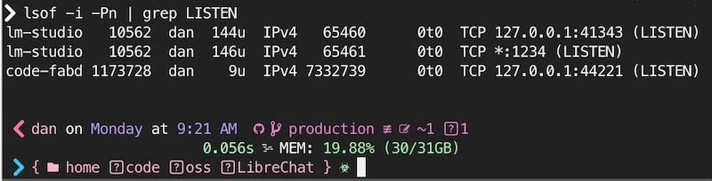

import {CodeTabs} from '../../../components/CodeTabs';

**Table of Contents**

- 🧗‍♀️ [For the brave](#️-for-the-brave)
- 🔄 [The `:latest` Dance](#-the-latest-dance)
- 🔐 [Secrets Management: The Right Way](#-secrets-management)
- 🌐 [Network Hazard](#-network-hazard)
- 🛡️ [Access Controls](#️-access-controls)
- 🔍 [Monitoring & Verification](#-monitoring--verification)
- ⏰ [Often Overlooked Tips](#-often-overlooked-tips)
- 🚀 [Production Checklist](#-production-checklist)
- 📚 [Further Reading](#-further-reading)

## 🧗‍♀️ For the brave

If you’re self-hosting Docker services, security is your responsibility from top to bottom—no cloud provider to shield you from port scans or sloppy config. Whether you’re spinning up apps on your home network or renting VPSes from providers like Vultr, DigitalOcean, Linode, AWS, Azure, or Google Cloud, you’ll need to lock things down - and verify you did it right.

In this guide, we’ll walk through Docker security—from some `lesser-known` to other `difficult-to-get-right` techniques; we'll explore canary tokens, read-only volumes, firewall rules, network segmentation & hardening, adding authenticated proxies, and more.

We’ll also compare home networks to public cloud setups and show you how to set up a basic auth proxy with Nginx. By the end, you’ll have several options to keep out the riff-raff (friends, family, and sometimes even yourself...)

That's a ton of stuff! But much of it relates, and you can pick and choose what's most relevant to your setup. 🍀

## 🔄 The `:latest` Dance

Keeping images updated is crucial for security. However, relying on `:latest` can lead to breaking changes or vulnerabilities creeping in unnoticed.

### The Safe Way to Update

Combine startup commands with `pull` or `build` to ensure you’re always running the latest image.

```bash
#!/bin/bash
# update-and-run.sh
docker compose pull && \
  docker compose up -d
```

### Version Pinning vs Latest

Choosing the right version to pin to is a balancing act between stability and security. Here are some common strategies:

```yaml
# docker-compose.yml
# ...
  # Exact version pinning, best for critical services
  image: postgres:17.2.1

  # Patch version pinning, good for non-critical services
  image: postgres:17.2

  # Major version pinning, perfect for hobby projects
  image: postgres:17

  # Yolo, avoid if possible
  image: postgres:latest
```

Use [Dependabot](https://github.com/features/security) or [Renovate](https://github.com/renovatebot/renovate) to automate version updates and ensure you’re reviewing changes before they break production.

_Let me know about your favorite tools for keeping Docker images up-to-date!_

## 🔐 Secrets Management

- [Generate Strong Secrets](#generate-strong-secrets)
- [Canary Tokens](#canary-tokens)
- [Upgrade from `.env` to MacOS Keychain](#upgrade-from-env-to-macos-keychain)
{/* - [Placeholder Validation](#placeholder-validation) */}

There are many ways to manage secrets, but one of the most important rules to stick to is: **never hard-code secrets into your docker images or commit them to git.** It's one of the most common security mistakes, it presents a long-term risk, and it's a pain to fix.

Securely storing secrets is a substantial topic with many options, from `.env` files, [Docker secrets](https://docs.docker.com/compose/how-tos/use-secrets/), [1Password](https://1password.com/downloads/command-line)/[Bitwarden](https://bitwarden.com/developers/), or a secrets manager like [HashiCorp Vault](https://www.vaultproject.io/) or AWS Secrets Manager.

You'll have to choose the "right" level of effort & security for your use case.

{/*
TODO: Move to Maintainer's Guide
// TODO: Move to Maintainer's Guide

### Placeholder Validation

<blockquote>You wouldn't believe how easy it is to hack a JWT token when the secret isn't secret!</blockquote>

<p className='inset'>💡 Ensure secrets are always unique. Try make it impossible to run with unsafe/hard-coded defaults.</p>

If you use placeholders like `__WARNING_REPLACE_ME__` in your secrets, great, maybe someone will notice!

Just in case, you can also add a little runtime safety with little effort. Here’s how you might do it in JavaScript, Rust, and Go:

<CodeTabs client:load tabs={["JavaScript", "Rust", "Go"]}>

```javascript
// validateSecrets.js
const validateSecrets = () => {
  const unsafePlaceholder = /__WARNING_REPLACE_ME__/;
  const missingSecrets = Object.entries(process.env).filter(
    ([key, value]) => unsafePlaceholder.test(value)
  );

  if (missingSecrets.length) {
    console.error("Unsafe secrets detected:", missingSecrets);
    process.exit(1);
  }
};

validateSecrets();
```

```rust
// validate_secrets.rs
use std::env;

fn validate_secrets() {
    let unsafe_placeholder = "__WARNING_REPLACE_ME__";
    for (key, value) in env::vars() {
        if value.contains(unsafe_placeholder) {
            panic!("Unsafe secret in {}", key);
        }
    }
}

fn main() {
    validate_secrets();
}
```

```go
// validate_secrets.go
package main

import (
	"fmt"
	"os"
	"strings"
)

func validateSecrets() {
	placeholder := "__WARNING_REPLACE_ME__"
	for _, env := range os.Environ() {
		pair := strings.SplitN(env, "=", 2)
		if len(pair) == 2 && strings.Contains(pair[1], placeholder) {
			panic(fmt.Sprintf("Unsafe secret in %s", pair[0]))
		}
	}
}

func main() {
	validateSecrets()
}
```
</CodeTabs>
*/}

### Generate Strong Secrets

Here's a small script to generate OR new secrets for an `.env` file:

```bash
#!/bin/bash
# .env.init.sh

if [ -f .env ]; then
  echo ".env file already exists!"
  cp .env ".env.$(date +%F).bak"
  echo "Backup created: .env.$(date +%F).bak"
fi

sed -i "s|POSTGRES_PASSWORD=.*|DB_PASSWORD=$(openssl rand -base64 32)|g" ./.env
sed -i "s|JWT_SECRET=.*|JWT_SECRET=$(openssl rand -base64 64)|g" ./.env
sed -i "s|SESSION_KEY=.*|SESSION_KEY=$(openssl rand -base64 24)|g" ./.env
sed -i "s|REDIS_PASSWORD=.*|REDIS_PASSWORD=$(openssl rand -base64 32)|g" ./.env

cat .env | grep -E 'DB_PASSWORD|JWT_SECRET|SESSION_KEY|REDIS_PASSWORD'

echo "New keys injected into .env file!"

```

### Canary Tokens

[**Canary Tokens**](https://canarytokens.org/) are a great way to detect if your secrets have been compromised (and used.) They're like a tripwire you can add to any sensitive files, urls, and tokens.

Put them in every `.env` file, CI platform, password and secrets manager you use!

There are many types of canary "tokens" to chose, from AWS tokens, [fake credit card](https://blog.thinkst.com/2024/12/its-baaack-credit-card-canarytokens-are-now-on-your-consoles.html) numbers, Excel & Word files, Kubeconfig files, VPN credentials, even sql dump files can have a tripwire!

#### Canary Token Best Practices

- **Place Everywhere**: In every `.env` file, CI/CD pipeline, and "secrets manager" you can think of.
  - Place a `passwords.xlsx` or `passwords.docx` file in your home directory.
  - Add an AWS profile `billing_prod` with a canary token as the secret.
  - Generate a `private.key` file for your `~/.ssh` directory.
  - Create a Canary SQL dump `all_credit_cards.sql` for your `~/backups` directory.
- **Monitor**: Set up email rules/alerts to catch when a canary token is triggered.

### Upgrade from `.env` to MacOS Keychain

For Mac folks, one of the simplest options is to use Keychain.

Here's a simple way to automate loading secrets from the OSX keychain, supports `TouchID`, and is a bit more secure than `.env` files.

The original <cite>credit goes to [Brian Hetfield](https://gist.github.com/bmhatfield/f613c10e360b4f27033761bbee4404fd) and [Jan Schaumann](https://www.netmeister.org/)</cite>

<CodeTabs client:load tabs={[
  "Helper commands",
  "Persist secrets in environment",
  "Use secrets per command"]
}>
```bash title="keychain-secrets.sh"
### Functions for setting and getting environment variables from the OSX keychain ###
### Adapted from: https://www.netmeister.org/blog/keychain-passwords.html and 
### https://gist.github.com/bmhatfield/f613c10e360b4f27033761bbee4404fd

# Use: get-keychain-secret SECRET_ENV_VAR
function get-keychain-secret () {
    security find-generic-password -w -a ${USER} -D "environment variable" -s "${1}"
}

# Use: set-keychain-secret SECRET_ENV_VAR
# You will be prompted to enter the secret value!
function set-keychain-secret () {
    [ -n "$1" ] || print "Missing environment variable name"
    
    # prompt user for secret
    echo -n "Enter secret for ${1}"
    read secret
    [ -n "$secret" ] || return 1

    ( [ -n "$1" ] || [ -n "$secret" ] ) || return 1
    security add-generic-password -U -a ${USER} -D "environment variable" -s "${1}" -w "${secret}"
}
```

```bash title="~/code/app/.env-secrets.sh"
source ~/keychain-secrets.sh

# Load Env vars into the current shell
export AWS_ACCESS_KEY_ID=$(get-keychain-secret AWS_ACCESS_KEY_ID);
export AWS_SECRET_ACCESS_KEY=$(get-keychain-secret AWS_SECRET_ACCESS_KEY);
# Note: If an attack can run `env` in your shell, then these secrets could be exposed!
```

```bash title="~/code/app/scripts/env-run.sh"
#!/usr/bin/env bash
source ~/keychain-secrets.sh

# Specify all secrets for this project
AWS_ACCESS_KEY_ID=$(get-keychain-secret AWS_ACCESS_KEY_ID) \
AWS_SECRET_ACCESS_KEY=$(get-keychain-secret AWS_SECRET_ACCESS_KEY) \
  "$@"

# Note: Using a shell wrapper helps prevent secrets from staying
# around in the environment. And it's safe to commit.

# Usage:
# ./scripts/env-run.sh docker compose up -d
# ./scripts/env-run.sh docker run -e AWS_ACCESS_KEY_ID -e AWS_SECRET_ACCESS ...
```
</CodeTabs>


## 🌐 Network Hazard

### Custom Networks & Internal Ports

Properly isolating services with Docker networks is an important way to reduce your attack surface area.

Be careful poking holes in your network! One misconfigured port forward can end very badly.

By default, services on a private LAN won’t be exposed to the internet-you have to explicitly forward ports from your router.

### Docker on LAN

Whether you're a developer running dev servers locally, or self-hosting services from your local network, **assumptions about docker's network model can lead to trouble.**

Devs are often surprised to find the 'traditional' methods to secure linux servers (`iptables`, restricting tcp/ip sysctl options) can **fail silently** on Docker hosts! This is especially the case when **self-hosting-or running on a typical home network.** (For the people in the back: This can allow access to dev containers on your MacBook!!!)

> ⚠️ **Warning #1:** By default, Docker (on Ubuntu/Debian) will bypass UFW/iptables rules, rendering **your firewall useless.** [See issue #690: Docker bypasses ufw firewall rules](https://github.com/moby/moby/issues/690).

> ⚠️ **Warning #2:** Binding ports to local IP addresses (e.g., `-p 127.0.0.1:8080:80`) may offer limited protection in certain cases. [See issue #45610: Publishing ports explicitly to private networks should not be accessible from LAN hosts](https://github.com/moby/moby/issues/45610). (Impacts Fedora, Ubuntu, and likely others.)

<p class="inset">If you're surprised to learn this, same!</p>

**Binding to local IPs is still a good practice** and has a meaningful impact in **managed cloud environments and specially configured networks.** 
{/* Don't think of your firewall or private network as your main or only defense, add Docker Networks to the mix for better **isolation**, and always consider if you need to expose ports at all. */}

### Example Docker Compose

Here's an example `docker-compose.yml` file that binds the `app` service to `127.0.0.1:8080` and connects both containers to the `backend` custom network.

```yaml title="docker-compose.yml" {6-10,14-17}
networks:
  backend:

services:
  app:
    networks:
      - backend
    ports:
      # Bind to localhost if possible
      - "127.0.0.1:8080:8080"
    # ... other settings
  database:
    image: postgres:17.1
    # No ports needed; accessible inside backend network.
    networks:
      - backend
```

{/* #### Test & Verify

As with all security measures, it's critical that you **test and verify** your network setup. */}

{/* While network security & auditing is a full-time responsibility in most companies, most self-host folks don't spend ANY time on it! */}

{/* Look, I get it, it can be intimidating. _(Subnets, net masks, CIDR, VLANs, and routing tables, oh my! If that made no sense, that's ok, you're in the right place. Also, we don't need to worry about any of that for now.)_ */}

### Network Best Practices

- 🏆 **Don't Publish ANY Ports** Recently I learned this is more useful than you might expect! When using a named (bridge) network, containers have unfiltered access to each other. They behave as though they are behind a local network (NAT gateway.)
  - While not possible in all use cases, this may be useful for containers running batch jobs, or primarily accessed via `attach` or `exec`.
- 🥇 **Use Docker Networks** to isolate and control which containers can talk to each other.
- 🥉 **Use Localhost Binding**: While [imperfect](https://github.com/moby/moby/issues/45610), you're generally better off binding ports to a loopback address (e.g., `127.0.0.1:8080:80`). Just make sure you [verify your setup.](#-monitoring--verification)

## 🛡️ Access Controls

Access controls are a critical part of securing your Docker services. This includes limiting container capabilities & permissions, restricting access to the Docker socket, and more.

- [Limiting Container Capabilities](#limiting-container-capabilities)
- [Docker Socket Access](#docker-socket-access)
- [Blocking Country!](#blocking-country)
- [Hardening CloudFlare Proxy Host](#hardening-cloudflare-proxy-host)

### Limiting Container Capabilities

Another solid access control practice is to limit the capabilities of your containers. This can prevent several threats, from privilege escalation, data theft/exfiltration, traffic hijacking, and more.

**What are capabilities?** Linux kernel-defined, named permissions or abilities. (The [`capabilities`](https://man7.org/linux/man-pages/man7/capabilities.7.html) man page has a full list.) They include things like `CAP_CHOWN` (change file ownership), `CAP_NET_ADMIN` (configure network interfaces), `CAP_KILL` (kill any process), and many more.

The two ways to determine needed capabilities are:

1. **Trial and Error**: This slower-but-effective method has you start with no capabilities, then add them back one by one until your app works.
2. **Find prior work**: Search for "`project-name` `cap_drop` Dockerfile", or "`project-name` `cap_drop` docker-compose.yml" to see if others have already done the work for you. Sometimes ChatGPT can conjure up the right configuration for you, too!

#### Capabilities Best Practice

- **Drop All Capabilities**: Use `cap_drop: [ ALL ]` to drop all Linux capabilities from the container.
- **No New Privileges**: Use `security_opt: [ no-new-privileges=true ]` to prevent the container from gaining new privileges.

```yaml title="Example: Drop/Limit Capabilities" {5-14}
services:
  database:
    image: postgres:17.1
    networks: [ db-network ]
    security_opt:
      - no-new-privileges:true
    cap_drop:
      - ALL
    cap_add:
      - CHOWN
      - DAC_READ_SEARCH
      - FOWNER
      - SETGID
      - SETUID
  db-admin:
    image: dpage/pgadmin4:4.1
    networks: [ db-network ]
    ports:
      - "8081:80"
    # ... other settings
networks:
  db-network:
```

Now your services can communicate with each other via the `db-network` network. The `auto-net` network will be created automatically by Docker Compose.

Use the `--external`/`external:` option to join a **pre-existing network.** Omit it to create a new network.

### Docker Socket Access

#### ⚠️ Warning: `docker.socket` is extremely powerful and dangerous dark magic!

<blockquote class="inset">⚠️ The \`:ro\` option doesn't affect I/O sent over the socket!</blockquote>

It merely ensures the file (a Unix socket, not a file in the traditional sense) itself is `read-only`.

{/* Any process that can "open" the socket can (probably) gain root access on the host. */}

#### Socket Best Practice

- 🥇 **Avoid mounting a docker socket,** there's likely a better alternative!
- 🫣 If you must, **use a Reverse Proxy** to limit what API commands are available. Check out the `docker-socket-proxy` project originally from Tecnativa, [docker-socket-proxy](https://github.com/Tecnativa/docker-socket-proxy).
- 🤢 Okay, _maybe_ sharing it is okay in a very **high-trust**, **low-risk** test environment.

#### Blocking Country!

Another decent idea!

_Talking about the geopolitical entity, not the music..._

If you are hosting apps mostly for your local family & friends, you can block traffic from countries you don't expect to receive traffic from. Or only allow traffic from countries you do expect.

Check out this script to block all traffic from China (sorry, China):

```bash title="block-china.sh"
curl -fsSL https://www.ipdeny.com/ipblocks/data/countries/cn.zone | \
  while read line; do ufw deny from $line to any; done
```

Similarly, you can allow only traffic from the US:

```bash title="allow-usa.sh"
curl -fsSL https://www.ipdeny.com/ipblocks/data/countries/us.zone | \
  while read line; do ufw allow from $line to any; done
```

#### Hardening CloudFlare Proxy Host

If your home server is protected behind a CloudFlare IP (proxy,) you can restrict access to only CloudFlare IPs, and your local network.

This is a bit similar to [Country blocking](#blocking-country) above, but with much tighter control.

```bash title="whitelist-ingress-from-cloudflare.sh"
ufw default deny incoming # Block all incoming!!!
ufw default allow outgoing # Allow all outgoing
ufw allow ssh # Allow SSH

# Allow access for local subnet (preferably dedicated DMZ/VLAN for hosted services)
ufw allow from 10.0.0.0/8 to any port 443

# Allow CloudFlare IPs
curl -fsSL https://www.cloudflare.com/ips-v4 | \
  while read line; do ufw allow from $line to any port 443; done
# Add IPv6 support
# curl -fsSL https://www.cloudflare.com/ips-v6 | \
#   while read line; do ufw allow from $line to any port 443; done
```

To test geo-based changes a VPN with locations in the desired country can be useful. See more in [Monitoring & Verification](#-monitoring--verification) section.

### App Layer Security

Once your [network and host are security hardened,](#-network-hazard) you may find there's more to do.

Now we need to think about the "application" layer of our services themselves.

<p class="inset">Does that database have a valid password? Does this container automate HTTPS/certs? Does the app include built-in auth? Are there limits on which emails can signup? Are there default credentials or environment variable to change?</p>

The only way to _know_ is to check. In this case, start with the `README` and other key files like `docker-compose.yml`, `Dockerfile`, and `.env.*`. In both the project, and ideally its supporting services as well. (e.g. Postgres, Redis, etc.)

#### Reverse Proxy

Another layer of defense is basic auth. I know it's dangerous to use without HTTPS, but sometimes it's the best you can do (legacy services), and it's often enough to stop automated Cross-Site-Request-Forgery attacks.

```nginx
# /etc/nginx/conf.d/secure-admin.conf
location /admin {
    auth_basic "Restricted Access";
    auth_basic_user_file /etc/nginx/.htpasswd;
    proxy_pass http://internal_admin:80;
    proxy_set_header X-Real-IP $remote_addr;
}
```

Generate credentials:

```bash
htpasswd -c /etc/nginx/.htpasswd admin
```

With a basic auth proxy, attackers have an extra hurdle—username and password—before hitting your internal service.

Another option is to use a service like [Traefik](https://traefik.io/) or [Caddy](https://caddyserver.com/) that can automate HTTPS and basic auth for you.

If you want to manage many domains & services with a GUI, I'd recommend [Nginx Proxy Manager](https://nginxproxymanager.com/).

## 🔍 Monitoring & Verification

- [Check Your Ports](#check-your-ports)
- [View Open Ports](#view-open-ports)
- [File Monitoring](#file-monitoring)


This is the **most important & most overlooked step.** You can have the best firewall, the best network, and the best practices, but if you don't verify, you have no idea if it's working.

Plus, knowing just a handful of commands-or where to look them up-can mean the difference in preventing a breach. The feeling of being a hacker is just a bonus. (For details and examples, jump ahead to the [Monitoring & Verification](#-monitoring--verification) section.)

<p class="inset">Don’t Trust, Verify Twice</p>

### Check Your Ports

<p class="inset">⚠️ IMPORTANT: Do not scan hosts you do not own.</p>

Whether you’re on a home network or a VPS, you will want to know what ports are open to the world.

There are 2 ways to do this:

- Check the Network (`nmap`, `masscan`)
- Ask the Operating System (`lsof`, `netstat`, `ss`)

#### Testing Outside Your Network

You'll need your current (public) IP, easily with services like `ifconfig.me`: `curl https://ifconfig.me`. Or look it up in your hosting provider's dashboard.

```bash title="Get Public IP"
curl -fsSL https://ifconfig.me
# --> CURRENT PUBLIC IP
```

Once you have your public IP, you now need to **connect to an external network.** You can use a friend's computer, a phone/5G hot spot, or a dedicated server host.

```bash title="nmap External Scan"
target_host="$(curl -fsSL https://ifconfig.me)"

# Note: Ensure `target_host` is the desired IP

# Scan specific ports:
nmap -A -p 80,443,8080 --open --reason $target_host
# Top 100 ports:
nmap -A --top-ports 100 --open --reason $target_host
# All ports
nmap -A -p1-65535 --open --reason $target_host
```

#### Test Inside Your Network

Practice using `nmap`, scan your local network or one of your servers, check your router, printer, smart fridge.

{/* While port scans are a constant fact of life, it might be a violation of the CFAA (Computer Fraud and Abuse Act) in the US. So, only scan things you own. */}

#### Example Scan Commands

```bash
# Scan your localhost for all open ports
nmap -sT localhost

# Scan your machine’s private IP for services
nmap -sV 192.168.1.10

# Find service details on your network
nmap -sn 192.168.0.0/24
nmap -sn 10.0.0.0/24
# Or on a docker 172.18.0.1/16
nmap -sn 172.18.0.1/16
```

```text title="nmap Scan" frame="terminal"
% nmap -A --open --reason 192.168.0.87

Starting Nmap 7.95 ( https://nmap.org ) at 2025-01-06 13:51 MST
Nmap scan report for dev02.local (192.168.0.87)
Host is up, received syn-ack (0.0067s latency).
Not shown: 995 closed tcp ports (conn-refused)
PORT     STATE SERVICE     REASON  VERSION
22/tcp   open  ssh         syn-ack OpenSSH 9.6p1 Ubuntu 3ubuntu13.5 (Ubuntu Linux; protocol 2.0)
| ssh-hostkey:
|_  256 {FINGERPRINT} (ED25519)
80/tcp   open  http        syn-ack Caddy httpd
|_http-server-header: Caddy
|_http-title: Dev02.DanLevy.net
443/tcp  open  ssl/https   syn-ack
|_http-title: Dev02.DanLevy.net
1234/tcp open  http        syn-ack Node.js Express framework
|_http-cors: GET POST PUT DELETE PATCH
|_http-title: Dev02.DanLevy.net (application/json; charset=utf-8).
Service Info: OS: Linux; CPE: cpe:/o:linux:linux_kernel

Service detection performed. Please report any incorrect results at https://nmap.org/submit/ .
Nmap done: 1 IP address (1 host up) scanned in 13.36 seconds
```

### View Open Ports 

Get familiar with `lsof` - it's available on MacOS & Linux. It shows granular network state and disk activity.

```bash title="lsof Commands"
# Monitor specific port
sudo lsof -i:80 -Pn

# Monitor ESTABLISHED connections
sudo lsof -i -Pn | grep ESTABLISHED
# View LISTEN
sudo lsof -i -Pn | grep LISTEN

# to see network names instead of IP addresses (can be very slow to do reverse DNS lookups)
sudo lsof -i -P | grep LISTEN

# Monitor all network connections
sudo watch -n1 "lsof -i -Pn"
```

#### Example Output



### File monitoring

To identify which **processes** are using the most **hard drive bandwidth**, you can use `iotop`:

```bash
sudo iotop
```

To see individual file changes, you can use `inotifywait` on Linux or `fswatch` on MacOS:

This can be useful to detect unauthorized or strange behavior per folder or system wide.

```bash
# Monitor all file changes in a directory
sudo inotifywait -m /path/to/directory
```

On MacOS you can use `fswatch`:

Install with `brew install fswatch`

```bash
fswatch -r /path/to/directory
```

## ⏰ Often Overlooked Tips

1. **Rate Limiting** for authentication attempts & any other key endpoints. Whether via Nginx’s `limit_req` module or `fail2ban` for SSH access, throttling brute-force is _probably_ a good idea. I say _probably_ because in the age of IPv6 and botnets-for-cheap, well, it's not what it used to be.

2. **Use Read-Only Volumes** where possible:
   ```yaml
   services:
     webapp:
       volumes:
         - ./config:/config:ro
   ```
   Combined with other best practices (non-root users, minimal folder permissions), the \`:ro\` volume mount option provides additional safe-guards against accidental (or malicious) changes to critical files.

3. **Audit Container Access** regularly.
   If a container doesn’t need it a secret, port or mount, remove it!

4. **Beware of WiFi Riff-Raff**
   I'm sure you'd never give out your WiFi password, especially to any weirdos, right? Well, except some friends... Okay, maybe family too. You never know what apps they have and which might share your SSID & password with the world.

### Home Network vs. Public Provider vs. Tunneling

1. **Virtual Isolation/DMZ**: For home servers, put them on a separate VLAN or DMZ if possible. This keeps your internal devices off-limits to potential compromise from the server side.
   - Use a separate router or VLAN for your home server.
   - Use a separate WiFi network for your home server.
   - Use a separate subnet for your home server.

2. **Cloud Providers**: Hetzner, Vultr, DigitalOcean, Linode, AWS, Azure, and Google Cloud all provide different firewall features.
   - Some providers & services block ports by default. Some offer opt-ins or add-ons. Check your service provider's documentation.
   - Many providers offer advanced monitoring and threat detection services.

3. **VPNs & Tunneling**: Consider using a VPN-like option or tunneling service to securely connect services across the internet without exposing them to the public internet.
   - TailScale, ngrok, ZeroTier.
   - WireGuard, OpenVPN.

{/* 3. **Hardening Against Internal/Lateral Attacks**: One infected device can compromise an entire network. Segmenting Docker services on custom networks, using hardware, UFW rules, and blocking unneeded ports can all help reduce risk (when properly configured.) */}

## 🚀 Production Checklist

- [ ] **Secrets**: All secrets randomly generated and securely stored
- [ ] **Updates**: Container update strategy documented and automated. (Okay if it's just a few commands in a text file.)
- [ ] **Network**: Only necessary ports exposed, internal networks set up.
- [ ] **Firewall Rules**: Default deny, explicit allows, country blocks if needed.
- [ ] **Reverse Proxy**: Nginx, Caddy or Traefik can add a layer of basic auth
- [ ] **Canary Tokens**: Place them alongside all sensitive keys. In every `.env` you have floating around.
- [ ] **Monitoring** Know thy systems with `nmap`, `lsof`, `inotifywait`, `glances`, etc.
- [ ] **Backup Strategy**: Tested, preferably automated, and off-site.
- [ ] **Least Privilege**: Non-root container users, read-only volumes.


## 📚 Further Reading

- [Docker Security Best Practices](https://docs.docker.com/develop/security-best-practices/)
- [OWASP Docker Security Cheat Sheet](https://cheatsheetseries.owasp.org/cheatsheets/Docker_Security_Cheat_Sheet.html)
- [CIS Docker Benchmark](https://www.cisecurity.org/benchmark/docker)
- [Canarytokens.org for Canary Tokens](https://canarytokens.org/)

## Thanks

A shout-out to some keen Redditors:

- <em className="cite">[u/JCBird1012](https://www.reddit.com/user/JCBird1012/) - [thread](https://www.reddit.com/r/selfhosted/comments/1hv8jn6/comment/m5rvlzi/).</em>
- <em className="cite">[u/Salzig](https://www.reddit.com/user/Salzig/)</em>
- <em className="cite">[u/Myelrond](https://www.reddit.com/user/myelrond/)</em>
- <em className="cite">[u/shrimpdiddle](https://www.reddit.com/user/shrimpdiddle/)</em>
- <em className="cite">[u/troeberry](https://www.reddit.com/user/troeberry/)</em>

Thanks for reading! I hope you found this guide helpful. If you have any questions or suggestions, feel free to reach out on my socials below, or feel free to click the `Edit on GitHub` link to create a PR! ❤️
