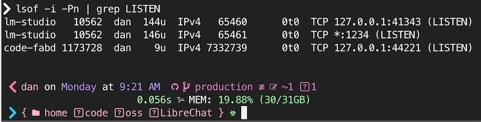

import {CodeTabs} from '../../../../components/CodeTabs';

**目录**

- 🧗‍♀️ [给勇敢者](#️-for-the-brave)
- 🔄 [`:latest`的舞蹈](#-the-latest-dance)
- 🔐 [密钥管理：正确方式](#-secrets-management)
- 🌐 [网络风险](#-network-hazard)
- 🛡️ [访问控制](#️-access-controls)
- 🔍 [监控与验证](#-monitoring--verification)
- ⏰ [常被忽视的技巧](#-often-overlooked-tips)
- 🚀 [生产环境检查清单](#-production-checklist)
- 📚 [进一步阅读](#-further-reading)

## 🧗‍♀️ 给勇敢者

如果你在自托管Docker服务，安全责任完全由你承担——没有云服务商能替你抵御端口扫描或粗心的配置。无论是在家庭网络部署应用，还是从Vultr、DigitalOcean、Linode、AWS、Azure或Google Cloud等服务商租用VPS，你都需要锁定系统并验证其正确性。

在本指南中，我们将深入探讨Docker安全，从一些`鲜为人知`到其他`难以正确实施`的技术；我们会探索诱饵令牌、只读卷、防火墙规则、网络分段与加固、添加认证代理等主题。

我们还将比较家庭网络与公有云环境的差异，并演示如何用Nginx设置基础认证代理。最后，你将获得多种方法来阻止不速之客（包括朋友、家人，甚至有时是你自己...）

内容相当丰富！但很多内容相互关联，你可以根据自身需求选择最相关的部分。🍀

## 🔄 `:latest`的舞蹈

保持镜像更新对安全至关重要。然而，依赖`:latest`可能在未经审查的情况下引入破坏性变更或存在漏洞的构建。

### 安全更新方式

将更新命令与`pull`或`build`结合，主动刷新镜像，然后在可观察到故障的时间窗口重启。

```bash
#!/bin/bash
# update-and-run.sh
docker compose pull && \
  docker compose up -d
```

### 版本锁定 vs 最新版本

选择合适的版本进行锁定，需要在稳定性与安全性之间权衡。以下是常见策略：

```yaml
# docker-compose.yml
# ...
  # 精确版本锁定，适用于关键服务
  image: postgres:17.2

  # 补丁版本锁定，适用于非关键服务
  image: postgres:17.2

  # 主版本锁定，适合个人项目
  image: postgres:17

  # 高风险，尽量避免
  image: postgres:latest
```

使用[Dependabot](https://github.com/features/security)或[Renovate](https://github.com/renovatebot/renovate)创建可审查的更新PR。对于凌晨2点重建会让你感到痛苦的任何服务，都应锁定到特定版本或摘要，并让自动化工具通知你何时需要更新。

_告诉我你最喜欢哪些保持Docker镜像更新的工具！_

## 🔐 密钥管理

- [生成强密钥](#generate-strong-secrets)
- [诱饵令牌](#canary-tokens)
- [从`.env`升级到MacOS密钥链](#upgrade-from-env-to-macos-keychain)
{/* - [占位符验证](#placeholder-validation) */}

管理密钥有多种方式，但有一条最重要的规则必须遵守：**永远不要将密钥硬编码到Docker镜像中或提交到git仓库**。这是最常见的安全错误之一，会造成长期风险，而且修复起来非常麻烦。

安全存储密钥是一个涉及多种方案的重要主题，从`.env`文件、[Docker密钥](https://docs.docker.com/compose/how-tos/use-secrets/)、[1Password](https://1password.com/downloads/command-line)/[Bitwarden](https://bitwarden.com/developers/)，到密钥管理器如[HashiCorp Vault](https://www.vaultproject.io/)或AWS Secrets Manager。你需要根据具体使用场景选择合适的安全级别和工作量投入。

{/*
TODO: 移动到维护者指南
// TODO: 移动到维护者指南

### 占位符验证

<blockquote>你绝对想不到当密钥不保密时破解JWT令牌有多容易！</blockquote>

<p className='inset'>💡 确保密钥始终是唯一的。尝试让使用不安全/硬编码默认值的运行变得不可能。</p>

如果你在密钥中使用`__WARNING_REPLACE_ME__`这样的占位符，很好，也许有人会注意到！

为了保险起见，你还可以用很小的代价添加运行时检查。以下是JavaScript、Rust和Go中可能的实现方式：

<CodeTabs client:load tabs={["JavaScript", "Rust", "Go"]}>

```javascript
// validateSecrets.js
const validateSecrets = () => {
  const unsafePlaceholder = /__WARNING_REPLACE_ME__/;
  const missingSecrets = Object.entries(process.env).filter(
    ([key, value]) => unsafePlaceholder.test(value)
  );

  if (missingSecrets.length) {
    console.error("检测到不安全的密钥:", missingSecrets);
    process.exit(1);
  }
};

validateSecrets();
```

```rust
// validate_secrets.rs
use std::env;

fn validate_secrets() {
    let unsafe_placeholder = "__WARNING_REPLACE_ME__";
    for (key, value) in env::vars() {
        if value.contains(unsafe_placeholder) {
            panic!("{} 中存在不安全密钥", key);
        }
    }
}

fn main() {
    validate_secrets();
}
```

```go
// validate_secrets.go
package main

import (
	"fmt"
	"os"
	"strings"
)

func validateSecrets() {
	placeholder := "__WARNING_REPLACE_ME__"
	for _, env := range os.Environ() {
		pair := strings.SplitN(env, "=", 2)
		if len(pair) == 2 && strings.Contains(pair[1], placeholder) {
			panic(fmt.Sprintf("%s 中存在不安全密钥", pair[0]))
		}
	}
}

func main() {
	validateSecrets()
}
```
</CodeTabs>

*/}

### 生成强密钥

以下是一个为`.env`文件生成新密钥的小脚本：

```bash
#!/bin/bash
# generate-secrets.sh

generate_secret() {
    local length=${1:-30}
    local generate_length=$((length + 4))
    openssl rand -base64 "$generate_length" | tr -d '+=/\n' | cut -c1-"$length"
}

[ -f .env ] && { echo ".env 文件已存在!"; exit 1; }

cat > .env << EOL
POSTGRES_PASSWORD=$(generate_secret)
JWT_SECRET=$(generate_secret 64)
SESSION_KEY=$(generate_secret 24)
REDIS_PASSWORD=$(generate_secret 20)
UNSAFE_PLACEHOLDER=__WARNING_REPLACE_RANDOM_TEXT__
EOL

echo "已使用安全随机值生成新的 .env 文件！"
```

### 诱饵令牌

[**诱饵令牌**](https://canarytokens.org/)是检测密钥是否被泄露（并被使用）的绝佳方式。它们就像你可以添加到任何敏感文件、URL和令牌中的触发器。

建议将它们放在你真正担心的密钥附近：`.env`文件、CI变量、密码管理器、备份文件夹和云凭证。不要把它变成表演；把触发器放在真实攻击者或未来你自己可能误触的位置。

诱饵令牌有多种类型可供选择，从AWS令牌、[假信用卡](https://blog.thinkst.com/2024/12/its-baaack-credit-card-canarytokens-are-now-on-your-consoles.html)号码、Excel和Word文件、Kubeconfig文件、VPN凭证，甚至SQL转储文件都可以设置触发器！

#### 诱饵令牌最佳实践

### 升级到 MacOS 密钥串

对于 macOS 用户，最简单的选择之一是使用密钥串。

这里提供一种自动化从 OSX 密钥串加载密钥的方法，支持 TouchID，比 `.env` 文件更安全一些。

原始 <cite>思路来自 [Brian Hetfield](https://gist.github.com/bmhatfield/f613c10e360b4f27033761bbee4404fd) 和 [Jan Schaumann](https://www.netmeister.org/)</cite>

<CodeTabs client:load tabs={[
  "辅助命令",
  "持久化环境变量",
  "按命令使用密钥"
]}>
```bash title="keychain-secrets.sh"
### 从 OSX 密钥串设置和获取环境变量的函数 ###
### 参考来源: https://www.netmeister.org/blog/keychain-passwords.html 和 
### https://gist.github.com/bmhatfield/f613c10e360b4f27033761bbee4404fd

# 用法: get-keychain-secret SECRET_ENV_VAR
function get-keychain-secret () {
    security find-generic-password -w -a ${USER} -D "environment variable" -s "${1}"
}

# 用法: set-keychain-secret SECRET_ENV_VAR
# 系统会提示你输入密钥值！
function set-keychain-secret () {
    [ -n "$1" ] || print "缺少环境变量名称"
    
    # 提示用户输入密钥
    echo -n "请输入 ${1} 的密钥"
    read secret
    [ -n "$secret" ] || return 1

    ( [ -n "$1" ] || [ -n "$secret" ] ) || return 1
    security add-generic-password -U -a ${USER} -D "environment variable" -s "${1}" -w "${secret}"
}
```

```bash title="~/code/app/.env-secrets.sh"
source ~/keychain-secrets.sh

# 将环境变量加载到当前 shell
export AWS_ACCESS_KEY_ID=$(get-keychain-secret AWS_ACCESS_KEY_ID);
export AWS_SECRET_ACCESS_KEY=$(get-keychain-secret AWS_SECRET_ACCESS_KEY);
# 注意: 如果攻击者能在你的 shell 中运行 `env`，这些密钥可能会被暴露！
```

```bash title="~/code/app/scripts/env-run.sh"
#!/usr/bin/env bash
source ~/keychain-secrets.sh

# 指定本项目的所有密钥
AWS_ACCESS_KEY_ID=$(get-keychain-secret AWS_ACCESS_KEY_ID) \
AWS_SECRET_ACCESS_KEY=$(get-keychain-secret AWS_SECRET_ACCESS_KEY) \
  "$@"

# 注意: 使用 shell 包装器有助于防止密钥在环境中残留
# 并且可以安全地提交到版本控制

# 用法:
# ./scripts/env-run.sh docker compose up -d
# ./scripts/env-run.sh docker run -e AWS_ACCESS_KEY_ID -e AWS_SECRET_ACCESS ...
```
</CodeTabs>

## 🌐 网络风险

### 自定义网络 & 内部端口

通过 Docker 网络正确隔离服务是减少攻击面的重要方式。

小心不要在网络中开洞！一个配置错误的端口转发可能导致严重后果。

默认情况下，私有 LAN 上的服务不会暴露到互联网，你必须显式地在路由器上转发端口。

### LAN 上的 Docker

无论你是本地运行开发服务器，还是在本地网络中托管服务，**对 Docker 网络模型的假设都可能导致问题。**

开发者常会惊讶地发现，传统保护 Linux 服务器的方法（`iptables`、限制 tcp/ip sysctl 选项）在 Docker 主机上可能**静默失效**！这种情况在**家庭网络环境**中尤为常见。（后排观众请注意：这可能导致攻击者访问你 MacBook 上的开发容器！！！）

> ⚠️ **警告 #1:** Docker 发布的端口可能绕过你认为保护主机的防火墙规则，尤其是在 Ubuntu/Debian 上使用 UFW 时。这并不意味着所有防火墙规则都无效，但 "UFW 显示拒绝" 并不能作为绝对保障。[查看问题 #690: Docker 绕过 ufw 防火墙规则](https://github.com/moby/moby/issues/690)。

> ⚠️ **警告 #2:** 将端口绑定到本地 IP 地址（例如 `-p 127.0.0.1:8080:80`）是默认推荐做法，但 Docker Engine 28.0.0 之前的版本存在已知漏洞，同一 L2 网络的主机仍可能访问本地发布的端口。[Docker 在其端口发布指南中记录了此注意事项](https://docs.docker.com/engine/network/port-publishing/)，下面提到的 nmap 验证习惯依然重要。

<p class="inset">如果你对这个发现感到意外，我也是！</p>

**绑定本地 IP 仍然是良好实践**，在**托管云环境和特殊配置网络**中具有实际意义。 
{/* 不要将防火墙或私有网络视为你的主要或唯一防御手段，结合 Docker 网络实现更好的**隔离**，并始终考虑是否真的需要暴露端口。 */}

### 示例 Docker Compose

以下是示例 `docker-compose.yml` 文件，将 `app` 服务绑定到 `127.0.0.1:8080`，并将两个容器连接到 `backend` 自定义网络。

```yaml title="docker-compose.yml" {6-10,14-17}
networks:
  backend:

services:
  app:
    networks:
      - backend
    ports:
      # 如果可能，绑定到本地主机
      - "127.0.0.1:8080:8080"
    # ... 其他设置
  database:
    image: postgres:17.1
    # 不需要端口；在 backend 网络内可访问。
    networks:
      - backend

```

{/* #### 测试与验证

与所有安全措施一样，**测试和验证**你的网络配置至关重要。 */}

{/* 虽然网络安全性与审计在大多数公司是全职责任，但大多数自托管用户几乎不会花时间在上面！ */}

{/* 看，我理解，这可能令人望而生畏。（子网、子网掩码、CIDR、VLAN 和路由表，哦天哪！如果这些让你困惑，没关系，你来对地方了。此外，我们现在不需要担心这些。） */}

### 网络最佳实践

- 🏆 **不要发布任何端口** 最近我了解到这比你想象的更有用！当使用命名（桥接）网络时，容器可以无过滤地互相访问。它们表现得如同位于本地网络（NAT 网关）之后。
  - 虽然并非所有用例都适用，但这对运行批处理作业的容器或主要通过 `attach` 或 `exec` 访问的容器可能有用。
- 🥇 **使用 Docker 网络** 隔离并控制哪些容器可以相互通信。
- 🥉 **使用本地绑定**：尽管[不完美](https://github.com/moby/moby/issues/45610)，但通常最好将端口绑定到回环地址（例如 `127.0.0.1:8080:80`）。只需确保你[验证了配置。](#-监控与验证)

## 🛡️ 访问控制

访问控制是保护 Docker 服务的关键部分。这包括限制容器的能力和权限、限制对 Docker 套接字的访问等。

- [限制容器能力](#限制容器能力)
- [Docker 套接字访问](#docker-套接字访问)
- [阻止国家！](#阻止国家)
- [强化 CloudFlare 代理主机](#强化-cloudflare-代理主机)

### 限制容器能力

另一种可靠的访问控制实践是限制容器的能力。这减少了多个威胁的影响范围，从权限提升到流量劫持。这不是一道防火墙，但它移除了大多数容器不需要的权限。

**什么是能力？** Linux 内核定义的、命名的权限或能力。（[`capabilities`](https://man7.org/linux/man-pages/man7/capabilities.7.html) 手册页包含完整列表。）它们包括 `CAP_CHOWN`（更改文件所有权）、`CAP_NET_ADMIN`（配置网络接口）、`CAP_KILL`（终止任何进程）等。

确定所需能力的两种方法是：

1. **试错法**：这种较慢但有效的方法是从零能力开始，逐步添加直到你的应用正常运行。
2. **查找已有工作**：搜索 "`项目名称` `cap_drop` Dockerfile" 或 "`项目名称` `cap_drop` docker-compose.yml"，查看是否有人已经完成相关工作。LLM 可以建议起点，但需在测试容器并阅读镜像文档后验证。

#### 能力最佳实践

- **删除所有能力**：使用 `cap_drop: [ ALL ]` 从容器中删除所有 Linux 能力。
- **禁止新权限**：使用 `security_opt: [ no-new-privileges=true ]` 防止容器获得新权限。

```yaml title="示例：删除/限制能力" {5-14}
services:
  database:
    image: postgres:17.1
    networks: [ db-network ]
    security_opt:
      - no-new-privileges:true
    cap_drop:
      - ALL
    cap_add:
      - CHOWN
      - DAC_READ_SEARCH
      - FOWNER
      - SETGID
      - SETUID
  db-admin:
    image: dpage/pgadmin4:4.1
    networks: [ db-network ]
    ports:
      - "8081:80"
    # ... 其他设置
networks:
  db-network:
```

现在你的服务可以通过 `db-network` 网络相互通信。Docker Compose 会自动创建该网络。

使用 `--external`/`external:` 选项加入**已存在的网络**。省略该选项以创建新网络。

### Docker 套接字访问

#### ⚠️ 警告：`docker.sock` 基本上是主机管理员权限

<blockquote class="inset">⚠️ `:ro` 选项不会影响通过套接字发送的 I/O！</blockquote>

它仅确保套接字路径本身以只读方式挂载。通过该套接字发送的 API 调用仍可以创建容器、挂载主机路径，并执行其他你可能无意委托的激动人心的操作。

{/* 任何可以“打开”套接字的进程（很可能）都能获得主机的 root 访问权限。 */}

#### 套接字最佳实践

- 🥇 **避免挂载 Docker 套接字**，很可能有更优替代方案。
- 🫣 如果必须，**在其前面放置一个狭窄的代理**，仅允许应用实际需要的 API 端点。查看 Tecnativa 原始开发的 `docker-socket-proxy` 项目，[docker-socket-proxy](https://github.com/Tecnativa/docker-socket-proxy)。然后验证被拒绝的调用确实被拒绝。
- 🤢 好吧，_也许_ 在**高度信任**、**低风险**的测试环境中共享是可行的。

#### 阻止国家！

有时有用，但不是真正的安全边界。

_谈论的是地缘政治实体，而不是音乐..._

如果你主要为本地家庭和朋友托管应用，可以阻止来自你不会收到流量的国家的流量。或者仅允许来自你预期的国家的流量。这会减少噪音；它不会阻止 VPN、代理、僵尸网络或任何有耐心的人。

查看此脚本以阻止所有来自中国的流量：

```bash title="block-china.sh"
curl -fsSL https://www.ipdeny.com/ipblocks/data/countries/cn.zone | \
  while read line; do ufw deny from $line to any; done

```

同样地，你可以只允许来自美国的流量：

```bash title="allow-usa.sh"
curl -fsSL https://www.ipdeny.com/ipblocks/data/countries/us.zone | \
  while read line; do ufw allow from $line to any; done
```

#### 强化 CloudFlare 代理主机

如果你的家用服务器通过 CloudFlare IP（代理）保护，你可以限制访问仅允许 CloudFlare IP 和本地网络。

这与上文的[国家封锁](#blocking-country)有些类似，但控制更为严格。

```bash title="whitelist-ingress-from-cloudflare.sh"
ufw default deny incoming # 拒绝所有入站流量！！！
ufw default allow outgoing # 允许所有出站流量
ufw allow ssh # 允许SSH

# 允许本地子网访问（最好为托管服务分配专用DMZ/VLAN）
ufw allow from 10.0.0.0/8 to any port 443

# 允许 CloudFlare IP
curl -fsSL https://www.cloudflare.com/ips-v4 | \
  while read line; do ufw allow from $line to any port 443; done
# 添加IPv6支持
# curl -fsSL https://www.cloudflare.com/ips-v6 | \
#   while read line; do ufw allow from $line to any port 443; done

```

要测试基于地理位置的更改，使用目标国家位置的VPN会很有帮助。详见[监控与验证](#-monitoring--verification)部分。

### 应用层安全

在[网络和主机加固](#-network-hazard)完成后，你可能会发现还有更多工作要做。

现在我们需要考虑服务本身的应用层安全。

<p class="inset">数据库有有效密码吗？这个容器是否自动处理HTTPS/证书？应用是否包含内置认证？对可注册的邮箱有限制吗？是否存在默认凭证或需要修改的环境变量？</p>

唯一确定的方法是检查。在这种情况下，从`README`和其他关键文件如`docker-compose.yml`、`Dockerfile`和`.env.*`开始。检查项目本身及其支持服务（例如Postgres、Redis等）。

#### 反向代理

另一层防御是基本认证。没有HTTPS时不要使用。对于遗留服务，在管理路由前添加基本认证通常足以阻止随机请求和未认证的爬虫直接访问。

```nginx

# /etc/nginx/conf.d/secure-admin.conf
location /admin {
    auth_basic "Restricted Access";
    auth_basic_user_file /etc/nginx/.htpasswd;
    proxy_pass http://internal_admin:80;
    proxy_set_header X-Real-IP $remote_addr;
}

```

生成凭证：

```bash

htpasswd -c /etc/nginx/.htpasswd admin

```

通过基本认证代理，攻击者在访问内部服务前需要多一道障碍——用户名和密码。

另一个选择是使用[Traefik](https://traefik.io/)或[Caddy](https://caddyserver.com/)等服务，它们可以自动处理HTTPS和基本认证。

如果你希望通过图形界面管理多个域名和服务，我推荐使用[Nginx Proxy Manager](https://nginxproxymanager.com/)。

## 🔍 监控与验证

- [检查你的端口](#check-your-ports)
- [查看开放端口](#view-open-ports)
- [文件监控](#file-monitoring)

这是**最重要且最容易被忽视的步骤**。你可以拥有最好的防火墙、最好的网络和最佳实践，但如果不验证，你根本不知道它是否真的在工作。

此外，掌握几个命令或知道在哪里查找它们，可能意味着能否阻止入侵的关键区别。体验黑客的感觉只是额外奖励。（如需详细信息和示例，请跳转到[监控与验证](#-monitoring--verification)部分。）

<p class="inset">不要信任，验证两次</p>

### 检查你的端口

<p class="inset">⚠️ 重要：不要扫描你未拥有的主机。</p>

无论你在家庭网络还是VPS上，都需要知道哪些端口对公网开放。

有两种方法可以实现：

- 检查网络（`nmap`，`masscan`）
- 查询操作系统（`lsof`，`netstat`，`ss`）

#### 测试外部网络

你需要当前的公网IP，可以通过服务如`ifconfig.me`快速获取：`curl https://ifconfig.me`。或者在你的托管提供商仪表板中查找。

```bash title="获取公网IP"
curl -fsSL https://ifconfig.me
# --> 当前公网IP
```

获取公网IP后，需要**连接到外部网络**。你可以使用朋友的电脑、手机/5G热点，或专用服务器主机。

```bash title="nmap 外部扫描"
target_host="$(curl -fsSL https://ifconfig.me)"

# 注意：确保`target_host`是目标IP

# 扫描特定端口：
nmap -A -p 80,443,8080 --open --reason $target_host
# 前100个端口：
nmap -A --top-ports 100 --open --reason $target_host
# 所有端口
nmap -A -p1-65535 --open --reason $target_host
```

#### 测试内部网络

练习使用`nmap`，扫描你的本地网络或其中一台服务器，检查路由器、打印机、智能冰箱等设备。

{/* 虽然端口扫描是常态，但在美国可能违反《计算机欺诈和滥用法案》(CFAA)。因此，仅扫描你拥有的设备。 */}

#### 示例扫描命令

```bash
# 扫描本机所有开放端口
nmap -sT localhost

# 扫描本机私有IP上的服务
nmap -sV 192.168.1.10

# 查找网络中的服务详情
nmap -sn 192.168.0.0/24
nmap -sn 10.0.0.0/24
# 或Docker网络 172.18.0.1/16
nmap -sn 172.18.0.1/16
```

```text title="nmap 扫描" frame="terminal"
% nmap -A --open --reason 192.168.0.87

Starting Nmap 7.95 ( https://nmap.org ) at 2025-01-06 13:51 MST
Nmap scan report for dev02.local (192.168.0.87)
Host is up, received syn-ack (0.0067s latency).
Not shown: 995 closed tcp ports (conn-refused)
PORT     STATE SERVICE     REASON  VERSION
22/tcp   open  ssh         syn-ack OpenSSH 9.6p1 Ubuntu 3ubuntu13.5 (Ubuntu Linux; protocol 2.0)
| ssh-hostkey:
|_  256 {FINGERPRINT} (ED25519)
80/tcp   open  http        syn-ack Caddy httpd
|_http-server-header: Caddy
|_http-title: Dev02.DanLevy.net
443/tcp  open  ssl/https   syn-ack
|_http-title: Dev02.DanLevy.net
1234/tcp open  http        syn-ack Node.js Express framework
|_http-cors: GET POST PUT DELETE PATCH
|_http-title: Dev02.DanLevy.net (application/json; charset=utf-8).
Service Info: OS: Linux; CPE: cpe:/o:linux:linux_kernel

Service detection performed. Please report any incorrect results at https://nmap.org/submit/ .
Nmap done: 1 IP address (1 host up) scanned in 13.36 seconds
```

### 查看开放端口

熟悉`lsof` - 它在MacOS和Linux上可用，可显示详细的网络状态和磁盘活动。

```bash title="lsof 命令"
# 监控特定端口
sudo lsof -i:80 -Pn

# 监控 ESTABLISHED 连接
sudo lsof -i -Pn | grep ESTABLISHED
# 查看 LISTEN
sudo lsof -i -Pn | grep LISTEN

# 要查看网络名称而非IP地址（反向DNS查询可能非常慢）
sudo lsof -i -P | grep LISTEN

# 监控所有网络连接
sudo watch -n1 "lsof -i -Pn"

```

#### 示例输出



### 文件监控

要识别哪些**进程**正在使用最多的**硬盘带宽**，可以使用`iotop`：

```bash

sudo iotop

```

要查看单个文件更改，可以在Linux上使用`inotifywait`，在MacOS上使用`fswatch`：

这可以用于检测特定文件夹或整个系统中的未经授权或异常行为。

```bash

# 监控目录中的所有文件更改
sudo inotifywait -m /path/to/directory

```

在MacOS上可以使用`fswatch`：

通过`brew install fswatch`安装

```bash

fswatch -r /path/to/directory

```

## ⏰ 常被忽视的提示

1. **速率限制** 对认证尝试和其他关键端点进行速率限制。无论是通过Nginx的`limit_req`模块还是`fail2ban`用于SSH访问，限制暴力破解_可能_是个好主意。我说_可能_是因为在IPv6和廉价僵尸网络的时代，情况已大不相同。

2. **尽可能使用只读卷**：
   ```yaml

services:
     webapp:
       volumes:
         - ./config:/config:ro

```
   结合其他最佳实践（非root用户、最小文件夹权限），`:ro`卷挂载选项可提供额外保护，防止容器内意外更改和某些写入尝试。它不会保护主机免受已有更广泛权限的进程影响。

3. **定期审计容器访问**。
   如果容器不需要密钥、端口或挂载，就移除它们！

4. **警惕WiFi闲杂人等**
   我敢肯定你绝不会泄露WiFi密码给任何可疑人物，对吧？除了某些朋友...好吧，也许家人也一样。你永远不知道他们安装了什么应用，这些应用可能会将你的SSID和密码分享给全世界。

### 家庭网络 vs. 公共供应商 vs. 隧道

1. **虚拟隔离/DMZ**：对于家庭服务器，如果可能，将其放在单独的VLAN或DMZ中。这可以防止服务器端的潜在攻击影响到内部设备。
   - 为家庭服务器使用单独的路由器或VLAN。
   - 为家庭服务器使用单独的WiFi网络。
   - 为家庭服务器使用单独的子网。

2. **云供应商**：Hetzner、Vultr、DigitalOcean、Linode、AWS、Azure和Google Cloud都提供不同的防火墙功能。
   - 某些供应商和服务默认会阻止端口。某些提供可选或附加功能。请查阅供应商文档。
   - 许多供应商提供高级监控和威胁检测服务。

3. **VPN和隧道**：考虑使用类似VPN的选项或隧道服务，以安全地跨互联网连接服务，而无需将其暴露给公共互联网。
   - TailScale、ngrok、ZeroTier。
   - WireGuard、OpenVPN。

{/* 3. **防范内部/横向攻击**：一个受感染的设备可能危及整个网络。在自定义网络上分段Docker服务，使用硬件、UFW规则和阻止不必要的端口，都可以在正确配置时降低风险。 */}

## 🚀 生产环境检查清单

- [ ] **密钥**：所有密钥随机生成并安全存储
- [ ] **更新**：容器更新策略已文档化并自动化。（如果是文本文件中的几个命令也可以接受。）
- [ ] **网络**：仅暴露必要端口，设置内部网络。
- [ ] **防火墙规则**：默认拒绝，显式允许，如需可按国家封锁。
- [ ] **反向代理**：Nginx、Caddy或Traefik可增加基本认证层
- [ ] **诱饵令牌**：将它们放置在敏感文件和凭证附近，这些是你会实际调查的。
- [ ] **监控** 使用`nmap`、`lsof`、`inotifywait`、`glances`等了解你的系统。
- [ ] **备份策略**：经过测试，最好自动化，并异地存储。
- [ ] **最小权限**：非root容器用户，只读卷。

## 📚 进一步阅读

- [Docker 安全最佳实践](https://docs.docker.com/develop/security-best-practices/)
- [OWASP Docker 安全速查表](https://cheatsheetseries.owasp.org/cheatsheets/Docker_Security_Cheat_Sheet.html)
- [CIS Docker 基准](https://www.cisecurity.org/benchmark/docker)
- [Canarytokens.org 的诱饵令牌](https://canarytokens.org/)

## 致谢

感谢一些敏锐的Reddit用户：

- <em className="cite">[u/JCBird1012](https://www.reddit.com/user/JCBird1012/) - [讨论](https://www.reddit.com/r/selfhosted/comments/1hv8jn6/comment/m5rvlzi/).</em>
- <em className="cite">[u/Salzig](https://www.reddit.com/user/Salzig/)</em>
- <em className="cite">[u/Myelrond](https://www.reddit.com/user/myelrond/)</em>
- <em className="cite">[u/shrimpdiddle](https://www.reddit.com/user/shrimpdiddle/)</em>
- <em className="cite">[u/troeberry](https://www.reddit.com/user/troeberry/)</em>

感谢阅读！希望这份指南对你有帮助。如果有任何问题或建议，欢迎通过下方的社交媒体联系我，或者点击 `在GitHub上编辑` 链接提交PR！❤️
