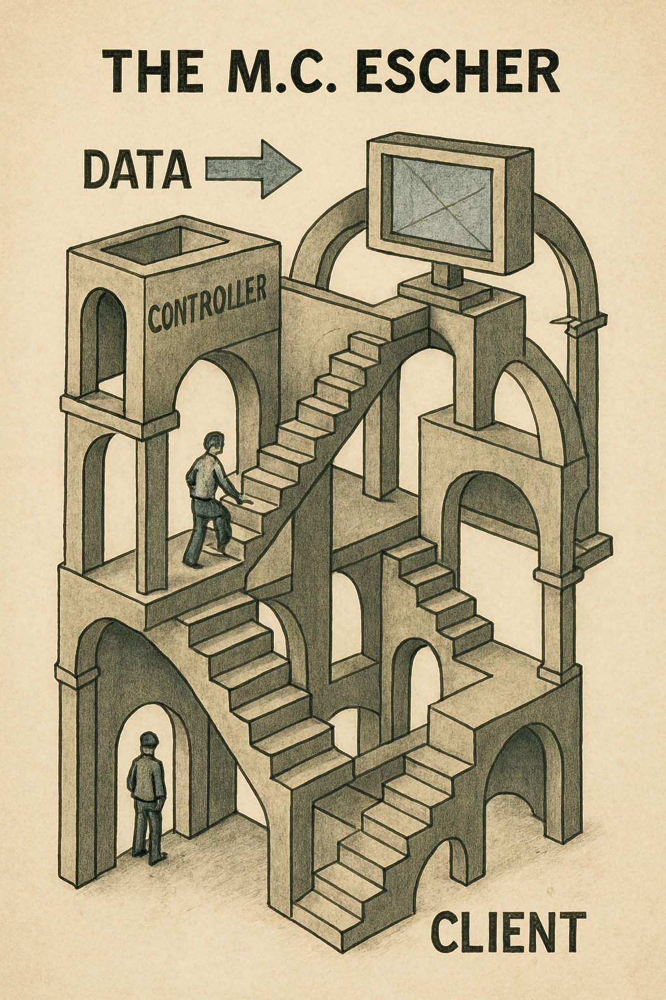
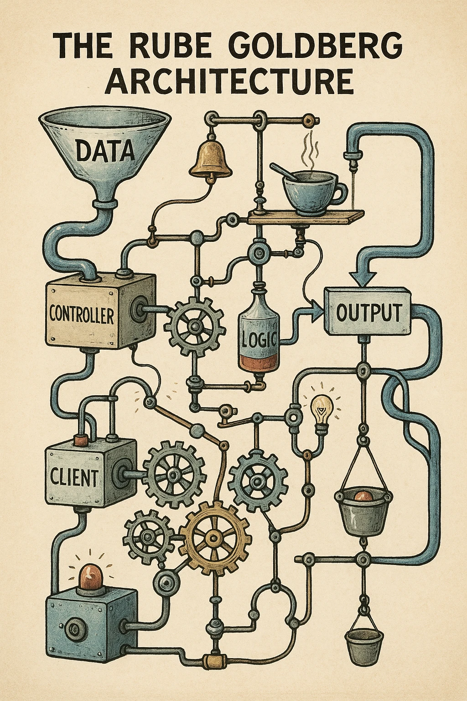

In the grand, often baffling circus of software development principles, the `Single Responsibility Principle` (SRP) is frequently injected into architecture sessions, promising order and maintainability. The seductive whisper of "do one thing and do it well" has, admittedly, saved some projects from collapsing into an unholy mess of spaghetti code. It's one of those ideas that sounds so sensible, so *adult*.

Inevitably you'll likely' confront the Single-Purpose People, or SPP, aka the Purity Police. These folks love to bring up "first principles," which is funny because they seem to only have one principle: "Make everything as small and atomic as possible."

Until you hear their proclaimations about how **"any function over 5 lines** is a code smell" and that every file must contain **only one function.**

But why? Is this generally beneficial?

<blockquote>
In this post I'm going to explore the dark side of the Single Responsibility Principle, the unintended consequences of over-abstraction, and how the quest for purity can lead to chaos. We'll also discuss how to embrace a more pragmatic approach to code organization that prioritizes maintainability and developer sanity.
</blockquote>

<figure class="inset-right">
  <figcaption>Violence in Software Architecture</figcaption>

</figure>

## I. Inheritance and Its Unintended Consequences

> Adding a single checkbox to a form should ideally only affect one file. Not 8 files across 5 directories... I'm looking at you, React/Redux.

When SRP is wielded by someone not actively trying to punish their future selves, it can offer a useful guiding idea: Code units focused on a single conceptual task *are* generally easier to wrap your head around. Testing becomes less like wrangling with an octopus. Clear boundaries *can* help you pretend you understand the eldritch complexity you've actually summoned. "Modularity! Reusability! Who dares argue such virtues?!"

Even the sainted Unix greybeards and their command-line tools get trotted out as exemplars. `ls` just lists files, right? Simple! Pure! Except, oops, lift the rug and `ls` is frantically orchestrating system calls like `opendir`, `readdir`, `closedir`, and `stat`, which themselves are whispering sweet nothings to the kernel's filesystem monstrosities¹. "Single purpose" was never about achieving molecular purity; it was about drawing a pragmatic line somewhere that made sense for the task at hand.

The original Unix philosophy was about *composition* and *simplicity*, **not about reducing everything** to a single function or file.

The Single-Purpose People conveniently forget this part.

## II. Over-Abstraction: When Simplicity Turns to Chaos

> Our architect insists every function longer than 5 lines is a 'code smell'. Our codebase now smells faintly of clueless desperation.

My old dog Chloe was, perhaps, the original Single-Purpose Purist. Her One Thing was decomposition. Toys, shoes, the occasional sofa cushion – all meticulously reduced to their smallest constituent parts, their fundamental essence revealed. Then buried. Functionally pure, you might say. Useless for anything else, but pure.

This is disturbingly similar to how the Single Purpose People approach a codebase. Armed with SRP like a holy text, they embark on a righteous crusade of refactoring, splitting, and "simplifying" until the project structure resembles the aftermath of a fragmentation grenade attack in a filing cabinet factory.

<figure class="inset-left">
  <figcaption>No escape for this infinite work pattern</figcaption>

</figure>

What chaos hath they wrought?

-   **File System Shrapnel:** Source directories blooming into nightmarish landscapes of countless tiny files, often containing a single, tragically lonely function. Navigation becomes an exercise in spelunking.
-   **Dependency Hellraiser:** A tangled web of imports and exports so dense that tracing the execution flow requires clairvoyance, a large whiteboard, and possibly animal sacrifice. Files imported exactly once, mocking you from their solitary confinement.
-   **Testing Treachery:** Tests become brittle, hyper-specific sentinels guarding minuscule implementation details. Change a function signature? Watch dozens of tests crumble like ancient pottery. The test suite transforms from a safety net into a minefield.
-   **Velocity Vanished:** Simple changes metastasize into multi-file modification sagas. Onboarding new developers involves weeks of handing them maps and compasses just to find where the `UserProfile` component *actually lives* this week. Forward progress slows to a geological crawl under the sheer weight of this "organization."

I’ve stared into the abyss of codebases where a straightforward 100-line feature was vivisected across 15+ files, each a "pure" little angel containing maybe one or two functions. The cognitive blast radius of trying to hold that mess in your head utterly negated any theoretical win from the separation. It wasn't simpler; it was just scattered.

## III. The Toll of Perfection: Impact on Developers

> We spend more time debating file structure and naming conventions than actually shipping features. Is this Agile?

<figure class="inset-left">
  <figcaption>So messy it borders on art</figcaption>

</figure>

This pathological fragmentation isn't just an aesthetic crime; it actively sabotages the poor bastards² trying to get work done:

**The Productivity Drain:** Forget technical debt; this is organizational debt accrued through obsessive-compulsive directory nesting. Every minor tweak becomes an archaeological dig through layers of abstraction. Time vanishes into the black hole of `cd ..` and `grep`.

**The Testing Tax:** Instead of providing confidence, the test suite becomes a source of constant, soul-crushing friction. Hours melt away fixing tests broken by trivial refactors, tests that were too damn coupled to the microscopic details they were supposed to be verifying.

**The Cognitive Catastrophe:** There's a hard limit on how many disconnected pieces of information a human brain can juggle. Forcing developers to constantly piece together program flow from a dozen scattered files is like asking them to assemble a ship in a bottle during an earthquake. It actively hinders understanding and makes confident changes nearly impossible.

## IV. Embracing Pragmatism: A Practical Alternative

> I suggested we put two related functions in the same file. You'd think I'd suggested sacrificing the Scrum Master to the Old Gods based on the looks I got.
> — A recovering purist reader

So, what's the escape hatch from this purity prison? It's not abandoning SRP entirely – that way lies madness of a different, Jabba the Hutt-esque variety. No, the answer is that rarest of modern software development commodities: **pragmatism**. Applying judgment instead of dogma. Imagine!

Here’s what that looks like when you’re not mainlining the dogma:

-   **Focus on Cohesion, Not Atoms:** Group things that *change together* and *belong together* conceptually. A module might handle several related aspects of user authentication. That's fine. It's probably *better* than six separate files each holding one function related to login state.
-   **Keep Kin Together:** Don't split related code unless there's a screamingly obvious, tangible benefit – like genuine reusability *in practice*, not in some hypothetical future that never arrives. Proximity matters for comprehension.
-   **Let Reality Drive:** Organize based on the actual features and workflows of your application, not some abstract ideal of functional purity³. Does this structure make it easier or harder for someone to understand and modify `Feature X`?
-   **Mind the Meatware:** Remember the poor developer. What organization minimizes the mental juggling act required to work on the code? Optimize for human understanding.
-   **Test What Matters:** Write tests that verify behavior at a sensible boundary, not tests that are intimately soldered to the internal wiring of every tiny function. Aim for confidence, not just coverage percentage theatre.

The objective isn't theoretical perfection worthy of a PhD thesis; it's creating code that your colleagues (and future you) can navigate, understand, and modify without wanting to set the building on fire.

Sometimes this means a file is 200 lines long instead of 50. Sometimes a function handles fetching data *and* transforming it slightly. Sometimes a class has *two* responsibilities that are so tightly coupled they might as well be married. Sue me. If it makes the system easier to work with *overall*, it's the right call.

Stay relentlessly focused on the practical questions:
- Can someone new find their way around?
- Can we change `X` without breaking unrelated `Y`?
- Does this test actually tell me if the feature works?
- Are we shipping value, or just rearranging deck chairs on the SS Abstraction?

## V. Conclusion: Fostering Cohesive and Maintainable Code

The Single Responsibility Principle is a useful chisel in the toolbox. It is not a chainsaw, nor a holy mandate to pulverize your codebase into atomic dust. Like any tool, its value lies entirely in the skill and judgment of the wielder.

So when you encounter the Single-Purpose People, eyes gleaming with refactoring zeal, ready to wage war on any function daring to exceed three lines, take a deep breath. Remember Chloe and her disassembled toys. Remember the weeping developer and the 12-file checkbox.

Our job is not to construct theoretically immaculate snowflake functions. Our job is to build software that works, that solves problems, and that doesn't inflict unnecessary psychic damage on the next person who has to touch it.

Stay pragmatic. Focus on outcomes. And for the love of God, don't let the pursuit of perfect purity become the enemy of perfectly adequate, maintainable code. Your sanity, and your team's velocity, depend on it.

¹ The irony being that achieving *actual* single purpose at the lowest levels requires immense complexity hidden just beneath the surface. It's turtles all the way down, folks.

² Yes, I mean you and me. We're the poor bastards in this scenario.

³ We're talking about conceptual purity here – the idea that a function should do only "one thing" logically. Don't confuse this with functional programming's concept of a "pure function" (no side effects), which is a different, though sometimes related, beast. The Single-Purpose People often conflate the two in their righteous quest.
